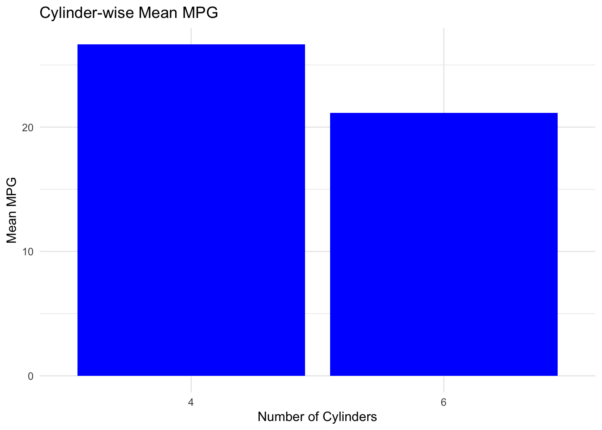
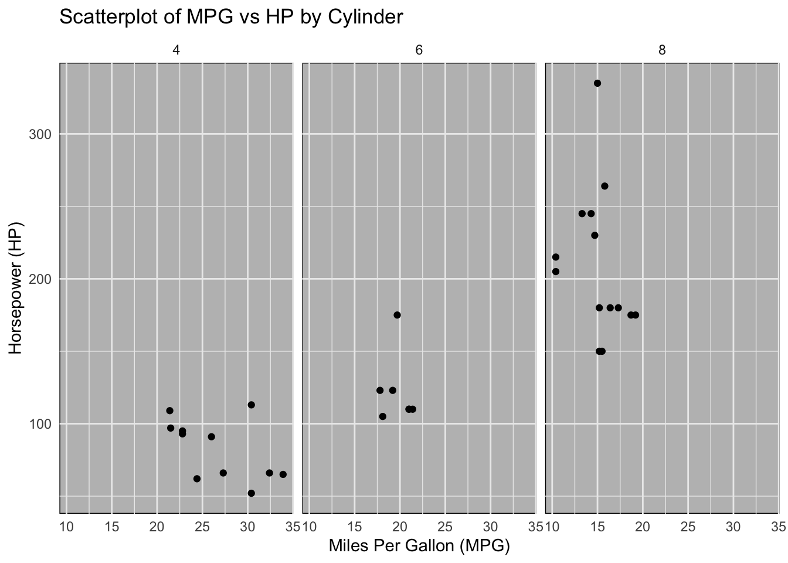

## パッケージ`tidyverse`

`tidyverse`は, Hadley Wickhamによって開発が進められているRパッケージ (群) である. データのインポート, 整理, 加工, 可視化, 分析を簡単かつ効率的に行うための一連のツールを提供する. `tidyverse`の中核をなすパッケージには以下のものがある:

- **ggplot2**: データの可視化を行うためのパッケージ. レイヤーの概念を用い, データポイント, 統計的変換, スケール, 軸, 凡例など, グラフの各要素を個別に定義し, 組み合わせることができる. これにより, 高度にカスタマイズされたグラフを容易に作成可能.

- **dplyr**: データの操作と変形を行うためのパッケージ. フィルタリング, 並べ替え, 集約など, データフレームに対する一般的な操作を簡単かつ直感的に行うための関数を提供.

- **tidyr**: データの整理と整形を簡単にするためのパッケージ. データセットのレイアウトを整形する等のクリーニングのタスクに対応しながら,「tidy形式」としてデータを再構築するツールを提供. 例えば, データを多数の列に広げる「wide形式」と データをより少ない列にまとめるが行を増やす「long形式」間の変換, 欠損値への適切な対処, 一列を複数列に分割あるいは複数列を一列に結合する等の処理.

<!--
`tidyverse`の思想の中心に位置する「tidy data」の概念に基づいてデータをtidy形式に変換 (tidy形式は, 各変数が列を形成し, 各観測値が独立した行を形成する, データ分析やデータ可視化に適したデータ形式). tidy形式によりデータ分析や可視化を直感的かつ簡易に実行可能となる.
-->

- **readr**: さまざまな形式のテキストデータ (例えば, csv, tsv形式) を読み込み, Rのデータフレームとして効率的にインポートするためのパッケージ. 標準のR関数よりも高速に動作し, ファイルの読み込み時によくある問題 (データ型の自動認識, 欠損値の扱い等) をより柔軟に処理.


さらに, 便利な機能を持つパッケージとして,

- **purrr**: リストと関数型プログラミングを扱うためのパッケージ. リストの操作, 要素の繰り返し処理, 条件に基づく要素の抽出など, 複雑なデータ構造の操作を簡単にする関数を提供.

- **tibble**: データフレームをより現代的かつ柔軟に扱うためのパッケージで, 印刷時の見やすさ, 列名の非標準的な文字の扱い, サブセット操作の改善など, データフレームを強化し使いやすさを改善.

- **stringr**: 文字列データの操作を行うためのパッケージ. Rの標準文字列操作機能よりも一貫性と可読性に優れたインターフェースを提供し、文字列の検索, 置換, 分割, 結合などのタスクを簡単に行うことが可能.

- **forcats**: 因子 (カテゴリカルデータ) を扱うためのパッケージ. 因子水準の順序変更, 要約, 結合, 分離など, 因子型のデータを操作するための便利な関数を提供.

- **lubridate**: 日付と時刻のデータを扱うためのパッケージ. 日付や時刻の加算・減算, 部分的な抽出, 時間差の計算など, 操作を直感的かつ効率的にするための関数を提供. 

`tidyverse`は, データを「tidy」（整然とした）形式で扱うことに焦点を当てている. tidyデータの原則では, 各変数が列に, 各観測値が行に, 各種類の観測単位がテーブルに配置される. この原則に従うことで, データ分析がより直感的で効率的になる.

`tidyverse`パッケージは, Rでのデータ分析作業を容易にし, コードをより読みやすく, 書きやすくすることを指向している. それぞれのパッケージは単独で使用することも出来るが, 一緒に使用することでより使い勝手が向上し便利である. データサイエンスにおける日常的なタスクを簡潔に, かつ効率的に行うための強力なツールセットと言える.

- `tidyverse`のホームページ
  [https://tidyverse.tidyverse.org/](https://tidyverse.tidyverse.org/)

### Q: Rの初心者は`tidyverse`から勉強することは可能か?

今日では, R言語の基本を学ばずにいきなり`tidyverse`から勉強することは, `tidyverse`を入口としてR言語の学習を始めるユーザーも多いと思われる.
特にデータ分析やデータサイエンスに焦点を当てている初心者にとっては代替的な選択肢である. `tidyverse`は, データの取り扱いを直感的かつ効率的にすることを目的として設計されており, その構文は初心者にとって学びやすいように工夫されている.

- `tidyverse`の利点:
  - 直感的な構文: `tidyverse`の関数は覚えやすく, 理解しやすい構文を持っているため, R言語の初心者でも扱いやすい.
  - データ分析のワークフローを強化: `tidyverse`はデータのインポート, 整理, 加工, 可視化, 分析という一連のデータ分析プロセスに対応するツールを提供する. これにより, データ分析の基本的な流れを簡単に学ぶことができる.
  - 広範なコミュニティとサポート: `tidyverse`はRユーザー内に多くの熱狂的なファンがいて, コミュニティを形成している.  オンラインでのサポートや学習リソースが豊富にある.
  
- 注意点:
  - R言語の基本概念の理解の必要性: R言語の基本的な概念 (変数の割り当て, 関数の使用方法, データ型など) は、`tidyverse`を効率的に使用するためにも理解しておく必要あり.
  - 限定的な機能: `tidyverse`だけではカバーできないR言語の機能も多くある. すなわち, `tidyverse`から学習を始めても, いずれはR言語のより広範な機能やパッケージにも目を向けることが必要.


**tidyverseに含まれるパッケージを利用すると, 確かに多くの複雑な処理が簡潔かつエレガントに書けたりすることがあり, その機能性を実感することも多い. しかし, Rプログラミングを行っている中で, R言語の基本を知らないと困るようなことの方が多い. よって, 筆者の考えでは, Rの初学者はいきなりtidyverse系を軸に学習を開始するよりは, tidyverseに含まれるパッケージはあくまでRの多数あるパッケージの一部であると位置付けて, 標準的なRを学びながらこれらのパッケージの用法を学ぶというスタンスで良い. 本コースは, tidyverse系の扱いはこのような方針に従って進めるものとする.**


### `tidyverse`の基本

以下, `tidyverse`の基本を理解するために, データのインポート, 加工, そして可視化のステップを含むシンプルなチュートリアルを紹介する.
ここでは, `tidyverse`の中の`readr`, `dplyr`, `ggplot2`の三つのパッケージを使用する.
これらは`tidyverse`の中で最もよく使用されるパッケージである.

**ステップ 1: `tidyverse`をインストールして読み込む**

まず, `tidyverse`パッケージをインストールし, ライブラリに読み込む.


```r
# tidyverseパッケージのインストール
# install.packages("tidyverse")

# ライブラリに読み込む
library(tidyverse)
```

```
## ── Attaching core tidyverse packages ──────────────────────── tidyverse 2.0.0 ──
## ✔ dplyr     1.1.2     ✔ readr     2.1.4
## ✔ forcats   1.0.0     ✔ stringr   1.5.0
## ✔ ggplot2   3.4.2     ✔ tibble    3.2.1
## ✔ lubridate 1.9.2     ✔ tidyr     1.3.0
## ✔ purrr     1.0.2     
## ── Conflicts ────────────────────────────────────────── tidyverse_conflicts() ──
## ✖ dplyr::filter() masks stats::filter()
## ✖ dplyr::lag()    masks stats::lag()
## ℹ Use the conflicted package (<http://conflicted.r-lib.org/>) to force all conflicts to become errors
```


**ステップ 2: データをインポートする**

`tidyverse`には様々なサンプルデータが含まれている. ここでは, `mtcars`データセットを使用する. `mtcars`は, 1974年のMotor Trend US誌に掲載された32台の自動車に関するデータである.


```r
# mtcarsデータセットを使用する
data <- mtcars
```


**ステップ 3: データを加工する**
`dplyr`を使用してデータを加工する. ここでは, mpg（ガロンあたりのマイル数）が20を超える車両のみを選択し、cyl（シリンダー数）ごとの平均mpgを計算する.


```r
# dplyrを使ってデータをフィルタリングし、集約する
filtered_data <- data %>%
  filter(mpg > 20) %>%
  group_by(cyl) %>%
  summarise(mean_mpg = mean(mpg))

# 結果を表示
print(filtered_data)
```

```
## # A tibble: 2 × 2
##     cyl mean_mpg
##   <dbl>    <dbl>
## 1     4     26.7
## 2     6     21.1
```

**ステップ 4: データを可視化する**

最後に, `ggplot2`を使ってデータの可視化を行う.
ここでは, cylごとのmean_mpgを棒グラフで表示する.


```r
# ggplot2を使ってデータを可視化
ggplot(filtered_data, aes(x = factor(cyl), y = mean_mpg)) +
  geom_bar(stat = "identity", fill = "blue") +
  theme_minimal() +
  labs(title = "Cylinder-wise Mean MPG",
       x = "Number of Cylinders",
       y = "Mean MPG")
```



関数`ggplot()`の別の使用例として, マルチパネル化した散布図を示す.

```r
# データを可視化する
# mpgとhpの関係を示す散布図を作成し、cylごとに異なるパネルに表示する
ggplot(data, aes(x = mpg, y = hp)) +
  geom_point() +
  facet_wrap(~cyl) +
  theme_minimal() +
  theme(panel.background = element_rect(fill = "gray")) +
  labs(title = "Scatterplot of MPG vs HP by Cylinder",
       x = "Miles Per Gallon (MPG)",
       y = "Horsepower (HP)")
```


