# 線形回帰分析


はじめに, コードの可読性を高めるため, パッケージ`tidyverse`をロードしておく.
例えば, `tidyverse`内にあるパッケージ`magrittr`の提供する機能であるパイプ (演算子) `%>%` を関数`head()`と組合せて使用し, 出力量を抑える.

```r
library(tidyverse)
```


## 重回帰分析の基本操作
### データ1: 1ルーム賃貸マンション {-}

```
- 1ルーム賃貸マンション, 家賃データ, 50件 (仮想データ)
  - rent: 月額家賃 (円)
  - area: 専有面積 (平米) 
  - yrs: 築後年数 (年)
  - dist: 最寄駅からの徒歩距離 (m)
```

- データの読み込み

```r
rentdat <- read.csv("rentdat.csv", header = T)
head(rentdat)  # R標準の記法
#>    rent  area   yrs    dist
#> 1 60000 18.45  8.73  837.46
#> 2 61000 19.84 13.33  520.86
#> 3 74000 22.45  8.26  433.77
#> 4 77000 26.81  5.94 1192.32
#> 5 59000 17.62  3.85  815.17
#> 6 86000 26.68  4.19  373.87
# または, パイプ (%>%) を利用して, rentdat %>% head()
```

実行に先立ち, `pairs()`や`cor()`を使い, 変数間の従属性や, 相関係数の大きさを確認する.

```r
pairs(rentdat)
```

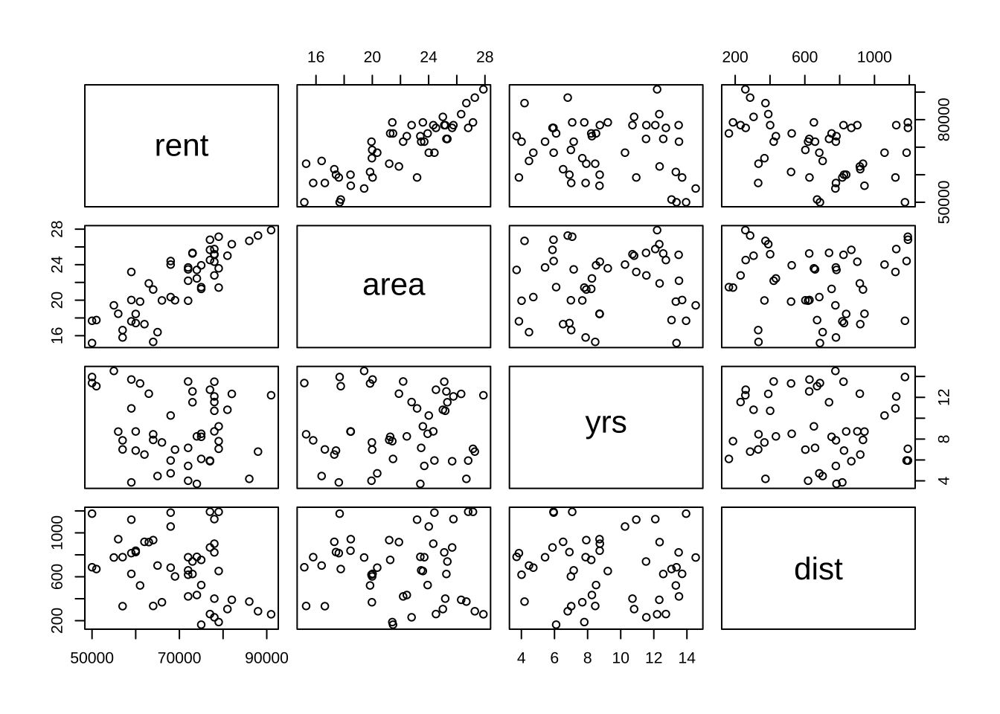

```r
cor(rentdat)
#>            rent        area         yrs        dist
#> rent  1.0000000  0.84098526 -0.16885266 -0.36727009
#> area  0.8409853  1.00000000  0.05454398 -0.02291733
#> yrs  -0.1688527  0.05454398  1.00000000 -0.05812975
#> dist -0.3672701 -0.02291733 -0.05812975  1.00000000
# パイプ (%>%) を利用しても良い rendat %>% pairs() rentdat %>5 cor()
```

- 回帰実行

関数`lm()`を使用して最小二乗法による適合を行う. 実行結果は`summary()`で確認する.

```r
res_lm <- lm(rent ~ ., data = rentdat)
summary(res_lm)
#> 
#> Call:
#> lm(formula = rent ~ ., data = rentdat)
#> 
#> Residuals:
#>    Min     1Q Median     3Q    Max 
#>  -6732  -2379  -1016   2286   7256 
#> 
#> Coefficients:
#>              Estimate Std. Error t value Pr(>|t|)    
#> (Intercept) 32261.469   3652.405   8.833 1.81e-11 ***
#> area         2397.144    142.744  16.793  < 2e-16 ***
#> yrs          -745.440    159.275  -4.680 2.55e-05 ***
#> dist          -12.443      1.733  -7.180 4.89e-09 ***
#> ---
#> Signif. codes:  0 '***' 0.001 '**' 0.01 '*' 0.05 '.' 0.1 ' ' 1
#> 
#> Residual standard error: 3531 on 46 degrees of freedom
#> Multiple R-squared:  0.8838,	Adjusted R-squared:  0.8762 
#> F-statistic: 116.6 on 3 and 46 DF,  p-value: < 2.2e-16
```

- 実行結果の取り出し

```r
# 回帰係数の取り出し
coef(res_lm)  # 関数の利用
#> (Intercept)        area         yrs        dist 
#> 32261.46944  2397.14374  -745.44017   -12.44341
res_lm$coef  # 省略形による指示可能
#> (Intercept)        area         yrs        dist 
#> 32261.46944  2397.14374  -745.44017   -12.44341
# res_lm$coefficients

# 適合値 (予測値) の取り出し
fitted(res_lm) %>%
  head()  # head()により, 最初の6行のみ表示 (デフォルト)
#>        1        2        3        4        5        6 
#> 59560.22 63402.81 74522.43 77264.45 61485.70 88441.65
# res_lm$fitted

# 残差の取り出し
resid(res_lm)  # 関数の利用
#>          1          2          3          4          5          6          7 
#>   439.7807 -2402.8084  -522.4320  -264.4500 -2485.7017 -2441.6518 -1029.7327 
#>          8          9         10         11         12         13         14 
#>  5176.2213 -6732.0408  2427.4126   376.6794  4555.9941 -1754.1073  1534.2533 
#>         15         16         17         18         19         20         21 
#>   647.1293 -2143.6007  5146.9150  4191.1927  2626.1939  5839.5466  1751.7939 
#>         22         23         24         25         26         27         28 
#> -5750.1494 -2990.2238 -5767.8528 -2307.8140 -3235.3851  -114.3409 -3829.2694 
#>         29         30         31         32         33         34         35 
#>   715.0065 -3332.8895  7256.4052  2590.8913  3537.0448  1388.8917  6999.9397 
#>         36         37         38         39         40         41         42 
#> -3321.0903 -2191.1362  5489.4176 -3603.0246 -1025.7680 -1625.3943 -1887.0020 
#>         43         44         45         46         47         48         49 
#> -1650.4408  1863.8094 -1133.3323 -2663.5164  5523.2614 -1554.5109 -1311.7071 
#>         50 
#> -1006.4070
res_lm$resid %>%
  head()
#>          1          2          3          4          5          6 
#>   439.7807 -2402.8084  -522.4320  -264.4500 -2485.7017 -2441.6518
# res_lm$residuals

# 回帰係数の信頼区間の計算
confint(res_lm)
#>                   2.5 %       97.5 %
#> (Intercept) 24909.55913 39613.379763
#> area         2109.81414  2684.473338
#> yrs         -1066.04436  -424.835985
#> dist          -15.93178    -8.955039
```

- モデル診断

```r
plot(res_lm$fitted.values, rentdat$rent)  # モデル診断: y観測値 vs y適合値
abline(a = 0, b = 1)
```

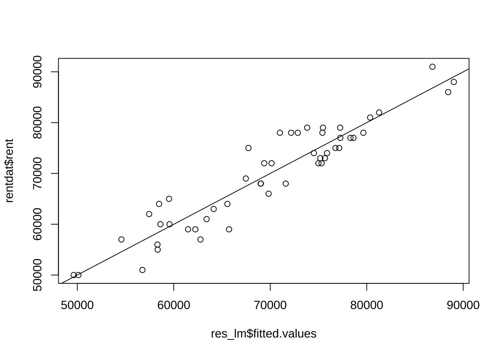

```r
plot(res_lm$fitted.values, res_lm$residuals)  # モデル診断: y適合値 vs 残差
abline(h = 0)
```

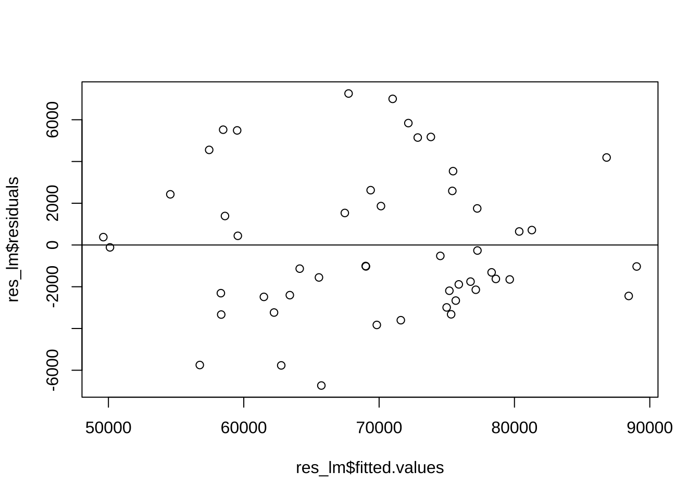

```r
par(mfrow = c(2, 2))
plot(res_lm)
```

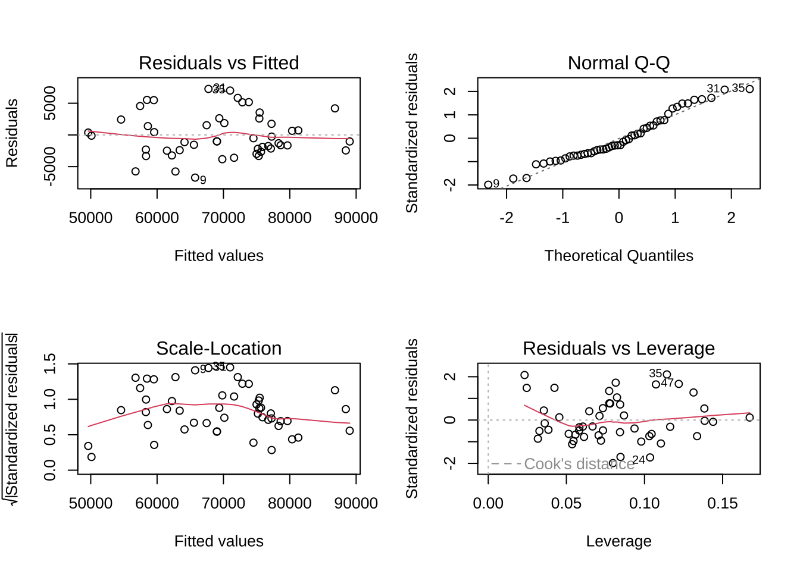

```r
# → resid(res_lm)
```

- 適合モデルを使った予測
  - 内挿予測 (適合値の計算)

```r
predict(res_lm) %>%
  head()
#>        1        2        3        4        5        6 
#> 59560.22 63402.81 74522.43 77264.45 61485.70 88441.65
```

  - 外挿予測
    - 例. 専有面積=18.8平米, 築後年数=13年,  駅距離=800m, または100mの物件の賃料は?

```r
new <- data.frame(area = 18.8, dist = c(800, 100), yrs = 13)
predict(res_lm, newdata = new)
#>        1        2 
#> 57682.32 66392.71
# predict.lm(res_lm, newdata = new) res_lm$residuals\t\t# resid(res_lm)
```


また, `summary()`には最小二乗推定の各種結果が格納されている.

```r
str(summary(res_lm))
#> List of 11
#>  $ call         : language lm(formula = rent ~ ., data = rentdat)
#>  $ terms        :Classes 'terms', 'formula'  language rent ~ area + yrs + dist
#>   .. ..- attr(*, "variables")= language list(rent, area, yrs, dist)
#>   .. ..- attr(*, "factors")= int [1:4, 1:3] 0 1 0 0 0 0 1 0 0 0 ...
#>   .. .. ..- attr(*, "dimnames")=List of 2
#>   .. .. .. ..$ : chr [1:4] "rent" "area" "yrs" "dist"
#>   .. .. .. ..$ : chr [1:3] "area" "yrs" "dist"
#>   .. ..- attr(*, "term.labels")= chr [1:3] "area" "yrs" "dist"
#>   .. ..- attr(*, "order")= int [1:3] 1 1 1
#>   .. ..- attr(*, "intercept")= int 1
#>   .. ..- attr(*, "response")= int 1
#>   .. ..- attr(*, ".Environment")=<environment: R_GlobalEnv> 
#>   .. ..- attr(*, "predvars")= language list(rent, area, yrs, dist)
#>   .. ..- attr(*, "dataClasses")= Named chr [1:4] "numeric" "numeric" "numeric" "numeric"
#>   .. .. ..- attr(*, "names")= chr [1:4] "rent" "area" "yrs" "dist"
#>  $ residuals    : Named num [1:50] 440 -2403 -522 -264 -2486 ...
#>   ..- attr(*, "names")= chr [1:50] "1" "2" "3" "4" ...
#>  $ coefficients : num [1:4, 1:4] 32261.5 2397.1 -745.4 -12.4 3652.4 ...
#>   ..- attr(*, "dimnames")=List of 2
#>   .. ..$ : chr [1:4] "(Intercept)" "area" "yrs" "dist"
#>   .. ..$ : chr [1:4] "Estimate" "Std. Error" "t value" "Pr(>|t|)"
#>  $ aliased      : Named logi [1:4] FALSE FALSE FALSE FALSE
#>   ..- attr(*, "names")= chr [1:4] "(Intercept)" "area" "yrs" "dist"
#>  $ sigma        : num 3531
#>  $ df           : int [1:3] 4 46 4
#>  $ r.squared    : num 0.884
#>  $ adj.r.squared: num 0.876
#>  $ fstatistic   : Named num [1:3] 117 3 46
#>   ..- attr(*, "names")= chr [1:3] "value" "numdf" "dendf"
#>  $ cov.unscaled : num [1:4, 1:4] 1.069834 -0.035212 -0.017107 -0.000183 -0.035212 ...
#>   ..- attr(*, "dimnames")=List of 2
#>   .. ..$ : chr [1:4] "(Intercept)" "area" "yrs" "dist"
#>   .. ..$ : chr [1:4] "(Intercept)" "area" "yrs" "dist"
#>  - attr(*, "class")= chr "summary.lm"
summary(res_lm)$r.squared  # R2
#> [1] 0.8837688
# summary(res_lm)['r.squared'] # 別の指定方法
summary(res_lm)$adj.r.squared  # 補正R2
#> [1] 0.8761885
summary(res_lm)$coef
#>                Estimate  Std. Error   t value     Pr(>|t|)
#> (Intercept) 32261.46944 3652.405183  8.832938 1.805979e-11
#> area         2397.14374  142.744411 16.793258 3.002396e-21
#> yrs          -745.44017  159.275119 -4.680205 2.548844e-05
#> dist          -12.44341    1.733012 -7.180222 4.893016e-09
```

- 標準化 (偏) 回帰係数

あらかじめ変数を標準化しておいてから`lm()`を実行すると, 標準化偏回帰係数が得られる.

```r
# 標準(化)回帰係数
srentdat <- scale(rentdat)  # scale()の返り値はリスト型 → データフレームへ変換
srentdat <- data.frame(srentdat)
sres_lm <- lm(rent ~ area + yrs + dist, data = srentdat)
summary(sres_lm)
#> 
#> Call:
#> lm(formula = rent ~ area + yrs + dist, data = srentdat)
#> 
#> Residuals:
#>     Min      1Q  Median      3Q     Max 
#> -0.6708 -0.2371 -0.1013  0.2278  0.7231 
#> 
#> Coefficients:
#>               Estimate Std. Error t value Pr(>|t|)    
#> (Intercept) -5.959e-16  4.976e-02    0.00        1    
#> area         8.456e-01  5.035e-02   16.79  < 2e-16 ***
#> yrs         -2.360e-01  5.042e-02   -4.68 2.55e-05 ***
#> dist        -3.616e-01  5.036e-02   -7.18 4.89e-09 ***
#> ---
#> Signif. codes:  0 '***' 0.001 '**' 0.01 '*' 0.05 '.' 0.1 ' ' 1
#> 
#> Residual standard error: 0.3519 on 46 degrees of freedom
#> Multiple R-squared:  0.8838,	Adjusted R-squared:  0.8762 
#> F-statistic: 116.6 on 3 and 46 DF,  p-value: < 2.2e-16

# 偏回帰係数 vs 標準(化)偏回帰係数
summary(res_lm)["coefficients"]
#> $coefficients
#>                Estimate  Std. Error   t value     Pr(>|t|)
#> (Intercept) 32261.46944 3652.405183  8.832938 1.805979e-11
#> area         2397.14374  142.744411 16.793258 3.002396e-21
#> yrs          -745.44017  159.275119 -4.680205 2.548844e-05
#> dist          -12.44341    1.733012 -7.180222 4.893016e-09
summary(sres_lm)["coefficients"]
#> $coefficients
#>                  Estimate Std. Error       t value     Pr(>|t|)
#> (Intercept) -5.958724e-16 0.04976173 -1.197451e-14 1.000000e+00
#> area         8.455702e-01 0.05035176  1.679326e+01 3.002396e-21
#> yrs         -2.359937e-01 0.05042380 -4.680205e+00 2.548844e-05
#> dist        -3.616101e-01 0.05036197 -7.180222e+00 4.893016e-09
# 確認
y_sd <- sd(rentdat$rent)
x_sd <- apply(rentdat[, -1], 2, sd)
res_lm$coef[-1] * x_sd/y_sd
#>       area        yrs       dist 
#>  0.8455702 -0.2359937 -0.3616101
```


## 変数の選択
### データ2: ボストン市内住宅物件価格データ {-}

```
- Boston Housingデータ
  - crim: 町ごとの一人当たり犯罪率
  - zn: 25,000平方フィート以上の住宅用地の割合
  - indus: 町ごとの非小売業の土地の割合
  - chas: チャールズ川のダミー変数 (川に接している場合は1, さもなくば0)
  - nox: 窒素酸化物濃度（1000万ppm）
  - rm: 1住居当たりの平均部屋数
  - age: 1940年以前に建設された住戸の持ち家比率
  - dis: ボストンの5つの雇用センターまでの距離の加重平均
  - rad: 放射状高速道路へのアクセス指数
  - tax: 10,000米ドル当たりの固定資産税率
  -  ptratio: 町ごとの生徒数・教師数比率
  - b: 1000(B - 0.63)^2 (Bは町ごとの黒人の割合)
  - lstat: 低所得者層の割合
  - medv: 持ち家住宅の中央値（1000ドル単位）
- 506件 x 14変数 (オリジナル版)
- source: http://lib.stat.cmu.edu/datasets/boston
```
  

```r
housing <- read.csv("boston_housing.csv", header = T)
housing %>%
  head()
#>      crim zn indus chas   nox    rm  age    dis rad tax ptratio      b lstat
#> 1 0.00632 18  2.31    0 0.538 6.575 65.2 4.0900   1 296    15.3 396.90  4.98
#> 2 0.02731  0  7.07    0 0.469 6.421 78.9 4.9671   2 242    17.8 396.90  9.14
#> 3 0.02729  0  7.07    0 0.469 7.185 61.1 4.9671   2 242    17.8 392.83  4.03
#> 4 0.03237  0  2.18    0 0.458 6.998 45.8 6.0622   3 222    18.7 394.63  2.94
#> 5 0.06905  0  2.18    0 0.458 7.147 54.2 6.0622   3 222    18.7 396.90  5.33
#> 6 0.02985  0  2.18    0 0.458 6.430 58.7 6.0622   3 222    18.7 394.12  5.21
#>   medv
#> 1 24.0
#> 2 21.6
#> 3 34.7
#> 4 33.4
#> 5 36.2
#> 6 28.7
```

`chas`はダミー変数 (0/1) のため, 一旦除去して変数間の相関等を調べる.
ライブラリ`corrplot`の関数`corrplot()`を使うと, 相関係数のヒートマップを作成することができる.

```r
# 散布図行列
pairs(housing[, -4])  # chas (バイナリ) を除去
```

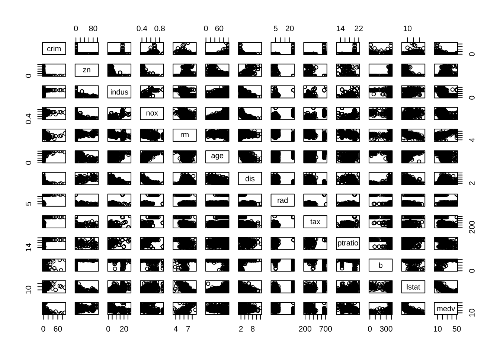

```r
round(cor(housing[, -4]), 2)  # chas(バイナリ)を除去
#>          crim    zn indus   nox    rm   age   dis   rad   tax ptratio     b
#> crim     1.00 -0.20  0.41  0.42 -0.22  0.35 -0.38  0.63  0.58    0.29 -0.39
#> zn      -0.20  1.00 -0.53 -0.52  0.31 -0.57  0.66 -0.31 -0.31   -0.39  0.18
#> indus    0.41 -0.53  1.00  0.76 -0.39  0.64 -0.71  0.60  0.72    0.38 -0.36
#> nox      0.42 -0.52  0.76  1.00 -0.30  0.73 -0.77  0.61  0.67    0.19 -0.38
#> rm      -0.22  0.31 -0.39 -0.30  1.00 -0.24  0.21 -0.21 -0.29   -0.36  0.13
#> age      0.35 -0.57  0.64  0.73 -0.24  1.00 -0.75  0.46  0.51    0.26 -0.27
#> dis     -0.38  0.66 -0.71 -0.77  0.21 -0.75  1.00 -0.49 -0.53   -0.23  0.29
#> rad      0.63 -0.31  0.60  0.61 -0.21  0.46 -0.49  1.00  0.91    0.46 -0.44
#> tax      0.58 -0.31  0.72  0.67 -0.29  0.51 -0.53  0.91  1.00    0.46 -0.44
#> ptratio  0.29 -0.39  0.38  0.19 -0.36  0.26 -0.23  0.46  0.46    1.00 -0.18
#> b       -0.39  0.18 -0.36 -0.38  0.13 -0.27  0.29 -0.44 -0.44   -0.18  1.00
#> lstat    0.46 -0.41  0.60  0.59 -0.61  0.60 -0.50  0.49  0.54    0.37 -0.37
#> medv    -0.39  0.36 -0.48 -0.43  0.70 -0.38  0.25 -0.38 -0.47   -0.51  0.33
#>         lstat  medv
#> crim     0.46 -0.39
#> zn      -0.41  0.36
#> indus    0.60 -0.48
#> nox      0.59 -0.43
#> rm      -0.61  0.70
#> age      0.60 -0.38
#> dis     -0.50  0.25
#> rad      0.49 -0.38
#> tax      0.54 -0.47
#> ptratio  0.37 -0.51
#> b       -0.37  0.33
#> lstat    1.00 -0.74
#> medv    -0.74  1.00
# pairs(housing) round(cor(housing), 2)

library(corrplot)
corrplot(cor(housing[, -4]))  # corrplot
```

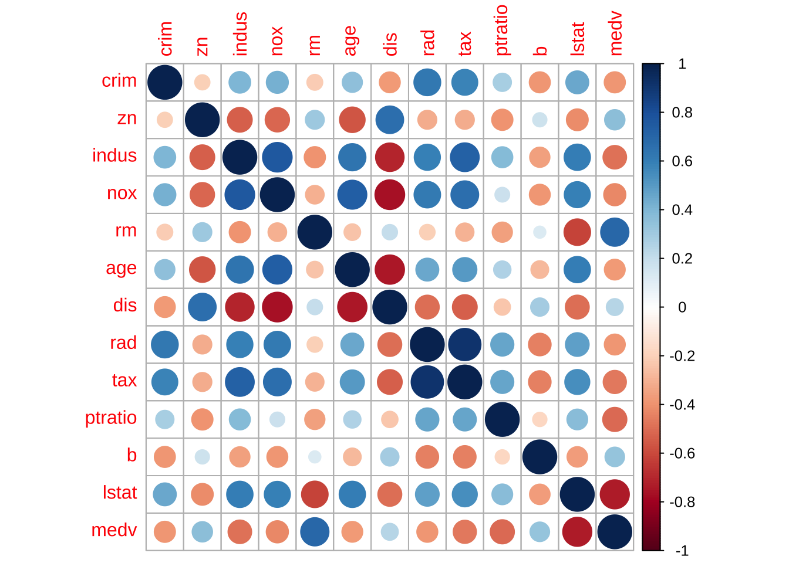

```r
# corrplot(cor(housing))\t# corrplot
```

- 4変数に絞り込み

```r
res_lm1 <- lm(medv ~ crim + rm + tax + lstat, data = housing)
summary(res_lm1)
#> 
#> Call:
#> lm(formula = medv ~ crim + rm + tax + lstat, data = housing)
#> 
#> Residuals:
#>     Min      1Q  Median      3Q     Max 
#> -16.383  -3.497  -1.149   1.825  30.716 
#> 
#> Coefficients:
#>              Estimate Std. Error t value Pr(>|t|)    
#> (Intercept) -1.414928   3.178364  -0.445   0.6564    
#> crim        -0.061579   0.035562  -1.732   0.0840 .  
#> rm           5.248721   0.439664  11.938   <2e-16 ***
#> tax         -0.005018   0.001922  -2.611   0.0093 ** 
#> lstat       -0.534835   0.050258 -10.642   <2e-16 ***
#> ---
#> Signif. codes:  0 '***' 0.001 '**' 0.01 '*' 0.05 '.' 0.1 ' ' 1
#> 
#> Residual standard error: 5.458 on 501 degrees of freedom
#> Multiple R-squared:  0.6506,	Adjusted R-squared:  0.6478 
#> F-statistic: 233.2 on 4 and 501 DF,  p-value: < 2.2e-16
anova(res_lm1)
#> Analysis of Variance Table
#> 
#> Response: medv
#>            Df  Sum Sq Mean Sq F value    Pr(>F)    
#> crim        1  6440.8  6440.8 216.206 < 2.2e-16 ***
#> rm          1 16709.7 16709.7 560.915 < 2.2e-16 ***
#> tax         1  1267.3  1267.3  42.542 1.693e-10 ***
#> lstat       1  3373.6  3373.6 113.247 < 2.2e-16 ***
#> Residuals 501 14924.8    29.8                      
#> ---
#> Signif. codes:  0 '***' 0.001 '**' 0.01 '*' 0.05 '.' 0.1 ' ' 1
```


```r
# update関数でモデル更新: 変数ptratio追加
res_lm2 <- update(res_lm1, . ~ . + ptratio)
summary(res_lm2)
#> 
#> Call:
#> lm(formula = medv ~ crim + rm + tax + lstat + ptratio, data = housing)
#> 
#> Residuals:
#>      Min       1Q   Median       3Q      Max 
#> -14.3602  -3.1111  -0.9237   1.6569  30.4116 
#> 
#> Coefficients:
#>               Estimate Std. Error t value Pr(>|t|)    
#> (Intercept) 16.7488084  4.0001180   4.187 3.34e-05 ***
#> crim        -0.0593795  0.0339830  -1.747   0.0812 .  
#> rm           4.6349234  0.4292367  10.798  < 2e-16 ***
#> tax         -0.0008196  0.0019328  -0.424   0.6717    
#> lstat       -0.5280046  0.0480346 -10.992  < 2e-16 ***
#> ptratio     -0.8731668  0.1251429  -6.977 9.59e-12 ***
#> ---
#> Signif. codes:  0 '***' 0.001 '**' 0.01 '*' 0.05 '.' 0.1 ' ' 1
#> 
#> Residual standard error: 5.215 on 500 degrees of freedom
#> Multiple R-squared:  0.6816,	Adjusted R-squared:  0.6784 
#> F-statistic: 214.1 on 5 and 500 DF,  p-value: < 2.2e-16
anova(res_lm2)
#> Analysis of Variance Table
#> 
#> Response: medv
#>            Df  Sum Sq Mean Sq F value    Pr(>F)    
#> crim        1  6440.8  6440.8 236.784 < 2.2e-16 ***
#> rm          1 16709.7 16709.7 614.301 < 2.2e-16 ***
#> tax         1  1267.3  1267.3  46.591 2.540e-11 ***
#> lstat       1  3373.6  3373.6 124.026 < 2.2e-16 ***
#> ptratio     1  1324.2  1324.2  48.684 9.589e-12 ***
#> Residuals 500 13600.6    27.2                      
#> ---
#> Signif. codes:  0 '***' 0.001 '**' 0.01 '*' 0.05 '.' 0.1 ' ' 1
```


```r
# 変数zn追加
res_lm3 <- update(res_lm2, . ~ . + zn)
summary(res_lm3)
#> 
#> Call:
#> lm(formula = medv ~ crim + rm + tax + lstat + ptratio + zn, data = housing)
#> 
#> Residuals:
#>      Min       1Q   Median       3Q      Max 
#> -14.4790  -3.1374  -0.8754   1.6871  30.3185 
#> 
#> Coefficients:
#>               Estimate Std. Error t value Pr(>|t|)    
#> (Intercept) 17.3073953  4.0780517   4.244 2.62e-05 ***
#> crim        -0.0584021  0.0340274  -1.716   0.0867 .  
#> rm           4.6460026  0.4297290  10.811  < 2e-16 ***
#> tax         -0.0008832  0.0019358  -0.456   0.6484    
#> lstat       -0.5354553  0.0491813 -10.887  < 2e-16 ***
#> ptratio     -0.8958719  0.1291910  -6.934 1.27e-11 ***
#> zn          -0.0081367  0.0114124  -0.713   0.4762    
#> ---
#> Signif. codes:  0 '***' 0.001 '**' 0.01 '*' 0.05 '.' 0.1 ' ' 1
#> 
#> Residual standard error: 5.218 on 499 degrees of freedom
#> Multiple R-squared:  0.6819,	Adjusted R-squared:  0.6781 
#> F-statistic: 178.3 on 6 and 499 DF,  p-value: < 2.2e-16
anova(res_lm3)
#> Analysis of Variance Table
#> 
#> Response: medv
#>            Df  Sum Sq Mean Sq  F value    Pr(>F)    
#> crim        1  6440.8  6440.8 236.5506 < 2.2e-16 ***
#> rm          1 16709.7 16709.7 613.6973 < 2.2e-16 ***
#> tax         1  1267.3  1267.3  46.5455 2.601e-11 ***
#> lstat       1  3373.6  3373.6 123.9040 < 2.2e-16 ***
#> ptratio     1  1324.2  1324.2  48.6356 9.826e-12 ***
#> zn          1    13.8    13.8   0.5083    0.4762    
#> Residuals 499 13586.7    27.2                       
#> ---
#> Signif. codes:  0 '***' 0.001 '**' 0.01 '*' 0.05 '.' 0.1 ' ' 1
```


```r
# 変数nox追加, zn除去
res_lm4 <- update(res_lm3, . ~ . + nox - zn)
summary(res_lm4)
#> 
#> Call:
#> lm(formula = medv ~ crim + rm + tax + lstat + ptratio + nox, 
#>     data = housing)
#> 
#> Residuals:
#>      Min       1Q   Median       3Q      Max 
#> -14.2389  -3.1372  -0.9454   1.6680  30.4687 
#> 
#> Coefficients:
#>               Estimate Std. Error t value Pr(>|t|)    
#> (Intercept) 17.2649269  4.2731659   4.040 6.18e-05 ***
#> crim        -0.0596990  0.0340256  -1.755    0.080 .  
#> rm           4.6382386  0.4297223  10.794  < 2e-16 ***
#> tax         -0.0004089  0.0022705  -0.180    0.857    
#> lstat       -0.5216846  0.0514382 -10.142  < 2e-16 ***
#> ptratio     -0.8844707  0.1294545  -6.832 2.44e-11 ***
#> nox         -1.0363053  2.9989281  -0.346    0.730    
#> ---
#> Signif. codes:  0 '***' 0.001 '**' 0.01 '*' 0.05 '.' 0.1 ' ' 1
#> 
#> Residual standard error: 5.22 on 499 degrees of freedom
#> Multiple R-squared:  0.6817,	Adjusted R-squared:  0.6779 
#> F-statistic: 178.1 on 6 and 499 DF,  p-value: < 2.2e-16
```

目的変数`medv`と説明変数`lstat`には, 明らかに非線形な関係性が見られる.
そこで, `lstat`に非線形変換を施すことで, 適合度が改善できる可能性がある.

```r
pairs(housing[, c("medv", "crim", "rm", "tax", "lstat")])
```

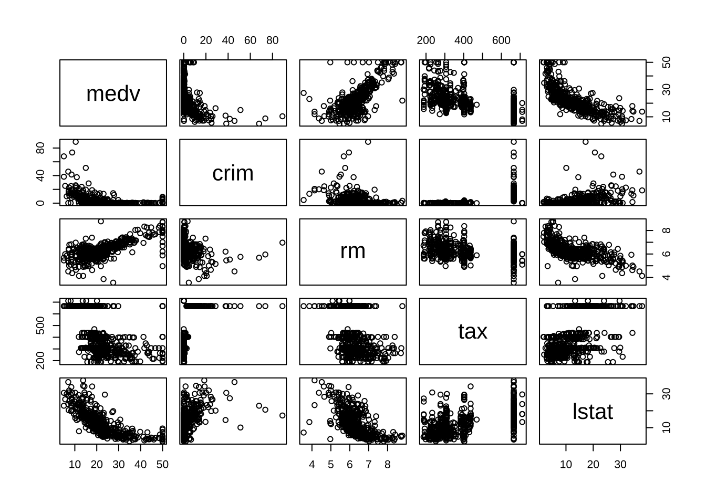

```r
round(cor(housing[, c("medv", "crim", "rm", "tax", "lstat")]), 2)
#>        medv  crim    rm   tax lstat
#> medv   1.00 -0.39  0.70 -0.47 -0.74
#> crim  -0.39  1.00 -0.22  0.58  0.46
#> rm     0.70 -0.22  1.00 -0.29 -0.61
#> tax   -0.47  0.58 -0.29  1.00  0.54
#> lstat -0.74  0.46 -0.61  0.54  1.00
```


```r
# 変数lstatの逆数を新変数invlstatとして定義し, モデルに追加
data2 <- data.frame(housing, invlstat = 1/housing$lstat)
res_lm5 <- lm(medv ~ crim + rm + tax + ptratio + invlstat, data = data2)
plot(housing$medv, 1/housing$lstat)
```

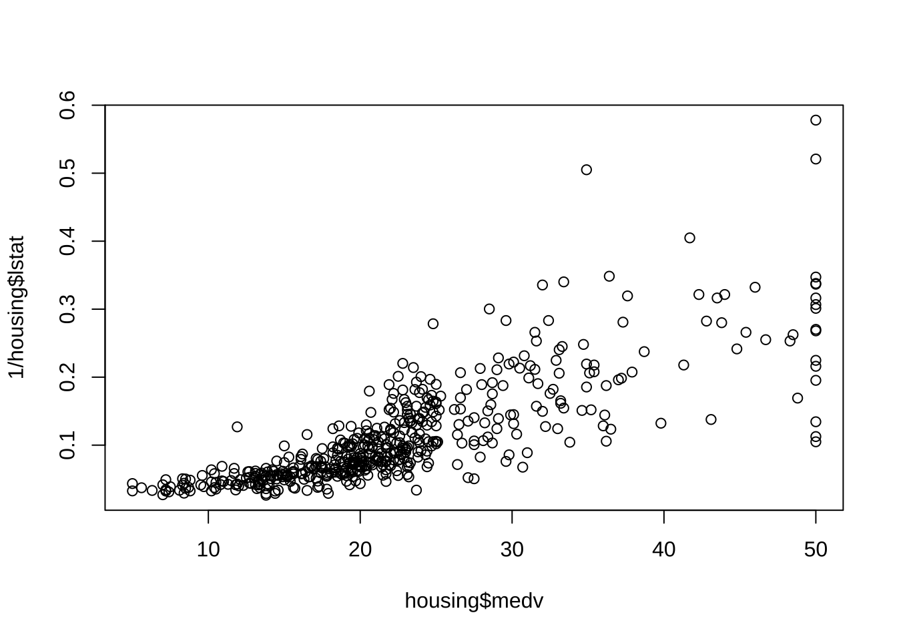

```r
summary(res_lm5)
#> 
#> Call:
#> lm(formula = medv ~ crim + rm + tax + ptratio + invlstat, data = data2)
#> 
#> Residuals:
#>      Min       1Q   Median       3Q      Max 
#> -14.9062  -2.6032  -0.5276   2.1041  31.2592 
#> 
#> Coefficients:
#>              Estimate Std. Error t value Pr(>|t|)    
#> (Intercept)  6.665018   3.295520   2.022   0.0437 *  
#> crim        -0.119564   0.030121  -3.969 8.26e-05 ***
#> rm           3.609393   0.394880   9.140  < 2e-16 ***
#> tax         -0.002272   0.001693  -1.342   0.1802    
#> ptratio     -0.665188   0.114156  -5.827 1.01e-08 ***
#> invlstat    60.465938   3.762069  16.073  < 2e-16 ***
#> ---
#> Signif. codes:  0 '***' 0.001 '**' 0.01 '*' 0.05 '.' 0.1 ' ' 1
#> 
#> Residual standard error: 4.719 on 500 degrees of freedom
#> Multiple R-squared:  0.7393,	Adjusted R-squared:  0.7367 
#> F-statistic: 283.6 on 5 and 500 DF,  p-value: < 2.2e-16
```

`crim`も`medv`と非線形な関係があるため, これを適当に非線形変換することで更に改善できる余地がある (各自で試して欲しい).


標準的なモデル選択規準であるAICやBICは, 関数`AIC()`, `BIC()`によって計算することができる.

```r
# AIC, BICの計算
AIC(res_lm5, res_lm2)
#>         df      AIC
#> res_lm5  7 3014.149
#> res_lm2  7 3115.379
BIC(res_lm5, res_lm2)
#>         df      BIC
#> res_lm5  7 3043.735
#> res_lm2  7 3144.965
```
AIC, BIC双方とも, `res_lm5`は`res_lm2`より望ましいことを示している.

関数`anova()`を使って, 分散分析によって (包含関係になる) モデル間の比較をすることができる.

```r
# 追加 (除去) した変数群の有意性 (例)
anova(res_lm1, res_lm3, test = "F")  # F検定
#> Analysis of Variance Table
#> 
#> Model 1: medv ~ crim + rm + tax + lstat
#> Model 2: medv ~ crim + rm + tax + lstat + ptratio + zn
#>   Res.Df   RSS Df Sum of Sq      F    Pr(>F)    
#> 1    501 14925                                  
#> 2    499 13587  2    1338.1 24.572 6.636e-11 ***
#> ---
#> Signif. codes:  0 '***' 0.001 '**' 0.01 '*' 0.05 '.' 0.1 ' ' 1
anova(res_lm3, res_lm1, test = "F")  # 実質的に同一
#> Analysis of Variance Table
#> 
#> Model 1: medv ~ crim + rm + tax + lstat + ptratio + zn
#> Model 2: medv ~ crim + rm + tax + lstat
#>   Res.Df   RSS Df Sum of Sq      F    Pr(>F)    
#> 1    499 13587                                  
#> 2    501 14925 -2   -1338.1 24.572 6.636e-11 ***
#> ---
#> Signif. codes:  0 '***' 0.001 '**' 0.01 '*' 0.05 '.' 0.1 ' ' 1
# anova(res_lm1, res_lm2, test = 'LRT') # 尤度比検定
```

- ステップワイズ法による変数選択

ステップワイズ法は, 関数`lm()`の実行結果オブジェクトを, 関数`step()`に入力として与えることで実行することができる.
```
# step(); AICによって決定
# scope: モデルサーチの範囲 (追加や削除を検討するべき変数を指定)
# scope指定ない場合:
# - directionのデフォルトは, 変数減少法 (後方削除)
# - モデルサーチ上限 (upper) は, 初期モデル
# scope指定ある場合:
# - directionのデフォルトは, 変数増減法
# - scopeがリストでなく, 単一式で与えらている場合, upperモデルと解釈 (lowerは欠損)
```

```r
res_lm_all <- lm(medv ~ ., data = housing)  # → 13変数
res_lm_all_2 <- lm(medv ~ 1, data = housing)  # → y切片のみ (変数なし)
#
step(res_lm5)  # 変数減少法 (scopeない場合のデフォルト)
#> Start:  AIC=1576.18
#> medv ~ crim + rm + tax + ptratio + invlstat
#> 
#>            Df Sum of Sq   RSS    AIC
#> - tax       1      40.1 11175 1576.0
#> <none>                  11134 1576.2
#> - crim      1     350.9 11485 1589.9
#> - ptratio   1     756.1 11891 1607.4
#> - rm        1    1860.5 12995 1652.4
#> - invlstat  1    5752.7 16887 1784.9
#> 
#> Step:  AIC=1576
#> medv ~ crim + rm + ptratio + invlstat
#> 
#>            Df Sum of Sq   RSS    AIC
#> <none>                  11175 1576.0
#> - crim      1     643.8 11818 1602.3
#> - ptratio   1     951.0 12126 1615.3
#> - rm        1    1847.9 13023 1651.4
#> - invlstat  1    6153.6 17328 1796.0
#> 
#> Call:
#> lm(formula = medv ~ crim + rm + ptratio + invlstat, data = data2)
#> 
#> Coefficients:
#> (Intercept)         crim           rm      ptratio     invlstat  
#>      6.6395      -0.1399       3.5960      -0.7113      61.4172
# step(res_lm5, direction = 'forward')\t# 変数増加法 (上限は初期モデル)
# step(res_lm5, direction = 'both')\t# 変数増減法 (上限は初期モデル)
```


```r
# 採用する変数の上限・下限の指定
step(res_lm_all, scope = list(lower = ~crim + rm))  # 下限のモデルを指定. 変数増減法
#> Start:  AIC=1589.64
#> medv ~ crim + zn + indus + chas + nox + rm + age + dis + rad + 
#>     tax + ptratio + b + lstat
#> 
#>           Df Sum of Sq   RSS    AIC
#> - age      1      0.06 11079 1587.7
#> - indus    1      2.52 11081 1587.8
#> <none>                 11079 1589.6
#> - chas     1    218.97 11298 1597.5
#> - tax      1    242.26 11321 1598.6
#> - zn       1    257.49 11336 1599.3
#> - b        1    270.63 11349 1599.8
#> - rad      1    479.15 11558 1609.1
#> - nox      1    487.16 11566 1609.4
#> - ptratio  1   1194.23 12273 1639.4
#> - dis      1   1232.41 12311 1641.0
#> - lstat    1   2410.84 13490 1687.3
#> 
#> Step:  AIC=1587.65
#> medv ~ crim + zn + indus + chas + nox + rm + dis + rad + tax + 
#>     ptratio + b + lstat
#> 
#>           Df Sum of Sq   RSS    AIC
#> - indus    1      2.52 11081 1585.8
#> <none>                 11079 1587.7
#> - chas     1    219.91 11299 1595.6
#> - tax      1    242.24 11321 1596.6
#> - zn       1    260.32 11339 1597.4
#> - b        1    272.26 11351 1597.9
#> - rad      1    481.09 11560 1607.2
#> - nox      1    520.87 11600 1608.9
#> - ptratio  1   1200.23 12279 1637.7
#> - dis      1   1352.26 12431 1643.9
#> - lstat    1   2718.88 13798 1696.7
#> 
#> Step:  AIC=1585.76
#> medv ~ crim + zn + chas + nox + rm + dis + rad + tax + ptratio + 
#>     b + lstat
#> 
#>           Df Sum of Sq   RSS    AIC
#> <none>                 11081 1585.8
#> - chas     1    227.21 11309 1594.0
#> - zn       1    257.82 11339 1595.4
#> - b        1    270.82 11352 1596.0
#> - tax      1    273.62 11355 1596.1
#> - rad      1    500.92 11582 1606.1
#> - nox      1    541.91 11623 1607.9
#> - ptratio  1   1206.45 12288 1636.0
#> - dis      1   1448.94 12530 1645.9
#> - lstat    1   2723.48 13805 1695.0
#> 
#> Call:
#> lm(formula = medv ~ crim + zn + chas + nox + rm + dis + rad + 
#>     tax + ptratio + b + lstat, data = housing)
#> 
#> Coefficients:
#> (Intercept)         crim           zn         chas          nox           rm  
#>   36.341145    -0.108413     0.045845     2.718716   -17.376023     3.801579  
#>         dis          rad          tax      ptratio            b        lstat  
#>   -1.492711     0.299608    -0.011778    -0.946525     0.009291    -0.522553
step(res_lm_all_2, scope = list(upper = ~crim + rm))  # 上限のモデルを指定. 変数増減法
#> Start:  AIC=2246.51
#> medv ~ 1
#> 
#>        Df Sum of Sq   RSS    AIC
#> + rm    1   20654.4 22062 1914.2
#> + crim  1    6440.8 36276 2165.8
#> <none>              42716 2246.5
#> 
#> Step:  AIC=1914.19
#> medv ~ rm
#> 
#>        Df Sum of Sq   RSS    AIC
#> + crim  1    2496.1 19566 1855.4
#> <none>              22062 1914.2
#> - rm    1   20654.4 42716 2246.5
#> 
#> Step:  AIC=1855.43
#> medv ~ rm + crim
#> 
#>        Df Sum of Sq   RSS    AIC
#> <none>              19566 1855.4
#> - crim  1    2496.1 22062 1914.2
#> - rm    1   16709.7 36276 2165.8
#> 
#> Call:
#> lm(formula = medv ~ rm + crim, data = housing)
#> 
#> Coefficients:
#> (Intercept)           rm         crim  
#>    -29.2447       8.3911      -0.2649
step(res_lm1, scope = list(upper = ~crim + rm + tax + lstat + ptratio + b, lower = ~crim +
  rm))
#> Start:  AIC=1722.43
#> medv ~ crim + rm + tax + lstat
#> 
#>           Df Sum of Sq   RSS    AIC
#> + ptratio  1    1324.2 13601 1677.4
#> + b        1     255.6 14669 1715.7
#> <none>                 14925 1722.4
#> - tax      1     203.1 15128 1727.3
#> - lstat    1    3373.6 18298 1823.5
#> 
#> Step:  AIC=1677.41
#> medv ~ crim + rm + tax + lstat + ptratio
#> 
#>           Df Sum of Sq   RSS    AIC
#> + b        1     306.0 13295 1667.9
#> - tax      1       4.9 13606 1675.6
#> <none>                 13601 1677.4
#> - ptratio  1    1324.2 14925 1722.4
#> - lstat    1    3286.7 16887 1784.9
#> 
#> Step:  AIC=1667.9
#> medv ~ crim + rm + tax + lstat + ptratio + b
#> 
#>           Df Sum of Sq   RSS    AIC
#> - tax      1      3.06 13298 1666.0
#> <none>                 13295 1667.9
#> - b        1    306.02 13601 1677.4
#> - ptratio  1   1374.66 14669 1715.7
#> - lstat    1   2849.76 16144 1764.2
#> 
#> Step:  AIC=1666.01
#> medv ~ crim + rm + lstat + ptratio + b
#> 
#>           Df Sum of Sq   RSS    AIC
#> <none>                 13298 1666.0
#> + tax      1      3.06 13295 1667.9
#> - b        1    307.85 13606 1675.6
#> - ptratio  1   1478.71 14776 1717.4
#> - lstat    1   3001.77 16299 1767.0
#> 
#> Call:
#> lm(formula = medv ~ crim + rm + lstat + ptratio + b, data = housing)
#> 
#> Coefficients:
#> (Intercept)         crim           rm        lstat      ptratio            b  
#>   11.615006    -0.038921     4.788176    -0.495139    -0.877249     0.009593
# 上限・下限を同時に指定. 変数増減法 ----------------------------------------#
```

## 説明変数に質的変数を含む回帰
### データセット#3: 高速道路事故データ {-}

```
- Hoffstedt’s Highway accident data
  - adt：1日の平均交通量（単位：千台)
  - trks：総交通量に占めるトラック交通量の割合
  - lane：交通の総車線数
  - acpt：1マイルあたりのアクセスポイント数
  - sigs: 1マイルあたりの信号付きインターチェンジの数
  - itg：1マイルあたりの高速道路型インターチェンジの数
  - slim：1973年の制限速度
  - lwid: 車線幅（フィート単位） 
  - shld: 車道の外側路肩の幅（フィート単位)
  - htype: 道路の種類または道路の財源を示す指標:
    "mc": メジャーコレクター (major collector), "fai": 州間 (interstate) 高速道路, "pa": 地域・都市間主要幹線 (principal arterial) 道路, "ma"; 地域・都市内主要幹線 (major arterial) 道路
  - rate: 1973年の事故発生率（百万車両マイル当たり）
- 注) htypeは4-水準因子
- 参考文献: Weisberg (2014), Applied Linear Regression, 4th Ed., Wiley.
```

```r
library(alr4)
data(Highway)
str(Highway)
#> 'data.frame':	39 obs. of  12 variables:
#>  $ adt  : int  69 73 49 61 28 30 46 25 43 23 ...
#>  $ trks : int  8 8 10 13 12 6 8 9 12 7 ...
#>  $ lane : int  8 4 4 6 4 4 4 4 4 4 ...
#>  $ acpt : num  4.6 4.4 4.7 3.8 2.2 24.8 11 18.5 7.5 8.2 ...
#>  $ sigs : num  0 0 0 0 0 1.84 0.7 0.38 1.39 1.21 ...
#>  $ itg  : num  1.2 1.43 1.54 0.94 0.65 0.34 0.47 0.38 0.95 0.12 ...
#>  $ slim : int  55 60 60 65 70 55 55 55 50 50 ...
#>  $ len  : num  4.99 16.11 9.75 10.65 20.01 ...
#>  $ lwid : int  12 12 12 12 12 12 12 12 12 12 ...
#>  $ shld : int  10 10 10 10 10 10 8 10 4 5 ...
#>  $ htype: Factor w/ 4 levels "mc","fai","pa",..: 2 2 2 2 2 3 3 3 3 3 ...
#>  $ rate : num  4.58 2.86 3.02 2.29 1.61 6.87 3.85 6.12 3.29 5.88 ...
Highway %>%
  head()
#>   adt trks lane acpt sigs  itg slim   len lwid shld htype rate
#> 1  69    8    8  4.6 0.00 1.20   55  4.99   12   10   fai 4.58
#> 2  73    8    4  4.4 0.00 1.43   60 16.11   12   10   fai 2.86
#> 3  49   10    4  4.7 0.00 1.54   60  9.75   12   10   fai 3.02
#> 4  61   13    6  3.8 0.00 0.94   65 10.65   12   10   fai 2.29
#> 5  28   12    4  2.2 0.00 0.65   70 20.01   12   10   fai 1.61
#> 6  30    6    4 24.8 1.84 0.34   55  5.97   12   10    pa 6.87
```


ライブラリ`corrplot`の関数`corrplot.mixed()`を使うと, 相関係数のヒートマップと相関係数の値を同時に表示するプロットを作成することができる.

```r
library(corrplot)
cor_hw <- cor(cbind(Highway$rate, Highway[, -(11:12)]))  # htypeを除去
corrplot.mixed(cor_hw)
```

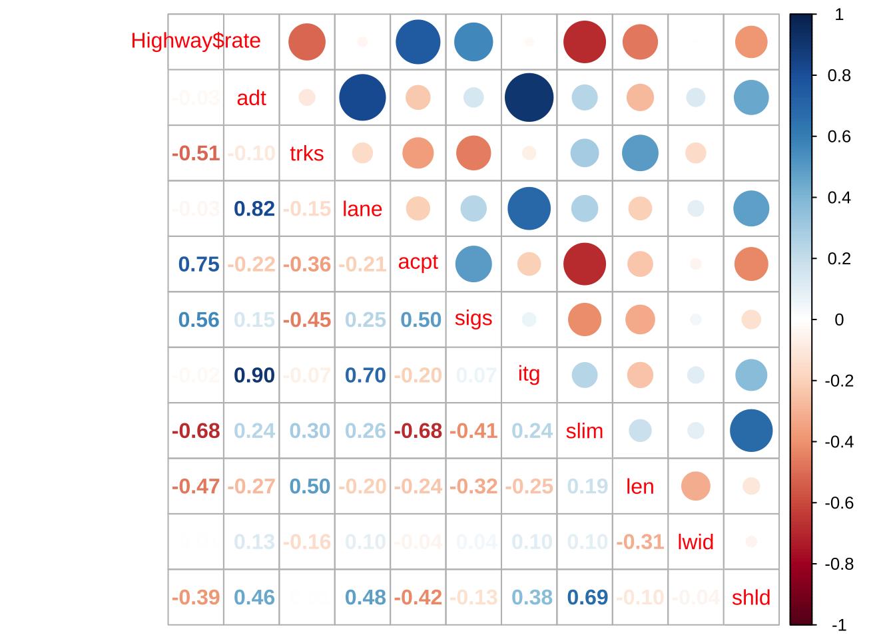


```r
# OLS回帰
res_lm <- lm(rate ~ ., data = Highway)
summary(res_lm)
#> 
#> Call:
#> lm(formula = rate ~ ., data = Highway)
#> 
#> Residuals:
#>      Min       1Q   Median       3Q      Max 
#> -1.99564 -0.62039 -0.05676  0.61741  2.54998 
#> 
#> Coefficients:
#>              Estimate Std. Error t value Pr(>|t|)  
#> (Intercept) 13.658212   6.872719   1.987   0.0579 .
#> adt         -0.004038   0.033945  -0.119   0.9063  
#> trks        -0.100150   0.114726  -0.873   0.3910  
#> lane         0.026675   0.283834   0.094   0.9259  
#> acpt         0.066588   0.042569   1.564   0.1303  
#> sigs         0.713644   0.525213   1.359   0.1864  
#> itg         -0.475478   1.282742  -0.371   0.7140  
#> slim        -0.123778   0.081683  -1.515   0.1422  
#> len         -0.064751   0.033369  -1.940   0.0637 .
#> lwid        -0.133813   0.597917  -0.224   0.8247  
#> shld         0.014113   0.162174   0.087   0.9313  
#> htypefai     0.543592   1.728270   0.315   0.7557  
#> htypepa     -1.009777   1.105612  -0.913   0.3698  
#> htypema     -0.548025   0.975623  -0.562   0.5793  
#> ---
#> Signif. codes:  0 '***' 0.001 '**' 0.01 '*' 0.05 '.' 0.1 ' ' 1
#> 
#> Residual standard error: 1.198 on 25 degrees of freedom
#> Multiple R-squared:  0.7605,	Adjusted R-squared:  0.636 
#> F-statistic: 6.107 on 13 and 25 DF,  p-value: 5.733e-05

# ステップワイズ回帰
res_step <- step(res_lm, trace = 0)  # 実行プロセスの非表示
summary(res_step)
#> 
#> Call:
#> lm(formula = rate ~ acpt + sigs + slim + len, data = Highway)
#> 
#> Residuals:
#>     Min      1Q  Median      3Q     Max 
#> -1.7505 -0.8659  0.1051  0.6618  2.5116 
#> 
#> Coefficients:
#>             Estimate Std. Error t value Pr(>|t|)   
#> (Intercept)  8.81443    2.60435   3.385  0.00181 **
#> acpt         0.08940    0.02818   3.173  0.00319 **
#> sigs         0.48538    0.34164   1.421  0.16450   
#> slim        -0.09599    0.04255  -2.256  0.03064 * 
#> len         -0.06856    0.02524  -2.717  0.01030 * 
#> ---
#> Signif. codes:  0 '***' 0.001 '**' 0.01 '*' 0.05 '.' 0.1 ' ' 1
#> 
#> Residual standard error: 1.116 on 34 degrees of freedom
#> Multiple R-squared:  0.7176,	Adjusted R-squared:  0.6843 
#> F-statistic:  21.6 on 4 and 34 DF,  p-value: 6.112e-09

## 除かれた変数群の有意性 anova(res_step, res_lm) # anova(res_lm, res_step)
```

- 多重共線性のチェック (VIF)

```r
# VIF install.packages('car')\t\t# or RStudio, Tools → Install packages,
library(car)  # 'Companion to Applied Regression' package
vif(res_lm)
#>            GVIF Df GVIF^(1/(2*Df))
#> adt   10.563911  1        3.250217
#> trks   1.931277  1        1.389704
#> lane   3.947949  1        1.986945
#> acpt   4.164627  1        2.040742
#> sigs   2.929007  1        1.711434
#> itg    7.362521  1        2.713397
#> slim   6.041264  1        2.457898
#> len    1.706597  1        1.306368
#> lwid   1.966483  1        1.402313
#> shld   6.417952  1        2.533368
#> htype 28.984452  3        1.752646
```

VIFによる多重共線性への対応に関する慣用ルールとして, 5以上の値を持つ説明変数は要注意, 10以上の変数は除去するのが良いとされている.


## 時系列データ同士の回帰
### データセット#4: 株式市場 {-}

```
- TOPIX: 東証株価指数, 月次終値, 2011年12月--2017年4月
- X1--X4, ある指標
```

```r
topixmat <- read.csv("topix_X.csv")
topixmat %>%
  head()
#>             topix     X1     X2     X3     X4
#> 2011年12月 728.61 100.00 100.00 100.00 100.00
#> 2012年1月  755.27  96.86  95.54  95.23 101.11
#> 2012年2月  835.96  97.77  96.44  93.82  98.36
#> 2012年3月  854.35  93.71 104.55  95.06 102.92
#> 2012年4月  804.27 101.62  98.71  89.65 106.08
#> 2012年5月  719.49 103.34  98.31  90.55 115.28
```


```r
attach(topixmat)
res_lm1 <- lm(topix ~ X1)
summary(res_lm1)
#> 
#> Call:
#> lm(formula = topix ~ X1)
#> 
#> Residuals:
#>     Min      1Q  Median      3Q     Max 
#> -391.79 -173.11  -16.77   82.05  452.93 
#> 
#> Coefficients:
#>             Estimate Std. Error t value Pr(>|t|)    
#> (Intercept) -170.600    219.329  -0.778     0.44    
#> X1            11.635      1.805   6.448 1.82e-08 ***
#> ---
#> Signif. codes:  0 '***' 0.001 '**' 0.01 '*' 0.05 '.' 0.1 ' ' 1
#> 
#> Residual standard error: 220.2 on 63 degrees of freedom
#> Multiple R-squared:  0.3975,	Adjusted R-squared:  0.388 
#> F-statistic: 41.57 on 1 and 63 DF,  p-value: 1.815e-08
par(mfrow = c(1, 1))
plot(X1, topix)
```

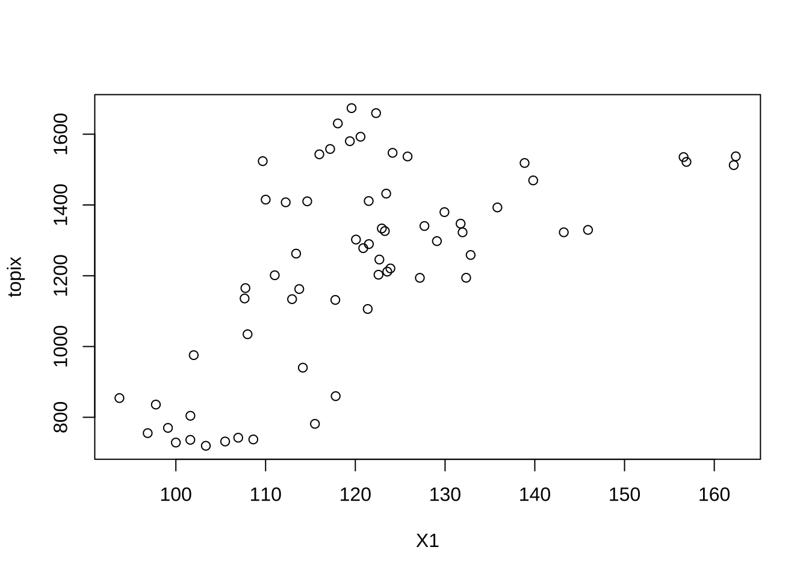

```r
cor(X1, topix)
#> [1] 0.6305084
par(mfrow = c(2, 1))
plot(topix, type = "l")
plot(X1, type = "l")
```

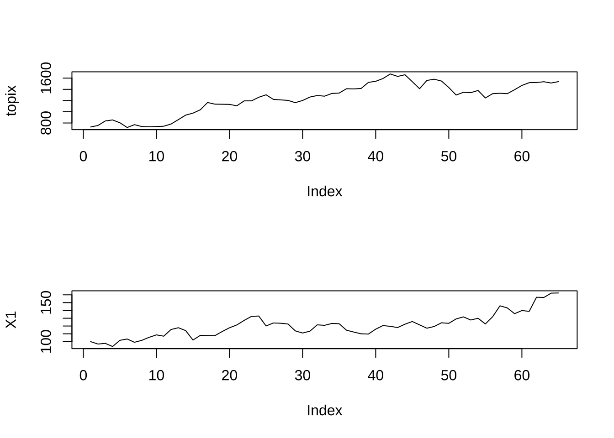

```r
#
res_lm2 <- lm(topix ~ X2)
summary(res_lm2)
#> 
#> Call:
#> lm(formula = topix ~ X2)
#> 
#> Residuals:
#>     Min      1Q  Median      3Q     Max 
#> -396.10 -182.85  -57.86  198.61  599.41 
#> 
#> Coefficients:
#>             Estimate Std. Error t value Pr(>|t|)    
#> (Intercept)  153.656    243.855    0.63    0.531    
#> X2             8.739      1.960    4.46 3.45e-05 ***
#> ---
#> Signif. codes:  0 '***' 0.001 '**' 0.01 '*' 0.05 '.' 0.1 ' ' 1
#> 
#> Residual standard error: 247.3 on 63 degrees of freedom
#> Multiple R-squared:  0.2399,	Adjusted R-squared:  0.2279 
#> F-statistic: 19.89 on 1 and 63 DF,  p-value: 3.451e-05
plot(X2, topix)
cor(X2, topix)
#> [1] 0.4898424
par(mfrow = c(2, 1))
```

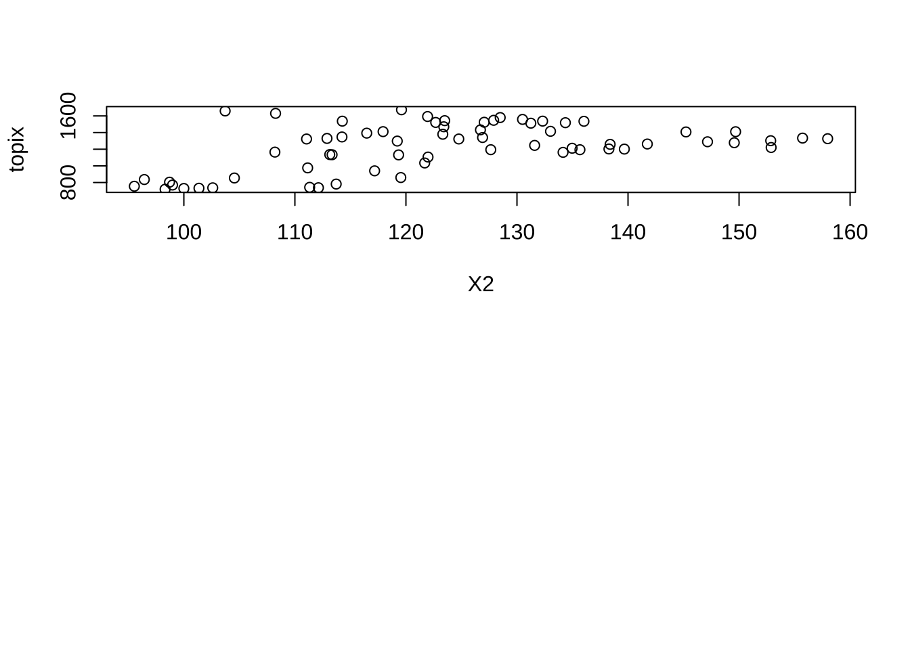

```r
plot(topix, type = "l")
plot(X2, type = "l")
```

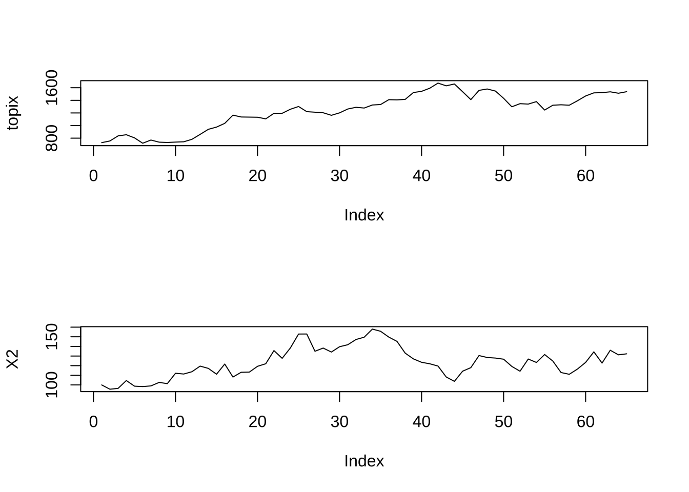

以上の結果から, どんなことが言えるか?
例えば, "ある指標"が毎月初めに得られるとすれば, その月のTOPIXの終値を予測するのに使うことができるという結論を出して良いだろうか?


```r
# 残差プロット plot(res_lm1); plot(res_lm2) Durbin - Watson検定
library(lmtest)
dwtest(res_lm1)
#> 
#> 	Durbin-Watson test
#> 
#> data:  res_lm1
#> DW = 0.17012, p-value < 2.2e-16
#> alternative hypothesis: true autocorrelation is greater than 0
dwtest(res_lm2)
#> 
#> 	Durbin-Watson test
#> 
#> data:  res_lm2
#> DW = 0.1226, p-value < 2.2e-16
#> alternative hypothesis: true autocorrelation is greater than 0
```

