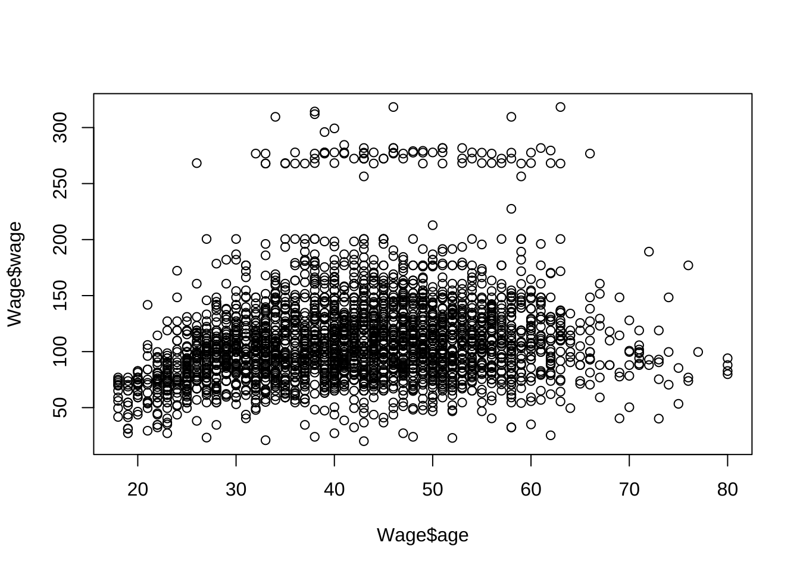
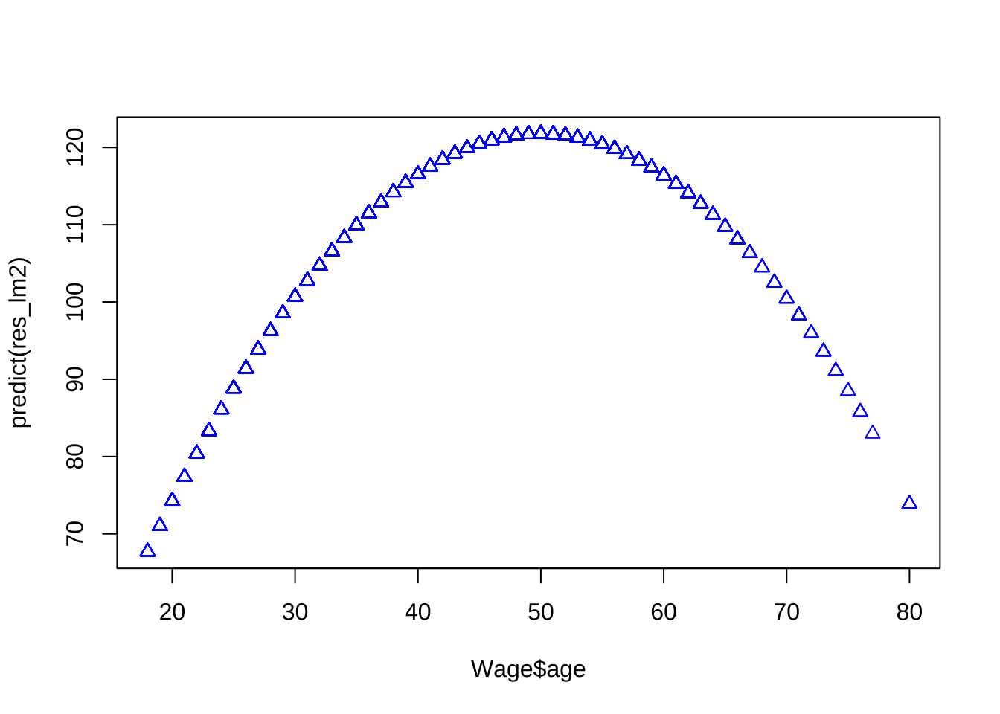
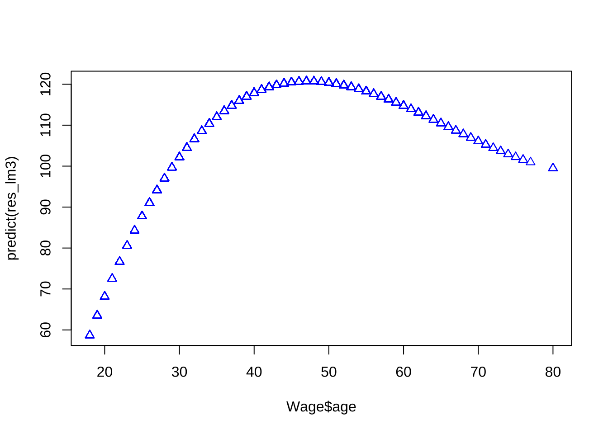
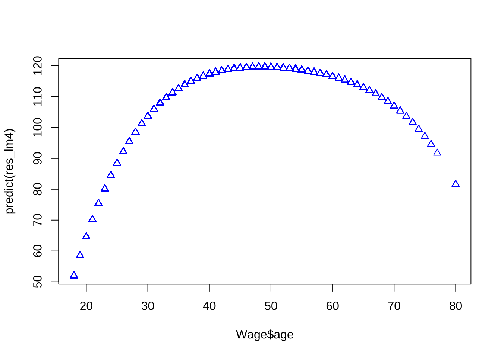

## 説明変数に質的変数を含む回帰 (2)

関数`lm()`の結果を関数`anova()`に入力することで,
分散分析表を作成する.

関数`anova()`は各説明変数 (量的変数, 質的変数どちらについても)
ごとに変動性を分割して $F$ 値および $p$ 値を計算する詳細な分散分析表 (ANOVA table) を作成する.
また, 二つ以上の包含関係 (ネスト) 
のある回帰モデルの適合結果オブジェクトを同時に引数として与えることで,
追加 (あるいは除去される) 変数群の持つ有意性を一括して調べることが出来る.


<!--
さらに, Rの環境設定のための関数`options()`のパラメータの一つであるコントラスト("contrasts")を変えることで, パラメータの持つ意味が, すなわち, 解釈が変わることも確認する.
-->

### データセット#5: 収入データ (仮想) {-}

```
- income.csv
 - 月収 (万円)
 - キャリア年数 (年)
 - 能力試験 (点)
 - 業種 (A/B)
```

```r
dat1 <- read.csv("income.csv")
```


```r
# キャリア年数を説明変数とする単回帰
lm1_mod0 <- lm(月収 ~ キャリア年数, dat = dat1)
summary(lm1_mod0)
#> 
#> Call:
#> lm(formula = 月収 ~ キャリア年数, data = dat1)
#> 
#> Residuals:
#>      Min       1Q   Median       3Q      Max 
#> -16.8581  -3.4759  -0.7415   4.5299  13.6303 
#> 
#> Coefficients:
#>              Estimate Std. Error t value Pr(>|t|)    
#> (Intercept)   19.8952     1.8298   10.87   <2e-16 ***
#> キャリア年数   1.9703     0.1362   14.46   <2e-16 ***
#> ---
#> Signif. codes:  0 '***' 0.001 '**' 0.01 '*' 0.05 '.' 0.1 ' ' 1
#> 
#> Residual standard error: 5.495 on 98 degrees of freedom
#> Multiple R-squared:  0.681,	Adjusted R-squared:  0.6778 
#> F-statistic: 209.2 on 1 and 98 DF,  p-value: < 2.2e-16
anova(lm1_mod0)  # ANOVA表
#> Analysis of Variance Table
#> 
#> Response: 月収
#>              Df Sum Sq Mean Sq F value    Pr(>F)    
#> キャリア年数  1 6316.7  6316.7  209.23 < 2.2e-16 ***
#> Residuals    98 2958.6    30.2                      
#> ---
#> Signif. codes:  0 '***' 0.001 '**' 0.01 '*' 0.05 '.' 0.1 ' ' 1

# 業種 (質的変数) を説明変数に追加 交互作用項なしモデル lm1_mod1 <- lm(月収 ~
# キャリア年数 + 業種, dat = dat1)
lm1_mod1 <- update(lm1_mod0, . ~ . + 業種)
summary(lm1_mod1)
#> 
#> Call:
#> lm(formula = 月収 ~ キャリア年数 + 業種, data = dat1)
#> 
#> Residuals:
#>      Min       1Q   Median       3Q      Max 
#> -14.4436  -3.5628  -0.6921   3.5165  12.6536 
#> 
#> Coefficients:
#>              Estimate Std. Error t value Pr(>|t|)    
#> (Intercept)   20.7222     1.7727  11.690  < 2e-16 ***
#> キャリア年数   1.9900     0.1306  15.233  < 2e-16 ***
#> 業種B         -3.5982     1.1499  -3.129  0.00232 ** 
#> ---
#> Signif. codes:  0 '***' 0.001 '**' 0.01 '*' 0.05 '.' 0.1 ' ' 1
#> 
#> Residual standard error: 5.264 on 97 degrees of freedom
#> Multiple R-squared:  0.7103,	Adjusted R-squared:  0.7043 
#> F-statistic: 118.9 on 2 and 97 DF,  p-value: < 2.2e-16
anova(lm1_mod1)  # ANOVA表
#> Analysis of Variance Table
#> 
#> Response: 月収
#>              Df Sum Sq Mean Sq  F value    Pr(>F)    
#> キャリア年数  1 6316.7  6316.7 227.9980 < 2.2e-16 ***
#> 業種          1  271.2   271.2   9.7906  0.002317 ** 
#> Residuals    97 2687.4    27.7                       
#> ---
#> Signif. codes:  0 '***' 0.001 '**' 0.01 '*' 0.05 '.' 0.1 ' ' 1
```

`summary(lm1_mod1)`の出力結果から, この回帰分析のベースラインは
業種Aであることが分かる. すなわち, ２つ目の回帰係数`業種B`は,
業種Bに属することによる相対効果, すなわち, 業種BのAに対する目的変数`月収`の平均値の差分を表している.

具体的には, 回帰係数の切片項の値が $22.92898$ が業種Aの切片となっていて,
一方, 業種Bは $23.92898-3.77837=20.15061$ を切片に持つと読むことができる.

業種の違いによるキャリア年数の影響度 (傾き) の違い を調べるためには,
業種とキャリア年数の2つの項を持つモデルに両者の交互作用項を加え,
その交互作用項の有意性 ($t$値に基づく$p$値) を確認すれば良い.

```r
# 交互作用項有りモデル
lm1_mod1_2 <- lm(月収 ~ キャリア年数 * 業種, dat = dat1)
summary(lm1_mod1_2)
#> 
#> Call:
#> lm(formula = 月収 ~ キャリア年数 * 業種, data = dat1)
#> 
#> Residuals:
#>      Min       1Q   Median       3Q      Max 
#> -13.2175  -3.7691  -0.8021   3.4916  13.2028 
#> 
#> Coefficients:
#>                    Estimate Std. Error t value Pr(>|t|)    
#> (Intercept)         19.3523     2.0795   9.306  4.6e-15 ***
#> キャリア年数         2.0980     0.1563  13.424  < 2e-16 ***
#> 業種B                0.9930     3.8464   0.258    0.797    
#> キャリア年数:業種B  -0.3537     0.2828  -1.250    0.214    
#> ---
#> Signif. codes:  0 '***' 0.001 '**' 0.01 '*' 0.05 '.' 0.1 ' ' 1
#> 
#> Residual standard error: 5.248 on 96 degrees of freedom
#> Multiple R-squared:  0.7149,	Adjusted R-squared:  0.706 
#> F-statistic: 80.24 on 3 and 96 DF,  p-value: < 2.2e-16
anova(lm1_mod1_2)
#> Analysis of Variance Table
#> 
#> Response: 月収
#>                   Df Sum Sq Mean Sq  F value    Pr(>F)    
#> キャリア年数       1 6316.7  6316.7 229.3230 < 2.2e-16 ***
#> 業種               1  271.2   271.2   9.8475  0.002259 ** 
#> キャリア年数:業種  1   43.1    43.1   1.5637  0.214160    
#> Residuals         96 2644.3    27.5                       
#> ---
#> Signif. codes:  0 '***' 0.001 '**' 0.01 '*' 0.05 '.' 0.1 ' ' 1
```
回帰係数の結果表より, 交互作用項は有意な差があるとは言えない, すなわち, 業種の違いによる回帰係数の差は認められなかった (十分な証拠が得られなかった).

代替的に, 業種とキャリア年数の交互作用ありモデルとなしモデルについて`lm()`をそれぞれ走らせ, 二つの結果を`anova()`に同時に与えることで両者の変動性に有意な差があるかを調べても良い.

```r
anova(lm1_mod1, lm1_mod1_2)  # ANOVA表
#> Analysis of Variance Table
#> 
#> Model 1: 月収 ~ キャリア年数 + 業種
#> Model 2: 月収 ~ キャリア年数 * 業種
#>   Res.Df    RSS Df Sum of Sq      F Pr(>F)
#> 1     97 2687.4                           
#> 2     96 2644.3  1    43.073 1.5637 0.2142
```

先述の交互作用項の$t$値に基づいた$p$値と等価な結果が得られた.


```r
lm1_mod2 <- update(lm1_mod1, . ~ . + 能力試験)
summary(lm1_mod2)
#> 
#> Call:
#> lm(formula = 月収 ~ キャリア年数 + 業種 + 能力試験, 
#>     data = dat1)
#> 
#> Residuals:
#>      Min       1Q   Median       3Q      Max 
#> -14.8763  -3.9926  -0.6659   3.7814  12.0713 
#> 
#> Coefficients:
#>              Estimate Std. Error t value Pr(>|t|)    
#> (Intercept)  23.92898    3.52028   6.797    9e-10 ***
#> キャリア年数  1.98691    0.13060  15.214  < 2e-16 ***
#> 業種B        -3.77837    1.16192  -3.252  0.00158 ** 
#> 能力試験     -0.06343    0.06017  -1.054  0.29444    
#> ---
#> Signif. codes:  0 '***' 0.001 '**' 0.01 '*' 0.05 '.' 0.1 ' ' 1
#> 
#> Residual standard error: 5.261 on 96 degrees of freedom
#> Multiple R-squared:  0.7136,	Adjusted R-squared:  0.7046 
#> F-statistic: 79.72 on 3 and 96 DF,  p-value: < 2.2e-16
anova(lm1_mod2)  # ANOVA表
#> Analysis of Variance Table
#> 
#> Response: 月収
#>              Df Sum Sq Mean Sq  F value  Pr(>F)    
#> キャリア年数  1 6316.7  6316.7 228.2596 < 2e-16 ***
#> 業種          1  271.2   271.2   9.8018 0.00231 ** 
#> 能力試験      1   30.8    30.8   1.1113 0.29444    
#> Residuals    96 2656.6    27.7                     
#> ---
#> Signif. codes:  0 '***' 0.001 '**' 0.01 '*' 0.05 '.' 0.1 ' ' 1
```


次に, 関数`anova()`により, ネスト関係にある二つのモデル`lm1_mod0`, 
`lm1_mod2`を比較する.

```r
# モデル比較 anova(lm1_mod0, lm1_mod1, lm1_mod2)
anova(lm1_mod0, lm1_mod2)
#> Analysis of Variance Table
#> 
#> Model 1: 月収 ~ キャリア年数
#> Model 2: 月収 ~ キャリア年数 + 業種 + 能力試験
#>   Res.Df    RSS Df Sum of Sq      F   Pr(>F)   
#> 1     98 2958.6                                
#> 2     96 2656.6  2       302 5.4566 0.005695 **
#> ---
#> Signif. codes:  0 '***' 0.001 '**' 0.01 '*' 0.05 '.' 0.1 ' ' 1
```

二つの変数, 業種, 能力試験は一括して, 偶然 (サンプリング・エラー) とはみなせないような体系的な (有意な) 変動を持つことを示している.
すなわち, 業種と能力試験は説明変数に加えておいた方が良いと判断される.

さらに, モデル選択規準AICによっても, これらを説明変数に持つ`lm1_mod2`の方が望ましいことを示している.

```r
AIC(lm1_mod0, lm1_mod2)
#>          df      AIC
#> lm1_mod0  3 628.5190
#> lm1_mod2  5 621.7522
```


#### "コントラスト"の設定変更 {-}

関数`options()`のパラメータの一つであるコントラスト (contrasts) を変えることで, パラメータの持つ意味が, すなわち, 解釈が変わる.

Rのデフォルトは, 処置対比 ("contr.treatment").

```
#options("contrasts")
#options("contrasts" = c("contr.treatment", "contr.poly"))	# デフォルト
#options("contrasts" = c("contr.sum", "contr.poly"))
```

零和対比 ("contr.sum) に変更した場合について結果を, 上と比較してみよう.

```r
options(contrasts = c("contr.sum", "contr.poly"))
lm1_mod2_2 <- update(lm1_mod1, . ~ . + 能力試験)
summary(lm1_mod2_2)
#> 
#> Call:
#> lm(formula = 月収 ~ キャリア年数 + 業種 + 能力試験, 
#>     data = dat1)
#> 
#> Residuals:
#>      Min       1Q   Median       3Q      Max 
#> -14.8763  -3.9926  -0.6659   3.7814  12.0713 
#> 
#> Coefficients:
#>              Estimate Std. Error t value Pr(>|t|)    
#> (Intercept)  22.03980    3.45054   6.387 6.02e-09 ***
#> キャリア年数  1.98691    0.13060  15.214  < 2e-16 ***
#> 業種1         1.88919    0.58096   3.252  0.00158 ** 
#> 能力試験     -0.06343    0.06017  -1.054  0.29444    
#> ---
#> Signif. codes:  0 '***' 0.001 '**' 0.01 '*' 0.05 '.' 0.1 ' ' 1
#> 
#> Residual standard error: 5.261 on 96 degrees of freedom
#> Multiple R-squared:  0.7136,	Adjusted R-squared:  0.7046 
#> F-statistic: 79.72 on 3 and 96 DF,  p-value: < 2.2e-16
```

ここでは, 回帰係数`業種1`が業種Aに対応, 一方, `業種2` (業種B) は省略されている.
零和条件から, `業種2`の係数は$-1.88919$であることが分かる.
すなわち, 切片項の値が $22.03980$ であることから,
業種Aの切片の値は, $22.03980+1.88919=23.92899$, 一方, Bは,
$23.92899-1.88919=20.15061$
となると読める.
すなわち, 先のデフォルトの処置対比の場合の切片の値と一致していることが確認される.

## 多項式回帰
### データセット#6: `Wage` {-}

```
中部大西洋地域の男性労働者3000人の賃金その他のデータ.
Inquidia Consulting（旧Open BI）のSteve Millerが手作業で集計.
Current Population Surveyの2011年3月補足より.
出所: https://www.re3data.org/repository/r3d100011860
```

パッケージ`ISLR`に含まれるデータセット`Wage`を用いて, 賃金を被説明変数, 年齢を説明変数とする回帰分析を行う.

```r
library(ISLR)
head(Wage)
#>        year age           maritl     race       education             region
#> 231655 2006  18 1. Never Married 1. White    1. < HS Grad 2. Middle Atlantic
#> 86582  2004  24 1. Never Married 1. White 4. College Grad 2. Middle Atlantic
#> 161300 2003  45       2. Married 1. White 3. Some College 2. Middle Atlantic
#> 155159 2003  43       2. Married 3. Asian 4. College Grad 2. Middle Atlantic
#> 11443  2005  50      4. Divorced 1. White      2. HS Grad 2. Middle Atlantic
#> 376662 2008  54       2. Married 1. White 4. College Grad 2. Middle Atlantic
#>              jobclass         health health_ins  logwage      wage
#> 231655  1. Industrial      1. <=Good      2. No 4.318063  75.04315
#> 86582  2. Information 2. >=Very Good      2. No 4.255273  70.47602
#> 161300  1. Industrial      1. <=Good     1. Yes 4.875061 130.98218
#> 155159 2. Information 2. >=Very Good     1. Yes 5.041393 154.68529
#> 11443  2. Information      1. <=Good     1. Yes 4.318063  75.04315
#> 376662 2. Information 2. >=Very Good     1. Yes 4.845098 127.11574
# par(new=T)
plot(Wage$age, Wage$wage)
```



- 2次の多項式回帰

```r
# 2次
res_lm2 <- lm(wage ~ poly(age, 2), data = Wage)  # 2次の直交多項式
head(poly(Wage$age, 2))  # 2次の多項式
#>                  1            2
#> [1,] -0.0386247992  0.055908727
#> [2,] -0.0291326034  0.026298066
#> [3,]  0.0040900817 -0.014506548
#> [4,]  0.0009260164 -0.014831404
#> [5,]  0.0120002448 -0.009815846
#> [6,]  0.0183283753 -0.002073906
coef(summary(res_lm2))
#>                Estimate Std. Error   t value     Pr(>|t|)
#> (Intercept)    111.7036   0.730162 152.98470 0.000000e+00
#> poly(age, 2)1  447.0679  39.992617  11.17876 1.878131e-28
#> poly(age, 2)2 -478.3158  39.992617 -11.96010 3.077420e-32
plot(Wage$age, predict(res_lm2), pch = 2, col = "blue")
```



- 3次の多項式回帰

```r
# 3次
res_lm3 <- lm(wage ~ poly(age, 3), data = Wage)  # 3次の直交多項式
head(poly(Wage$age, 3))  # 3次の多項式
#>                  1            2             3
#> [1,] -0.0386247992  0.055908727 -0.0717405794
#> [2,] -0.0291326034  0.026298066 -0.0145499511
#> [3,]  0.0040900817 -0.014506548 -0.0001331835
#> [4,]  0.0009260164 -0.014831404  0.0045136682
#> [5,]  0.0120002448 -0.009815846 -0.0111366263
#> [6,]  0.0183283753 -0.002073906 -0.0166282799
coef(summary(res_lm3))
#>                Estimate Std. Error    t value     Pr(>|t|)
#> (Intercept)    111.7036  0.7290826 153.211181 0.000000e+00
#> poly(age, 3)1  447.0679 39.9334995  11.195309 1.570802e-28
#> poly(age, 3)2 -478.3158 39.9334995 -11.977808 2.511784e-32
#> poly(age, 3)3  125.5217 39.9334995   3.143268 1.687063e-03
plot(Wage$age, predict(res_lm3), pch = 2, col = "blue")
```



- 4次の多項式回帰

```r
# 4次
res_lm4 <- lm(wage ~ poly(age, 4), data = Wage)  # 4次の直交多項式
head(poly(Wage$age, 4))  # 4次の多項式
#>                  1            2             3            4
#> [1,] -0.0386247992  0.055908727 -0.0717405794  0.086729854
#> [2,] -0.0291326034  0.026298066 -0.0145499511 -0.002599280
#> [3,]  0.0040900817 -0.014506548 -0.0001331835  0.014480093
#> [4,]  0.0009260164 -0.014831404  0.0045136682  0.012657507
#> [5,]  0.0120002448 -0.009815846 -0.0111366263  0.010211456
#> [6,]  0.0183283753 -0.002073906 -0.0166282799 -0.001314381
coef(summary(res_lm4))
#>                 Estimate Std. Error    t value     Pr(>|t|)
#> (Intercept)    111.70361  0.7287409 153.283015 0.000000e+00
#> poly(age, 4)1  447.06785 39.9147851  11.200558 1.484604e-28
#> poly(age, 4)2 -478.31581 39.9147851 -11.983424 2.355831e-32
#> poly(age, 4)3  125.52169 39.9147851   3.144742 1.678622e-03
#> poly(age, 4)4  -77.91118 39.9147851  -1.951938 5.103865e-02
plot(Wage$age, predict(res_lm4), pch = 2, col = "blue")
```



```r
#
res_lm4_2 <- lm(wage ~ poly(age, 4, raw = T), data = Wage)  # 非直交化
head(poly(Wage$age, 4, raw = T))  # 4次の多項式
#>       1    2      3       4
#> [1,] 18  324   5832  104976
#> [2,] 24  576  13824  331776
#> [3,] 45 2025  91125 4100625
#> [4,] 43 1849  79507 3418801
#> [5,] 50 2500 125000 6250000
#> [6,] 54 2916 157464 8503056
coef(summary(res_lm4_2))
#>                             Estimate   Std. Error   t value     Pr(>|t|)
#> (Intercept)            -1.841542e+02 6.004038e+01 -3.067172 0.0021802539
#> poly(age, 4, raw = T)1  2.124552e+01 5.886748e+00  3.609042 0.0003123618
#> poly(age, 4, raw = T)2 -5.638593e-01 2.061083e-01 -2.735743 0.0062606446
#> poly(age, 4, raw = T)3  6.810688e-03 3.065931e-03  2.221409 0.0263977518
#> poly(age, 4, raw = T)4 -3.203830e-05 1.641359e-05 -1.951938 0.0510386498
```

モデル式を変えて結果を比較する.

```r
# 上と同一
res_lm4_3 <- lm(wage ~ age + I(age^2) + I(age^3) + I(age^4), data = Wage)
coef(summary(res_lm4_3))
#
res_lm4_3 <- lm(wage ~ cbind(age, age^2, age^3, age^4), data = Wage)
coef(summary(res_lm4_3))

# 以下と比較せよ
res_lm4_4 <- lm(wage ~ age + age^2 + age^3 + age^4, data = Wage)
coef(summary(res_lm4_4))
```
