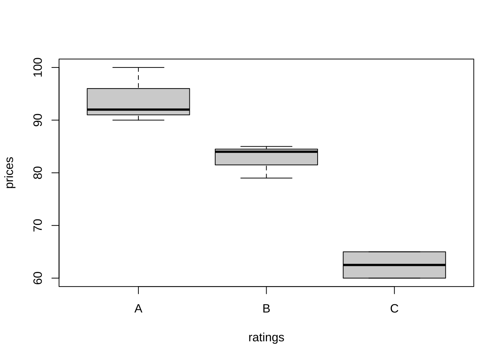

## 関数`factor()`について
<!-- FDS2024用に作成 -->


Rの初心者向けに関数`factor()`の使い方に関する簡単な説明を行う.

---

### Rでのfactor関数の使い方 {-}

関数`factor()`は, カテゴリーデータ（文字列や整数を値に持つベクトル）を因子型（factor）に変換するために使用される.

#### ベクトルを因子に変換 {-}

```r
# 質的変数 (文字列ベクトル) を定義
ratings <- c("A", "B", "C", "B", "A", "C", "A", "B")

# 因子 (ファクター) 化
ratings_factor <- factor(ratings)
ratings_factor
#> [1] A B C B A C A B
#> Levels: A B C
```

#### 因子水準（カテゴリー）の確認 {-}

```r
# 因子水準
levels(ratings_factor)
#> [1] "A" "B" "C"
```

#### 因子ラベルの変更 {-}

```r
# 因子ラベルを付け替え 注) 実行前に,
# 水準とラベルが正しく対応していることを確認すること
levels(ratings_factor) <- c("Excellent", "Good", "Fair")
levels(ratings_factor)
#> [1] "Excellent" "Good"      "Fair"
```

#### 因子の並べ替え {-}

```r
# ファクターの並び替え
ratings_factor <- factor(ratings_factor, levels = c("Fair", "Good", "Excellent"))
ratings_factor
#> [1] Excellent Good      Fair      Good      Excellent Fair      Excellent
#> [8] Good     
#> Levels: Fair Good Excellent
```

(質的な値を持つ) ベクトルを`factor()`により因子に変換する際, 
Rのデフォルトでは水準の値に対してアルファベット順に順番 (整数) が割当てられる. 
名義尺度変数であれば水準に割り当てられる順番自体には本来意味は持たないはずであるが,
それでも, 例えば箱ひげ図など質的変数を使ったプロットする場合,
意図とは異なる順番に配置され不都合が起こることがある.
例えば, "level1", "level2", ...,"level9", "level10"のような数値を含んたベクトルに対して`factor()` を適用して因子化すると, "level1"の次に"level2"ではなく, "level10"が配置されてしまったりする.

```r
aaa <- c("level1", "level2", "level1", "level10", "level2", "level10")
factor(aaa)
#> [1] level1  level2  level1  level10 level2  level10
#> Levels: level1 level10 level2
```

このような不具合を防ぐには, `factor()`を適用する際に,
因子水準 (並び順) を引数`levels`で予め指定しておくのが良い.
その際, 引数`labels`も併用し, 使いやすいラベルを付与しておくと良い.

```r
aaa_factor <- factor(aaa, levels = c("level1", "level2", "level10"), labels = c("L1",
  "L2", "L10"))
aaa_factor
#> [1] L1  L2  L1  L10 L2  L10
#> Levels: L1 L2 L10
```

#### 因子の利用 {-}

Rのデータフレーム (data.frame) は, 行列の形をしているが, 実際は, 長さは等しいものの 異なる"データ型"のベクトルを要素に持つリスト (list) である.
因子に変換されたデータは, データフレーム内でカテゴリー変数として保持することで, 統計解析や可視化などで利用される.


```r
# サンプルのカテゴリーデータ
ratings <- c("A", "B", "C", "B", "A", "C", "A", "B")
prices <- c(100, 85, 60, 79, 90, 65, 92, 84)

# データフレームの作成
df <- data.frame(ratings = factor(ratings), prices = prices)
df
#>   ratings prices
#> 1       A    100
#> 2       B     85
#> 3       C     60
#> 4       B     79
#> 5       A     90
#> 6       C     65
#> 7       A     92
#> 8       B     84

# データフレームの要約
summary(df)
#>  ratings     prices      
#>  A:3     Min.   : 60.00  
#>  B:3     1st Qu.: 75.50  
#>  C:2     Median : 84.50  
#>          Mean   : 81.88  
#>          3rd Qu.: 90.50  
#>          Max.   :100.00

# 箱ひげ図
plot(prices ~ ratings, data = df)
```



Rにおける標準的な統計解析や可視化を行う場合には, 
関数`factor()`を使うことで, カテゴリー変数はR内部で適正に処理されるため
一変数のままで使用することができる. すなわち, 通常, 
カテゴリーの水準に対応するダミー変数を作る作業は不要である.

関数`lm()`や`glm()`等においては, 文字列を値に持つカテゴリー変数は明示的に`factor()`を使って因子型に
変換せずとも, Rは因子型と解釈して関数を実行するが, もしそのカテゴリー変数が整数値 (例, `area <- c(1, 2, 2, 1, 1)`) を持つ場合には, `factor()`を使って
変換しないと, 意図とは異なる結果やエラーを生じることになる


```r
# カテゴリーデータが整数値で記録されている場合
ratings <- c(1, 2, 3, 2, 1, 3, 1, 2)
prices <- c(100, 85, 60, 79, 90, 65, 92, 84)

# データフレームの作成
df <- data.frame(ratings = factor(ratings), prices = prices)
df
#>   ratings prices
#> 1       1    100
#> 2       2     85
#> 3       3     60
#> 4       2     79
#> 5       1     90
#> 6       3     65
#> 7       1     92
#> 8       2     84

# データフレームの要約?
summary(df)
#>  ratings     prices      
#>  1:3     Min.   : 60.00  
#>  2:3     1st Qu.: 75.50  
#>  3:2     Median : 84.50  
#>          Mean   : 81.88  
#>          3rd Qu.: 90.50  
#>          Max.   :100.00

# 箱ひげ図?
plot(prices ~ ratings, data = df)
```


```r
# 適切な処理: 関数factor()の使用
df <- data.frame(area = factor(ratings, levels = c("1", "2", "3"), labels = c("A",
  "B", "C")), prices = prices)
df
#>   area prices
#> 1    A    100
#> 2    B     85
#> 3    C     60
#> 4    B     79
#> 5    A     90
#> 6    C     65
#> 7    A     92
#> 8    B     84

# データフレームの要約
summary(df)
#>  area      prices      
#>  A:3   Min.   : 60.00  
#>  B:3   1st Qu.: 75.50  
#>  C:2   Median : 84.50  
#>        Mean   : 81.88  
#>        3rd Qu.: 90.50  
#>        Max.   :100.00

# 箱ひげ図
boxplot(prices ~ ratings, data = df)
```


---
