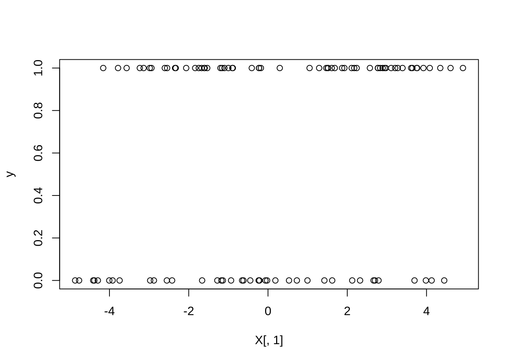
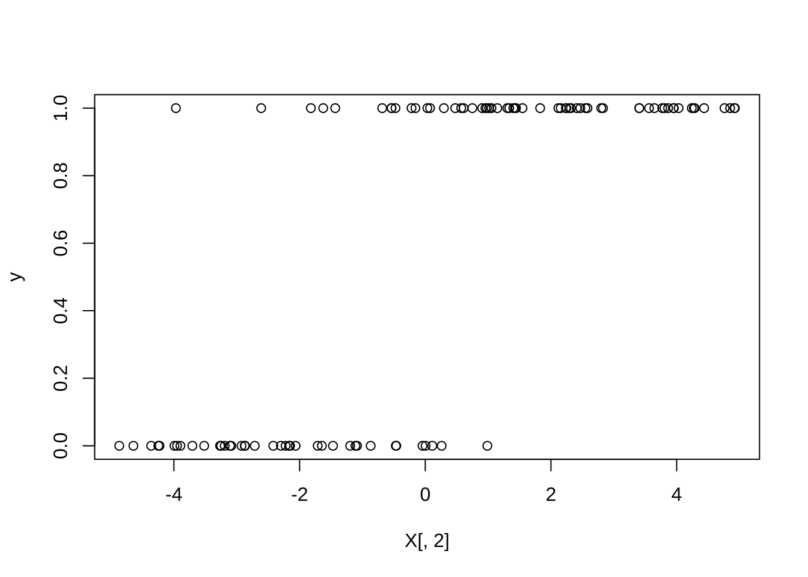
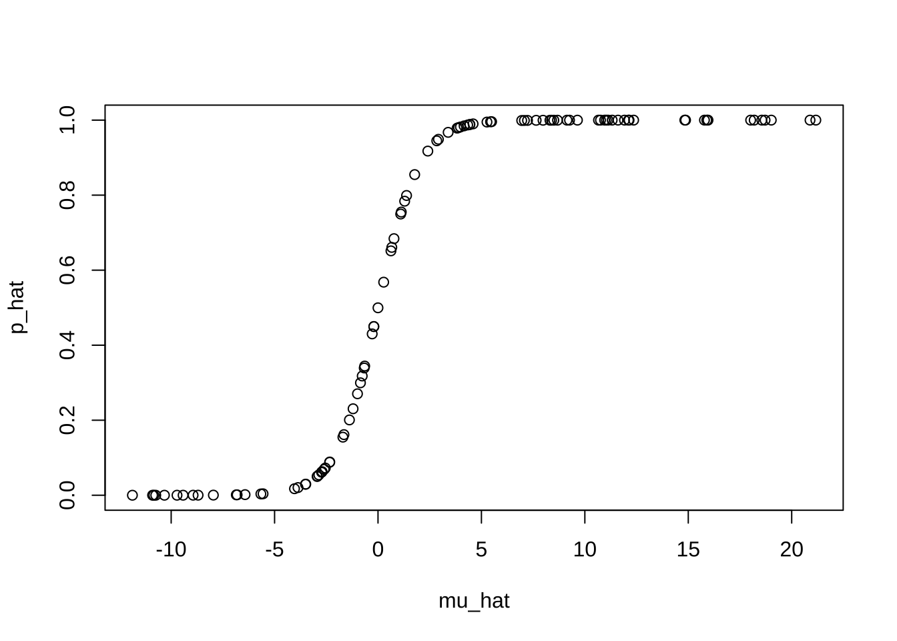
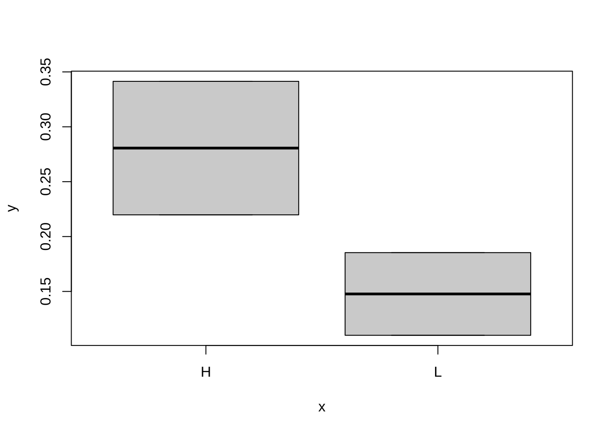
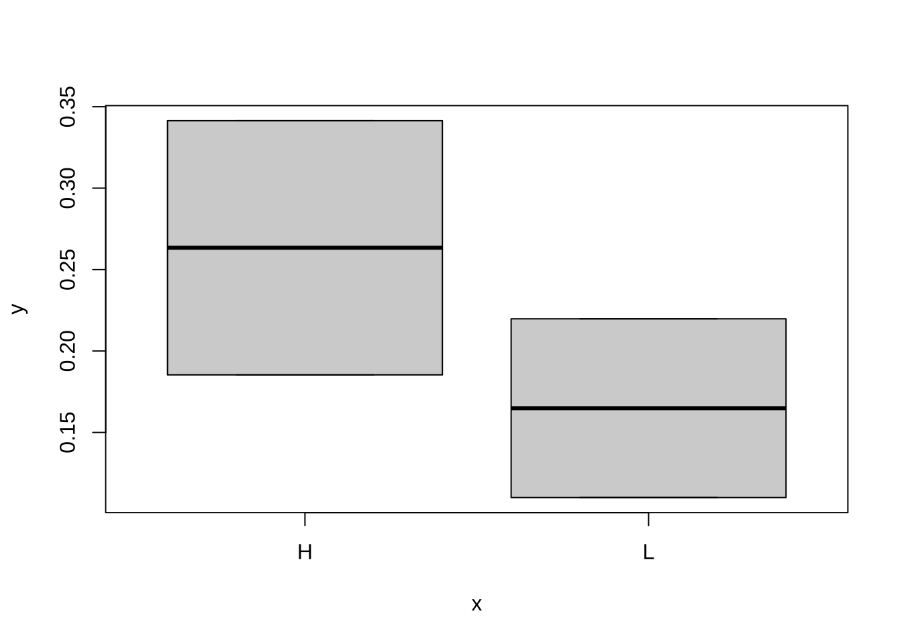
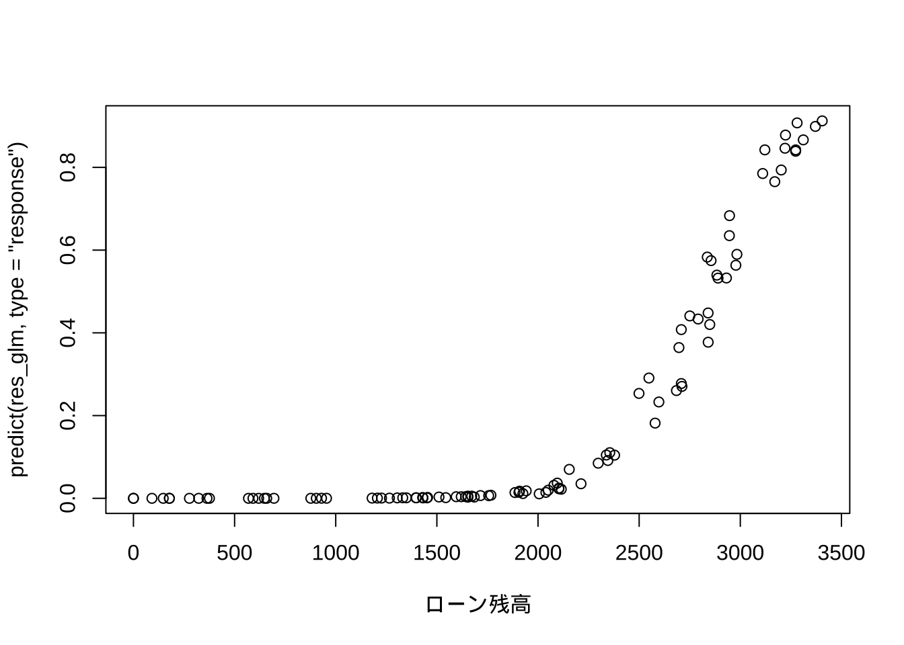

# ロジット/ブロビット回帰分析


## ロジット回帰分析の基本操作
### ロジットモデル: シミュレーションデータ {-}

- シミュレーションデータの生成

```r
set.seed(1)
n <- 100
p <- 2
a <- 1.2
b <- c(0.5, 1.5)
X <- matrix(runif(n * p, -5, 5), ncol = p)  # 予測変数 (X1, X2)
colnames(X) <- paste0("X", 1:p)
mu <- a + X %*% b  # 線形予測子
pi <- exp(mu)/(1 + exp(mu))  # ロジスティック変換
y <- rbinom(n, 1, pi)  # 発生頻度 (ランダム)

plot(X[, 1], y)
```



```r
plot(X[, 2], y)
```



- ロジット回帰分析の実行

```r
# ロジット回帰
res_glm <- glm(y ~ X, family = binomial)
summary(res_glm)
#> 
#> Call:
#> glm(formula = y ~ X, family = binomial)
#> 
#> Deviance Residuals: 
#>      Min        1Q    Median        3Q       Max  
#> -1.79161  -0.08440   0.00084   0.09128   2.36307  
#> 
#> Coefficients:
#>             Estimate Std. Error z value Pr(>|z|)    
#> (Intercept)   2.5815     0.8647   2.985 0.002831 ** 
#> XX1           1.1494     0.3434   3.347 0.000818 ***
#> XX2           2.7630     0.7509   3.680 0.000233 ***
#> ---
#> Signif. codes:  0 '***' 0.001 '**' 0.01 '*' 0.05 '.' 0.1 ' ' 1
#> 
#> (Dispersion parameter for binomial family taken to be 1)
#> 
#>     Null deviance: 133.750  on 99  degrees of freedom
#> Residual deviance:  34.478  on 97  degrees of freedom
#> AIC: 40.478
#> 
#> Number of Fisher Scoring iterations: 8
```

- 予測

```r
# 予測 (内挿)
mu_hat <- predict(res_glm)  # μ
p_hat <- predict(res_glm, type = "response")  # 発生頻度
head(data.frame(y, p_hat))
#>   y     p_hat
#> 1 1 0.9846543
#> 2 0 0.0500027
#> 3 0 0.0507452
#> 4 1 1.0000000
#> 5 1 0.9448650
#> 6 0 0.3178520
plot(mu_hat, p_hat)
```



- 係数の信頼区間

```r
# 信頼区間
confint(res_glm)  # 95%信頼区間 (デフォルト)
#>                 2.5 %   97.5 %
#> (Intercept) 1.1914472 4.659417
#> XX1         0.5901329 1.974012
#> XX2         1.5989191 4.620681
confint(res_glm, level = 0.9)  # 90%信頼区間
#>                   5 %     95 %
#> (Intercept) 1.3787136 4.269921
#> XX1         0.6664132 1.818782
#> XX2         1.7488603 4.265779
```


## データ分析例
### データセット (1): 企業パフォーマンス・データ (仮想) {-}

```
- firmperf.txt, 8件
   - 企業規模 (size): H/L
   - 人材投資 (hr_invest): H/L 
   - SDGs活動 (sdg): H/L
   - 対象企業数 (n_tot): 社
   - 優良社数 (n_pos): 社
```

- データ読み込み

```r
perf_dat1 <- read.csv("firmperf.txt", skip = 2)
# 注) デフォルトはstringsAsFactors = F (文字列を因子型変数に変換せずに読み込む)
# size:sdgは, 関数read.csv()でそのまま読み込むと文字型変数となる.
# 読み込み時に因子型にするには, stringsAsFactors = T 執筆現在
# (2024年5月10日)のglm()の仕様では, 文字型のままでもOK
colnames(perf_dat1) <- c("size", "hr_invest", "sdg", "n_tot", "n_pos")
attach(perf_dat1)
```

- ロジット回帰実行
- 異なるデータ形式への対応

```r
# データ形式-1 '成功回数'、'失敗回数'の2列
perf_tbl <- cbind(n_pos, n_tot - n_pos)
res_glm1 <- glm(perf_tbl ~ size + hr_invest + sdg, family = binomial)
summary(res_glm1)
#> 
#> Call:
#> glm(formula = perf_tbl ~ size + hr_invest + sdg, family = binomial)
#> 
#> Deviance Residuals: 
#>        1         2         3         4         5         6         7         8  
#>  0.11781   0.18151   0.15625  -1.18807  -0.35661  -0.40158   0.78239   0.09386  
#> 
#> Coefficients:
#>             Estimate Std. Error z value Pr(>|z|)   
#> (Intercept) -0.63288    0.25177  -2.514  0.01195 * 
#> sizeL       -0.07844    0.26926  -0.291  0.77082   
#> hr_investL  -0.82333    0.27607  -2.982  0.00286 **
#> sdgL        -0.61585    0.35132  -1.753  0.07961 . 
#> ---
#> Signif. codes:  0 '***' 0.001 '**' 0.01 '*' 0.05 '.' 0.1 ' ' 1
#> 
#> (Dispersion parameter for binomial family taken to be 1)
#> 
#>     Null deviance: 15.2547  on 7  degrees of freedom
#> Residual deviance:  2.3921  on 4  degrees of freedom
#> AIC: 36.198
#> 
#> Number of Fisher Scoring iterations: 4

res_glm2 <- glm(perf_tbl ~ hr_invest + sdg, binomial)
summary(res_glm2)
#> 
#> Call:
#> glm(formula = perf_tbl ~ hr_invest + sdg, family = binomial)
#> 
#> Deviance Residuals: 
#>        1         2         3         4         5         6         7         8  
#>  0.16285   0.20322   0.28582  -1.22028  -0.54755  -0.32113   0.66014   0.01463  
#> 
#> Coefficients:
#>             Estimate Std. Error z value Pr(>|z|)   
#> (Intercept)  -0.6570     0.2380  -2.760  0.00578 **
#> hr_investL   -0.8235     0.2760  -2.983  0.00285 **
#> sdgL         -0.6100     0.3507  -1.739  0.08200 . 
#> ---
#> Signif. codes:  0 '***' 0.001 '**' 0.01 '*' 0.05 '.' 0.1 ' ' 1
#> 
#> (Dispersion parameter for binomial family taken to be 1)
#> 
#>     Null deviance: 15.2547  on 7  degrees of freedom
#> Residual deviance:  2.4775  on 5  degrees of freedom
#> AIC: 34.284
#> 
#> Number of Fisher Scoring iterations: 4

res_glm0 <- glm(perf_tbl ~ 1, binomial)  # 切片項のみ (null model)
summary(res_glm0)
#> 
#> Call:
#> glm(formula = perf_tbl ~ 1, family = binomial)
#> 
#> Deviance Residuals: 
#>     Min       1Q   Median       3Q      Max  
#> -1.6946  -1.0354  -0.5135   0.7712   2.2549  
#> 
#> Coefficients:
#>             Estimate Std. Error z value Pr(>|z|)    
#> (Intercept)  -1.3950     0.1205  -11.58   <2e-16 ***
#> ---
#> Signif. codes:  0 '***' 0.001 '**' 0.01 '*' 0.05 '.' 0.1 ' ' 1
#> 
#> (Dispersion parameter for binomial family taken to be 1)
#> 
#>     Null deviance: 15.255  on 7  degrees of freedom
#> Residual deviance: 15.255  on 7  degrees of freedom
#> AIC: 43.061
#> 
#> Number of Fisher Scoring iterations: 4

anova(res_glm2, test = "Chisq")  # カイ2乗検定 (test = 'LRT'でも可)
#> Analysis of Deviance Table
#> 
#> Model: binomial, link: logit
#> 
#> Response: perf_tbl
#> 
#> Terms added sequentially (first to last)
#> 
#> 
#>           Df Deviance Resid. Df Resid. Dev Pr(>Chi)   
#> NULL                          7    15.2547            
#> hr_invest  1   9.4371         6     5.8175 0.002126 **
#> sdg        1   3.3400         5     2.4775 0.067615 . 
#> ---
#> Signif. codes:  0 '***' 0.001 '**' 0.01 '*' 0.05 '.' 0.1 ' ' 1
anova(res_glm2, res_glm0, test = "Chisq")  # 同
#> Analysis of Deviance Table
#> 
#> Model 1: perf_tbl ~ hr_invest + sdg
#> Model 2: perf_tbl ~ 1
#>   Resid. Df Resid. Dev Df Deviance Pr(>Chi)   
#> 1         5     2.4775                        
#> 2         7    15.2547 -2  -12.777 0.001681 **
#> ---
#> Signif. codes:  0 '***' 0.001 '**' 0.01 '*' 0.05 '.' 0.1 ' ' 1
```


```r
# データ形式-2 '成功率'の指定
prop_perf <- n_pos/n_tot
res_glm1_2 <- glm(prop_perf ~ size + hr_invest + sdg, binomial, weights = n_tot)
summary(res_glm1_2)
#> 
#> Call:
#> glm(formula = prop_perf ~ size + hr_invest + sdg, family = binomial, 
#>     weights = n_tot)
#> 
#> Deviance Residuals: 
#>        1         2         3         4         5         6         7         8  
#>  0.11781   0.18151   0.15625  -1.18807  -0.35661  -0.40158   0.78239   0.09386  
#> 
#> Coefficients:
#>             Estimate Std. Error z value Pr(>|z|)   
#> (Intercept) -0.63288    0.25177  -2.514  0.01195 * 
#> sizeL       -0.07844    0.26926  -0.291  0.77082   
#> hr_investL  -0.82333    0.27607  -2.982  0.00286 **
#> sdgL        -0.61585    0.35132  -1.753  0.07961 . 
#> ---
#> Signif. codes:  0 '***' 0.001 '**' 0.01 '*' 0.05 '.' 0.1 ' ' 1
#> 
#> (Dispersion parameter for binomial family taken to be 1)
#> 
#>     Null deviance: 15.2547  on 7  degrees of freedom
#> Residual deviance:  2.3921  on 4  degrees of freedom
#> AIC: 36.198
#> 
#> Number of Fisher Scoring iterations: 4
```


```r
# プロビット回帰
res_glm2_p <- glm(perf_tbl ~ hr_invest + sdg, family = binomial(link = "probit"))  # probit
summary(res_glm2_p)
#> 
#> Call:
#> glm(formula = perf_tbl ~ hr_invest + sdg, family = binomial(link = "probit"))
#> 
#> Deviance Residuals: 
#>        1         2         3         4         5         6         7         8  
#>  0.17291   0.15015   0.27674  -1.24447  -0.55358  -0.29829   0.67558   0.02009  
#> 
#> Coefficients:
#>             Estimate Std. Error z value Pr(>|z|)   
#> (Intercept)  -0.4128     0.1449  -2.849  0.00438 **
#> hr_investL   -0.4814     0.1644  -2.929  0.00340 **
#> sdgL         -0.3343     0.1886  -1.773  0.07628 . 
#> ---
#> Signif. codes:  0 '***' 0.001 '**' 0.01 '*' 0.05 '.' 0.1 ' ' 1
#> 
#> (Dispersion parameter for binomial family taken to be 1)
#> 
#>     Null deviance: 15.255  on 7  degrees of freedom
#> Residual deviance:  2.530  on 5  degrees of freedom
#> AIC: 34.336
#> 
#> Number of Fisher Scoring iterations: 3
```


```r
# ロジット回帰 (再実行)
res_glm2 <- glm(perf_tbl ~ hr_invest + sdg, binomial)  # simpler, logit
summary(res_glm2)
#> 
#> Call:
#> glm(formula = perf_tbl ~ hr_invest + sdg, family = binomial)
#> 
#> Deviance Residuals: 
#>        1         2         3         4         5         6         7         8  
#>  0.16285   0.20322   0.28582  -1.22028  -0.54755  -0.32113   0.66014   0.01463  
#> 
#> Coefficients:
#>             Estimate Std. Error z value Pr(>|z|)   
#> (Intercept)  -0.6570     0.2380  -2.760  0.00578 **
#> hr_investL   -0.8235     0.2760  -2.983  0.00285 **
#> sdgL         -0.6100     0.3507  -1.739  0.08200 . 
#> ---
#> Signif. codes:  0 '***' 0.001 '**' 0.01 '*' 0.05 '.' 0.1 ' ' 1
#> 
#> (Dispersion parameter for binomial family taken to be 1)
#> 
#>     Null deviance: 15.2547  on 7  degrees of freedom
#> Residual deviance:  2.4775  on 5  degrees of freedom
#> AIC: 34.284
#> 
#> Number of Fisher Scoring iterations: 4

# モデル診断 plot(res_glm2)
```

- 予測

```r
# 予測
predict(res_glm2)  # 対数オッズ
#>         1         2         3         4         5         6         7         8 
#> -2.090427 -1.266936 -1.480454 -1.266936 -1.480454 -0.656963 -0.656963 -2.090427
p_hat <- predict(res_glm2, type = "response")  # 確率
data.frame(perf_dat1, p_hat)
#>   size hr_invest sdg n_tot n_pos     p_hat
#> 1    H         L   L    60     7 0.1100307
#> 2    H         H   L     8     2 0.2197822
#> 3    H         L   H   186    36 0.1853588
#> 4    L         H   L     3     0 0.2197822
#> 5    L         L   H    86    14 0.1853588
#> 6    H         H   H    50    16 0.3414222
#> 7    L         H   H    22     9 0.3414222
#> 8    L         L   L    18     2 0.1100307

# 参考) 説明変数が因子型(factor)でない場合, 以前はエラー発生 →
# 文字型変数は因子型への変換が必要だった
plot(factor(hr_invest), predict(res_glm2, type = "response"))
```



```r
plot(factor(sdg), predict(res_glm2, type = "response"))
```



```r
# 説明変数が数値型変数ならば、logistic曲線を描く
```

- 係数の信頼区間

```r
# 信頼区間
confint(res_glm1_2)  # 95%信頼区間 (デフォルト)
#>                  2.5 %      97.5 %
#> (Intercept) -1.1392044 -0.14805877
#> sizeL       -0.6194614  0.43967083
#> hr_investL  -1.3592877 -0.27372310
#> sdgL        -1.3520115  0.03750972
confint(res_glm1_2, level = 0.9)  # 90%信頼区間
#>                    5 %        95 %
#> (Intercept) -1.0558140 -0.22506829
#> sizeL       -0.5304547  0.35748113
#> hr_investL  -1.2736384 -0.36344375
#> sdgL        -1.2264225 -0.06339516

detach()
```


### データセット (2): 個人ローン・デフォルト・データ (仮想) {-}

```
- default.csv, 100件
  - デフォルト (1/0)
  - ローン残高 (万円) 
  - 収入 (万円)
  - 職種 (A/B)
```
- データ読み込み

```r
default <- read.csv("default.csv")
attach(default)
```

- ロジット回帰

```r
# ロジット回帰
res_glm <- glm(デフォルト ~ ローン残高 + 収入 + 職種, family = binomial)
summary(res_glm)
#> 
#> Call:
#> glm(formula = デフォルト ~ ローン残高 + 収入 + 職種, 
#>     family = binomial)
#> 
#> Deviance Residuals: 
#>      Min        1Q    Median        3Q       Max  
#> -2.20685  -0.21788  -0.04981  -0.00258   2.84704  
#> 
#> Coefficients:
#>               Estimate Std. Error z value Pr(>|z|)    
#> (Intercept) -1.336e+01  3.505e+00  -3.811 0.000138 ***
#> ローン残高   4.708e-03  1.224e-03   3.846 0.000120 ***
#> 収入        -9.227e-04  2.345e-03  -0.394 0.693925    
#> 職種B        9.713e-01  1.445e+00   0.672 0.501434    
#> ---
#> Signif. codes:  0 '***' 0.001 '**' 0.01 '*' 0.05 '.' 0.1 ' ' 1
#> 
#> (Dispersion parameter for binomial family taken to be 1)
#> 
#>     Null deviance: 102.791  on 99  degrees of freedom
#> Residual deviance:  46.971  on 96  degrees of freedom
#> AIC: 54.971
#> 
#> Number of Fisher Scoring iterations: 8

plot(ローン残高, predict(res_glm, type = "response"))
```



```r
plot(収入, predict(res_glm, type = "response"))
```


```r
# plot(職種, predict(res_glm, type = 'response'))
```

- プロビット回帰

```r
# プロビット回帰
res_glm_p <- glm(デフォルト ~ ローン残高 + 収入 + 職種, family = binomial(link = "probit"))
summary(res_glm_p)
#> 
#> Call:
#> glm(formula = デフォルト ~ ローン残高 + 収入 + 職種, 
#>     family = binomial(link = "probit"))
#> 
#> Deviance Residuals: 
#>      Min        1Q    Median        3Q       Max  
#> -2.10245  -0.22078  -0.02316  -0.00001   2.80240  
#> 
#> Coefficients:
#>               Estimate Std. Error z value Pr(>|z|)    
#> (Intercept) -7.0233825  1.6903093  -4.155 3.25e-05 ***
#> ローン残高   0.0024920  0.0005893   4.229 2.35e-05 ***
#> 収入        -0.0006478  0.0013082  -0.495    0.620    
#> 職種B        0.6549554  0.8035424   0.815    0.415    
#> ---
#> Signif. codes:  0 '***' 0.001 '**' 0.01 '*' 0.05 '.' 0.1 ' ' 1
#> 
#> (Dispersion parameter for binomial family taken to be 1)
#> 
#>     Null deviance: 102.79  on 99  degrees of freedom
#> Residual deviance:  47.81  on 96  degrees of freedom
#> AIC: 55.81
#> 
#> Number of Fisher Scoring iterations: 8

## 結果の比較: glm vs lm res_glm_normal <- glm(デフォルト ~ ローン残高 + 収入 +
## 職種, family = gaussian) summary(res_glm_normal) res_lm <- lm(デフォルト ~
## ローン残高 + 収入 + 職種) anova(res_lm)
```

- 予測

```r
# 予測 (新しいデータセットに対して)
newdat <- data.frame(ローン残高 = c(100, 500, 1000, 10000), 収入 = 30000,
  職種 = "A")
predict(res_glm, newdata = newdat, type = "response")
#>            1            2            3            4 
#> 2.220446e-16 2.220446e-16 2.220446e-16 9.976404e-01
```

- 係数の信頼区間

```r
# 信頼区間
confint(res_glm)  # 95%信頼区間 (デフォルト)
#>                     2.5 %       97.5 %
#> (Intercept) -21.713657994 -7.721969240
#> ローン残高    0.002743950  0.007642011
#> 収入         -0.005498298  0.003877354
#> 職種B        -1.917922786  3.862413416

detach()
```

- 便利なツール: パッケージ`epiDisplay`

```r
# (参考) 便利なツール
library(epiDisplay)
logistic.display(res_glm, simplified = TRUE)
#>  
#>                   OR lower95ci upper95ci     Pr(>|Z|)
#> ローン残高 1.0047194 1.0023118  1.007133 0.0001199072
#> 収入       0.9990777 0.9944971  1.003679 0.6939246907
#> 職種B      2.6413382 0.1555813 44.842586 0.5014338592
```

## 疑似R2の計算


```r
# ロジット回帰
res_glm <- glm(デフォルト ~ ローン残高 + 収入 + 職種, family = binomial,
  data = default)
# summary(res_glm)
```

### パッケージ`DescTools`の利用 {-}

```
DescTools::PseudoR2()
- usage: PseudoR2(x, which = NULL)
  - which: 計算したい疑似R2. 
    選択肢: "McFadden"(デフォルト), "McFaddenAdj", "CoxSnell", "Nagelkerke", "AldrichNelson", "VeallZimmermann", "Efron", "McKelveyZavoina", "Tjur", "all".
```


```r
# 疑似R2の計算
library(DescTools)
PseudoR2(res_glm)  # McFadden (デフォルト)
#>  McFadden 
#> 0.5430468
PseudoR2(res_glm, which = "CoxSnell")  # Cox-Snell
#>  CoxSnell 
#> 0.4277647
PseudoR2(res_glm, which = "Nagelkerke")  # Nagelkerke
#> Nagelkerke 
#>  0.6660436
PseudoR2(res_glm, which = "all")
#>        McFadden     McFaddenAdj        CoxSnell      Nagelkerke   AldrichNelson 
#>       0.5430468       0.4652192       0.4277647       0.6660436       0.3582359 
#> VeallZimmermann           Efron McKelveyZavoina            Tjur             AIC 
#>       0.7067438       0.5736644       0.8515845       0.5589555      54.9708332 
#>             BIC          logLik         logLik0              G2 
#>      65.3915139     -23.4854166     -51.3956671      55.8205010
```

### パッケージ`pscl`の利用 {-}

```
pscl::pR2()
- 以下を出力:
- llh: The log-likelihood from the fitted model
- llhNull: The log-likelihood from the intercept-only restricted model
- G2: Minus two times the difference in the log-likelihoods
- McFadden: McFadden's pseudo r-squared
- r2ML: Maximum likelihood pseudo r-squared
- r2CU: Cragg and Uhler's pseudo r-squared
```

<!--
GPT-4:
pR2関数: psclパッケージに含まれるpR2関数は、ロジスティック回帰モデルに対する疑似R^2の計算をサポートしています。McFaddenのR^2、Cox and SnellのR^2、NagelkerkeのR^2など、複数の疑似R^2の指標を提供します。
とあるので, r2ML → Cox-Snell, r2CU → Nagelkerke,  に対応していると思われる
-->


```r
# install.packages('pscl')
library(pscl)

# 疑似R2の計算
pscl::pR2(res_glm)
#> fitting null model for pseudo-r2
#>         llh     llhNull          G2    McFadden        r2ML        r2CU 
#> -23.4854166 -51.3956671  55.8205010   0.5430468   0.4277647   0.6660436
```

### パッケージ`performance`の利用 {-}

```
performance::r2()
- モデルに応じて適切な疑似R2を選んで出力:
  - Logistic models: Tjur's R2
  - General linear models: Nagelkerke's R2
  - Multinomial Logit: McFadden's R2
  - Models with zero-inflation: R2 for zero-inflated models
  - Mixed models: Nakagawa's R2
  - Bayesian models: R2 bayes
```


```r
# install.packages('performance')
library(performance)

# 疑似R2の計算
performance::r2(res_glm)
#> # R2 for Logistic Regression
#>   Tjur's R2: 0.559
```
