# 一般化加法モデル (GAM) 


二つのパッケージ`gam`および`mgcv`は, 同一名の関数`gam()`, `s()`を持つ. これらは, 同じ名前ながら指定できるパラメータが互いに異なっているため,
二つのライブラリを同時に読み込むことで,
プログラムの一部が正常に動作しなくなる可能性がある.
そこで, 例えば, パッケージ`gam`の関数`gam()`であれば,
`gam::gam()`等と指定するなどの対応が取り得るが,
機能に重複があることから,
両方同時ではなく, どちから一方のみをロードし使うのが
安全であろう. 
こだわりがなければ, より多様な機能を有する
`mgcv`に限定して使用して良いと思われる

<!--
したがって, 両方同時ではなく, どちから一方のみをロードし使うのが良い.
どちらが良いか分かなければ, `mgcv`に限定して良いと思われる: -->

- パッケージ`mgcv`の方の`gam()`関数は, 予測変数間の交互作用をモデルに
取り入れられるなど柔軟性に富む. 
- `s()`関数は,多様な平滑化項を指定することができる. 

## パッケージ`gam`の利用

```r
library(gam)
```

```
関数gam():
- 加法予測子のシンボリック表現や誤差分布を指定の上でGAMをフィット
- バックフィッティング・アルゴリズムを採用 (異なる平滑化やフィッティングの方法を混ぜる)
- 局所回帰や平滑化スプラインをサポート
- usage:
  gam(formula, family  =  gaussian, data, weights, subset, na.action, 
      start, etastart, mustart, control  =  gam.control(...), 
      model = TRUE, method, x = FALSE, y = TRUE, ...)
```

本セクションの出所: ISLR, Ch.7 (pp.287--)

```r
library(ISLR)  # Wage
head(Wage)
#>        year age           maritl     race       education             region
#> 231655 2006  18 1. Never Married 1. White    1. < HS Grad 2. Middle Atlantic
#> 86582  2004  24 1. Never Married 1. White 4. College Grad 2. Middle Atlantic
#> 161300 2003  45       2. Married 1. White 3. Some College 2. Middle Atlantic
#> 155159 2003  43       2. Married 3. Asian 4. College Grad 2. Middle Atlantic
#> 11443  2005  50      4. Divorced 1. White      2. HS Grad 2. Middle Atlantic
#> 376662 2008  54       2. Married 1. White 4. College Grad 2. Middle Atlantic
#>              jobclass         health health_ins  logwage      wage
#> 231655  1. Industrial      1. <=Good      2. No 4.318063  75.04315
#> 86582  2. Information 2. >=Very Good      2. No 4.255273  70.47602
#> 161300  1. Industrial      1. <=Good     1. Yes 4.875061 130.98218
#> 155159 2. Information 2. >=Very Good     1. Yes 5.041393 154.68529
#> 11443  2. Information      1. <=Good     1. Yes 4.318063  75.04315
#> 376662 2. Information 2. >=Very Good     1. Yes 4.845098 127.11574
```

```
Wage: 東海岸賃金データ (Mid-Atlantic Wage Data)
- 東海岸地域 (Mid-Atlantic region) 3000人の男性労働者の賃金その他のデータ.
- year 賃金情報の記録年
- age 労働者の年齢
- maritl 婚姻状況 (因子): 1.未婚, 2. 既婚, 3. 配偶者死別, 4. 離婚 5. 別居
- race 人種 (因子): 1. 白人, 2. 黒人, 3. アジア人, 4. その他
- education 教育水準 (因子): 1. 高校未卒業, 2. 高卒, 3. 大学中退 (課程の一部を修了), 4. 学部卒, 5. 院卒
- region 国の地域（東海岸のみ）
- jobclass 職種 (因子): 1. 産業, 2. 情報
- health 健康状態 (因子): 1. 良好以下, 2. 非常に良好以上
- health_ins 健康保険の有無 (因子): 1. あり, 2. なし
- logwage 労働者の賃金の対数
- wage 労働者の賃金 (名目)
```

### 多項式回帰 {-}
参考: ISLR, 7.8.1

※以下の多項式回帰部分は, 既に配布したものと重複.

```r
fit_lm <- lm(wage ~ poly(age, 4), data = Wage)  # 4次の直交多項式
head(poly(Wage$age, 4))  # 4次の多項式
#>                  1            2             3            4
#> [1,] -0.0386247992  0.055908727 -0.0717405794  0.086729854
#> [2,] -0.0291326034  0.026298066 -0.0145499511 -0.002599280
#> [3,]  0.0040900817 -0.014506548 -0.0001331835  0.014480093
#> [4,]  0.0009260164 -0.014831404  0.0045136682  0.012657507
#> [5,]  0.0120002448 -0.009815846 -0.0111366263  0.010211456
#> [6,]  0.0183283753 -0.002073906 -0.0166282799 -0.001314381
coef(summary(fit_lm))
#>                 Estimate Std. Error    t value     Pr(>|t|)
#> (Intercept)    111.70361  0.7287409 153.283015 0.000000e+00
#> poly(age, 4)1  447.06785 39.9147851  11.200558 1.484604e-28
#> poly(age, 4)2 -478.31581 39.9147851 -11.983424 2.355831e-32
#> poly(age, 4)3  125.52169 39.9147851   3.144742 1.678622e-03
#> poly(age, 4)4  -77.91118 39.9147851  -1.951938 5.103865e-02
fit_lm <- lm(wage ~ poly(age, 4, raw = T), data = Wage)  # 非直交化
head(poly(Wage$age, 4, raw = T))  # 4次の多項式
#>       1    2      3       4
#> [1,] 18  324   5832  104976
#> [2,] 24  576  13824  331776
#> [3,] 45 2025  91125 4100625
#> [4,] 43 1849  79507 3418801
#> [5,] 50 2500 125000 6250000
#> [6,] 54 2916 157464 8503056
coef(summary(fit_lm))
#>                             Estimate   Std. Error   t value     Pr(>|t|)
#> (Intercept)            -1.841542e+02 6.004038e+01 -3.067172 0.0021802539
#> poly(age, 4, raw = T)1  2.124552e+01 5.886748e+00  3.609042 0.0003123618
#> poly(age, 4, raw = T)2 -5.638593e-01 2.061083e-01 -2.735743 0.0062606446
#> poly(age, 4, raw = T)3  6.810688e-03 3.065931e-03  2.221409 0.0263977518
#> poly(age, 4, raw = T)4 -3.203830e-05 1.641359e-05 -1.951938 0.0510386498
```


```r
# 上と同一
fit_lm <- lm(wage ~ age + I(age^2) + I(age^3) + I(age^4), data = Wage)
coef(summary(fit_lm))
fit_lm <- lm(wage ~ cbind(age, age^2, age^3, age^4), data = Wage)
coef(summary(fit_lm))
```


```r
# 以下と比較せよ
fit_lm2 <- lm(wage ~ age + age^2 + age^3 + age^4, data = Wage)
coef(summary(fit_lm2))
#>               Estimate Std. Error  t value      Pr(>|t|)
#> (Intercept) 81.7047354 2.84624224 28.70618 2.543375e-160
#> age          0.7072759 0.06475113 10.92299  2.900778e-27
```

### スプライン適合 {-}
参考: ISLR 7.8.2


```r
agelims <- range(Wage$age)
age_grid <- seq(from = agelims[1], to = agelims[2])
library(splines)

# B-スプライン
fit_sp <- lm(wage ~ bs(age, knots = c(25, 40, 60)), data = Wage)  # bs: B-スプライン
pred_sp <- predict(fit_sp, newdata = list(age = age_grid), se = T)
plot(Wage$age, Wage$wage, col = "grey")
lines(age_grid, pred_sp$fit, lw = 2)
lines(age_grid, pred_sp$fit + 2 * pred_sp$se, lty = "dashed")
lines(age_grid, pred_sp$fit - 2 * pred_sp$se, lty = "dashed")
```


```r
# 自然スプライン
fit_sp2 <- lm(wage ~ ns(age, df = 4), data = Wage)  # ns: 自然スプライン(4次)
pred_sp2 <- predict(fit_sp2, newdata = list(age = age_grid), se = T)
plot(Wage$age, Wage$wage, col = "grey")
lines(age_grid, pred_sp2$fit, lw = 2)
lines(age_grid, pred_sp2$fit + 2 * pred_sp2$se, lty = "dashed")
lines(age_grid, pred_sp2$fit - 2 * pred_sp2$se, lty = "dashed")
```

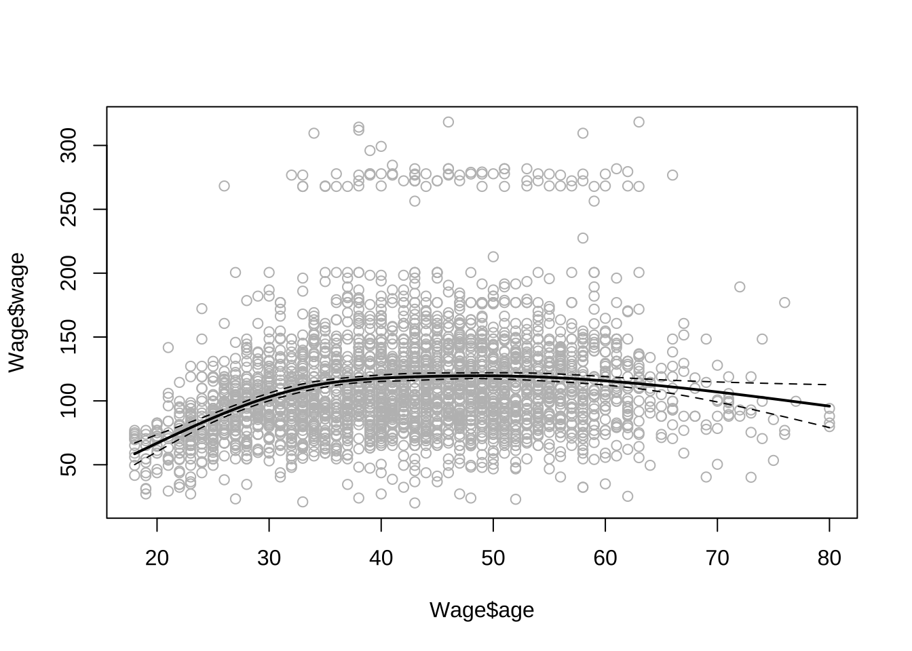


```r
# 平滑化スプライン
plot(Wage$age, Wage$wage, xlim = agelims, cex = 0.5, col = "darkgrey")
fit_sp3 <- smooth.spline(Wage$age, Wage$wage, df = 16)  # 平滑化スプライン(自由度 = 16)
fit_sp4 <- smooth.spline(Wage$age, Wage$wage, cv = T)  # 同 (交差検証により自由度選択)
fit_sp4$df
#> [1] 6.794596
pred_sp2 <- predict(fit_sp2, newdata = list(age = age_grid), se = T)
lines(fit_sp3, col = "orange", lw = 2)
lines(fit_sp4, col = "lightblue", lw = 2)
legend("topright", legend = c("16 DF", "6.8 DF"), col = c("orange", "lightblue"),
  lty = 1, lwd = 2, cex = 0.8)
```

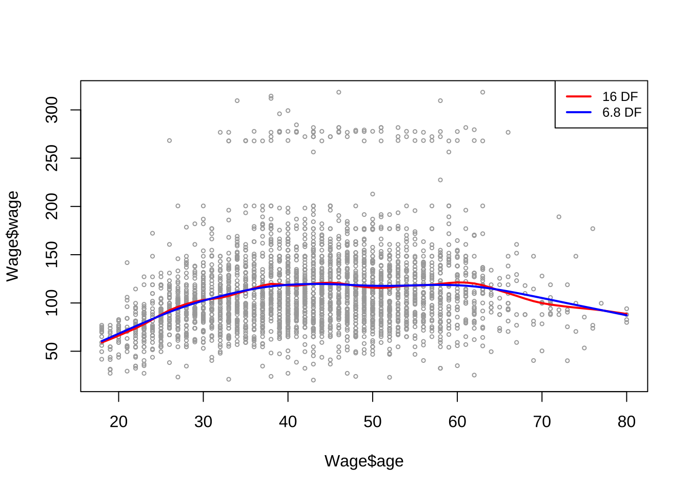


### GAM {-}
参考: ISLR 7.8.3


```r
# lmの実行
fit_gam1 <- lm(wage ~ ns(year, 4) + ns(age, 5) + education, data = Wage)
# ns: natural cubic splineの(Bスプライン)基底行列生成
summary(fit_gam1)
#> 
#> Call:
#> lm(formula = wage ~ ns(year, 4) + ns(age, 5) + education, data = Wage)
#> 
#> Residuals:
#>      Min       1Q   Median       3Q      Max 
#> -120.513  -19.608   -3.583   14.112  214.535 
#> 
#> Coefficients:
#>                             Estimate Std. Error t value Pr(>|t|)    
#> (Intercept)                   46.949      4.704   9.980  < 2e-16 ***
#> ns(year, 4)1                   8.625      3.466   2.488  0.01289 *  
#> ns(year, 4)2                   3.762      2.959   1.271  0.20369    
#> ns(year, 4)3                   8.127      4.211   1.930  0.05375 .  
#> ns(year, 4)4                   6.806      2.397   2.840  0.00455 ** 
#> ns(age, 5)1                   45.170      4.193  10.771  < 2e-16 ***
#> ns(age, 5)2                   38.450      5.076   7.575 4.78e-14 ***
#> ns(age, 5)3                   34.239      4.383   7.813 7.69e-15 ***
#> ns(age, 5)4                   48.678     10.572   4.605 4.31e-06 ***
#> ns(age, 5)5                    6.557      8.367   0.784  0.43328    
#> education2. HS Grad           10.983      2.430   4.520 6.43e-06 ***
#> education3. Some College      23.473      2.562   9.163  < 2e-16 ***
#> education4. College Grad      38.314      2.547  15.042  < 2e-16 ***
#> education5. Advanced Degree   62.554      2.761  22.654  < 2e-16 ***
#> ---
#> Signif. codes:  0 '***' 0.001 '**' 0.01 '*' 0.05 '.' 0.1 ' ' 1
#> 
#> Residual standard error: 35.16 on 2986 degrees of freedom
#> Multiple R-squared:  0.293,	Adjusted R-squared:  0.2899 
#> F-statistic:  95.2 on 13 and 2986 DF,  p-value: < 2.2e-16
par(mfrow = c(1, 2))
plot(fit_gam1, se = TRUE, col = "orange")
```

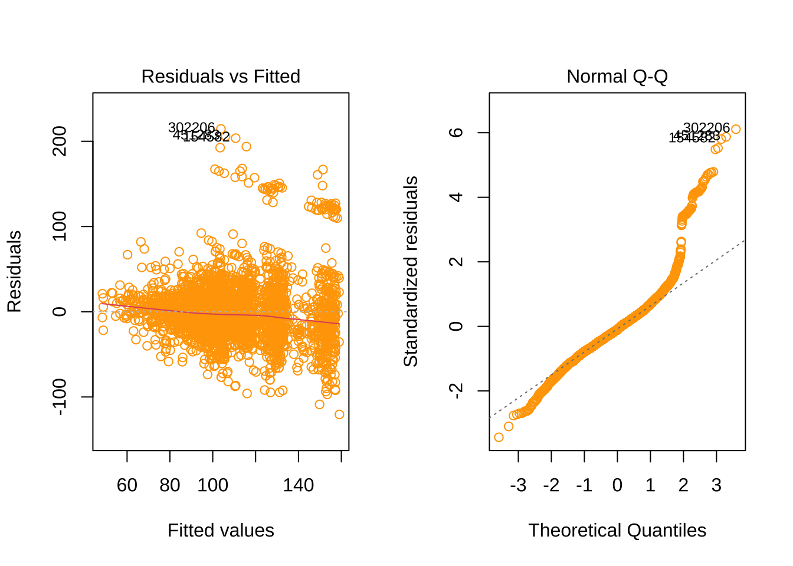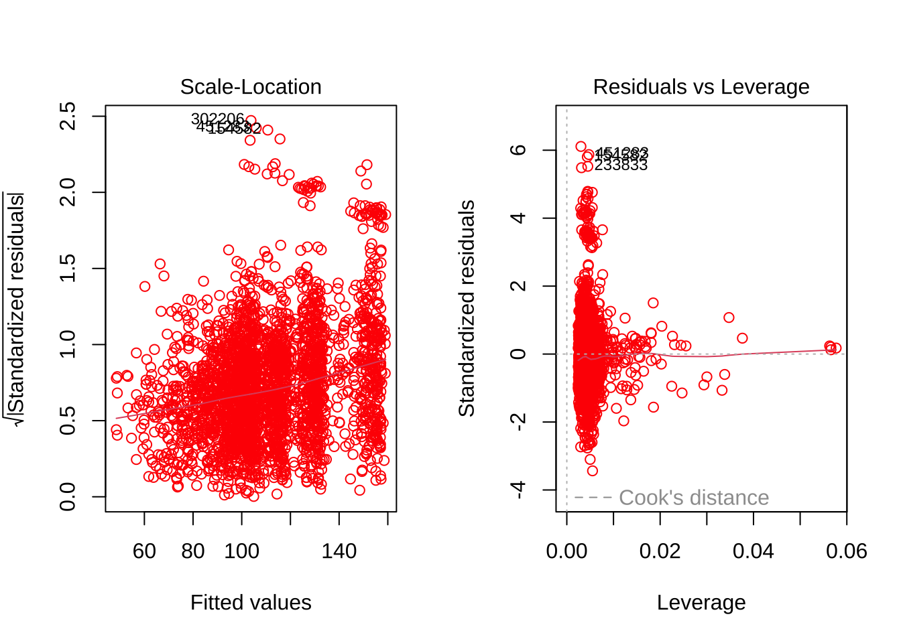

<!-- RK(060124): 以下のように, gam::gam(), gam::s()を指定しないとコンパイルエラーが発生.
おそらく, mgcvのgam(), s()と干渉
fit_gam3 <- gam(wage ~ s(year, 4) + s(age, 5) + education, data  =  Wage)
-->


```r
# GAM
fit_gam3 <- gam::gam(wage ~ gam::s(year, 4) + gam::s(age, 5) + education, data = Wage)
# s: 平滑化スプライン head(gam::s(Wage$age, 5))
summary(fit_gam3)  # --> ANOVA
#> 
#> Call: gam::gam(formula = wage ~ gam::s(year, 4) + gam::s(age, 5) + 
#>     education, data = Wage)
#> Deviance Residuals:
#>      Min       1Q   Median       3Q      Max 
#> -113.323  -19.521   -3.964   14.438  219.172 
#> 
#> (Dispersion Parameter for gaussian family taken to be 1287.767)
#> 
#>     Null Deviance: 5222086 on 2999 degrees of freedom
#> Residual Deviance: 3854286 on 2993 degrees of freedom
#> AIC: 30004.62 
#> 
#> Number of Local Scoring Iterations: 2 
#> 
#> Anova for Parametric Effects
#>                   Df  Sum Sq Mean Sq F value    Pr(>F)    
#> gam::s(year, 4)    1   22434   22434  17.421  3.08e-05 ***
#> gam::s(age, 5)     1  195045  195045 151.460 < 2.2e-16 ***
#> education          4 1150320  287580 223.317 < 2.2e-16 ***
#> Residuals       2993 3854286    1288                      
#> ---
#> Signif. codes:  0 '***' 0.001 '**' 0.01 '*' 0.05 '.' 0.1 ' ' 1
par(mfrow = c(1, 3))
plot(fit_gam3, se = TRUE, col = "lightblue")
```

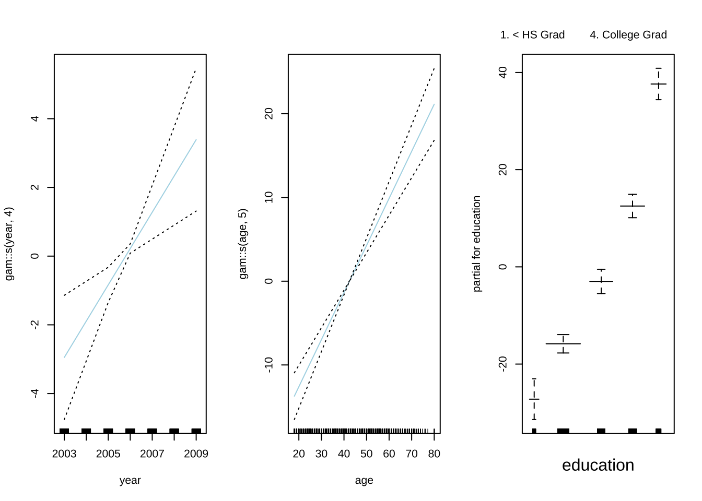

<!--
# fit_gam3 <- gam::gam(wage ~ gam::s(year, 4) + gam::s(age, 5) + education, data  =  Wage)
#fit_gam1 <- gam::gam(wage ~ gam::s(age, 5) + education, data  =  Wage)
#fit_gam2 <- gam::gam(wage ~ year + gam::s(age, 5) + education, data  =  Wage)
-->


```r
fit_gam1 <- gam::gam(wage ~ gam::s(age, 5) + education, data = Wage)
fit_gam2 <- gam::gam(wage ~ year + gam::s(age, 5) + education, data = Wage)
anova(fit_gam1, fit_gam2, fit_gam3, test = "F")
#> Analysis of Deviance Table
#> 
#> Model 1: wage ~ gam::s(age, 5) + education
#> Model 2: wage ~ year + gam::s(age, 5) + education
#> Model 3: wage ~ gam::s(year, 4) + gam::s(age, 5) + education
#>   Resid. Df Resid. Dev Df Deviance      F   Pr(>F)   
#> 1      2994    3867992                               
#> 2      2993    3854286  1    13706 10.643 0.001117 **
#> 3      2993    3854286  0        0                   
#> ---
#> Signif. codes:  0 '***' 0.001 '**' 0.01 '*' 0.05 '.' 0.1 ' ' 1
AIC(fit_gam1, fit_gam2, fit_gam3)
#>          df      AIC
#> fit_gam1  7 30013.27
#> fit_gam2  8 30004.62
#> fit_gam3  8 30004.62
```


```r
# ISLRの修正: preplot.Gam → preplot
tmp <- preplot(fit_gam2, terms = labels(fit_gam2))
age_sm <- cbind(tmp$`gam::s(age, 5)`$x, tmp$`gam::s(age, 5)`$y)
age_sm_uniq <- unique(age_sm[order(age_sm[, 1]), ])
plot(age_sm_uniq, type = "l", xlab = "age", ylab = "s(age, 5)")
```

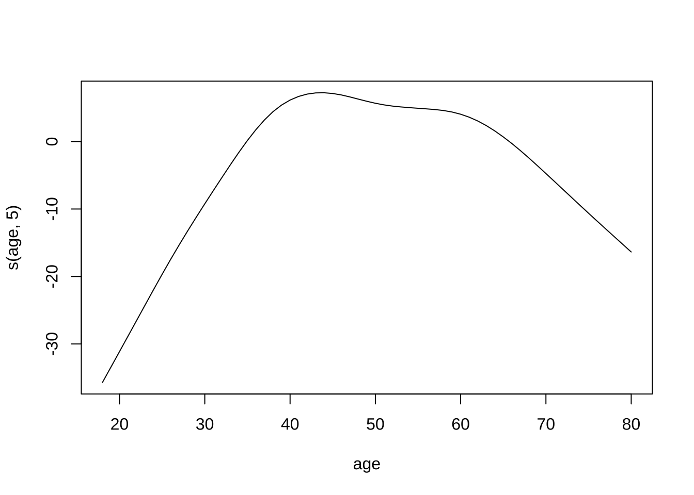


## パッケージ`mgcv`の利用
交互作用項を含んだGAMを扱いたい場合.


```r
library(mgcv)
```

```
ライブラリmgcv, 関数gam()
- Generalized additive models with integrated smoothness estimation
- usage:
  gam(formula, family = gaussian(), data = list(), weights = NULL,
  subset = NULL, na.action, offset = NULL, method = "GCV.Cp", 
  optimizer = c("outer", "newton"), control = list(), scale = 0, 
  select = FALSE, knots = NULL, sp = NULL, min.sp = NULL, H = NULL,
  gamma = 1, fit = TRUE, paraPen = NULL, G = NULL, in.out, 
  drop.unused.levels = TRUE, drop.intercept = NULL, discrete = FALSE, ...)
- 参考サイト: https://cran.r-project.org/web/packages/mgcv/mgcv.pdf
```
<!-- cf. https://qiita.com/saltcooky/items/d5a1a62756d10273b008 -->


```r
library(tidyverse)
require(MASS)
# select <- dplyr::select
```


```r
fit_lm <- lm(medv ~ tax + crim + age + ptratio + nox + ptratio + dis, data = Boston)
summary(fit_lm)
#> 
#> Call:
#> lm(formula = medv ~ tax + crim + age + ptratio + nox + ptratio + 
#>     dis, data = Boston)
#> 
#> Residuals:
#>     Min      1Q  Median      3Q     Max 
#> -13.111  -4.661  -1.301   2.431  32.135 
#> 
#> Coefficients:
#>               Estimate Std. Error t value Pr(>|t|)    
#> (Intercept)  8.609e+01  4.480e+00  19.217  < 2e-16 ***
#> tax          2.793e-04  3.023e-03   0.092  0.92641    
#> crim        -1.754e-01  4.448e-02  -3.944 9.15e-05 ***
#> age         -5.282e-02  1.800e-02  -2.935  0.00349 ** 
#> ptratio     -1.794e+00  1.669e-01 -10.751  < 2e-16 ***
#> nox         -3.610e+01  5.188e+00  -6.960 1.08e-11 ***
#> dis         -1.654e+00  2.549e-01  -6.488 2.10e-10 ***
#> ---
#> Signif. codes:  0 '***' 0.001 '**' 0.01 '*' 0.05 '.' 0.1 ' ' 1
#> 
#> Residual standard error: 6.946 on 499 degrees of freedom
#> Multiple R-squared:  0.4365,	Adjusted R-squared:  0.4297 
#> F-statistic: 64.42 on 6 and 499 DF,  p-value: < 2.2e-16
```


```r
fit_gam <- mgcv::gam(medv ~ s(tax) + s(crim) + s(age) + s(ptratio) + s(nox) + s(dis),
  data = Boston)

plot(fit_gam, residuals = T, pch = 1, se = T, cex.lab = 1.3)
```

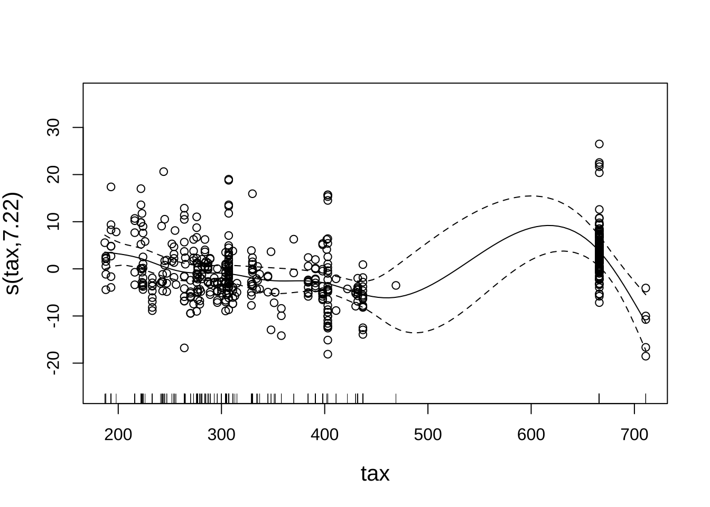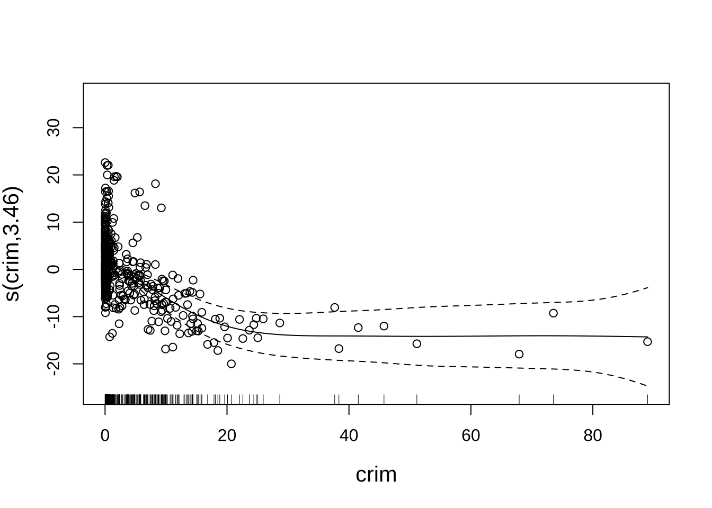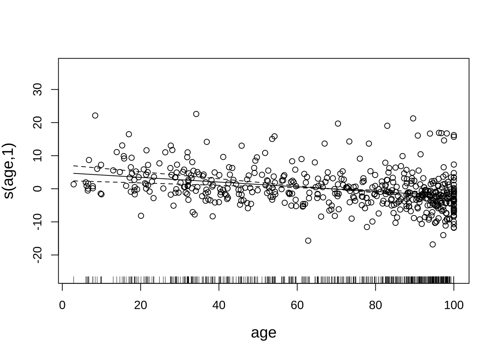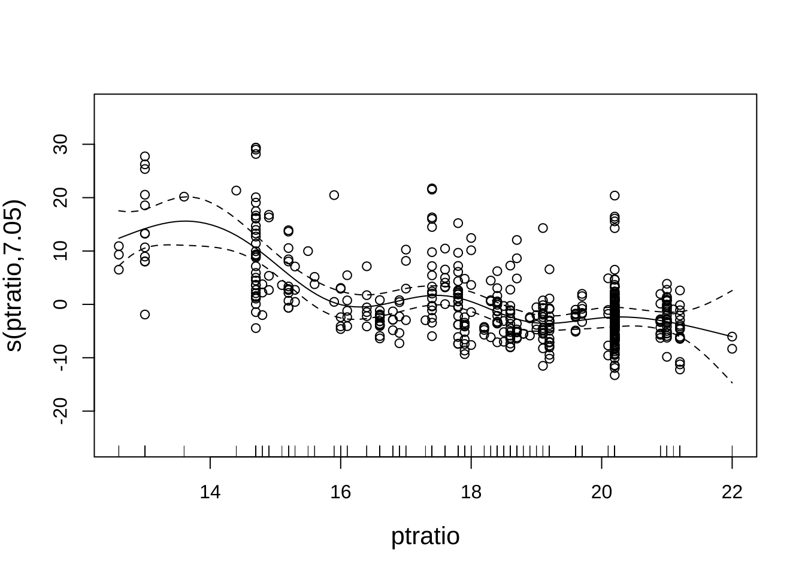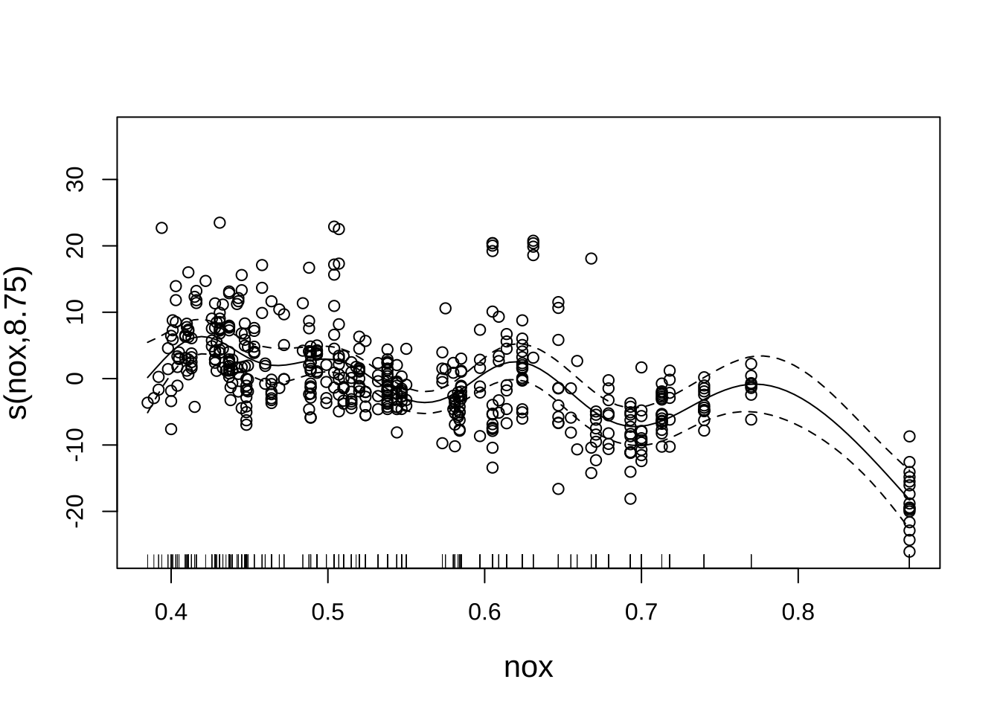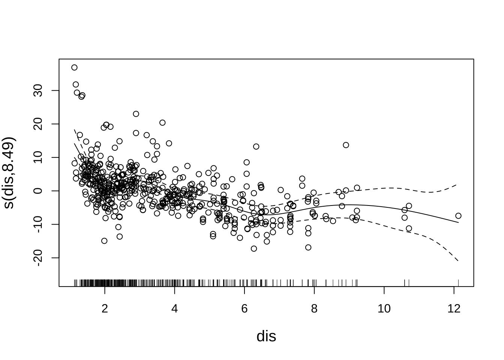

```r
# --> 各変数の非線形性
```


```r
# 交互作用を含めたGAM
fit_gam <- mgcv::gam(medv ~ s(ptratio) + s(rm) + s(ptratio, rm), data = Boston)

vis.gam(fit_gam, color = "topo", theta = 50)
```

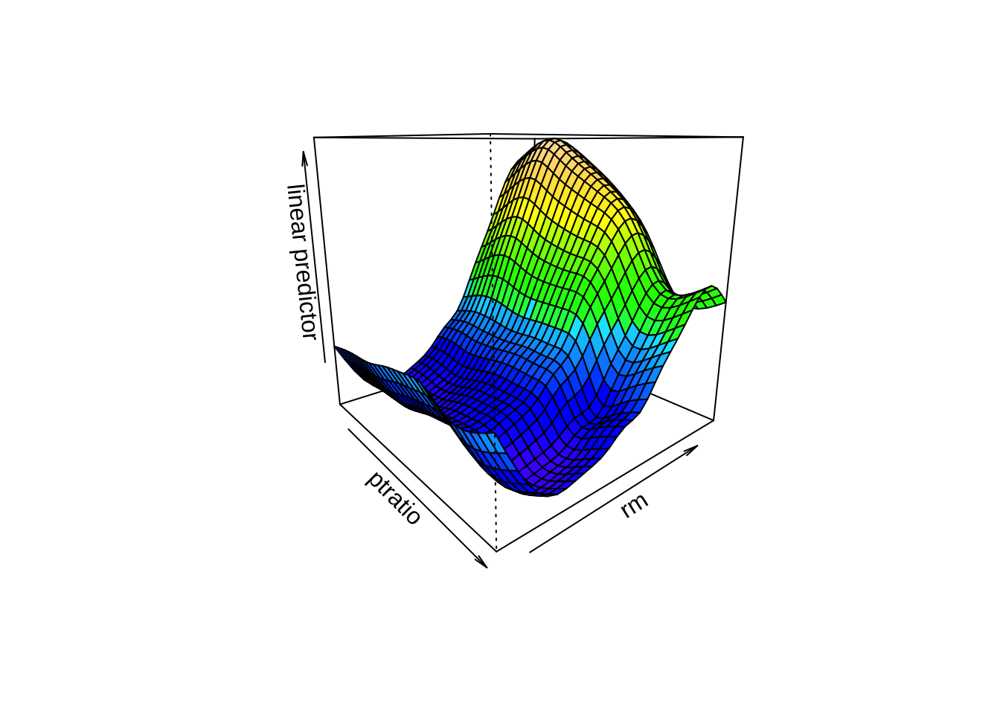

```r

vis.gam(fit_gam, color = "topo", plot.type = "contour")
```

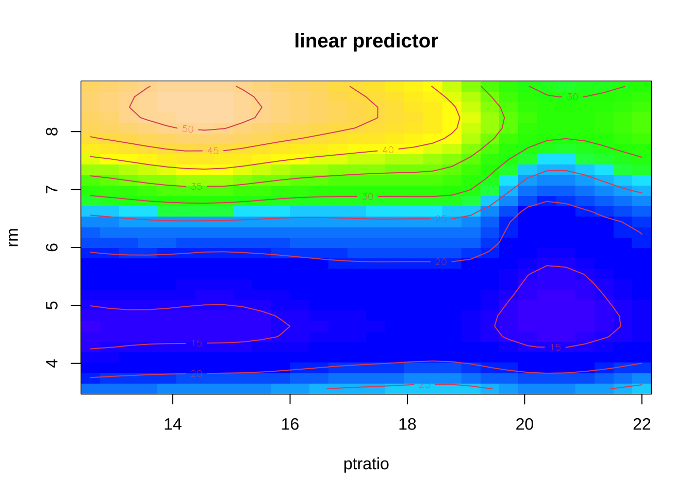

```r
# --> ptratioとrmのheatmap

summary(fit_gam)
#> 
#> Family: gaussian 
#> Link function: identity 
#> 
#> Formula:
#> medv ~ s(ptratio) + s(rm) + s(ptratio, rm)
#> 
#> Parametric coefficients:
#>             Estimate Std. Error t value Pr(>|t|)    
#> (Intercept)  22.5328     0.2277   98.94   <2e-16 ***
#> ---
#> Signif. codes:  0 '***' 0.001 '**' 0.01 '*' 0.05 '.' 0.1 ' ' 1
#> 
#> Approximate significance of smooth terms:
#>                  edf Ref.df     F p-value    
#> s(ptratio)     3.596  4.016 0.466   0.747    
#> s(rm)          7.200  8.174 6.460  <2e-16 ***
#> s(ptratio,rm) 10.595 27.000 1.668  <2e-16 ***
#> ---
#> Signif. codes:  0 '***' 0.001 '**' 0.01 '*' 0.05 '.' 0.1 ' ' 1
#> 
#> R-sq.(adj) =   0.69   Deviance explained = 70.3%
#> GCV = 27.457  Scale est. = 26.242    n = 506
```


```r
fit_gam0 <- mgcv::gam(medv ~ s(ptratio) + s(rm), data = Boston)
summary(fit_gam0)
#> 
#> Family: gaussian 
#> Link function: identity 
#> 
#> Formula:
#> medv ~ s(ptratio) + s(rm)
#> 
#> Parametric coefficients:
#>             Estimate Std. Error t value Pr(>|t|)    
#> (Intercept)  22.5328     0.2363   95.34   <2e-16 ***
#> ---
#> Signif. codes:  0 '***' 0.001 '**' 0.01 '*' 0.05 '.' 0.1 ' ' 1
#> 
#> Approximate significance of smooth terms:
#>              edf Ref.df     F p-value    
#> s(ptratio) 6.312  7.357 16.21  <2e-16 ***
#> s(rm)      8.047  8.759 61.38  <2e-16 ***
#> ---
#> Signif. codes:  0 '***' 0.001 '**' 0.01 '*' 0.05 '.' 0.1 ' ' 1
#> 
#> R-sq.(adj) =  0.666   Deviance explained = 67.5%
#> GCV = 29.149  Scale est. = 28.264    n = 506
anova(fit_gam, fit_gam0)  # 注) test = 'F'/'Chisq'は機能しない (5/12/23)
#> Analysis of Deviance Table
#> 
#> Model 1: medv ~ s(ptratio) + s(rm) + s(ptratio, rm)
#> Model 2: medv ~ s(ptratio) + s(rm)
#>   Resid. Df Resid. Dev      Df Deviance
#> 1    478.40      12691                 
#> 2    488.88      13867 -10.485  -1176.7
AIC(fit_gam, fit_gam0)
#>                df      AIC
#> fit_gam  23.39062 3113.127
#> fit_gam0 16.35950 3143.930
```


## パッケージ`prophet`の利用
時系列予測を目的とした関数および補助関数のパッケージ.

```
prophet: 
- 非線形のトレンドに年次・週次・日次の季節性, さらに 休日効果を加えた加法モデルに基づいて時系列データを予測
- 強い季節性があり, 数シーズンの過去データを持つ時系列データに対して良く機能
- 欠損値やトレンドのシフトに対して頑強. 通常, 外れ値をうまく処理
- 出所: https://facebook.github.io/prophet/docs/quick_start.html#r-api
```


```r
# install.packages('prophet')
library(prophet)
library(zoo)  # index, yearmon
```


```r
air <- AirPassengers
# Pan Am, # international passenger bokking (in 1000s) per month 1949--1960
# (Brown, 1963)
class(air)
#> [1] "ts"
air
#>      Jan Feb Mar Apr May Jun Jul Aug Sep Oct Nov Dec
#> 1949 112 118 132 129 121 135 148 148 136 119 104 118
#> 1950 115 126 141 135 125 149 170 170 158 133 114 140
#> 1951 145 150 178 163 172 178 199 199 184 162 146 166
#> 1952 171 180 193 181 183 218 230 242 209 191 172 194
#> 1953 196 196 236 235 229 243 264 272 237 211 180 201
#> 1954 204 188 235 227 234 264 302 293 259 229 203 229
#> 1955 242 233 267 269 270 315 364 347 312 274 237 278
#> 1956 284 277 317 313 318 374 413 405 355 306 271 306
#> 1957 315 301 356 348 355 422 465 467 404 347 305 336
#> 1958 340 318 362 348 363 435 491 505 404 359 310 337
#> 1959 360 342 406 396 420 472 548 559 463 407 362 405
#> 1960 417 391 419 461 472 535 622 606 508 461 390 432
# ここでは, 生データのまま使用 (対数変換せず)
```


```r
# 年月の取り出し
tt <- as.Date(yearmon(index(air)))

# prophetモデルの生成
air_df <- data.frame(ds = tt, y = air)
air_ppht <- prophet(air_df)

# 予測年月の生成
dates_ft <- make_future_dataframe(air_ppht, periods = 12, freq = "month")
tail(dates_ft)
#>             ds
#> 151 1961-07-01
#> 152 1961-08-01
#> 153 1961-09-01
#> 154 1961-10-01
#> 155 1961-11-01
#> 156 1961-12-01

# 予測値の生成
air_forecast <- predict(air_ppht, dates_ft)
tail(air_forecast[c("ds", "yhat", "yhat_lower", "yhat_upper")])
#>             ds     yhat yhat_lower yhat_upper
#> 151 1961-07-01 576.8046   546.0160   605.6497
#> 152 1961-08-01 577.2261   548.6358   605.2943
#> 153 1961-09-01 528.6678   498.0700   556.3054
#> 154 1961-10-01 493.5023   463.0823   519.9611
#> 155 1961-11-01 459.6479   431.6076   491.0062
#> 156 1961-12-01 489.0093   460.1287   518.0409
str(air_forecast)
#> 'data.frame':	156 obs. of  16 variables:
#>  $ ds                        : POSIXct, format: "1949-01-01" "1949-02-01" ...
#>  $ trend                     : num  107 109 111 114 116 ...
#>  $ additive_terms            : num  -21.433 -30.103 -0.467 -4.937 -3.629 ...
#>  $ additive_terms_lower      : num  -21.433 -30.103 -0.467 -4.937 -3.629 ...
#>  $ additive_terms_upper      : num  -21.433 -30.103 -0.467 -4.937 -3.629 ...
#>  $ yearly                    : num  -21.433 -30.103 -0.467 -4.937 -3.629 ...
#>  $ yearly_lower              : num  -21.433 -30.103 -0.467 -4.937 -3.629 ...
#>  $ yearly_upper              : num  -21.433 -30.103 -0.467 -4.937 -3.629 ...
#>  $ multiplicative_terms      : num  0 0 0 0 0 0 0 0 0 0 ...
#>  $ multiplicative_terms_lower: num  0 0 0 0 0 0 0 0 0 0 ...
#>  $ multiplicative_terms_upper: num  0 0 0 0 0 0 0 0 0 0 ...
#>  $ yhat_lower                : num  57.3 49.5 80.9 80.1 84.5 ...
#>  $ yhat_upper                : num  114 108 140 138 143 ...
#>  $ trend_lower               : num  107 109 111 114 116 ...
#>  $ trend_upper               : num  107 109 111 114 116 ...
#>  $ yhat                      : num  85.9 79.4 110.9 108.6 112 ...

plot(air_ppht, air_forecast)
```

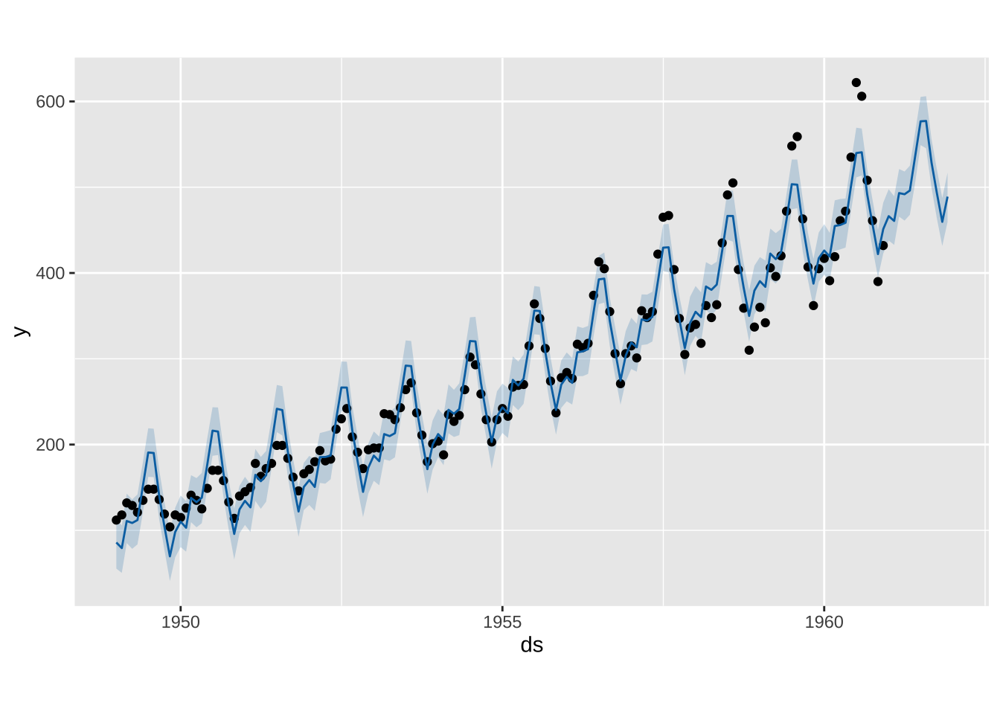

```r

# prophetによる予測の各成分のプロット
prophet_plot_components(air_ppht, air_forecast)
```

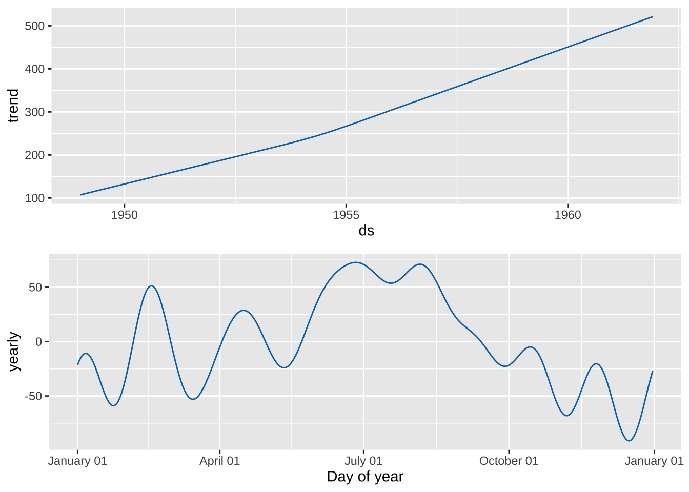

```
prophetの主な引数
- growth: "linear"(デフォルト), "logisitc", "flat"
- changepoints (変化点): 日付ベクトルをユーザー指定 or 潜在的な変化点の自動選択(デフォルト)
- n.changepoints (変化点の数): 25 (デフォルト)
- yearly.seasonality (年次季節性への適合): "auto"(デフォルト), T, F, 生成するFourier項の数
- weekly.seasonality (週次季節性への適合): 同上
- daily.seasonality (週次季節性への適合): 同上
- holidays (休日の指定): なし(デフォルト
- seasonality.mode (季節性の入り方): "additive"(加法的)(デフォルト), "multiplictive"(乗法的)
等
```
