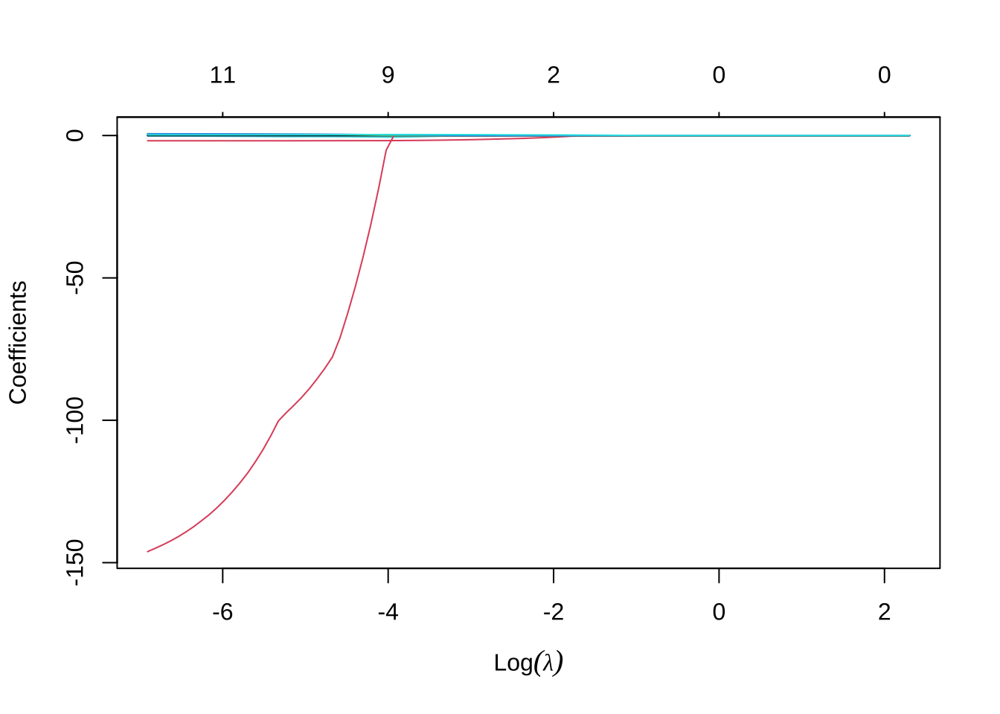
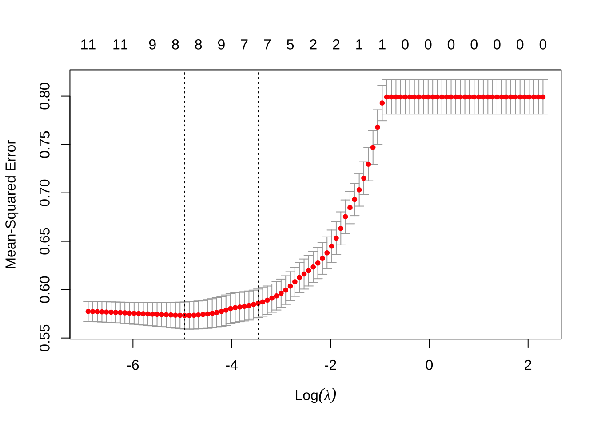
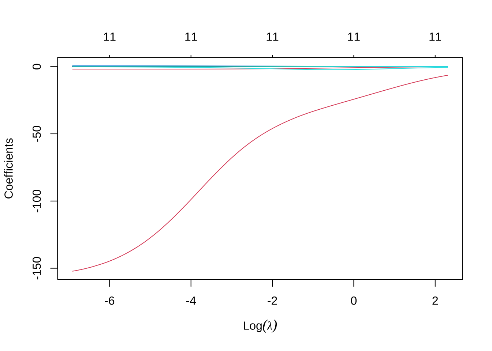

# 正則化回帰 (lasso, ridge回帰) 


※ 本セクションにおける分析フローは, 主としてISLR, Ch.6を参考.

## 検証用セット法による回帰モデルの予測精度評価
### データセット1: ワイン品質データ {-}

```
- winequality-white.csv
   - fixed acidity: 酢酸濃度
   - volitle acidity: 揮発酸濃度
   - citric acidity: クエン酸濃度
   - chlorides: 塩化物
   - sulfur dioxide: 二酸化硫黄
   - sulphate: 硫酸塩
   - fixed acidity: 酒石酸含有量（g/dm3)
   - volatile acidity: 酢酸含有量（g/dm3)
   - citric acid: クエン酸含有量（g/dm3)
   - residual sugar: 残留糖分含有量（g/dm3）
   - chlorides: 塩化ナトリウム含有量（g/dm3)
   - free sulfur dioxide: 遊離亜硫酸含有量（mg/dm3）
   - total sulfur dioxide: 総亜硫酸含有量（mg/dm3）
   - density: 密度（g/dm3)
   - pH:	pH
   - sulphates: 硫酸カリウム含有量（g/dm3）
   - alcohol: アルコール度数（% vol.）
   - quality: ワインの品質 (0 (very bad) -- 10 (excellent))
```

```r
wine <- read.csv("winequality-white.csv", sep = ";", skip = 1, header = T)
head(wine)
#>   fixed.acidity volatile.acidity citric.acid residual.sugar chlorides
#> 1           7.0             0.27        0.36           20.7     0.045
#> 2           6.3             0.30        0.34            1.6     0.049
#> 3           8.1             0.28        0.40            6.9     0.050
#> 4           7.2             0.23        0.32            8.5     0.058
#> 5           7.2             0.23        0.32            8.5     0.058
#> 6           8.1             0.28        0.40            6.9     0.050
#>   free.sulfur.dioxide total.sulfur.dioxide density   pH sulphates alcohol
#> 1                  45                  170  1.0010 3.00      0.45     8.8
#> 2                  14                  132  0.9940 3.30      0.49     9.5
#> 3                  30                   97  0.9951 3.26      0.44    10.1
#> 4                  47                  186  0.9956 3.19      0.40     9.9
#> 5                  47                  186  0.9956 3.19      0.40     9.9
#> 6                  30                   97  0.9951 3.26      0.44    10.1
#>   quality
#> 1       6
#> 2       6
#> 3       6
#> 4       6
#> 5       6
#> 6       6
```


- 検証用セット法 (validation set approach)
  - データセットを学習用と検証用にランダムに分割
  - 学習用データセットで学習 (線形回帰モデルへの適合)
  - 検証用データセットで予測
  - 予測MSE (平均2乗誤差) を計算

```r
# データセットを学習用と検証用にランダムに分割
set.seed(1)
train <- sample(1:nrow(wine), 3000)
# wine_train <- wine[train,]\t\t# 学習用データセット, 3000 wine_test <-
# wine[-train,]\t\t# テスト用データセット, 1898

# 学習用データセットで学習 (線形回帰モデルへの適合)
lm_mod <- lm(quality ~ ., data = wine[train, ])

# 検証用データセットで予測
lm_pred <- predict(lm_mod, newdata = wine[-train, -12])

# 予測MSE (平均2乗誤差) の計算
mean((lm_pred - wine[-train, 12])^2)
#> [1] 0.5657141

# 回帰結果
summary(lm_mod)
#> 
#> Call:
#> lm(formula = quality ~ ., data = wine[train, ])
#> 
#> Residuals:
#>     Min      1Q  Median      3Q     Max 
#> -3.2676 -0.4885 -0.0412  0.4639  2.9119 
#> 
#> Coefficients:
#>                        Estimate Std. Error t value Pr(>|t|)    
#> (Intercept)           1.594e+02  2.202e+01   7.236 5.84e-13 ***
#> fixed.acidity         6.054e-02  2.524e-02   2.399   0.0165 *  
#> volatile.acidity     -1.834e+00  1.446e-01 -12.684  < 2e-16 ***
#> citric.acid          -2.951e-02  1.208e-01  -0.244   0.8070    
#> residual.sugar        8.795e-02  9.123e-03   9.640  < 2e-16 ***
#> chlorides            -1.260e-01  6.522e-01  -0.193   0.8468    
#> free.sulfur.dioxide   4.523e-03  1.082e-03   4.181 2.98e-05 ***
#> total.sulfur.dioxide -1.199e-04  4.791e-04  -0.250   0.8024    
#> density              -1.596e+02  2.235e+01  -7.141 1.16e-12 ***
#> pH                    6.627e-01  1.303e-01   5.085 3.90e-07 ***
#> sulphates             6.331e-01  1.285e-01   4.925 8.90e-07 ***
#> alcohol               2.002e-01  2.858e-02   7.006 3.03e-12 ***
#> ---
#> Signif. codes:  0 '***' 0.001 '**' 0.01 '*' 0.05 '.' 0.1 ' ' 1
#> 
#> Residual standard error: 0.7518 on 2988 degrees of freedom
#> Multiple R-squared:  0.2953,	Adjusted R-squared:  0.2927 
#> F-statistic: 113.8 on 11 and 2988 DF,  p-value: < 2.2e-16
```


## lasso
### 関数`glmnet()`の基本操作 {-}
```
glmnet(): 罰則付き最尤法: GLM推定 + elastic netによる正則化
- usage: glmnet(x, y, family = c("gaussian", "binomial", "poisson", "multinomial", "cox", "mgaussian"), ...)
- 最重要パラメータ
  - alpha: elastic net混合パラメータ (デフォルト=1)
  - lambda: 正則化パラメータ (デフォルトは自動的に100個設定)
```

```r
library(glmnet)
```

簡便のため, glmnetに入力するため, 一旦, 特徴量行列 `x` と 目的変数ベクトル `y` を別々のオブジェクトとして用意しておく.

```r
x <- as.matrix(wine[, 1:11])
y <- as.matrix(wine[, 12])
```

lassoを実行するには, `glmnet()`において, 引数`alpha = 1`と設定する.
$\alpha$は, lasso, ridge回帰 (後述) を包括するクラスである
elastic netのパラメータであり, 両者の正規化項の結合ウェイトを示す
($\alpha=1$がlasso, $\alpha=0$がridge回帰に対応).
特定の`lambda`の値二つに対して実行し, 結果を比較してみる.

```r
# LASSO (alpha = 1) lambda = L1-penalty項
lasso_mod <- glmnet(x[train, ], y[train], alpha = 1, lambda = 0.1)
coef(lasso_mod)
#> 12 x 1 sparse Matrix of class "dgCMatrix"
#>                              s0
#> (Intercept)           3.5648570
#> fixed.acidity         .        
#> volatile.acidity     -0.9333891
#> citric.acid           .        
#> residual.sugar        .        
#> chlorides             .        
#> free.sulfur.dioxide   .        
#> total.sulfur.dioxide  .        
#> density               .        
#> pH                    .        
#> sulphates             .        
#> alcohol               0.2443784
# lasso_mod$beta\t# y切片無し
lasso_mod <- glmnet(x[train, ], y[train], alpha = 1, lambda = 0.01)  # lambda小(penalty小) --> 係数 = 0少
coef(lasso_mod)
#> 12 x 1 sparse Matrix of class "dgCMatrix"
#>                                 s0
#> (Intercept)           74.381719017
#> fixed.acidity         -0.002299923
#> volatile.acidity      -1.812108243
#> citric.acid            .          
#> residual.sugar         0.050598423
#> chlorides             -0.386260201
#> free.sulfur.dioxide    0.004109954
#> total.sulfur.dioxide   .          
#> density              -73.059537698
#> pH                     0.311903370
#> sulphates              0.412510523
#> alcohol                0.284548889
```
最初の例 (`lambda=0.1`), すなわち, 正則化項の係数が相対的に大きい (罰則大) 時, 回帰係数の殆どの値がゼロ (変数選択されない).
他方, 二番目の例 (`lambda=0.01`), すなわち, 正則化項の係数が相対的に小さい時,
多くの回帰係数の値が非ゼロとなっている.

### `lambda`のグリッド指定による`glmnet`の一括実行 {-}
正則化パラメータ$\lambda$は, 数値ベクトル として関数`glmnet()`に与えることもできる.
すると, 各`lambda`の値に対して`glmnet()`が個別に実行され, それらが一括して戻ってくる.
以下では, $10^1$から$10^{-3}$まで100個の点からなるグリッドを取り, 関数`glmnet()`に与える例である.

```r
# lambdaのグリッド指定 grid <- 10^seq(10, -2, length = 100)\t\t# lambda = 10^10
# -- 10^(-2)
grid <- 10^seq(1, -3, length = 100)  # lambda = 10^1 -- 10^(-3)
# 範囲設定されたlambaの各値に対してglmnetを実行
lasso_mod <- glmnet(x[train, ], y[train], alpha = 1, lambda = grid)
# 結果オブジェクトの大きさ (次元)
dim(coef(lasso_mod))  # 12 rows --> 説明変数+y切片, 100 columns --> lambdaの値
#> [1]  12 100
dim(lasso_mod$beta)  # 11 rows --> interceptがない
#> [1]  11 100
```

戻ってきたオブジェクトから, 個々のlambda値に対する実行結果を取り出すことができる.
以下, 50番目. 90番目のグリッド点における結果を取り出す例を示す.


```r
# 50番目のlambdaの値
lasso_mod$lambda[50]  # --> 0.1047616
#> [1] 0.1047616
# 回帰係数推定値
coef(lasso_mod)[, 50]
#>          (Intercept)        fixed.acidity     volatile.acidity 
#>            3.5943708            0.0000000           -0.8843771 
#>          citric.acid       residual.sugar            chlorides 
#>            0.0000000            0.0000000            0.0000000 
#>  free.sulfur.dioxide total.sulfur.dioxide              density 
#>            0.0000000            0.0000000            0.0000000 
#>                   pH            sulphates              alcohol 
#>            0.0000000            0.0000000            0.2402657
lasso_mod$beta[, 50]  # 代替的方法
#>        fixed.acidity     volatile.acidity          citric.acid 
#>            0.0000000           -0.8843771            0.0000000 
#>       residual.sugar            chlorides  free.sulfur.dioxide 
#>            0.0000000            0.0000000            0.0000000 
#> total.sulfur.dioxide              density                   pH 
#>            0.0000000            0.0000000            0.0000000 
#>            sulphates              alcohol 
#>            0.0000000            0.2402657
# 回帰係数推定値のノルムの大きさ sqrt(sum(coef(lasso_mod)[-1, 50]^2))\t# -->
# L2-norm
sum(abs(coef(lasso_mod)[-1, 50]))  # --> L1-norm
#> [1] 1.124643
```


```r
# 90番目のlambdaの値の例
lasso_mod$lambda[90]  # --> 0.002535364
#> [1] 0.002535364
# 回帰係数推定値
coef(lasso_mod)[, 90]
#>          (Intercept)        fixed.acidity     volatile.acidity 
#>         1.285160e+02         2.870680e-02        -1.839954e+00 
#>          citric.acid       residual.sugar            chlorides 
#>        -8.511098e-03         7.470412e-02        -2.656102e-01 
#>  free.sulfur.dioxide total.sulfur.dioxide              density 
#>         4.331940e-03        -3.401243e-05        -1.280749e+02 
#>                   pH            sulphates              alcohol 
#>         5.201851e-01         5.621013e-01         2.323178e-01
# 回帰係数推定値のノルムの大きさ sqrt(sum(coef(lasso_mod)[-1, 90]^2))\t# -->
# L2-norm
sum(abs(coef(lasso_mod)[-1, 90]))  # --> L1-norm
#> [1] 131.6114
```
lambda値大 (罰則大) → 回帰係数推定値の大きさ (L1ノルムで評価) 小,
となっている

学習結果を使い, グリッド上にない新しいlambda値 (例, 0.05) 
に対する回帰係数の予測をすることもできる.

```r
# 新しいlambda値 (例, 0.05) に対する回帰係数の予測
predict(lasso_mod, s = 0.05, type = "coefficients")
#> 12 x 1 sparse Matrix of class "dgCMatrix"
#>                                s1
#> (Intercept)           3.037559871
#> fixed.acidity        -0.021059990
#> volatile.acidity     -1.453951512
#> citric.acid           .          
#> residual.sugar        0.007980186
#> chlorides             .          
#> free.sulfur.dioxide   0.002465338
#> total.sulfur.dioxide  .          
#> density               .          
#> pH                    .          
#> sulphates             .          
#> alcohol               0.309041958
```

指定したグリッド範囲において, 回帰係数推定値の変化を示す
coefficient paths (回帰係数推定値 vs L1ノルム) は`plot()`により描くことができる.

```r
plot(lasso_mod)  # coefficient paths (回帰係数推定値 vs L1ノルム)
```




```r
# テストデータを使った予測, および予測MSEの計算
lasso_pred <- predict(lasso_mod, s = 0.05, newx = x[-train, ])  # lambda = 0.05
mean((lasso_pred - y[-train])^2)  # test MSE
#> [1] 0.5771119
```

### 交差検証によるパラメータ・チューニング {-}
以上のような`lambda`のグリッドに対して実行した`glmnet`の結果より,
関数`cv.glmnet()`は, 交差検証 (cross-validation) を使って,
正則化パラメータ$\lambda$の"最適な"値を見つけることができる.

```
- cv.glmnet(): k-重交差検証を実行. 最適なλの値を返す. 
```

```r
# 交差検証 (Cross-validation) によるlambda値のチューニング
set.seed(2)
cv_out <- cv.glmnet(x[train, ], y[train], alpha = 1)  # デフォルト: 10-fold CV (nfoldsで指定)
cv_out <- cv.glmnet(x[train, ], y[train], lambda = grid, nfolds = 5, alpha = 1)  # lambdaは上のgrid使用, 5-fold CV

# オプション lambda: Optional user - supplied lambda sequence; default is NULL,
# and glmnet chooses its own sequence
plot(cv_out)
```



"最適な"$\lambda$の決め方の一つは, CV誤差 (予測MSE推定値) が最小となる
$\lambda$値であり, これは`cv.glmnet()`の出力オブジェクト内の
要素`$lambda.min`に格納されている.
この`$lambda.min`を`predict()`の引数`s`に与えることで,
対応するlassoのモデルを使った外挿予測をすることができる.

```r
# CV誤差 (予測MSE推定値) が最小 (CV_min) となるlambda
(lmbd_min <- cv_out$lambda.min)
#> [1] 0.007054802
# このlambdaを持つモデルによる予測, 予測MSE
lasso_pred <- predict(lasso_mod, s = lmbd_min, newx = x[-train, ])
mean((lasso_pred - y[-train])^2)  # 予測MSE
#> [1] 0.5647419
```

代替的な$\lambda$の決め方として慣用的によく用いられる方法に,
**"1標準誤差ルール (1 standard error rule)"**がある. 
これは, CV誤差 (予測MSE推定値) の最小値 ($CV_{min}$),
その時の標準誤差$se_{min}$に対して,
$\lambda$における予測MSE $CV_{\lambda}$が
$CV_{\lambda} \le CV_{min} + se_{min}$ となる$\lambda$値の中で
最大の$\lambda$を選択するものである.
CV誤差最小となる$\lambda$よりも大きな$\lambda$を
取ることで, 選択される変数の数が減り,
よりシンプルなモデルが最終モデルとして選ばれるようになる.


```r
# 1標準誤差ルール (1 standard error rule) によるlambda: CV誤差が CV <= CV_min +
# se_min となる最大のlambda
(lmbd_1se <- cv_out$lambda.1se)
#> [1] 0.03125716
# このlambdaを持つモデルによる予測, 予測MSE
lasso_pred2 <- predict(lasso_mod, s = lmbd_1se, newx = x[-train, ])
mean((lasso_pred2 - y[-train])^2)
#> [1] 0.5702662
```

- 以上の, `cv.glmnet()`による出力の確認.

```r
# 上記2つの'最適な'lambdaのインデックス
cv_out$index  # min, 1seの順
#>     Lambda
#> min     79
#> 1se     63

# cv_out$cvm\t# (予測MSEの) CV推定値 cv_out$cvsd\t# cvmの標準誤差
(cvmse_1se <- cv_out$cvm[cv_out$index["min", ]] + cv_out$cvsd[cv_out$index["min",
  ]])
#> [1] 0.5872448
which.max(cv_out$cvm <= cvmse_1se)
#> [1] 63

# 最適なlambda値の対数 → CV誤差曲線 (上図) 内の2本の点線の位置
log(cv_out$lambda.min)
#> [1] -4.954047
log(cv_out$lambda.1se)
#> [1] -3.465507
```
<!--
# cv_out$cvm	# (予測MSEの) CV推定値 (nfolds個の平均値)
# cv_out$cvsd	# cvmの標準誤差 (予測MSEの標準偏差)
-->

CV誤差曲線 (上図) において, 2本の縦線が引かれているが, 
左側の線はCV誤差最小点の位置`log(cv_out$lambda.min)`, 
右側の線は"1標準誤差ルール"による点の位置
`log(cv_out$lambda.1se)`を表している.

## ridge回帰

ridge回帰は, 関数`glmnet()`において, 引数`alpha=0`を指定すれば良い.
その他の実行方法や結果の見方等は, 上記lassoのケースと全く同様である.

```r
# Ridge regression (alpha = 0)
ridge_mod <- glmnet(x[train, ], y[train], alpha = 0, lambda = 0.1)
ridge_mod$beta
#> 11 x 1 sparse Matrix of class "dgCMatrix"
#>                                 s0
#> fixed.acidity        -2.633821e-02
#> volatile.acidity     -1.639141e+00
#> citric.acid          -5.476896e-03
#> residual.sugar        3.694013e-02
#> chlorides            -1.399251e+00
#> free.sulfur.dioxide   4.920892e-03
#> total.sulfur.dioxide -5.358797e-04
#> density              -5.165966e+01
#> pH                    2.494285e-01
#> sulphates             4.307148e-01
#> alcohol               2.645255e-01
ridge_mod <- glmnet(x[train, ], y[train], alpha = 0, lambda = 0.01)
ridge_mod$beta
#> 11 x 1 sparse Matrix of class "dgCMatrix"
#>                                 s0
#> fixed.acidity         2.667047e-02
#> volatile.acidity     -1.834882e+00
#> citric.acid          -3.723824e-02
#> residual.sugar        7.023424e-02
#> chlorides            -4.222285e-01
#> free.sulfur.dioxide   4.800634e-03
#> total.sulfur.dioxide -2.510749e-04
#> density              -1.172285e+02
#> pH                    5.021875e-01
#> sulphates             5.659802e-01
#> alcohol               2.410154e-01
```

先のlassoの時と異なり, 明らかに, 
どの回帰係数も非ゼロの値にとどまっている.
また, 理論が示す通り, $\lambda=0.1$の時の方が,
各係数の絶対値がゼロに近付いことが確認される

## 一般化線形モデル (GLM) + 正則化
関数`glment()`はその名が示すように,
線形回帰にとどまらず, 一般化線形モデル (GLM)
に対しても, elastic net (lasso, ridge回帰)
を実行することができる.
引数`family`をデフォルト (`gaussian`) 以外の
適切な確率分布を指定する.
選択可能なクラスとして,

```
family = c("gaussian", "binomial", "poisson", "multinomial", "cox", "mgaussian")
```

また. `glmnet()`は使用上, 通常の統計解析実行用のR関数, 例えば`lm()`や`glm()`等とは異なるクセのあることに注意が必要である.
```
glmnet()実行上の注意点
 - 欠損値(NA)の事前処理が必要; 除去 or 補間
 - 通常のy~x モデル式の入力ではなく, matrixクラス x, vectorクラス yを引数に取る 
 - 説明変数は数値変数のみ (xは行列) → 質的変数/factorの数量化が必要 (ダミー変数導入)
```

### データセット2: german creditデータ {-}
```
german_credit_modified.csv
- 予測変数 (20変数): StatusAccount, DurationMonth, CreditHistory, Purpose,
  CreditAmount, SavingsAccount, EmploymentSince, InstallmentRate, 
  StatusAndSex, Guarantors, ResidenceSince, Property, Age, InstallmentPlans, 
  Housing, NCredits, Job, NPeopleMain, Phone, ForeignWorker
- 目的変数: Customer [good/bad]
- オリジナルデータの出所: (http://archive.ics.uci.edu/ml/machine-learning-databases/statlog/german/)[http://archive.ics.uci.edu/ml/machine-learning-databases/statlog/german/] 
```


```r
# 例.
credit_dat <- read.csv("german_credit_modified.csv", skip = 3, header = T)
str(credit_dat)
#> 'data.frame':	1000 obs. of  21 variables:
#>  $ StatusAccount   : chr  "lt_0DM" "lt_200DM" "none" "lt_0DM" ...
#>  $ DurationMonth   : int  6 48 12 42 24 36 24 36 12 30 ...
#>  $ CreditHistory   : chr  "E" "C" "E" "C" ...
#>  $ Purpose         : chr  "TV_etc" "TV_etc" "education" "TV_etc" ...
#>  $ CreditAmount    : int  1169 5951 2096 7882 4870 9055 2835 6948 3059 5234 ...
#>  $ SavingsAccount  : chr  NA "lt_100DM" "lt_100DM" "lt_100DM" ...
#>  $ EmploymentSince : chr  "ge_7yrs" "lt_4yrs" "lt_7yrs" "lt_7yrs" ...
#>  $ InstallmentRate : int  4 2 2 2 3 2 3 2 2 4 ...
#>  $ StatusAndSex    : chr  "M_single" "F_divorced" "M_single" "M_single" ...
#>  $ Guarantors      : chr  "none" "none" "none" "guarantor" ...
#>  $ ResidenceSince  : int  4 2 3 4 4 4 4 2 4 2 ...
#>  $ Property        : chr  "real_estate" "real_estate" "real_estate" "life_insurance" ...
#>  $ Age             : int  67 22 49 45 53 35 53 35 61 28 ...
#>  $ InstallmentPlans: chr  "none" "none" "none" "none" ...
#>  $ Housing         : chr  "own" "own" "own" "free" ...
#>  $ NCredits        : int  2 1 1 1 2 1 1 1 1 2 ...
#>  $ Job             : chr  "skilled" "skilled" "unskilled" "skilled" ...
#>  $ NPeopleMain     : int  1 1 2 2 2 2 1 1 1 1 ...
#>  $ Phone           : chr  "yes" "no" "no" "no" ...
#>  $ ForeignWorker   : chr  "yes" "yes" "yes" "yes" ...
#>  $ Customer        : chr  "good" "bad" "good" "good" ...
```

上記のように`glmnet()`を実行する前に, 必要なデータ前処理を行う.

- 欠損値の確認および欠損値の処理

例えば, パッケージ`Amelia`にある関数`missmap()`を使うと, 欠損値のある変数やレコードを可視化することができる.
ここでは, 欠損値は補完せずに, 欠損値を持つレコード自体を除去することにする.
パッケージ`tidyverse` (より正確には, その中に含まれるパッケージ`dplyr`) 内にある  `filter()`関数を使用した例を示すが, 代替的に,
`complete.cases()`を使用しても良い.

```r
# 欠損値の可視化
library(Amelia)
missmap(credit_dat, col = c("black", "lightblue"), y.at = 1, y.labels = "", legend = TRUE)  # Amelia
```



```r
# 欠損値除去
library(tidyverse)
credit_dat2 <- credit_dat %>%
  filter(!is.na(SavingsAccount) & !is.na(Property))
# 欠損値除去 (代替的方法) idx_comp <- complete.cases(credit_dat) credit_dat2 <-
# credit_dat[idx_comp, ]
```

- 質的変数の数値化 (ダミー変数化)

```r
# model.matrix()により, 説明変数行列 (design matrix) の生成, かつ 質的変数 →
# ダミー変数化
x <- model.matrix(Customer ~ ., credit_dat2)[, -1]  # (intercept) を除去 (& NAを含む行は除かれる)
y <- credit_dat2$Customer
```

- lasso + ロジット回帰の実行

```r
library(glmnet)
res_glmnet <- glmnet(x, y, family = "binomial", alpha = 1, lambda = 0.01)
res_glmnet$beta  # 推定回帰係数
#> 42 x 1 sparse Matrix of class "dgCMatrix"
#>                                     s0
#> StatusAccountlt_0DM       -0.685602433
#> StatusAccountlt_200DM     -0.412434306
#> StatusAccountnone          0.782355735
#> DurationMonth             -0.042679931
#> CreditHistoryB            -0.095412680
#> CreditHistoryC             .          
#> CreditHistoryD             .          
#> CreditHistoryE             0.501848921
#> Purposebusiness            .          
#> Purposecar                -0.154132447
#> Purposeeducation          -0.811628841
#> Purposeothers              .          
#> Purposerepairs             .          
#> CreditAmount               .          
#> SavingsAccountlt_1000DM    .          
#> SavingsAccountlt_100DM    -0.479910279
#> SavingsAccountlt_500DM     .          
#> EmploymentSincelt_1yr     -0.303152940
#> EmploymentSincelt_4yrs     .          
#> EmploymentSincelt_7yrs     0.298352171
#> EmploymentSinceunemployed -0.542343752
#> InstallmentRate           -0.096852163
#> StatusAndSexM_divorced    -0.191933913
#> StatusAndSexM_married      0.075476637
#> StatusAndSexM_single       0.095810739
#> Guarantorsguarantor        0.819400005
#> Guarantorsnone             0.005573323
#> ResidenceSince             .          
#> Propertylife_insurance     .          
#> Propertyreal_estate        0.076516039
#> Age                        0.015995247
#> InstallmentPlansnone       0.525251308
#> InstallmentPlansstore      .          
#> Housingown                 .          
#> Housingrent               -0.430797835
#> NCredits                  -0.102761386
#> Jobskilled                 .          
#> Jobunemployed              .          
#> Jobunskilled               .          
#> NPeopleMain                .          
#> Phoneyes                   0.083489661
#> ForeignWorkeryes          -0.303151094
```


## 補足: GLMに対する変数選択の代替的方法
最後に, 正則化回帰ではないが, Rを使った,
一般化線形モデル (GLM) に対する変数選択の代替的方法について紹介する.
ここでは, 上でも使用した白ワインデータを使い, ワインの品質を目的変数として
デフォルトである線形回帰 (family = "gaussian") をそのまま使用する.

```
- glm() + step()の利用
- step(): Choose a model by AIC in a Stepwise Algorithm
- ← AIC基準を使い, ステップワイズによりモデル選択
- glm()では, NAはデフォルトで除去されるが, step()では行数が変化したとしてエラー
- → 欠損値(NA)の事前処理が必要; 除去 or 補間
```


```r
# 例. ワインデータ wine <- read.csv('winequality-white.csv', sep = ';', skip =
# 1, header = T)
res_glm <- glm(quality ~ ., data = wine[train, ])
res_step <- step(res_glm)
#> Start:  AIC=6816.15
#> quality ~ fixed.acidity + volatile.acidity + citric.acid + residual.sugar + 
#>     chlorides + free.sulfur.dioxide + total.sulfur.dioxide + 
#>     density + pH + sulphates + alcohol
#> 
#>                        Df Deviance    AIC
#> - chlorides             1   1689.0 6814.2
#> - citric.acid           1   1689.0 6814.2
#> - total.sulfur.dioxide  1   1689.0 6814.2
#> <none>                      1689.0 6816.1
#> - fixed.acidity         1   1692.2 6819.9
#> - free.sulfur.dioxide   1   1698.8 6831.6
#> - sulphates             1   1702.7 6838.4
#> - pH                    1   1703.6 6840.0
#> - alcohol               1   1716.7 6863.0
#> - density               1   1717.8 6864.9
#> - residual.sugar        1   1741.5 6906.0
#> - volatile.acidity      1   1779.9 6971.5
#> 
#> Step:  AIC=6814.19
#> quality ~ fixed.acidity + volatile.acidity + citric.acid + residual.sugar + 
#>     free.sulfur.dioxide + total.sulfur.dioxide + density + pH + 
#>     sulphates + alcohol
#> 
#>                        Df Deviance    AIC
#> - total.sulfur.dioxide  1   1689.0 6812.2
#> - citric.acid           1   1689.0 6812.3
#> <none>                      1689.0 6814.2
#> - fixed.acidity         1   1692.4 6818.3
#> - free.sulfur.dioxide   1   1698.8 6829.7
#> - sulphates             1   1702.8 6836.5
#> - pH                    1   1704.2 6839.0
#> - alcohol               1   1716.8 6861.2
#> - density               1   1718.7 6864.6
#> - residual.sugar        1   1743.8 6908.0
#> - volatile.acidity      1   1781.7 6972.5
#> 
#> Step:  AIC=6812.25
#> quality ~ fixed.acidity + volatile.acidity + citric.acid + residual.sugar + 
#>     free.sulfur.dioxide + density + pH + sulphates + alcohol
#> 
#>                       Df Deviance    AIC
#> - citric.acid          1   1689.1 6810.3
#> <none>                     1689.0 6812.2
#> - fixed.acidity        1   1692.5 6816.3
#> - sulphates            1   1702.8 6834.6
#> - free.sulfur.dioxide  1   1702.8 6834.6
#> - pH                   1   1704.2 6837.1
#> - alcohol              1   1716.8 6859.3
#> - density              1   1719.8 6864.5
#> - residual.sugar       1   1744.5 6907.2
#> - volatile.acidity     1   1786.9 6979.3
#> 
#> Step:  AIC=6810.33
#> quality ~ fixed.acidity + volatile.acidity + residual.sugar + 
#>     free.sulfur.dioxide + density + pH + sulphates + alcohol
#> 
#>                       Df Deviance    AIC
#> <none>                     1689.1 6810.3
#> - fixed.acidity        1   1692.5 6814.3
#> - sulphates            1   1702.8 6832.6
#> - free.sulfur.dioxide  1   1702.8 6832.7
#> - pH                   1   1704.6 6835.8
#> - alcohol              1   1717.0 6857.5
#> - density              1   1720.5 6863.6
#> - residual.sugar       1   1745.2 6906.4
#> - volatile.acidity     1   1789.3 6981.3
summary(res_step)
#> 
#> Call:
#> glm(formula = quality ~ fixed.acidity + volatile.acidity + residual.sugar + 
#>     free.sulfur.dioxide + density + pH + sulphates + alcohol, 
#>     data = wine[train, ])
#> 
#> Deviance Residuals: 
#>     Min       1Q   Median       3Q      Max  
#> -3.2713  -0.4916  -0.0425   0.4618   2.9501  
#> 
#> Coefficients:
#>                       Estimate Std. Error t value Pr(>|t|)    
#> (Intercept)          1.615e+02  2.139e+01   7.549 5.77e-14 ***
#> fixed.acidity        6.060e-02  2.473e-02   2.450   0.0143 *  
#> volatile.acidity    -1.839e+00  1.380e-01 -13.323  < 2e-16 ***
#> residual.sugar       8.868e-02  8.897e-03   9.968  < 2e-16 ***
#> free.sulfur.dioxide  4.336e-03  8.785e-04   4.936 8.42e-07 ***
#> density             -1.617e+02  2.168e+01  -7.459 1.14e-13 ***
#> pH                   6.706e-01  1.279e-01   5.242 1.69e-07 ***
#> sulphates            6.297e-01  1.278e-01   4.926 8.83e-07 ***
#> alcohol              1.996e-01  2.839e-02   7.030 2.54e-12 ***
#> ---
#> Signif. codes:  0 '***' 0.001 '**' 0.01 '*' 0.05 '.' 0.1 ' ' 1
#> 
#> (Dispersion parameter for gaussian family taken to be 0.5647177)
#> 
#>     Null deviance: 2396.8  on 2999  degrees of freedom
#> Residual deviance: 1689.1  on 2991  degrees of freedom
#> AIC: 6810.3
#> 
#> Number of Fisher Scoring iterations: 2
```
