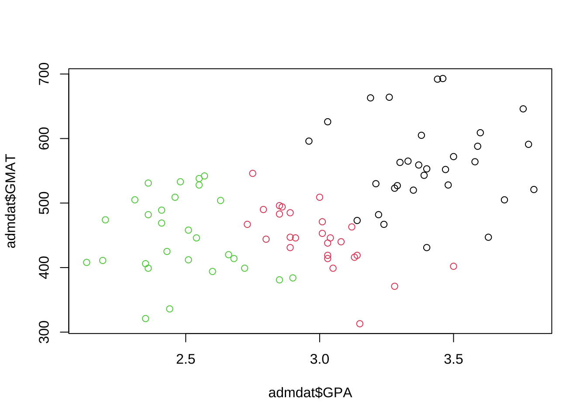
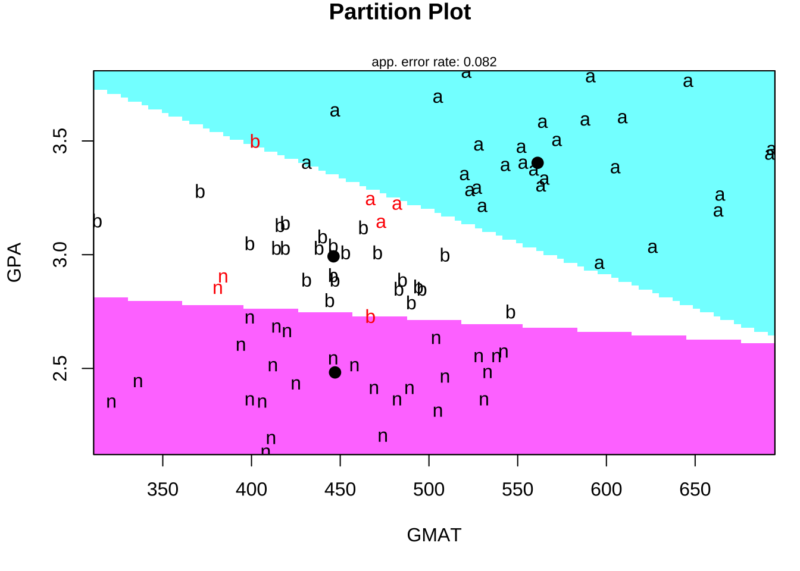
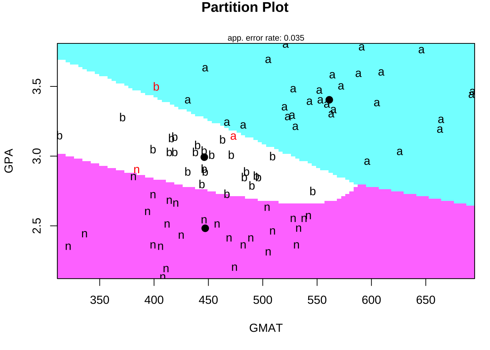
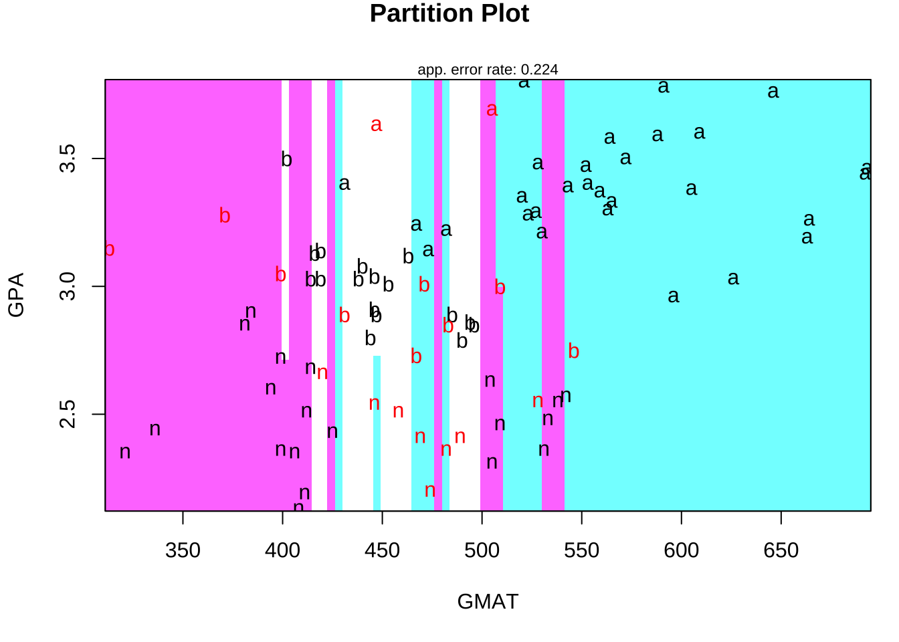
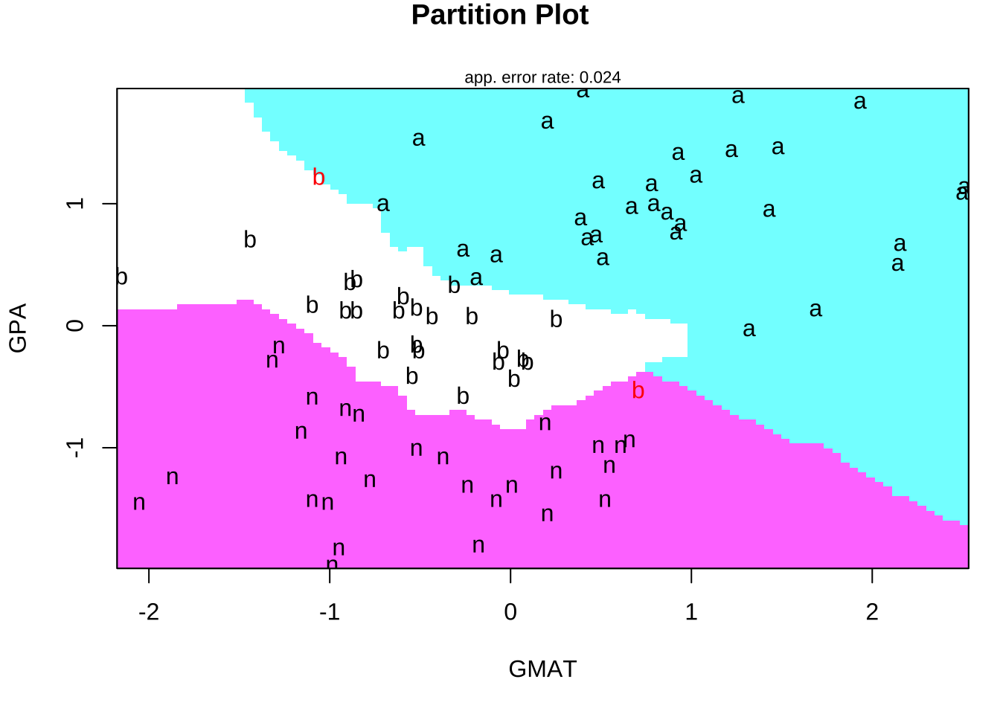
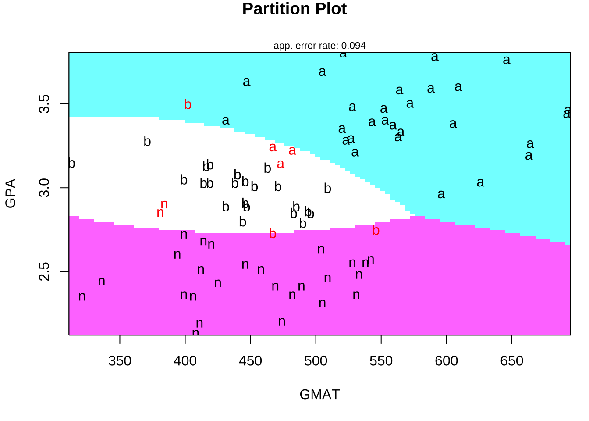

# 判別分析


判別分析における標準的的手法である線形判別 (lda), 2次判別 (qda)は,
標準パッケージ**MASS**に含まれている関数`lda()`, `qda()`,
一方, kNN (k近傍法) はパッケージ**class**に含まれている関数`knn()`を
使用して実行することができる.


## 線形判別 & 2次判別: パッケージMASSの利用
- 以下, 7.1, 7.2のコード作成の参考: ISLR, p.155-

### データセット#1: 米国S&P500日次リターンデータ{-}

```
Smarket: S&P500日次%リターン5年分
- Year  観測値の記録年 (2001--2005)
- Lag1  前日の%リターン
- Lag2  2日前の%リターン
- Lag3  3日前の%リターン
- Lag4  4日前の%リターン
- Lag5  5日前の%リターン
- Volume  取引量 (日次取引株式数, 単位十億枚)
- Today 当日の%リターン
- Direction 相場の方向性 (Down/Up, 2-水準因子)
```

```r
library(ISLR)
names(Smarket)
#> [1] "Year"      "Lag1"      "Lag2"      "Lag3"      "Lag4"      "Lag5"     
#> [7] "Volume"    "Today"     "Direction"
dim(Smarket)
#> [1] 1250    9
summary(Smarket)
#>       Year           Lag1                Lag2                Lag3          
#>  Min.   :2001   Min.   :-4.922000   Min.   :-4.922000   Min.   :-4.922000  
#>  1st Qu.:2002   1st Qu.:-0.639500   1st Qu.:-0.639500   1st Qu.:-0.640000  
#>  Median :2003   Median : 0.039000   Median : 0.039000   Median : 0.038500  
#>  Mean   :2003   Mean   : 0.003834   Mean   : 0.003919   Mean   : 0.001716  
#>  3rd Qu.:2004   3rd Qu.: 0.596750   3rd Qu.: 0.596750   3rd Qu.: 0.596750  
#>  Max.   :2005   Max.   : 5.733000   Max.   : 5.733000   Max.   : 5.733000  
#>       Lag4                Lag5              Volume           Today          
#>  Min.   :-4.922000   Min.   :-4.92200   Min.   :0.3561   Min.   :-4.922000  
#>  1st Qu.:-0.640000   1st Qu.:-0.64000   1st Qu.:1.2574   1st Qu.:-0.639500  
#>  Median : 0.038500   Median : 0.03850   Median :1.4229   Median : 0.038500  
#>  Mean   : 0.001636   Mean   : 0.00561   Mean   :1.4783   Mean   : 0.003138  
#>  3rd Qu.: 0.596750   3rd Qu.: 0.59700   3rd Qu.:1.6417   3rd Qu.: 0.596750  
#>  Max.   : 5.733000   Max.   : 5.73300   Max.   :3.1525   Max.   : 5.733000  
#>  Direction 
#>  Down:602  
#>  Up  :648  
#>            
#>            
#>            
#> 
# cor(Smarket) # -> Error
cor(Smarket[, -9])
#>              Year         Lag1         Lag2         Lag3         Lag4
#> Year   1.00000000  0.029699649  0.030596422  0.033194581  0.035688718
#> Lag1   0.02969965  1.000000000 -0.026294328 -0.010803402 -0.002985911
#> Lag2   0.03059642 -0.026294328  1.000000000 -0.025896670 -0.010853533
#> Lag3   0.03319458 -0.010803402 -0.025896670  1.000000000 -0.024051036
#> Lag4   0.03568872 -0.002985911 -0.010853533 -0.024051036  1.000000000
#> Lag5   0.02978799 -0.005674606 -0.003557949 -0.018808338 -0.027083641
#> Volume 0.53900647  0.040909908 -0.043383215 -0.041823686 -0.048414246
#> Today  0.03009523 -0.026155045 -0.010250033 -0.002447647 -0.006899527
#>                Lag5      Volume        Today
#> Year    0.029787995  0.53900647  0.030095229
#> Lag1   -0.005674606  0.04090991 -0.026155045
#> Lag2   -0.003557949 -0.04338321 -0.010250033
#> Lag3   -0.018808338 -0.04182369 -0.002447647
#> Lag4   -0.027083641 -0.04841425 -0.006899527
#> Lag5    1.000000000 -0.02200231 -0.034860083
#> Volume -0.022002315  1.00000000  0.014591823
#> Today  -0.034860083  0.01459182  1.000000000
```

まず, データセットを学習データとテストデータに2分割する (Validation set approach).
具体的には, 時間軸に沿って, 2004以前を学習用, 2005年をテスト用に使用する.

```r
# データセット分割: Validation set approach 時間軸に沿って2分割 (2004以前 →
# 学習, 2005年 → テスト)
idx_train <- (1:nrow(Smarket))[Smarket$Year < 2005]
Smarket_2005 <- Smarket[-idx_train, ]
dim(Smarket_2005)
#> [1] 252   9
Direction_2005 <- Smarket[-idx_train, "Direction"]
```


```r
# 代替的方法-1 (ISLR)
train <- (Smarket$Year < 2005)
Smarket_2005 <- Smarket[!train, ]
Direction_2005 <- Smarket[!train, "Direction"]
```


```r
# 代替的方法-2
library(tidyverse)
idx_train <- Smarket %>%
  filter(Year < 2005) %>%
  row_number()
Smarket_2005 <- Smarket %>%
  filter(Year == 2005)
Direction_2005 <- Smarket %>%
  select(Direction) %>%
  slice(-idx_train) %>%
  1[[]]
```


### 線形判別 (LDA) {-}

- モデル適合

線形判別の実行は, パッケージ**MASS**の関数`lda()`により行うことができる.

```r
library(MASS)
# 学習データによるモデル適合
fit_lda <- lda(Direction ~ Lag1 + Lag2, data = Smarket, subset = idx_train)
fit_lda
#> Call:
#> lda(Direction ~ Lag1 + Lag2, data = Smarket, subset = idx_train)
#> 
#> Prior probabilities of groups:
#>     Down       Up 
#> 0.491984 0.508016 
#> 
#> Group means:
#>             Lag1        Lag2
#> Down  0.04279022  0.03389409
#> Up   -0.03954635 -0.03132544
#> 
#> Coefficients of linear discriminants:
#>             LD1
#> Lag1 -0.6420190
#> Lag2 -0.5135293
```

`fit_lda`の出力結果には, 各グループ(`Down`, `Up`)ごとの,
予測変数 (`Lag1`, `Lag2`) のグループ平均の値や,
線形判別関数の係数に関する情報などが格納されている.

- 判別 (外挿予測)

線形判別 (lda) の出力オブジェクト (適合結果) を
関数`predict`に入力することで, 
判別結果 (class), およびその判断に使用した
事後確率 (posterior) が出力される.
判別分析の使用目的は, まさにこれらの出力 (特に前者) を得ることである.

```r
# テストデータの判別 (外挿予測)
pred_lda <- predict(fit_lda, Smarket_2005)
names(pred_lda)
#> [1] "class"     "posterior" "x"
#
head(pred_lda$class)
#> [1] Up Up Up Up Up Up
#> Levels: Down Up
head(pred_lda$posterior)
#>           Down        Up
#> 999  0.4901792 0.5098208
#> 1000 0.4792185 0.5207815
#> 1001 0.4668185 0.5331815
#> 1002 0.4740011 0.5259989
#> 1003 0.4927877 0.5072123
#> 1004 0.4938562 0.5061438
# →　出力: $class, $posterior, $x
```

- 精度評価

学習済モデルのパフォーマンス評価は,
テストデータを使って判別させ (外挿予測), マスクしておいた教師信号 (正解) と比較することにより行う.

分類精度の評価は, 混同行列や正解率で確認することができる.

```r
# 混同行列
table(pred_lda$class, Direction_2005)
# 正解率
mean(pred_lda$class == Direction_2005)
#>       Direction_2005
#>        Down  Up
#>   Down   35  35
#>   Up     76 106
#> [1] 0.5595238
```


```r
# 閾値0.5の場合の方向予測 2005年における (下落発生の) 事後確率0.5以上の予測件数
sum(pred_lda$posterior[, 1] >= 0.5)
# 同0.5未満の予測確率
sum(pred_lda$posterior[, 1] < 0.5)

# モデルによる事後確率の出力値, 市場が下落する確率に対応
pred_lda$posterior[1:20, 1]
pred_lda$class[1:20]

# 2005年における事後確率0.9超の予測件数
sum(pred_lda$posterior[, 1] > 0.9)
# 同事後確率の最大値
max(pred_lda$posterior[, 1])
```


### 2次判別 (QDA) {-}

- モデル適合

線形判別の実行は, パッケージ**MASS**の関数`qda()`により行うことができる.
操作は`lda()`と同様である.

```r
# 学習データによるモデル適合
fit_qda <- qda(Direction ~ Lag1 + Lag2, data = Smarket, subset = idx_train)
fit_qda
#> Call:
#> qda(Direction ~ Lag1 + Lag2, data = Smarket, subset = idx_train)
#> 
#> Prior probabilities of groups:
#>     Down       Up 
#> 0.491984 0.508016 
#> 
#> Group means:
#>             Lag1        Lag2
#> Down  0.04279022  0.03389409
#> Up   -0.03954635 -0.03132544
```

- 判別 (外挿予測)

```r
# テストデータの判別 (外挿予測)
pred_qda <- predict(fit_qda, Smarket_2005)
names(pred_qda)
#> [1] "class"     "posterior"
head(pred_qda$class)
#> [1] Up Up Up Up Up Up
#> Levels: Down Up
head(pred_qda$posterior)
#>           Down        Up
#> 999  0.4873243 0.5126757
#> 1000 0.4759011 0.5240989
#> 1001 0.4636911 0.5363089
#> 1002 0.4739253 0.5260747
#> 1003 0.4903426 0.5096574
#> 1004 0.4913561 0.5086439
# →　出力: $class, $posterior\t
```

- 精度評価

```r
# 混同行列
table(pred_qda$class, Direction_2005)
# 正解率
mean(pred_qda$class == Direction_2005)
#>       Direction_2005
#>        Down  Up
#>   Down   30  20
#>   Up     81 121
#> [1] 0.5992063
```

上でも軽く触れたが, 学習済モデルのパラメータ推定値は
`lda()`や`qda()`の出力オブジェクトに格納され, これらから
線形判別関数や2次判別関数や, 判別境界の形状を知ることができる.

```r
# fit_lda$scaling\t\t\t\t# 線形判別関数の係数 hist(predict(fit_lda)$x)\t\t#
# 判別得点 fit_lda$means\t\t\t\t\t# グループ平均 fit_lda$prior\t\t\t\t\t#
# 事前確率
```

ここで用いた`Smarket`は時系列データゆえ, Validation set approachを採用するにあたって時間的に古いものを学習用データ,
新しいものをテスト用データに指定した.
一般の時系列ではないデータセットの場合には, 
データセットの分割は通常ランダムに行うことになるが, それでも
学習済モデルの判別パフォーマンスはデータセットの分割の仕方に依存してしまう.
そこで, そのようなデータセット分割への依存性を軽減し,
モデルによる外挿予測の精度評価の信頼性を高めるために交互検証 (クロス・バリデーション) を行うことが推奨される.

関数`lda()`や`qda()`は引数`CV`を持っていて, これを`TRUE`と設定することで, LOOCVを実行することができる (デフォルトは`FALSE`).
(Smarketは時系列データセットのため, LOOCVの使用は適切でない. ここでは省略する.)

```
LOOCV (Lead-One-Out Cross-Validation)
- 交差検証法の一種. 1個抜き交差検証
- データセットの各データ点を1つずつテスト用データとして取り出し, 残りのサンプルを学習用データとして使用して, モデルの適合および外挿予測を行う.
- このプロセスをデータセットの全てのデータ点に対して繰り返し行うことで, モデルの性能を評価する.
```


## kNN法: パッケージ**class**の利用

kNN法は, 標準ライブラリ`class`内の関数`knn()`によって実行できる.
kNN法では, クラス数$k$を与える必要がある.
`knn()`へのデータセットの与え方は, 上記`lda()`, `qda()`とは異なり,
学習に用いる予測変数, テストに用いる予測変数, 学習に用いる目的変数
(ラベル)を順に与える必要がある.

- データセットの分割

```r
# kNN法
library(class)
# データセットの分割 train_x <- cbind(Smarket$Lag1, Smarket$Lag2)[idx_train, ]
# test_x <- cbind(Smarket$Lag1, Smarket$Lag2)[-idx_train, ]
train_x <- Smarket[idx_train, c("Lag1", "Lag2")]
test_x <- Smarket[-idx_train, c("Lag1", "Lag2")]
train_direction <- Smarket$Direction[idx_train]
```

- 判別 (外挿予測)
ここでは$k=1$とした例を示す.

```r
# K = 1 学習データをもとに, テストデータを分類予測 set.seed(1)
pred_knn <- knn(train_x, test_x, train_direction, k = 1)
```

- 精度評価

```r
# 混同行列
(tbl_knn <- table(pred_knn, Direction_2005))
#>         Direction_2005
#> pred_knn Down Up
#>     Down   43 58
#>     Up     68 83

# library(caret) confusionMatrix(tbl_knn, mode = 'prec_recall')

# 正解率
mean(pred_knn == Direction_2005)
#> [1] 0.5
```


- 交差検証 (LOOCV)

`class`には, 関数`knn.cv()`が用意されている. これを用いれば,
上記のようにデータセット全体を学習用とテスト用にあらかじめ
2分割して`knn()`に与えるのではなく, データセット全体を与えることで
LOOCV (leave-oen-out cross validation) を実行することができる.

<!--
毎回各データ点を1つのテストデータ, 残りを学習データとしながら
kNN法を実行し, テストデータを入れ替えながら繰り返して
全データセットに関する判別 (外挿予測) の結果を得る
LOOCV (leave-oen-out cross validation) を実行することができる.
-->

上でも触れたが, 時系列データセットに対して, LOOCVその他の交差検証を実施する際には十分注意が必要である. 
すなわち, 将来データを学習して過去のデータを予測するようなデータの使い方は, 外挿予測 (=将来予測) を目的とする場合には適切ではない. そのように計算された外挿予測値を使って テスト予測誤差を評価することの意味・意義について
問わないといけない.
<!-- そのような文脈では, Smarketに対してLOOCVで計算されるテスト予測誤差の評価は適切とは言えないことに注意したい. -->
ここでは, あくまで操作の参考として,
`knn.cv()`の使用や$k$の選択を行うRコード例を示す.


```r
# Cross-validation LOOCV (leave-oen-out cross validation) → 全データセット
# (テストデータ1つずつ) の分類結果を返す
x <- Smarket[, c("Lag1", "Lag2")]
y <- Smarket$Direction
pred_knn_cv <- knn.cv(x, y, k = 3, prob = T)
head(pred_knn_cv)
#> [1] Up   Up   Down Up   Up   Down
#> Levels: Down Up
summary(pred_knn_cv)
#> Down   Up 
#>  566  684
```

LOOCVに対して全データセットを与えて学習・
予測させたため, 精度評価のための
予測値と真の値 (教師信号) の比較は全データセットに対して
行われねばならない.

```r
# 混同行列
(tbl_knn_cv <- table(pred_knn_cv, y))
#>            y
#> pred_knn_cv Down  Up
#>        Down  269 297
#>        Up    333 351
# 正解率
mean(pred_knn_cv == y)
#> [1] 0.496
```

正解率は50%を下回り, 予測がうまくいってないことを示している.

一般に, kNN法は$k$の大きさに結果が左右されることから,
適切な$k$の選択は重要である.

```r
for (k_tmp in 1:10) {
  print(paste0("k=", k_tmp))
  pred_knn_cv <- knn.cv(x, y, k = k_tmp)
  # 混同行列
  print(tbl_knn_cv <- table(pred_knn_cv, y))
  # 正解率
  print(mean(pred_knn_cv == y))
}
#> [1] "k=1"
#>            y
#> pred_knn_cv Down  Up
#>        Down  280 310
#>        Up    322 338
#> [1] 0.4944
#> [1] "k=2"
#>            y
#> pred_knn_cv Down  Up
#>        Down  290 316
#>        Up    312 332
#> [1] 0.4976
#> [1] "k=3"
#>            y
#> pred_knn_cv Down  Up
#>        Down  269 297
#>        Up    333 351
#> [1] 0.496
#> [1] "k=4"
#>            y
#> pred_knn_cv Down  Up
#>        Down  260 298
#>        Up    342 350
#> [1] 0.488
#> [1] "k=5"
#>            y
#> pred_knn_cv Down  Up
#>        Down  273 300
#>        Up    329 348
#> [1] 0.4968
#> [1] "k=6"
#>            y
#> pred_knn_cv Down  Up
#>        Down  275 301
#>        Up    327 347
#> [1] 0.4976
#> [1] "k=7"
#>            y
#> pred_knn_cv Down  Up
#>        Down  268 304
#>        Up    334 344
#> [1] 0.4896
#> [1] "k=8"
#>            y
#> pred_knn_cv Down  Up
#>        Down  278 297
#>        Up    324 351
#> [1] 0.5032
#> [1] "k=9"
#>            y
#> pred_knn_cv Down  Up
#>        Down  270 295
#>        Up    332 353
#> [1] 0.4984
#> [1] "k=10"
#>            y
#> pred_knn_cv Down  Up
#>        Down  259 298
#>        Up    343 350
#> [1] 0.4872
```

$k$を変えても, 正解率は大きく変わらず, いずれも50%を下回った.
本データセットが時系列データであることを考えれば,
不自然とは言えない.


## 他パッケージの利用: パッケージ**klaR**

### データセット#2: ビジネススクールの入学許可データ {-}

```
- admission.csv
   - GPA
   - GMAT
   - De (意思決定): "admit", "border", "notadmit"
- source: https://rstudio-pubs-static.s3.amazonaws.com/35817_2552e05f1d4e4db8ba87b334101a43da.html
```

```r
url <- "http://www.biz.uiowa.edu/faculty/jledolter/DataMining/admission.csv"
admdat <- read.csv(url, stringsAsFactors = T)  # 注: stringsAsFactors = F (デフォルト) → エラー
# admdat <- read.csv('admission.csv', skip = 2, stringsAsFactors = T)\t
head(admdat)
# admdat = data.frame(admdat)
plot(admdat$GPA, admdat$GMAT, col = admdat$De)
```



```
#>    GPA GMAT    De
#> 1 2.96  596 admit
#> 2 3.14  473 admit
#> 3 3.22  482 admit
#> 4 3.29  527 admit
#> 5 3.69  505 admit
#> 6 3.46  693 admit
```


関数`partimat()`は, 判別分析やそれ以外の多様なクラス分類手法をサポートしている.

- 引数`method`で指定: "lda", "qda", "rpart", "naiveBayes", "rda", "sknn", "svmlight"


```r
# 'klaR'パッケージの利用 install.packages('klaR')
library(klaR)
# 線形判別
partimat(De ~ ., data = admdat, method = "lda")
```



```r
# 2次判別
partimat(De ~ ., data = admdat, method = "qda")
```



```r
# kNN法
partimat(De ~ ., data = admdat, method = "sknn")  # Simple kNN法 (デフォルトk = 3)
```



変数間のスケールを統一 (標準化) した後にkNN法を再実行してみる.

```r
# 変数標準化後
admdat2 <- data.frame(GPA = scale(admdat$GPA), GMAT = scale(admdat$GMAT), De = admdat$De)
partimat(De ~ ., data = admdat2, method = "sknn")  # Simple kNN法 (デフォルトk = 3)
```



パッケージ**klaR**内には, ナイーブベイズ法を実行する関数`NaiveBayes()`も用意されている.

```r
# ナイーブベイズ法
fit_NB <- NaiveBayes(De ~ ., data = admdat)  # usekernel = F(デフォルト) → 正規分布
# predict(fit_NB) # →　出力: $class, $posterior
(tbl_nb <- table(predict(fit_NB)$class, admdat$De))
#>           
#>            admit border notadmit
#>   admit       28      1        0
#>   border       3     23        2
#>   notadmit     0      2       26
```

関数`partimat()`において, `method = "naiveBayes"`と指定してもよい.

```r
# または
partimat(De ~ ., data = admdat, method = "naiveBayes")  # ナイーブベイズ法
```


