# 決定木分析


## 導入: 回帰木 vs 線形回帰
### データセット1: 自動車の制動距離 {-}

```
- cars
   - speed: 自動車の速度 (mph)
   - dist: ブレーキをかけて自動車が停止するまでの距離 (feet)
- Rの標準データセット
```


```r
# cars
head(cars)
#>   speed dist
#> 1     4    2
#> 2     4   10
#> 3     7    4
#> 4     7   22
#> 5     8   16
#> 6     9   10
tail(cars)
#>    speed dist
#> 45    23   54
#> 46    24   70
#> 47    24   92
#> 48    24   93
#> 49    24  120
#> 50    25   85
# cars['speed']
plot(cars)
```

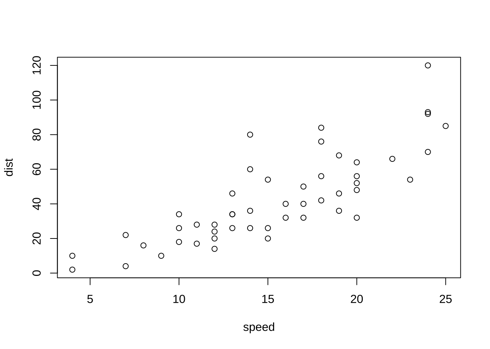

```r
cor(cars["speed"], cars["dist"])
#>            dist
#> speed 0.8068949
```

- 単回帰分析

```r
# 単回帰分析
cars_lm <- lm(dist ~ speed, data = cars)
summary(cars_lm)
#> 
#> Call:
#> lm(formula = dist ~ speed, data = cars)
#> 
#> Residuals:
#>     Min      1Q  Median      3Q     Max 
#> -29.069  -9.525  -2.272   9.215  43.201 
#> 
#> Coefficients:
#>             Estimate Std. Error t value Pr(>|t|)    
#> (Intercept) -17.5791     6.7584  -2.601   0.0123 *  
#> speed         3.9324     0.4155   9.464 1.49e-12 ***
#> ---
#> Signif. codes:  0 '***' 0.001 '**' 0.01 '*' 0.05 '.' 0.1 ' ' 1
#> 
#> Residual standard error: 15.38 on 48 degrees of freedom
#> Multiple R-squared:  0.6511,	Adjusted R-squared:  0.6438 
#> F-statistic: 89.57 on 1 and 48 DF,  p-value: 1.49e-12

# 回帰係数の取り出し
cars_lm$coef
#> (Intercept)       speed 
#>  -17.579095    3.932409
coefficients(cars_lm)
#> (Intercept)       speed 
#>  -17.579095    3.932409

# 回帰直線の図示
plot(cars)
abline(cars_lm)
```

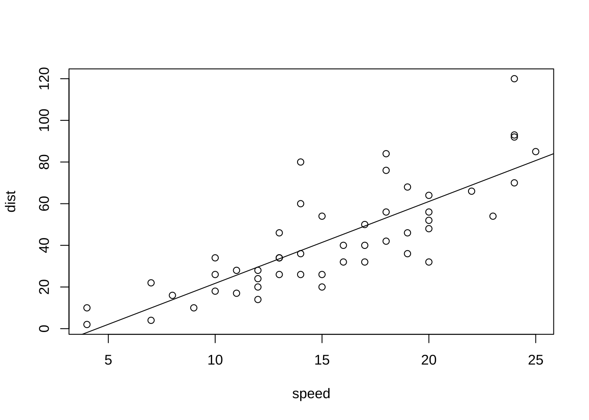


```r
# モデル診断（残差プロット等) plot(cars_lm)\t\t 4枚表示: 残差vs Y適合値, 残差
# vs Q - Qプロット, 残差平方根 vs Y適合値, 残差 vs 影響力(てこ値とCook距離)
```

- 予測

```r
# 学習データに対する適合値 (内挿予測)
cars_pred <- predict(cars_lm)
# 残差
cars_resd <- residuals(cars_lm)
# 予測値 vs 残差
plot(cars_pred, cars_resd)
abline(h = 0, lty = 2)
```

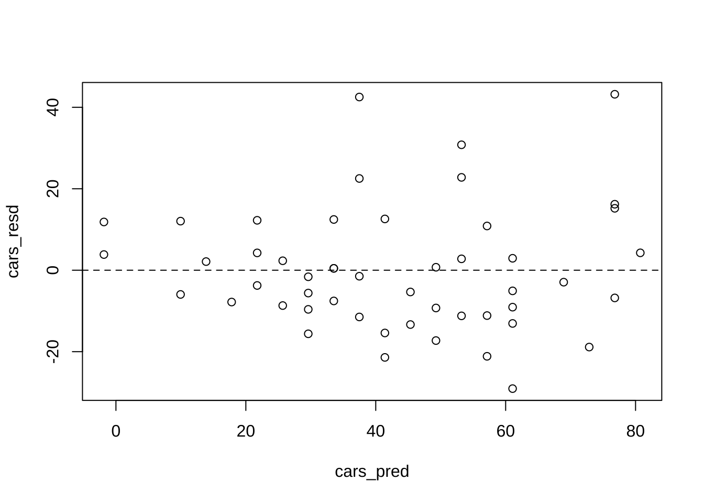

```r
data.frame(cars, cars_pred, cars_resd)
#>    speed dist cars_pred  cars_resd
#> 1      4    2 -1.849460   3.849460
#> 2      4   10 -1.849460  11.849460
#> 3      7    4  9.947766  -5.947766
#> 4      7   22  9.947766  12.052234
#> 5      8   16 13.880175   2.119825
#> 6      9   10 17.812584  -7.812584
#> 7     10   18 21.744993  -3.744993
#> 8     10   26 21.744993   4.255007
#> 9     10   34 21.744993  12.255007
#> 10    11   17 25.677401  -8.677401
#> 11    11   28 25.677401   2.322599
#> 12    12   14 29.609810 -15.609810
#> 13    12   20 29.609810  -9.609810
#> 14    12   24 29.609810  -5.609810
#> 15    12   28 29.609810  -1.609810
#> 16    13   26 33.542219  -7.542219
#> 17    13   34 33.542219   0.457781
#> 18    13   34 33.542219   0.457781
#> 19    13   46 33.542219  12.457781
#> 20    14   26 37.474628 -11.474628
#> 21    14   36 37.474628  -1.474628
#> 22    14   60 37.474628  22.525372
#> 23    14   80 37.474628  42.525372
#> 24    15   20 41.407036 -21.407036
#> 25    15   26 41.407036 -15.407036
#> 26    15   54 41.407036  12.592964
#> 27    16   32 45.339445 -13.339445
#> 28    16   40 45.339445  -5.339445
#> 29    17   32 49.271854 -17.271854
#> 30    17   40 49.271854  -9.271854
#> 31    17   50 49.271854   0.728146
#> 32    18   42 53.204263 -11.204263
#> 33    18   56 53.204263   2.795737
#> 34    18   76 53.204263  22.795737
#> 35    18   84 53.204263  30.795737
#> 36    19   36 57.136672 -21.136672
#> 37    19   46 57.136672 -11.136672
#> 38    19   68 57.136672  10.863328
#> 39    20   32 61.069080 -29.069080
#> 40    20   48 61.069080 -13.069080
#> 41    20   52 61.069080  -9.069080
#> 42    20   56 61.069080  -5.069080
#> 43    20   64 61.069080   2.930920
#> 44    22   66 68.933898  -2.933898
#> 45    23   54 72.866307 -18.866307
#> 46    24   70 76.798715  -6.798715
#> 47    24   92 76.798715  15.201285
#> 48    24   93 76.798715  16.201285
#> 49    24  120 76.798715  43.201285
#> 50    25   85 80.731124   4.268876
```


```r
# テストデータ(未学習データ)に対する予測 (外挿予測)
testdat <- data.frame(speed = c(5, 6, 21))
head(predict(cars_lm, newdata = testdat))
#>         1         2         3 
#>  2.082949  6.015358 65.001489
```

### 基本操作: 回帰木

回帰木, 分類木ともに,
パッケージ**rpart**の関数`rpart()`を適用する.


```r
library(rpart)
cars_rp <- rpart(dist ~ speed, data = cars)
summary(cars_rp)  # ==> 葉3枚
#> Call:
#> rpart(formula = dist ~ speed, data = cars)
#>   n= 50 
#> 
#>          CP nsplit rel error    xerror      xstd
#> 1 0.4676398      0 1.0000000 1.0385455 0.2201517
#> 2 0.1104944      1 0.5323602 0.6419837 0.1367990
#> 3 0.0100000      2 0.4218658 0.5178441 0.1231792
#> 
#> Variable importance
#> speed 
#>   100 
#> 
#> Node number 1: 50 observations,    complexity param=0.4676398
#>   mean=42.98, MSE=650.7796 
#>   left son=2 (31 obs) right son=3 (19 obs)
#>   Primary splits:
#>       speed < 17.5 to the left,  improve=0.4676398, (0 missing)
#> 
#> Node number 2: 31 observations,    complexity param=0.1104944
#>   mean=29.32258, MSE=267.9605 
#>   left son=4 (15 obs) right son=5 (16 obs)
#>   Primary splits:
#>       speed < 12.5 to the left,  improve=0.4328244, (0 missing)
#> 
#> Node number 3: 19 observations
#>   mean=65.26316, MSE=474.5097 
#> 
#> Node number 4: 15 observations
#>   mean=18.2, MSE=78.42667 
#> 
#> Node number 5: 16 observations
#>   mean=39.75, MSE=220.9375
plot(cars_rp, uniform = T, margin = 0.05)
text(cars_rp, all = T, use.n = T)
```

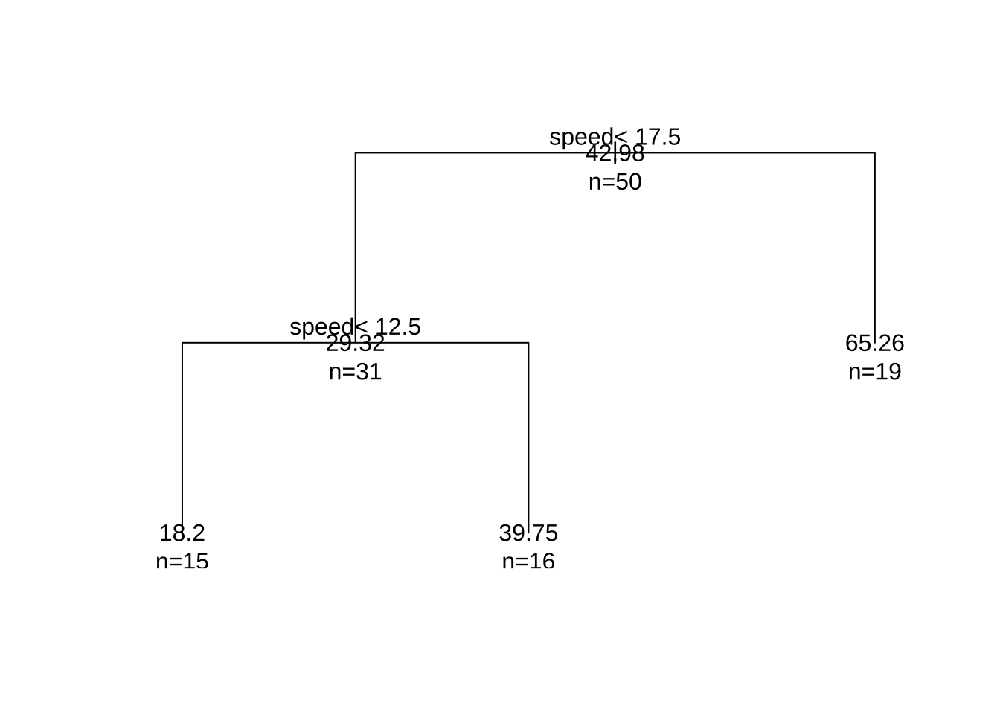


- 予測

```r
# 学習用データに対する適合値 (内挿予測)
cars_rp_pred <- predict(cars_rp)
cars_rp_fitted <- data.frame(cars$speed, cars_rp_pred)
plot(cars$speed, cars$dist)
lines(cars_rp_fitted, type = "s")
```

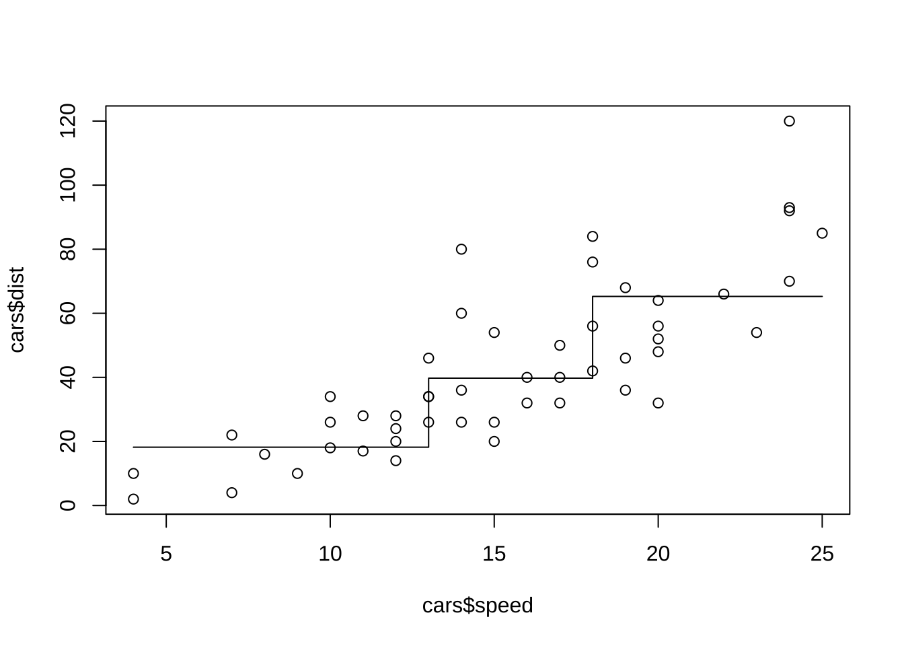


```r
# テストデータに対する予測値 (外挿予測)
predict(cars_rp, newdata = testdat)
#>        1        2        3 
#> 18.20000 18.20000 65.26316
```


```r
# 観測値, 線形回帰の適合値, 回帰木の適合値
data.frame(cars, cars_pred, cars_rp_fitted)
#>    speed dist cars_pred cars.speed cars_rp_pred
#> 1      4    2 -1.849460          4     18.20000
#> 2      4   10 -1.849460          4     18.20000
#> 3      7    4  9.947766          7     18.20000
#> 4      7   22  9.947766          7     18.20000
#> 5      8   16 13.880175          8     18.20000
#> 6      9   10 17.812584          9     18.20000
#> 7     10   18 21.744993         10     18.20000
#> 8     10   26 21.744993         10     18.20000
#> 9     10   34 21.744993         10     18.20000
#> 10    11   17 25.677401         11     18.20000
#> 11    11   28 25.677401         11     18.20000
#> 12    12   14 29.609810         12     18.20000
#> 13    12   20 29.609810         12     18.20000
#> 14    12   24 29.609810         12     18.20000
#> 15    12   28 29.609810         12     18.20000
#> 16    13   26 33.542219         13     39.75000
#> 17    13   34 33.542219         13     39.75000
#> 18    13   34 33.542219         13     39.75000
#> 19    13   46 33.542219         13     39.75000
#> 20    14   26 37.474628         14     39.75000
#> 21    14   36 37.474628         14     39.75000
#> 22    14   60 37.474628         14     39.75000
#> 23    14   80 37.474628         14     39.75000
#> 24    15   20 41.407036         15     39.75000
#> 25    15   26 41.407036         15     39.75000
#> 26    15   54 41.407036         15     39.75000
#> 27    16   32 45.339445         16     39.75000
#> 28    16   40 45.339445         16     39.75000
#> 29    17   32 49.271854         17     39.75000
#> 30    17   40 49.271854         17     39.75000
#> 31    17   50 49.271854         17     39.75000
#> 32    18   42 53.204263         18     65.26316
#> 33    18   56 53.204263         18     65.26316
#> 34    18   76 53.204263         18     65.26316
#> 35    18   84 53.204263         18     65.26316
#> 36    19   36 57.136672         19     65.26316
#> 37    19   46 57.136672         19     65.26316
#> 38    19   68 57.136672         19     65.26316
#> 39    20   32 61.069080         20     65.26316
#> 40    20   48 61.069080         20     65.26316
#> 41    20   52 61.069080         20     65.26316
#> 42    20   56 61.069080         20     65.26316
#> 43    20   64 61.069080         20     65.26316
#> 44    22   66 68.933898         22     65.26316
#> 45    23   54 72.866307         23     65.26316
#> 46    24   70 76.798715         24     65.26316
#> 47    24   92 76.798715         24     65.26316
#> 48    24   93 76.798715         24     65.26316
#> 49    24  120 76.798715         24     65.26316
#> 50    25   85 80.731124         25     65.26316
```

## 回帰木
### データセット2: 米國株価指数データ (再掲) {-}

```
- Smarket: S&P500日次%リターン5年分
   - Year  観測値の記録年 (2001--2005)
   - Lag1  前日の%リターン
   - Lag2  2日前の%リターン
   - Lag3  3日前の%リターン
   - Lag4  4日前の%リターン
   - Lag5  5日前の%リターン
   - Volume  取引量 (日次取引株式数, 単位十億枚)
   - Today 当日の%リターン
   - Direction 相場の方向性 (Down/Up, 2-水準因子)
```

8.2, 8.3は, 決定木の動作を確認し, その特性を理解することを目的とする.
決定木の機能である, データセットの分類規則の生成にフォーカスし,
データセットは学習用・予測用に2分割せず全てを使って学習させる.
ここでは, 容易でないタスク (株価予測) を決定木で行うが, 
予測力についてはいまは議論しない.


```r
library(ISLR)
head(Smarket)
#>   Year   Lag1   Lag2   Lag3   Lag4   Lag5 Volume  Today Direction
#> 1 2001  0.381 -0.192 -2.624 -1.055  5.010 1.1913  0.959        Up
#> 2 2001  0.959  0.381 -0.192 -2.624 -1.055 1.2965  1.032        Up
#> 3 2001  1.032  0.959  0.381 -0.192 -2.624 1.4112 -0.623      Down
#> 4 2001 -0.623  1.032  0.959  0.381 -0.192 1.2760  0.614        Up
#> 5 2001  0.614 -0.623  1.032  0.959  0.381 1.2057  0.213        Up
#> 6 2001  0.213  0.614 -0.623  1.032  0.959 1.3491  1.392        Up
```

- 回帰木の構築
`Smarket`を使って, 回帰木を構築する.
回帰木では当日の%リターン`Today`を目的変数とする.
`Smarket`には, 当日の相場の上下の方向性を示す
量的変数`Direction`が含まれているが, これは`Today`の予測変数に
使えないため除去する. 記録年である`Year`も当日のリターン予測には
(常識的に考えて) 使えないので除く.
`Volume`は. `Today`と同じタイミングで得られる情報であるため,
ここでは予測変数からは除いておくが, ラグ変数にするなどの工夫を
すれば使っても良い.


```r
library(tidyverse)
sp500 <- Smarket %>%
  dplyr::select(-Year, -Direction, -Volume)
# Volumeは当日情報のため, 除いておく → 日付をずらせば加えても良い
# sp500$Vol_lag1 <- dplyr::lead(Smarket$Volume, n = 1)
```

- 回帰木の適合

```r
sp_rp <- rpart(Today ~ ., data = sp500)
sp_rp
#> n= 1250 
#> 
#> node), split, n, deviance, yval
#>       * denotes terminal node
#> 
#> 1) root 1250 1612.77800  0.00313840  
#>   2) Lag5>=-2.892 1236 1528.47500 -0.01281958 *
#>   3) Lag5< -2.892 14   56.19987  1.41200000 *
#
sp_rp <- rpart(Today ~ ., data = sp500, control = rpart.control(cp = 0.008))
sp_rp
#> n= 1250 
#> 
#> node), split, n, deviance, yval
#>       * denotes terminal node
#> 
#> 1) root 1250 1612.77800  0.00313840  
#>   2) Lag5>=-2.892 1236 1528.47500 -0.01281958 *
#>   3) Lag5< -2.892 14   56.19987  1.41200000 *
#
sp_rp <- rpart(Today ~ ., data = sp500, control = rpart.control(cp = 0.0079))
# rpart.control(minsplit = 20, minbucket = round(minsplit/3), cp = 0.01,
# maxcompete = 4, maxsurrogate = 5, usesurrogate = 2, xval = 10, surrogatestyle
# = 0, maxdepth = 30, ...)  method: 'anova', 'poisson', 'class' or 'exp'
sp_rp
#> n= 1250 
#> 
#> node), split, n, deviance, yval
#>       * denotes terminal node
#> 
#>  1) root 1250 1612.77800  0.00313840  
#>    2) Lag5>=-2.892 1236 1528.47500 -0.01281958  
#>      4) Lag1>=0.2225 502  549.98260 -0.12242230 *
#>      5) Lag1< 0.2225 734  968.33720  0.06214033  
#>       10) Lag2>=-0.291 496  567.84910 -0.02306048 *
#>       11) Lag2< -0.291 238  389.38390  0.23970170  
#>         22) Lag5< -1.7375 15   49.41417 -0.80153330 *
#>         23) Lag5>=-1.7375 223  322.61330  0.30973990 *
#>    3) Lag5< -2.892 14   56.19987  1.41200000 *
```

- 得られた回帰木の可視化

```r
# 可視化
library(rpart.plot)
rpart.plot(sp_rp, digit = 3)
```

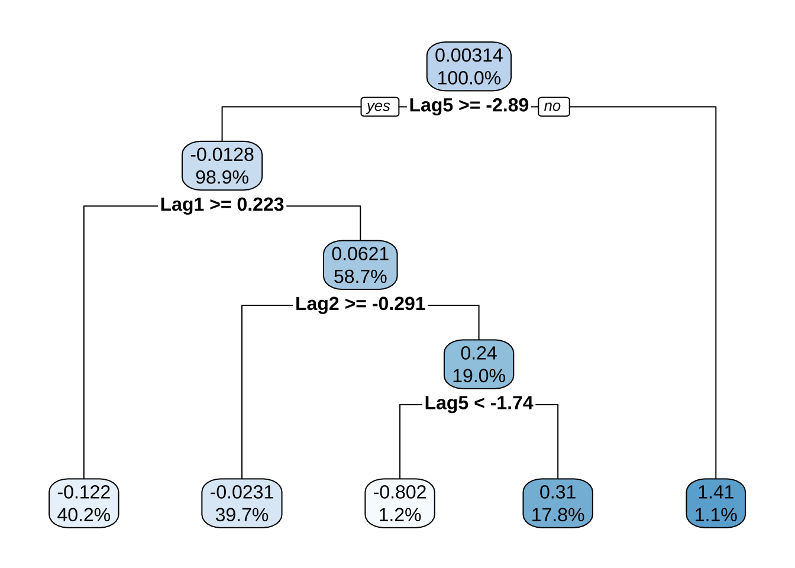

```r
rpart.plot(sp_rp, digit = 4, fallen.leaves = T, type = 3, extra = 101)
```

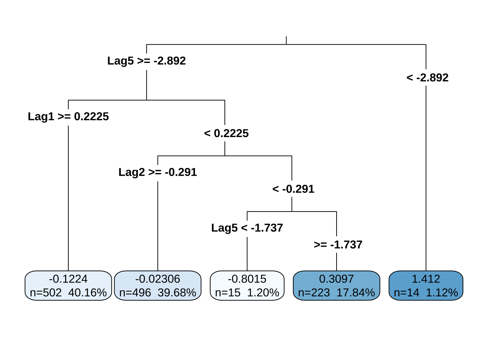

- CP表 (Complexity Parameter Table)

```r
# CP値 vs 交差検証 (CV) 予測誤差
printcp(sp_rp)
#> 
#> Regression tree:
#> rpart(formula = Today ~ ., data = sp500, control = rpart.control(cp = 0.0079))
#> 
#> Variables actually used in tree construction:
#> [1] Lag1 Lag2 Lag5
#> 
#> Root node error: 1612.8/1250 = 1.2902
#> 
#> n= 1250 
#> 
#>          CP nsplit rel error xerror     xstd
#> 1 0.0174254      0   1.00000 1.0036 0.059497
#> 2 0.0079811      1   0.98257 1.0300 0.062702
#> 3 0.0079000      4   0.95863 1.1140 0.065588
plotcp(sp_rp)
```

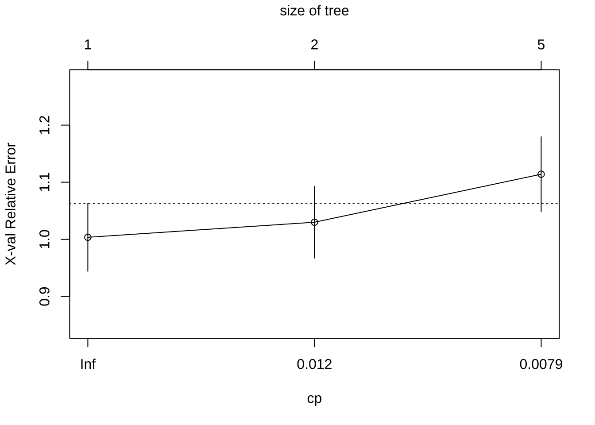
`plotcp()`は, 木の複雑度 (CP)  (横軸) に対する
交差検証 (CV) 予測誤差の大きさ (縦軸) をプロットした図であり,
通常, 閾値 
(点線で表される水平線. フルに成長した剪定前の木の持つ誤差の大きさ) を下回る最初のcpの値を
選択するのが望ましいとされる.

上で得られた図は, cp (横軸) が増えると, 
交差検証誤差の大きさ (縦軸) が上がる,
すなわち, 木を複雑にすると予測誤差が悪化するを示している.

木のサイズが1または2の時に点線を下回っているのみで, 
1から2になると若干だが誤差は大きくなっており,
データセットを分割することの説得性がこの図からは得らない.
株価予測の難しさを反映していると考えられる.


```r
# 手動による剪定例 cp (complex parameter) の大きさでコントロール
prn_rp <- prune(sp_rp, cp = 0.008)
plot(prn_rp, uniform = T, margin = 0.05)
text(prn_rp, all = T, use.n = T)
```

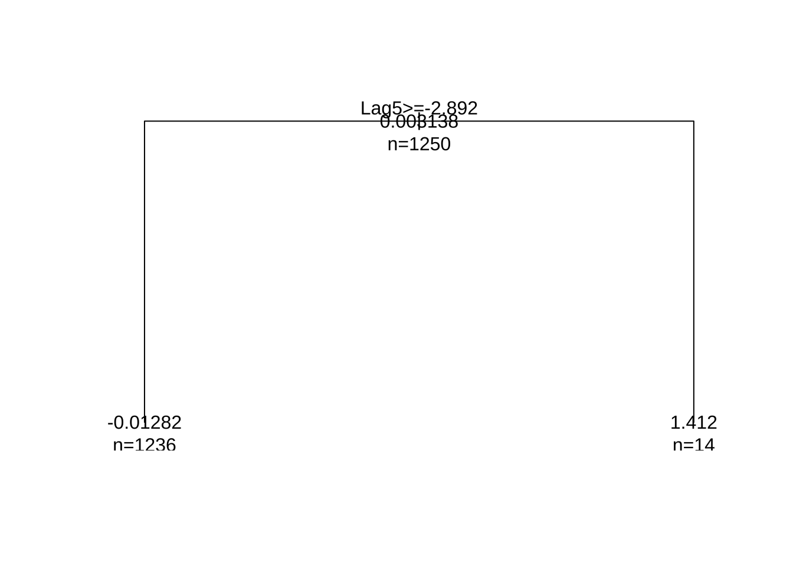

- パフォーマンス評価 (内挿予測)


**自主課題**
上で得られた決定木を解釈してみよう.

## 分類木
同じ `Smarket`を使って, 分類木を構築する.
回帰木では当日の%リターン`Today`を目的変数としていたが,
ここでは, 量的変数`Direction`を目的変数に設定する.
`Direction`は, `Today`を使って作られていることから,
`Today`を予測変数に使わないように`Year`, `Volume`と共に除く.

```r
sp500_2 <- Smarket %>%
  dplyr::select(-Year, -Today, -Volume)
# sp500_2$Vol_lag1 <- dplyr::lead(Smarket$Volume, n = 1)
```

- 分類木の適合

```r
sp2_rp <- rpart(Direction ~ ., data = sp500_2)
sp2_rp
#> n= 1250 
#> 
#> node), split, n, loss, yval, (yprob)
#>       * denotes terminal node
#> 
#>  1) root 1250 602 Up (0.4816000 0.5184000)  
#>    2) Lag1>=0.0555 610 286 Down (0.5311475 0.4688525)  
#>      4) Lag1< 0.1375 50  14 Down (0.7200000 0.2800000) *
#>      5) Lag1>=0.1375 560 272 Down (0.5142857 0.4857143)  
#>       10) Lag2>=0.635 118  45 Down (0.6186441 0.3813559) *
#>       11) Lag2< 0.635 442 215 Up (0.4864253 0.5135747)  
#>         22) Lag4>=1.1645 53  18 Down (0.6603774 0.3396226) *
#>         23) Lag4< 1.1645 389 180 Up (0.4627249 0.5372751)  
#>           46) Lag4< 0.833 363 174 Up (0.4793388 0.5206612)  
#>             92) Lag2< -0.5965 134  60 Down (0.5522388 0.4477612) *
#>             93) Lag2>=-0.5965 229 100 Up (0.4366812 0.5633188) *
#>           47) Lag4>=0.833 26   6 Up (0.2307692 0.7692308) *
#>    3) Lag1< 0.0555 640 278 Up (0.4343750 0.5656250)  
#>      6) Lag5< -0.8225 128  57 Down (0.5546875 0.4453125)  
#>       12) Lag4< 1.3205 111  44 Down (0.6036036 0.3963964) *
#>       13) Lag4>=1.3205 17   4 Up (0.2352941 0.7647059) *
#>      7) Lag5>=-0.8225 512 207 Up (0.4042969 0.5957031)  
#>       14) Lag2>=0.7265 101  49 Down (0.5148515 0.4851485)  
#>         28) Lag2< 1.097 39  11 Down (0.7179487 0.2820513) *
#>         29) Lag2>=1.097 62  24 Up (0.3870968 0.6129032) *
#>       15) Lag2< 0.7265 411 155 Up (0.3771290 0.6228710) *
```

- 得られた分類木の可視化 

```r
# 決定木の可視化
rpart.plot(sp2_rp, digit = 3)
```

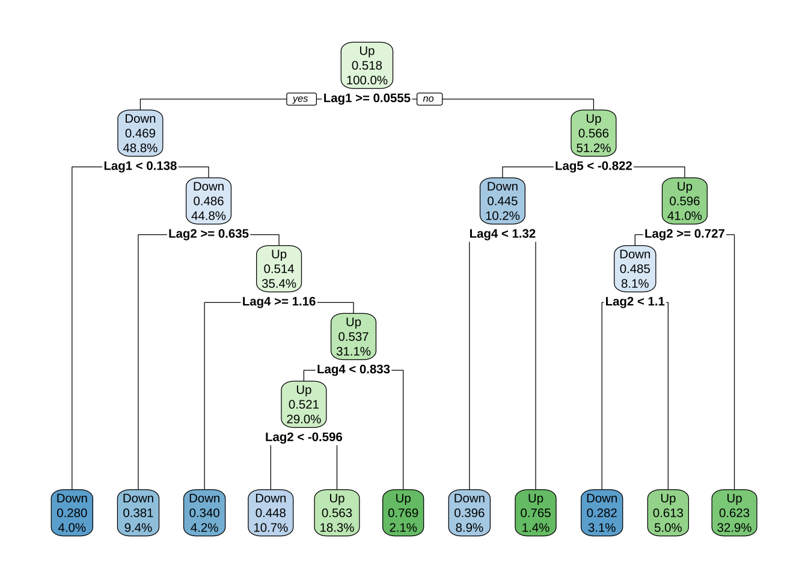

```r
rpart.plot(sp2_rp, digit = 4, fallen.leaves = T, type = 3, extra = 101)
```

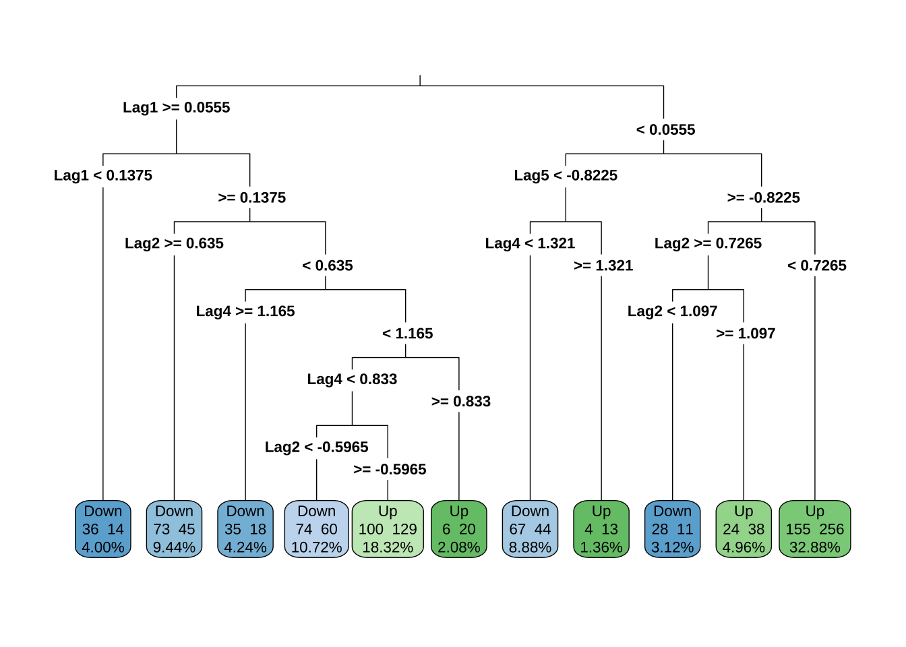

- CP表 (Complexity Parameter Table)

```r
# CP値 vs 交差検証 (CV) 予測誤差
printcp(sp2_rp)
#> 
#> Classification tree:
#> rpart(formula = Direction ~ ., data = sp500_2)
#> 
#> Variables actually used in tree construction:
#> [1] Lag1 Lag2 Lag4 Lag5
#> 
#> Root node error: 602/1250 = 0.4816
#> 
#> n= 1250 
#> 
#>         CP nsplit rel error xerror     xstd
#> 1 0.063123      0   1.00000 1.0000 0.029345
#> 2 0.023256      1   0.93688 1.0050 0.029350
#> 3 0.016058      2   0.91362 1.0166 0.029359
#> 4 0.014950      5   0.86545 1.0332 0.029365
#> 5 0.014120      6   0.85050 1.0299 0.029364
#> 6 0.011628      8   0.82226 1.0299 0.029364
#> 7 0.010000     10   0.79900 1.0150 0.029358
plotcp(sp2_rp)
```

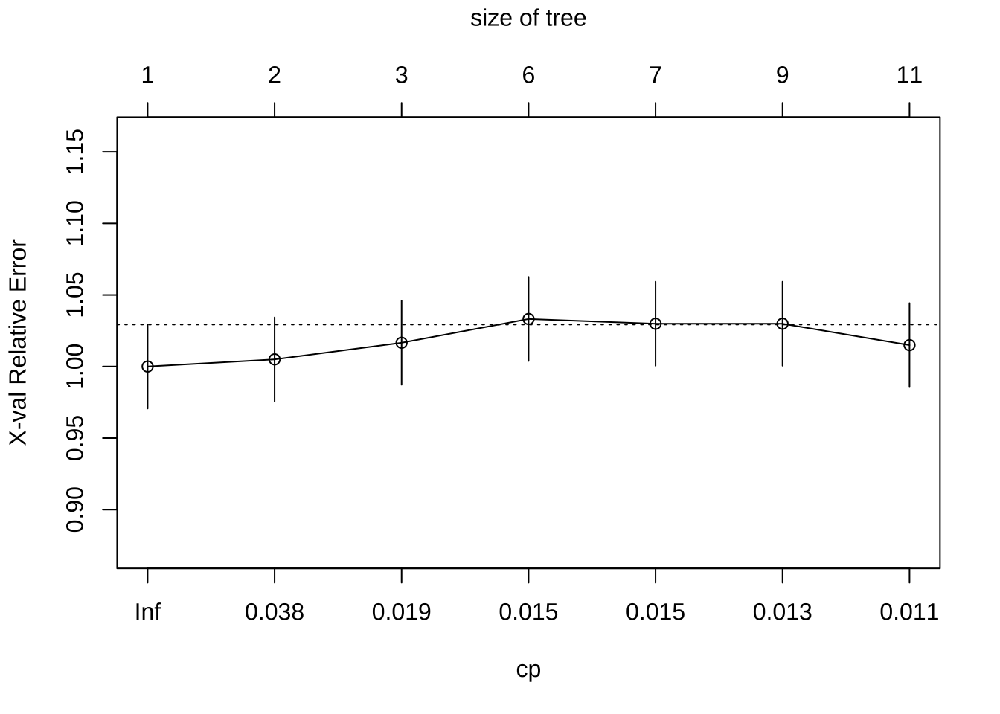
上の図は, cp (横軸) が増えても, 
交差検証予測誤差の大きさ (縦軸) が点線の回りで上下するだけで
大きな変化が見られない,
すなわち, 木の複雑度を変えても適合が改善しないことを示している.
やはり, 株価予測 (実質的にランダム) を行っていることに
よる帰結だと考えられる.

- パフォーマンス評価 (内挿予測)

```r
# クラス分類の内挿予測
pcls_sp_rp <- predict(sp2_rp, sp500_2, type = "class")  # クラス分類の予測結果出力

# 正解率
mean(pcls_sp_rp == sp500_2$Direction)
#> [1] 0.6152

# 混同行列
tbl_rp <- table(pcls_sp_rp, sp500_2$Direction)
```

**自主課題**
上で得られた決定木 (分類規則) を解釈してみよう.


パッケージ**caret**の関数`confusionMatrix()`を使って,
混同行列より各種評価指標を計算する.
2種類の表示モードで結果を示す:
- 適合率 (precision) - 再現率 (recall) 表示
- 感度(sensitivity) - 特異度 (specificity) 表示

```r
library(caret)
# 適合率 (precision) - 再現率 (recall) 表示
confusionMatrix(tbl_rp, mode = "prec_recall")
#> Confusion Matrix and Statistics
#> 
#>           
#> pcls_sp_rp Down  Up
#>       Down  313 192
#>       Up    289 456
#>                                           
#>                Accuracy : 0.6152          
#>                  95% CI : (0.5876, 0.6423)
#>     No Information Rate : 0.5184          
#>     P-Value [Acc > NIR] : 3.483e-12       
#>                                           
#>                   Kappa : 0.2249          
#>                                           
#>  Mcnemar's Test P-Value : 1.202e-05       
#>                                           
#>               Precision : 0.6198          
#>                  Recall : 0.5199          
#>                      F1 : 0.5655          
#>              Prevalence : 0.4816          
#>          Detection Rate : 0.2504          
#>    Detection Prevalence : 0.4040          
#>       Balanced Accuracy : 0.6118          
#>                                           
#>        'Positive' Class : Down            
#> 
# 感度(sensitivity) - 特異度 (specificity) 表示
confusionMatrix(tbl_rp)  # mode = 'sens_spec' (デフォルト)
#> Confusion Matrix and Statistics
#> 
#>           
#> pcls_sp_rp Down  Up
#>       Down  313 192
#>       Up    289 456
#>                                           
#>                Accuracy : 0.6152          
#>                  95% CI : (0.5876, 0.6423)
#>     No Information Rate : 0.5184          
#>     P-Value [Acc > NIR] : 3.483e-12       
#>                                           
#>                   Kappa : 0.2249          
#>                                           
#>  Mcnemar's Test P-Value : 1.202e-05       
#>                                           
#>             Sensitivity : 0.5199          
#>             Specificity : 0.7037          
#>          Pos Pred Value : 0.6198          
#>          Neg Pred Value : 0.6121          
#>              Prevalence : 0.4816          
#>          Detection Rate : 0.2504          
#>    Detection Prevalence : 0.4040          
#>       Balanced Accuracy : 0.6118          
#>                                           
#>        'Positive' Class : Down            
#> 
```

パッケージ**caret**は, 多種多様な機械学習アルゴリズムを統一的な環境で
実行し比較できる環境を提供する.
サポートベクターマシン (SVM), 勾配ブースティング, ランダムフォレスト, 
ニューラルネット, ..., など多様な手法・アルゴリズムをサポートする.

以上の`Smarket`を用いた決定木分析での留意点として, 以下が挙げられる.

- 連続変数を分割する点の妥当性 (ロバストか?)
- → 離散変数 (特に2値) に変換するか?
- Volumeのラグ変数を加えるか? (そのままでは不可)

