# アンサンブル学習


## 決定木 (分類木)
前章では, パッケージ**rpart**の関数`rpart()`を使用したが,
ここでは, 別のパッケージ**tree**の関数`tree()`を使用する.

### データセット3: 個人ローン信用データ (再掲) {-}
データセットは, german creditデータを使用する.
目的変数としては, 個人の2水準 {Bad, Good} の信用状態を示す
変数である`Customer`を選択し, これを予測するモデルを
決定木により構築する.

```
データ入手先: https://archive.ics.uci.edu/dataset/144/statlog+german+credit+data
※ 授業用に一部修正
```


```r
credit_df <- read.csv("german_credit_modified.csv", header = T, skip = 3, quote = "",
  stringsAsFactors = T)
# 目的変数(Customer)はfactor型にしないとエラー発生: stringsAsFactors =
# Tを指定のこと
str(credit_df)
#> 'data.frame':	1000 obs. of  21 variables:
#>  $ StatusAccount   : Factor w/ 4 levels "ge_200DM","lt_0DM",..: 2 3 4 2 2 4 4 3 4 3 ...
#>  $ DurationMonth   : int  6 48 12 42 24 36 24 36 12 30 ...
#>  $ CreditHistory   : Factor w/ 5 levels "A","B","C","D",..: 5 3 5 3 4 3 3 3 3 5 ...
#>  $ Purpose         : Factor w/ 6 levels "TV_etc","business",..: 1 1 4 1 3 4 1 3 1 3 ...
#>  $ CreditAmount    : int  1169 5951 2096 7882 4870 9055 2835 6948 3059 5234 ...
#>  $ SavingsAccount  : Factor w/ 4 levels "ge_1000DM","lt_1000DM",..: NA 3 3 3 3 NA 2 3 1 3 ...
#>  $ EmploymentSince : Factor w/ 5 levels "ge_7yrs","lt_1yr",..: 1 3 4 4 3 3 1 3 4 5 ...
#>  $ InstallmentRate : int  4 2 2 2 3 2 3 2 2 4 ...
#>  $ StatusAndSex    : Factor w/ 4 levels "F_divorced","M_divorced",..: 4 1 4 4 4 4 4 4 2 3 ...
#>  $ Guarantors      : Factor w/ 3 levels "co-applicant",..: 3 3 3 2 3 3 3 3 3 3 ...
#>  $ ResidenceSince  : int  4 2 3 4 4 4 4 2 4 2 ...
#>  $ Property        : Factor w/ 3 levels "car_etc","life_insurance",..: 3 3 3 2 NA NA 2 1 3 1 ...
#>  $ Age             : int  67 22 49 45 53 35 53 35 61 28 ...
#>  $ InstallmentPlans: Factor w/ 3 levels "bank","none",..: 2 2 2 2 2 2 2 2 2 2 ...
#>  $ Housing         : Factor w/ 3 levels "free","own","rent": 2 2 2 1 1 1 2 3 2 2 ...
#>  $ NCredits        : int  2 1 1 1 2 1 1 1 1 2 ...
#>  $ Job             : Factor w/ 4 levels "management","skilled",..: 2 2 4 2 2 4 2 1 4 1 ...
#>  $ NPeopleMain     : int  1 1 2 2 2 2 1 1 1 1 ...
#>  $ Phone           : Factor w/ 2 levels "no","yes": 2 1 1 1 1 2 1 2 1 1 ...
#>  $ ForeignWorker   : Factor w/ 2 levels "no","yes": 2 2 2 2 2 2 2 2 2 2 ...
#>  $ Customer        : Factor w/ 2 levels "bad","good": 2 1 2 2 1 2 2 2 2 1 ...
```

欠損値の有無を確認し, 必要な処理を行う.
今回の分析では, 欠損値は補間せずにレコードごと除去することにする.


```r
library(Amelia)
missmap(credit_df, col = c("yellow", "black"), y.at = 1, y.labels = "", legend = TRUE)  # Amelia
```

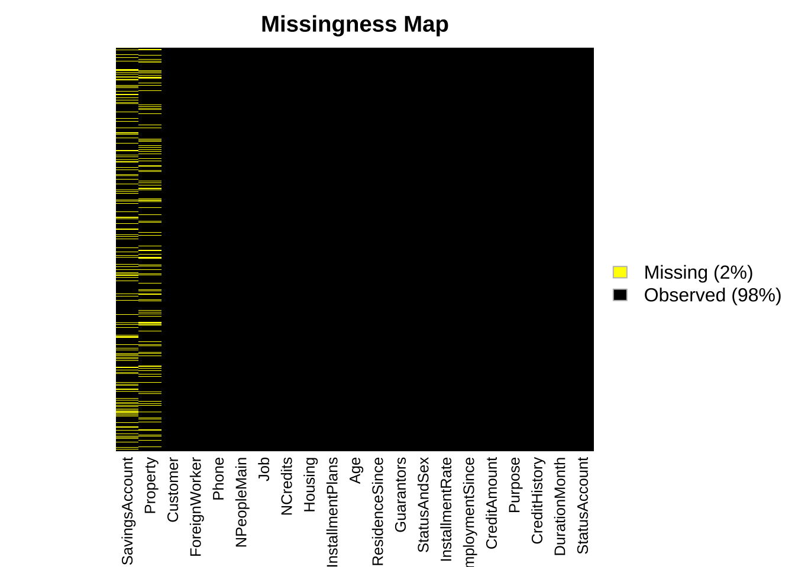

```r

# 欠損値処理 → 今回は除去
ok <- complete.cases(credit_df)  # 欠損値を持つ項目のないcase (データ点)はT, さもなくばFを返す
credit_df_noNA <- credit_df[ok, ]
```

なお, 以下で使用する`randomForest()`や`gbm()`に対しては不要であるが, 関数によっては, データフレーム内にある factor型を持つ質的変数はそのままでは受け付けずに, 
一旦ダミー変数に変換する必要のあるものもある.

```r
# model.matrixは, 質的変数　→ ダミー化
x <- model.matrix(Customer ~ ., credit_df_noNA)[, -1]  # factorのdummy変数化 + (intercept)を除去
y <- credit_df_noNA$Customer
# 以下のtree関数, randomForest関数, gbm関数は, factor型変数の使用可
# (ダミー化は不要)
```

- 学習データ/ テストデータの分割

```r
set.seed(1)
train <- sample(1:nrow(credit_df_noNA), 500)
# x.train <- x[train, ] y.train <- y[train]
```

- 決定木の構築
パッケージ**tree**を読み込み, 関数`tree()`を用いて分類木を構築する.


```r
# パッケージtree, 関数tree()の使用
library(tree)  # tree, cv.tree, prune.tree
fit_tree <- tree(Customer ~ ., data = credit_df_noNA, subset = train)
# split = 'gini' (デフォルト'deviance))
summary(fit_tree)
#> 
#> Classification tree:
#> tree(formula = Customer ~ ., data = credit_df_noNA, subset = train)
#> Variables actually used in tree construction:
#>  [1] "StatusAccount"    "DurationMonth"    "Guarantors"       "Property"        
#>  [5] "Age"              "SavingsAccount"   "CreditHistory"    "EmploymentSince" 
#>  [9] "Purpose"          "InstallmentPlans" "InstallmentRate" 
#> Number of terminal nodes:  14 
#> Residual mean deviance:  0.9171 = 445.7 / 486 
#> Misclassification error rate: 0.228 = 114 / 500
fit_tree
#> node), split, n, deviance, yval, (yprob)
#>       * denotes terminal node
#> 
#>  1) root 500 619.100 good ( 0.31000 0.69000 )  
#>    2) StatusAccount: lt_0DM,lt_200DM 272 373.300 good ( 0.44118 0.55882 )  
#>      4) DurationMonth < 15.5 120 146.600 good ( 0.30000 0.70000 )  
#>        8) Guarantors: co-applicant,none 104 134.200 good ( 0.34615 0.65385 )  
#>         16) Property: car_etc,life_insurance 61  84.150 good ( 0.45902 0.54098 ) *
#>         17) Property: real_estate 43  41.320 good ( 0.18605 0.81395 ) *
#>        9) Guarantors: guarantor 16   0.000 good ( 0.00000 1.00000 ) *
#>      5) DurationMonth > 15.5 152 209.000 bad ( 0.55263 0.44737 )  
#>       10) Age < 62 147 200.800 bad ( 0.57143 0.42857 )  
#>         20) SavingsAccount: lt_1000DM,lt_100DM 123 163.600 bad ( 0.61789 0.38211 ) *
#>         21) SavingsAccount: ge_1000DM,lt_500DM 24  30.550 good ( 0.33333 0.66667 )  
#>           42) CreditHistory: A,C 15  20.730 bad ( 0.53333 0.46667 )  
#>             84) Age < 27 6   0.000 bad ( 1.00000 0.00000 ) *
#>             85) Age > 27 9   9.535 good ( 0.22222 0.77778 ) *
#>           43) CreditHistory: B,D,E 9   0.000 good ( 0.00000 1.00000 ) *
#>       11) Age > 62 5   0.000 good ( 0.00000 1.00000 ) *
#>    3) StatusAccount: ge_200DM,none 228 195.500 good ( 0.15351 0.84649 )  
#>      6) EmploymentSince: lt_1yr,unemployed 48  61.110 good ( 0.33333 0.66667 )  
#>       12) Purpose: business,repairs 8   6.028 bad ( 0.87500 0.12500 ) *
#>       13) Purpose: TV_etc,car,education 40  42.650 good ( 0.22500 0.77500 ) *
#>      7) EmploymentSince: ge_7yrs,lt_4yrs,lt_7yrs 180 121.400 good ( 0.10556 0.89444 )  
#>       14) InstallmentPlans: bank,store 33  38.670 good ( 0.27273 0.72727 ) *
#>       15) InstallmentPlans: none 147  73.060 good ( 0.06803 0.93197 )  
#>         30) CreditHistory: C,D 79  56.030 good ( 0.11392 0.88608 )  
#>           60) InstallmentRate < 3.5 49  16.710 good ( 0.04082 0.95918 ) *
#>           61) InstallmentRate > 3.5 30  32.600 good ( 0.23333 0.76667 ) *
#>         31) CreditHistory: A,B,E 68  10.420 good ( 0.01471 0.98529 ) *
# 木の表示
plot(fit_tree)
text(fit_tree, pretty = 0)
```

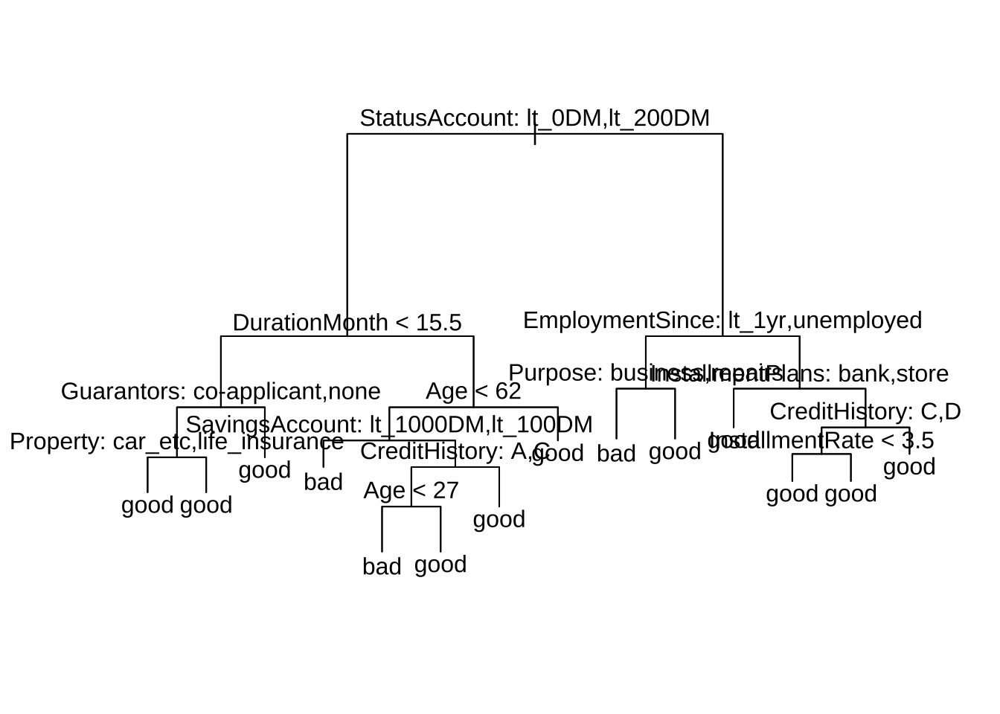

- 木の成長のコントロール (停止条件の設定)
`tree()`によって生成する木の大きさは, `tree.control()`によってコントロールすることが出来る.
指定した条件に引っ掛かりそれ以上分割するノードが
なくなった時点でアルゴリズムが終了する.

```
tree.control(): 木の成長をコントロールするパラメータ (特に, mincutとminsize) の設定
- usage: tree.control(nobs, mincut = 5, minsize = 10, mindev = 0.01)
- 主なパラメータ:
  - nobs    学習セットの観測数
  - mincut    各ノードを分割するために必要な最小観測数. 最大で minsize/2 まで. 値が小さいほど, より細かい分割が行われる (デフォルト=5)
  - minsize   末端ノードのサイズの最小値. 値が大きいと, ツリーは浅くなる (デフォルト=10)
  - mindev    各ノードのノード内逸脱度 (within-node deviance)が, ルートノードの逸脱度に対して少なくともこの値の割合以上である場合にのみ, そのノードが分割されることを示す. 例. mindev=0.01の場合, ノードが分割されるためにはそのノードの逸脱度がルートノードの逸脱度の1%以上である必要があある. これにより, すでに十分小さい逸脱度を持つノードが無駄に分割されるのを防ぐ.
```


```r
# 決定木のコントロールパラメータの設定
control_params <- tree.control(nobs = nrow(credit_df_noNA), mincut = 3, minsize = 6,
  mindev = 0.01)

# 決定木の構築
fit_tree2 <- tree(Customer ~ ., data = credit_df_noNA, control = control_params)

# 決定木のプロット
plot(fit_tree2)
text(fit_tree2, pretty = 0)
```

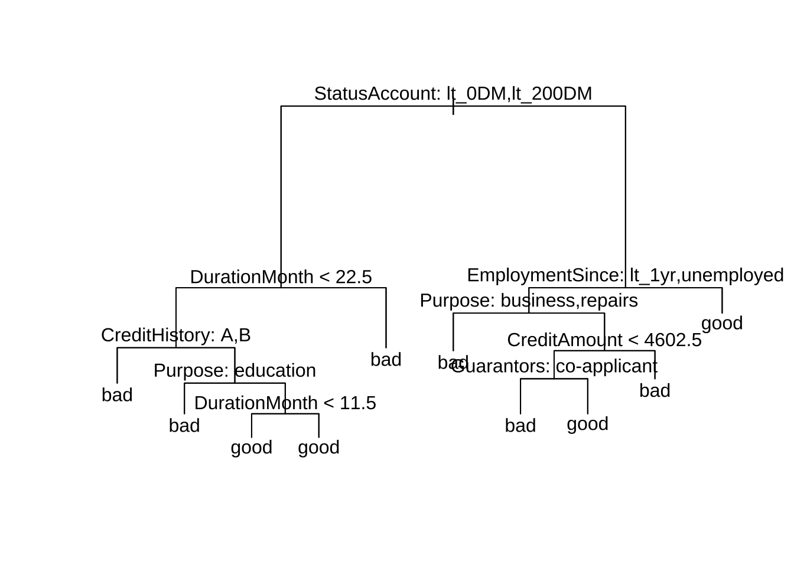

```r

# 決定木の詳細を表示
summary(fit_tree2)
#> 
#> Classification tree:
#> tree(formula = Customer ~ ., data = credit_df_noNA, control = control_params)
#> Variables actually used in tree construction:
#> [1] "StatusAccount"   "DurationMonth"   "CreditHistory"   "Purpose"        
#> [5] "EmploymentSince" "CreditAmount"    "Guarantors"     
#> Number of terminal nodes:  10 
#> Residual mean deviance:  0.9739 = 667.1 / 685 
#> Misclassification error rate: 0.2245 = 156 / 695
```

- 木の剪定

関数`cv.tree()`を使えば,
交差検証 (CV) による最適な木の大きさを見つけることができる.

```r
# 木の剪定がパフォーマンスを改善するか?  交差検証により木
# (の複雑度パラメータcp) を選択する場合 (cv.treeから,
# prune.treeを呼び出して実行)
set.seed(1)
cvfit_tree <- cv.tree(fit_tree)  # デフォルト: method = 'deviance', 10-folds CV
plot(cvfit_tree$size, cvfit_tree$dev, type = "b")  # index of tree with minimum error
```

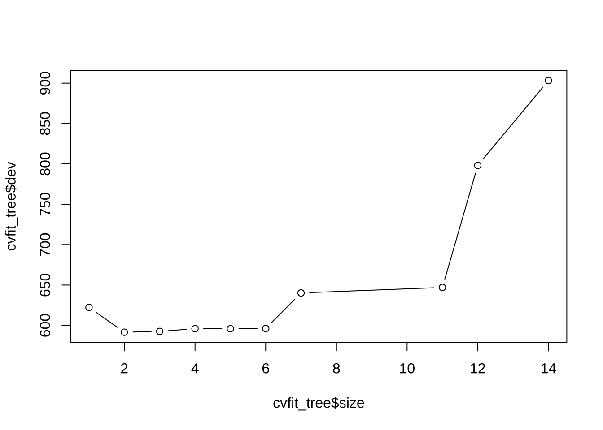

```r
cvfit_tree$size[which.min(cvfit_tree$dev)]  # 末端ノードの数
#> [1] 2
```

→ デフォルトのmethod = "deviance"では, size = 2が最良 (単純過ぎ?).


```r
cvfit_tree <- cv.tree(fit_tree, method = "misclass")  # 
cvfit_tree$size[which.min(cvfit_tree$dev)]  # 末端ノードの数
#> [1] 5
```

→ method = "misclass"を選ぶと, size = 3が最良となる.

関数`prune.tree()`を使い, 手動で木を剪定することもできる.
```
prune.tree()の主なパラメータ:
- k   cp (cost-complexity parameter) パラメータ
- best    (希望する) 木のサイズ (末端ノード数). (kを指定する代わりに指定可) 
- method    ノードの非均一性の指標. デフォルト="deviance". 回帰木は"deviance"のみ. 分類木では"misclass" (誤分類の数) も選択可能
```

```r
# prune.tree関数による剪定 prn_tree <- prune.tree(fit_tree, k = 11)\t\t\t# k:
# cost-complexity parameter, または, bestの指定
prn_tree <- prune.tree(fit_tree, method = "misclass", best = 8)  # best: 末端ノード数
summary(prn_tree)
#> 
#> Classification tree:
#> snip.tree(tree = fit_tree, nodes = c(4L, 7L))
#> Variables actually used in tree construction:
#> [1] "StatusAccount"   "DurationMonth"   "Age"             "SavingsAccount" 
#> [5] "CreditHistory"   "EmploymentSince" "Purpose"        
#> Number of terminal nodes:  9 
#> Residual mean deviance:  0.9976 = 489.8 / 491 
#> Misclassification error rate: 0.228 = 114 / 500
plot(prn_tree)  # 'deviance'/'msiclass'で結果が異なる. cvとも異なる
text(prn_tree, pretty = 0)
```

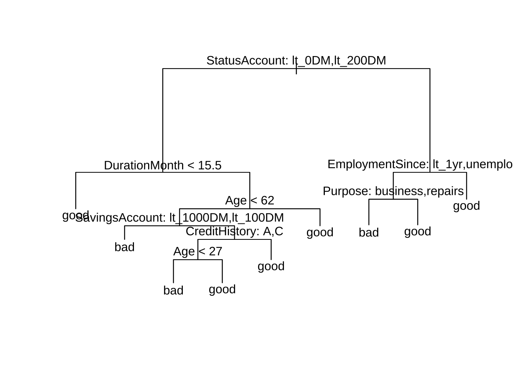

- テスト用データセットを用いて外挿予測
ここでは, 適合された木 (剪定なし) を用いて, テスト用データに対する予測を行う.
デフォルトでは`predict()`は確率を出力してしまうため,
ここではを引数`type=class`を指定する.

```r
# yhat_tree <- predict(fit_tree, newdata = credit_df_noNA[-train, ])\t\t# -->
# 確率
yhat_tree <- predict(fit_tree, newdata = credit_df_noNA[-train, ], type = "class")  # --> good/bad
```

- 混同行列によるパフォーマンス評価

混同行列を作成し, パッケージ**caret**に含まれる関数`confusionMatrix()`を使用して,
各種パフォーマンス指標を計算する. この関数の出力オブジェクトから,
accuracyや, F1 ("F尺度") 等の特定の指標の値を取り出すことが出来る.

```r
(tbl_tree <- table(yhat_tree, credit_df_noNA$Customer[-train]))
#>          
#> yhat_tree bad good
#>      bad   24   22
#>      good  29  120
library(caret)  # confusionMatrix
confusionMatrix(tbl_tree, mode = "prec_recall")
#> Confusion Matrix and Statistics
#> 
#>          
#> yhat_tree bad good
#>      bad   24   22
#>      good  29  120
#>                                           
#>                Accuracy : 0.7385          
#>                  95% CI : (0.6709, 0.7986)
#>     No Information Rate : 0.7282          
#>     P-Value [Acc > NIR] : 0.4091          
#>                                           
#>                   Kappa : 0.3108          
#>                                           
#>  Mcnemar's Test P-Value : 0.4008          
#>                                           
#>               Precision : 0.5217          
#>                  Recall : 0.4528          
#>                      F1 : 0.4848          
#>              Prevalence : 0.2718          
#>          Detection Rate : 0.1231          
#>    Detection Prevalence : 0.2359          
#>       Balanced Accuracy : 0.6490          
#>                                           
#>        'Positive' Class : bad             
#> 
(confusionMatrix(tbl_tree)$overall["Accuracy"])
#>  Accuracy 
#> 0.7384615
(confusionMatrix(tbl_tree, mode = "prec_recall")$byClass["F1"])
#>        F1 
#> 0.4848485
```

→ 木の大きさを変えることで, 改善の余地がある.


## ランダムフォレスト分類木

パッケージ**randomForest**の関数`randomForest()`を使用する.

```
randomForest():
重要なパラメータ
- mtry: 各分割においてランダムに抽出される変数の数 (デフォルト: 分類はsqrt(p), 回帰はp/3)
- nodesize: 末端ノードの最小サイズ (大 → 小さな木)
- maxnodes: 末端ノードの最大個数
- ntree: 生成する木の数 (各レコードが複数回学習に使われるように, 小さくし過ぎない)
```

- ランダムフォレストの実行

```r
library(randomForest)
set.seed(1)
fit_rf <- randomForest(Customer ~ ., data = credit_df_noNA, subset = train, mtry = 6,
  importance = TRUE)
```
<!--
# mtryを指定しなければ, ランダムフォレストではなく, バギング (bagging)
#fit_rf <- randomForest(Customer ~ ., data = credit, subset = train, importance = TRUE)	# bagging (デフォルト)
-->

- テスト用データを用いて外挿予測

```r
yhat_rf <- predict(fit_rf, newdata = credit_df_noNA[-train, ])
#
summary(fit_rf)
#>                 Length Class  Mode     
#> call               6   -none- call     
#> type               1   -none- character
#> predicted        500   factor numeric  
#> err.rate        1500   -none- numeric  
#> confusion          6   -none- numeric  
#> votes           1000   matrix numeric  
#> oob.times        500   -none- numeric  
#> classes            2   -none- character
#> importance        80   -none- numeric  
#> importanceSD      60   -none- numeric  
#> localImportance    0   -none- NULL     
#> proximity          0   -none- NULL     
#> ntree              1   -none- numeric  
#> mtry               1   -none- numeric  
#> forest            14   -none- list     
#> y                500   factor numeric  
#> test               0   -none- NULL     
#> inbag              0   -none- NULL     
#> terms              3   terms  call
```

混同行列を作成し, accuracyや, F1 ("F尺度") の数値を取り出す.

```r
(tbl_rf <- table(yhat_rf, credit_df_noNA$Customer[-train]))
#>        
#> yhat_rf bad good
#>    bad   23   14
#>    good  30  128
(confusionMatrix(tbl_rf)$overall["Accuracy"])
#> Accuracy 
#> 0.774359
(confusionMatrix(tbl_rf, mode = "prec_recall")$byClass["F1"])
#>        F1 
#> 0.5111111
```
→ パラメータ・チューニング(mtry, nodesize/maxnodes等)より, 改善の余地有り

- 各変数の重要度

```r
# 各変数の重要度
importance(fit_rf)
#>                         bad       good MeanDecreaseAccuracy MeanDecreaseGini
#> StatusAccount    18.2406750 16.4946426           23.4101092       22.7732973
#> DurationMonth     8.6191619 13.7539806           16.8054128       23.4872569
#> CreditHistory     2.5123173  4.9885214            5.6602350       11.4384420
#> Purpose           3.9812876  2.0171391            3.7749554       11.7082009
#> CreditAmount      2.3306101  8.7839987            9.0502101       30.1623368
#> SavingsAccount    5.9954796 -0.1269385            3.5280400        6.7990910
#> EmploymentSince   1.8684738  4.4793237            4.8717406       14.4204958
#> InstallmentRate   1.0644703  4.4672097            4.1244434        8.9624679
#> StatusAndSex      1.7758577  0.4215884            1.4385134        8.8589038
#> Guarantors        4.8469105  8.1675310            9.0020391        5.6785251
#> ResidenceSince    1.0304818  0.4797195            1.0480306        8.7191197
#> Property         -1.4386017  7.7430478            5.3764627        8.0519616
#> Age               4.9327720  5.0869132            7.2074345       24.1410112
#> InstallmentPlans  1.2617704  1.7176788            2.0252865        5.9231219
#> Housing          -0.3777576  2.1536104            1.4887341        3.6019637
#> NCredits         -0.1365011  3.8979401            3.3878630        4.7944978
#> Job               0.9970704  3.4870177            3.6369344        7.0219383
#> NPeopleMain      -1.3613446  0.5956468           -0.1577331        2.4535740
#> Phone             1.8034420 -0.3854100            0.7655450        3.2441279
#> ForeignWorker     0.2520411 -1.6396991           -1.1523368        0.7819814
varImpPlot(fit_rf)
```

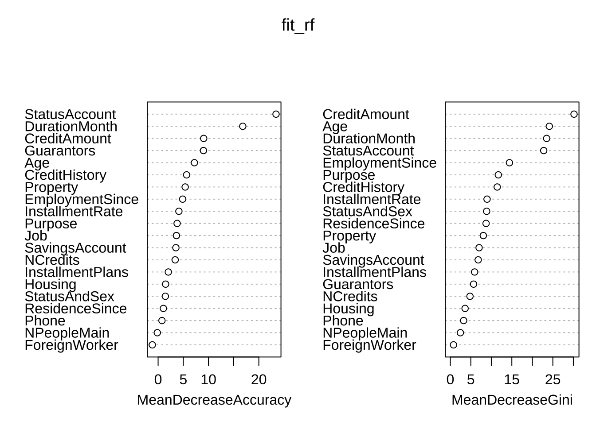

-> 重要な変数として, Credit Amount, Age, DurationMonth, Status Account, EmploymentSince, ...

- ROC曲線の可視化, およびAUC指標の計算

```r
# ROC曲線, AUC
library(ROCR)  # performance
yprob_rf <- predict(fit_rf, newdata = credit_df_noNA[-train, ], type = "prob")
pred_rf <- prediction(apply(yprob_rf, 1, max), credit_df_noNA$Customer[-train])
perf_rf <- performance(pred_rf, "tpr", "fpr")
plot(perf_rf)
```

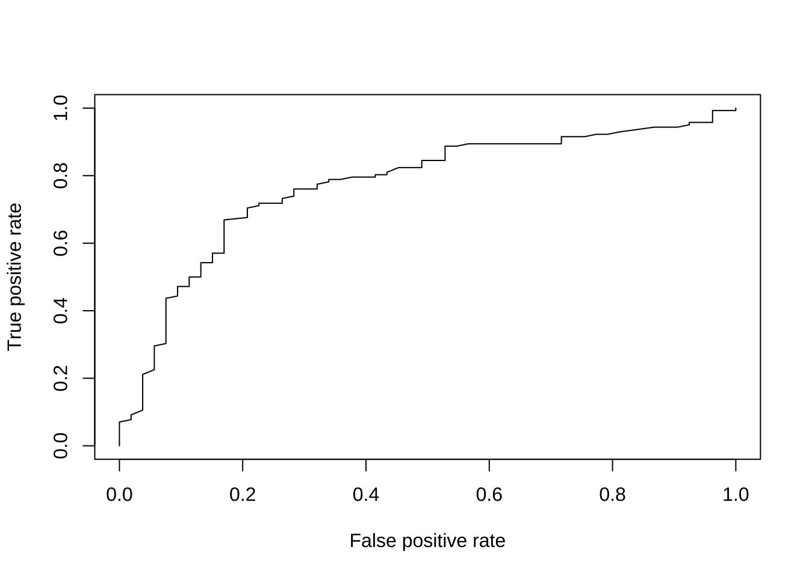

```r
auc_rf <- performance(pred_rf, "auc")
(auc <- as.numeric(auc_rf@y.values))
#> [1] 0.7725884
```


## 一般ブースティング回帰モデル

パッケージ**gbm**, 関数`gbm()`を用いて,
GBM (General Boosting Regression Model, 一般ブースティング回帰モデル) を実行する.

`gbm()`にデータセットを与える際, 事前に目的変数の値は
{0,1}に変換しておく必要がある.

```r
# 予め反応変数を{0,1}に変換しておく
credit_df_01 <- credit_df_noNA
credit_df_01$Customer2 <- model.matrix(~Customer, data = credit_df_noNA, contrasts.arg = list(Customer = "contr.treatment"))[,
  -1]
credit_df_01$Customer <- NULL
str(credit_df_01)
#> 'data.frame':	695 obs. of  21 variables:
#>  $ StatusAccount   : Factor w/ 4 levels "ge_200DM","lt_0DM",..: 3 4 2 4 3 4 3 3 2 3 ...
#>  $ DurationMonth   : int  48 12 42 24 36 12 30 12 48 12 ...
#>  $ CreditHistory   : Factor w/ 5 levels "A","B","C","D",..: 3 5 3 3 3 3 5 3 3 3 ...
#>  $ Purpose         : Factor w/ 6 levels "TV_etc","business",..: 1 4 1 1 3 1 3 3 2 1 ...
#>  $ CreditAmount    : int  5951 2096 7882 2835 6948 3059 5234 1295 4308 1567 ...
#>  $ SavingsAccount  : Factor w/ 4 levels "ge_1000DM","lt_1000DM",..: 3 3 3 2 3 1 3 3 3 3 ...
#>  $ EmploymentSince : Factor w/ 5 levels "ge_7yrs","lt_1yr",..: 3 4 4 1 3 4 5 2 2 3 ...
#>  $ InstallmentRate : int  2 2 2 3 2 2 4 3 3 1 ...
#>  $ StatusAndSex    : Factor w/ 4 levels "F_divorced","M_divorced",..: 1 4 4 4 4 2 3 1 1 1 ...
#>  $ Guarantors      : Factor w/ 3 levels "co-applicant",..: 3 3 2 3 3 3 3 3 3 3 ...
#>  $ ResidenceSince  : int  2 3 4 4 2 4 2 1 4 1 ...
#>  $ Property        : Factor w/ 3 levels "car_etc","life_insurance",..: 3 3 2 2 1 3 1 1 2 1 ...
#>  $ Age             : int  22 49 45 53 35 61 28 25 24 22 ...
#>  $ InstallmentPlans: Factor w/ 3 levels "bank","none",..: 2 2 2 2 2 2 2 2 2 2 ...
#>  $ Housing         : Factor w/ 3 levels "free","own","rent": 2 2 1 2 3 2 2 3 3 2 ...
#>  $ NCredits        : int  1 1 1 1 1 1 2 1 1 1 ...
#>  $ Job             : Factor w/ 4 levels "management","skilled",..: 2 4 2 2 1 4 1 2 2 2 ...
#>  $ NPeopleMain     : int  1 2 2 1 1 1 1 1 1 1 ...
#>  $ Phone           : Factor w/ 2 levels "no","yes": 1 1 1 1 2 1 1 1 1 2 ...
#>  $ ForeignWorker   : Factor w/ 2 levels "no","yes": 2 2 2 2 2 2 2 2 2 2 ...
#>  $ Customer2       : num  0 1 1 1 1 1 0 0 0 1 ...
```

<!--
bookdownでエラー発生
credit_df_01$Customer2 <- model.matrix( ~ Customer, data = credit_df_noNA)[, -1]
→
{0,1}でなく, 何故か{-1,1}が出力されてしまう!?
→
model.matrix()内, 何故かbookdown実行時, "contr.sum"になっていた!? 出力が{-1,1}
-->

```
gbm():
重要なパラメータ
- n.trees   適合する木の総数=繰り返し計算回数
- interaction.depth   各木の最大深さ
- shrnkage    縮小パラメータ (学習レート/ステップサイズ減少幅) (デフォルト = 0.1)
- bag.fraction   次の木生成のためランダムに抽出される学習セットの割合 (デフォルト = 0.5). 
  モデル適合にランダムネスを導入
```
- GBMの実行

```r
# gbm関数を分類問題に適用 (distribution = 'bernoulli')
library(gbm)
set.seed(1)
fit_gbm <- gbm(Customer2 ~ ., data = credit_df_01[train, ], distribution = "bernoulli",
  n.trees = 5000, interaction.depth = 4, shrinkage = 0.001)
```


```r
summary(fit_gbm)  # プロットの出力: plotit = T (デフォルト)\t
```

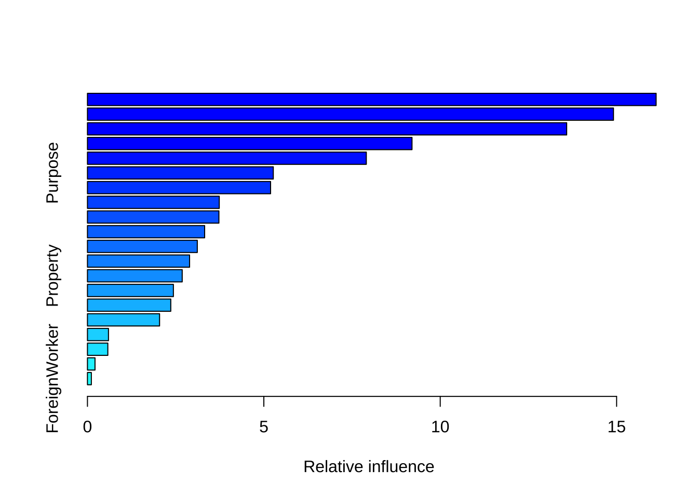

```
#>                               var    rel.inf
#> StatusAccount       StatusAccount 16.1199662
#> CreditAmount         CreditAmount 14.9109611
#> DurationMonth       DurationMonth 13.5845743
#> Age                           Age  9.2000812
#> EmploymentSince   EmploymentSince  7.9050318
#> Purpose                   Purpose  5.2681349
#> CreditHistory       CreditHistory  5.1911514
#> InstallmentRate   InstallmentRate  3.7363564
#> InstallmentPlans InstallmentPlans  3.7263872
#> SavingsAccount     SavingsAccount  3.3219146
#> Guarantors             Guarantors  3.1139441
#> StatusAndSex         StatusAndSex  2.8951497
#> Property                 Property  2.6861050
#> ResidenceSince     ResidenceSince  2.4361526
#> Job                           Job  2.3620765
#> Housing                   Housing  2.0444234
#> NCredits                 NCredits  0.5958863
#> Phone                       Phone  0.5774505
#> NPeopleMain           NPeopleMain  0.2141407
#> ForeignWorker       ForeignWorker  0.1101121
# 各変数の相対的影響度 (relative influence): 損失関数 (二乗誤差) の減少幅
```


```r
plot(fit_gbm)
```

- partial dependence plot (PDP) 

PDPは, (自分以外の変数について積分して除去することで) 1変数の反応変数に対する効果を可視化するXAI (Explainable AI) の一手法である. 

ここでは, 重要な2変数である`Age`, `CreditAmount`について PDPを作成する.

```r
# partial dependence plot (PDP) 最重要な2変数について
par(mfrow = c(1, 2))
plot(fit_gbm, i = "Age")
```

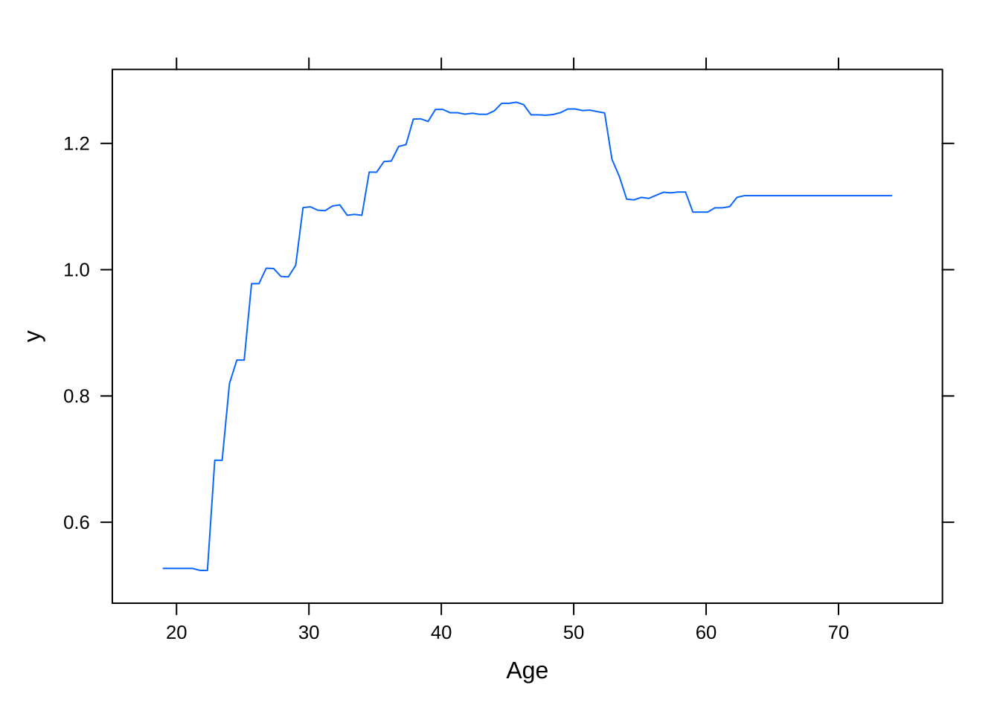

```r
plot(fit_gbm, i = "CreditAmount")
```

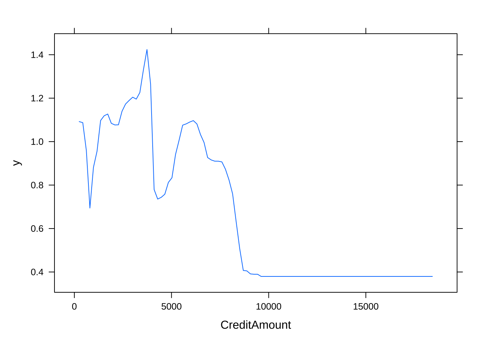

- テストデータにより外挿予測
`predict()`において引数`type = "response"`を指定すると,
先の`gbm()`実行時に`distribution="bernoulli"`と指定していた場合には, 確率が返される.
そこで, これを目的変数 ({0,1}) の予測に変換するために, 閾値を設定し大小での2値分類を行う.
また, `predict()`では, 予測に用いるため `gbm()`で得られた木の数を`n.trees`で指定する.


```r
yprob_gbm <- predict(fit_gbm, newdata = credit_df_01[-train, ], n.trees = 5000, type = "response")
# (現状) type = 'response': 'bernoulli'では, 確率を返す → 2値{0,1}予測するには,
# 閾値を指定して変換(!)
thrshld <- 0.5
yhat_gbm <- ifelse(yprob_gbm > thrshld, 1, 0)

# yhat_gbm <- predict(fit_gbm, newdata = credit_df_01[-train, ], n.trees =
# 5000)\t head(yhat_gbm)

y_test <- credit_df_01[-train, "Customer2"]  # 0/1
```

上と同様に, 混同行列を作成し, accuracyや, F1 ("F尺度") の数値を取り出す.

```r
(tbl_gbm <- table(yhat_gbm, y_test))
#>         y_test
#> yhat_gbm   0   1
#>        0  18  13
#>        1  35 129
(confusionMatrix(tbl_gbm)$overall["Accuracy"])
#>  Accuracy 
#> 0.7538462
(confusionMatrix(tbl_gbm, mode = "prec_recall")$byClass["F1"])
#>        F1 
#> 0.4285714
```
→ `shrinkage`, `interaction.depth`等のパラメータ・チューニングにより, パフォーマンスを改善できる余地が有る.


- ROC曲線, AUC指標

```r
# ROC曲線, AUC
pred_gbm <- prediction(yprob_gbm, y_test)
perf_gbm <- performance(pred_gbm, "tpr", "fpr")
plot(perf_gbm)
```

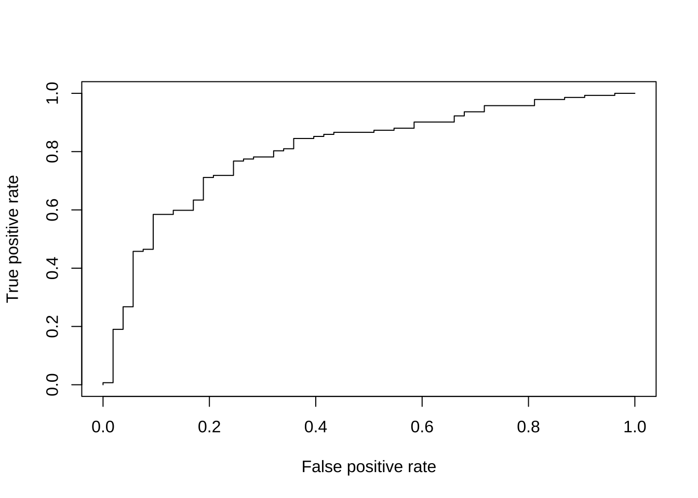

```r
auc_gbm <- performance(pred_gbm, "auc")
(auc <- as.numeric(auc_gbm@y.values))
#> [1] 0.8057401
```

注)上述の手法と合わせる為に, 予め学習データとテスト分割を分割 (固定) したが, **gbm**パッケージ内で, 分割→テストする機能有り
