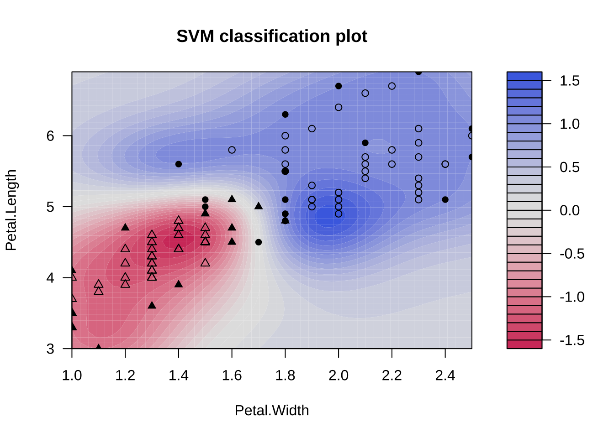
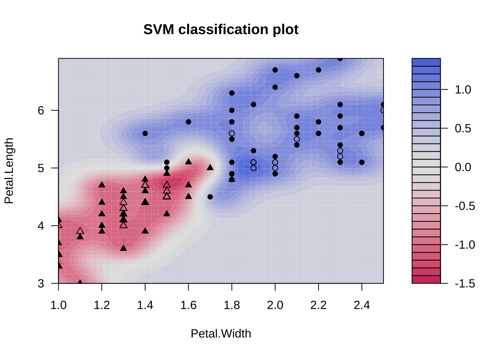
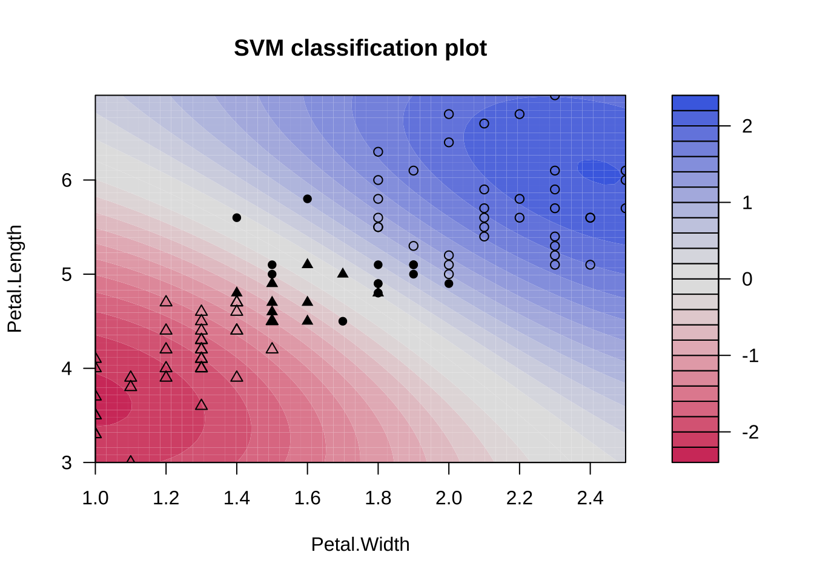
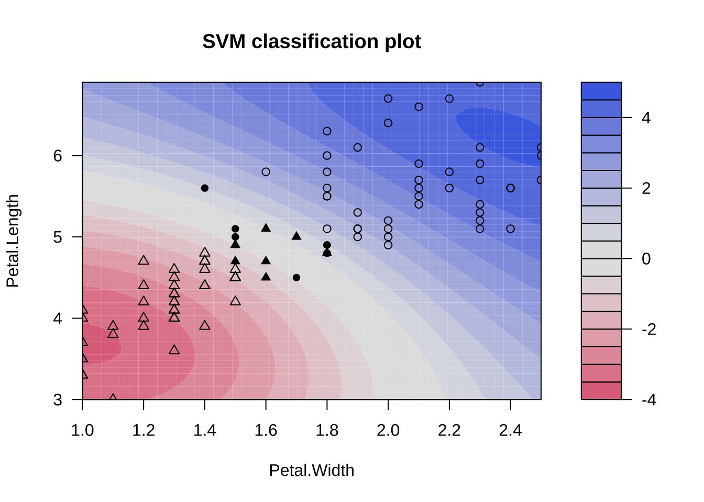
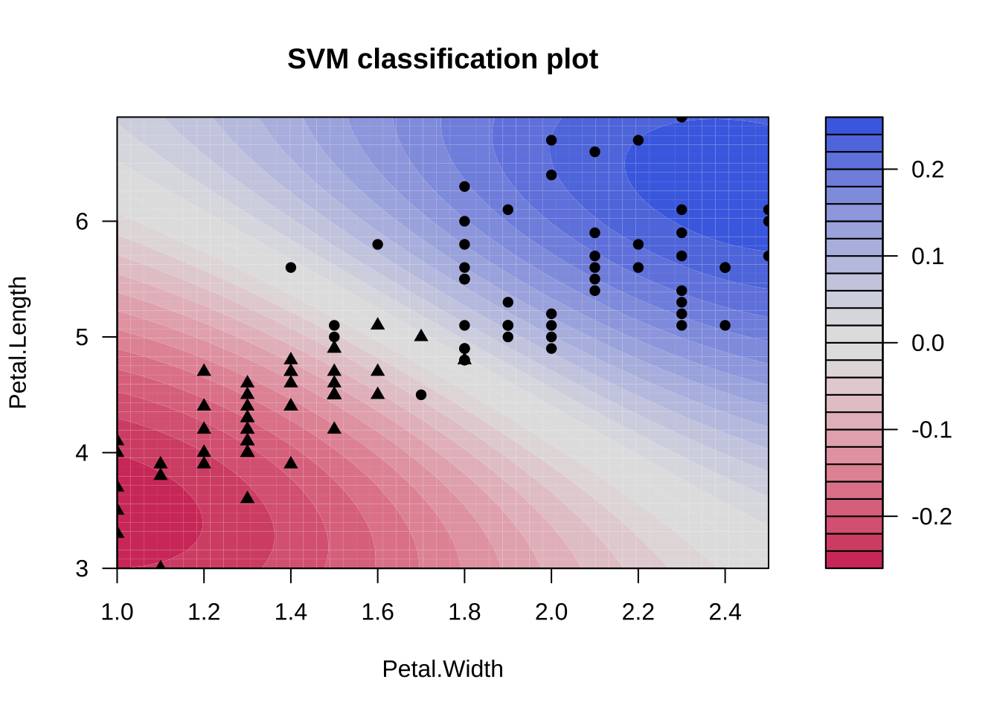
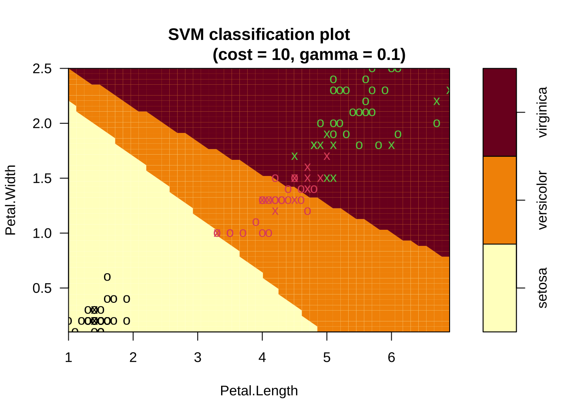
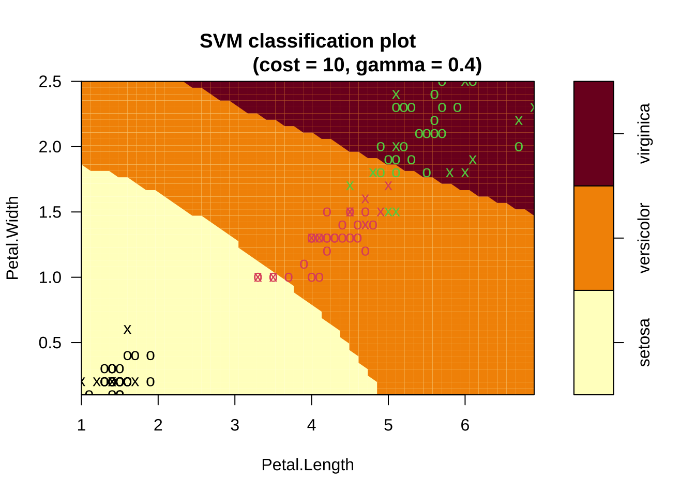
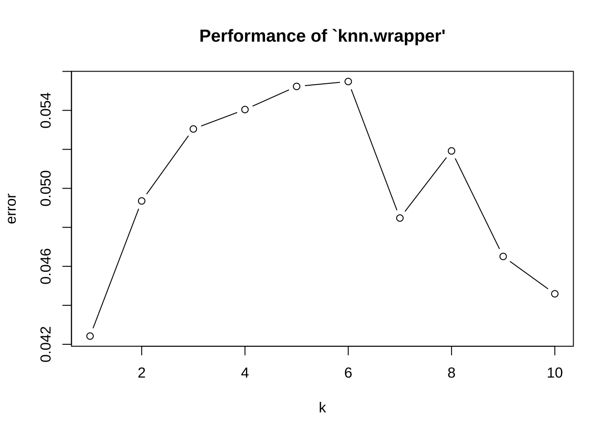
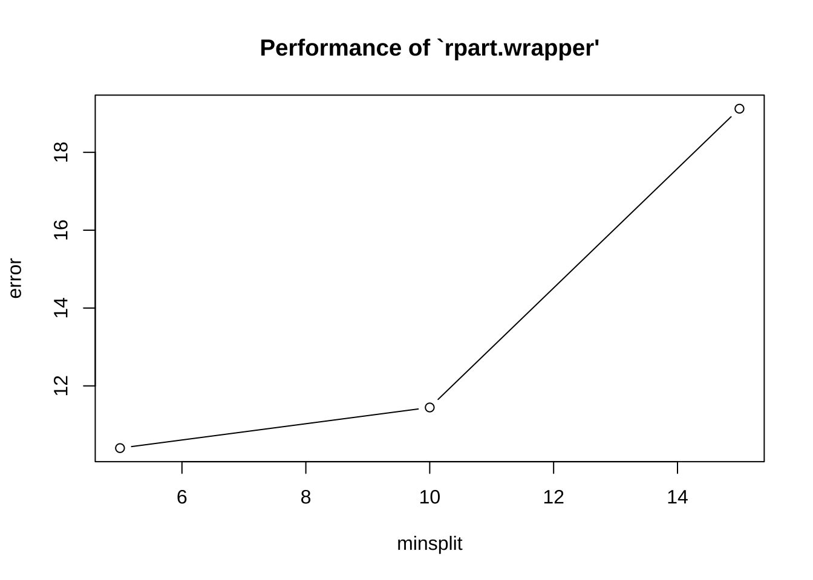

# サポート・ベクター・マシーン (SVM)


## SVM (RBFカーネル) の動作の確認
### データセット1: iris (あやめ) データ {-}

```
iris
- 150 x 4 
- Sepal.Length (萼片の長さ) (cm)
- Sepal.Width (萼片の幅 (cm)
- Petal.Length (花弁の長さ) (cm)
- Petal.Width (花弁の幅 (cm)
- Species (あやめの種類): Setosa, Versicolour, Virginica
- ※ petal 花弁 (花びら), sepal: 萼片 (がくへん)
- Introduced in Ronald A. Fisher (1934)
- cf. https://rpubs.com/vidhividhi/irisdataeda
```

SVM (RBFカーネル) の特徴を理解するため, もともとは
目的変数`Species`は3分類 (50件x3) を持つが, ここでは
2分類に限定し, かつ, 予測変数も2つに絞って分析を行う


```r
iris1 <- iris[51:150, 3:5]  # (Petal.Length, Petal.Width, Species)
iris1$Species <- droplevels(iris1$Species)
```

### SVMの実行 {-}
パッケージ**kernlab**, 関数`ksvm()`を使用する.

```r
library(kernlab)
iris_ksvm <- ksvm(Species ~ ., data = iris1)  # デフォルト (kpar = 'automatic')
table(predict(iris_ksvm, iris1[, 1:2]), iris1$Species)
#>             
#>              versicolor virginica
#>   versicolor         48         2
#>   virginica           2        48
plot(iris_ksvm, data = iris1[, 1:2])
```



2予測変数 + 2値分類のケース → 境界を可視化できる.

- 黒点...サポートベクター

ハイパーパラメータ (`C`, `sigma`) の値を変えて実行してみる.
学習データを (内挿) 予測させ分離境界を描く.

```r
iris_ksvm <- ksvm(Species ~ ., data = iris1, kpar = list(sigma = 10))  # → より複雑
table(predict(iris_ksvm, iris1[, 1:2]), iris1$Species)
#>             
#>              versicolor virginica
#>   versicolor         49         1
#>   virginica           1        49
plot(iris_ksvm, data = iris1[, 1:2])
```




```r
iris_ksvm <- ksvm(Species ~ ., data = iris1, kpar = list(sigma = 0.1))  # → より大雑把
table(predict(iris_ksvm, iris1[, 1:2]), iris1$Species)
#>             
#>              versicolor virginica
#>   versicolor         47         3
#>   virginica           3        47
plot(iris_ksvm, data = iris1[, 1:2])
```




```r
iris_ksvm <- ksvm(Species ~ ., data = iris1, kpar = list(sigma = 0.1), C = 10)  # → より少ないSV
table(predict(iris_ksvm, iris1[, 1:2]), iris1$Species)
#>             
#>              versicolor virginica
#>   versicolor         47         2
#>   virginica           3        48
plot(iris_ksvm, data = iris1[, 1:2])
```




```r
iris_ksvm <- ksvm(Species ~ ., data = iris1, kpar = list(sigma = 0.1), C = 1)
plot(iris_ksvm, data = iris1[, 1:2])
```


```r

table(predict(iris_ksvm, iris1[, 1:2]), iris1$Species)
#>             
#>              versicolor virginica
#>   versicolor         47         3
#>   virginica           3        47
```


```r
iris_ksvm <- ksvm(Species ~ ., data = iris1, kpar = list(sigma = 0.1), C = 0.1)
plot(iris_ksvm, data = iris1[, 1:2])
```


```r

table(predict(iris_ksvm, iris1[, 1:2]), iris1$Species)
#>             
#>              versicolor virginica
#>   versicolor         48         3
#>   virginica           2        47
```


```r
iris_ksvm <- ksvm(Species ~ ., data = iris1, kpar = list(sigma = 0.1), C = 0.01)  # → より多くのSV
table(predict(iris_ksvm, iris1[, 1:2]), iris1$Species)
#>             
#>              versicolor virginica
#>   versicolor         48         3
#>   virginica           2        47
plot(iris_ksvm, data = iris1[, 1:2])
```



すなわち,

- `sigma` (gamma) 大 → より複雑な分離境界
- `C` (cost) 小 → より多数のsupport vectors

が確認される.

## 2値分類
### データセット2: spamデータ {-}

```
spam:
- 4601 x 58 
- 目的変数 type (58列目): "nonspam"/"spam"
- 予測変数 (1--57) はすべてnumeric
- 注) 2値分類問題としては使い易いデータセット
```


```r
library(kernlab)  # ksvm()
data(spam)
dim(spam)  # spamデータの分析
#> [1] 4601   58
head(spam)
#>   make address  all num3d  our over remove internet order mail receive will
#> 1 0.00    0.64 0.64     0 0.32 0.00   0.00     0.00  0.00 0.00    0.00 0.64
#> 2 0.21    0.28 0.50     0 0.14 0.28   0.21     0.07  0.00 0.94    0.21 0.79
#> 3 0.06    0.00 0.71     0 1.23 0.19   0.19     0.12  0.64 0.25    0.38 0.45
#> 4 0.00    0.00 0.00     0 0.63 0.00   0.31     0.63  0.31 0.63    0.31 0.31
#> 5 0.00    0.00 0.00     0 0.63 0.00   0.31     0.63  0.31 0.63    0.31 0.31
#> 6 0.00    0.00 0.00     0 1.85 0.00   0.00     1.85  0.00 0.00    0.00 0.00
#>   people report addresses free business email  you credit your font num000
#> 1   0.00   0.00      0.00 0.32     0.00  1.29 1.93   0.00 0.96    0   0.00
#> 2   0.65   0.21      0.14 0.14     0.07  0.28 3.47   0.00 1.59    0   0.43
#> 3   0.12   0.00      1.75 0.06     0.06  1.03 1.36   0.32 0.51    0   1.16
#> 4   0.31   0.00      0.00 0.31     0.00  0.00 3.18   0.00 0.31    0   0.00
#> 5   0.31   0.00      0.00 0.31     0.00  0.00 3.18   0.00 0.31    0   0.00
#> 6   0.00   0.00      0.00 0.00     0.00  0.00 0.00   0.00 0.00    0   0.00
#>   money hp hpl george num650 lab labs telnet num857 data num415 num85
#> 1  0.00  0   0      0      0   0    0      0      0    0      0     0
#> 2  0.43  0   0      0      0   0    0      0      0    0      0     0
#> 3  0.06  0   0      0      0   0    0      0      0    0      0     0
#> 4  0.00  0   0      0      0   0    0      0      0    0      0     0
#> 5  0.00  0   0      0      0   0    0      0      0    0      0     0
#> 6  0.00  0   0      0      0   0    0      0      0    0      0     0
#>   technology num1999 parts pm direct cs meeting original project   re  edu
#> 1          0    0.00     0  0   0.00  0       0     0.00       0 0.00 0.00
#> 2          0    0.07     0  0   0.00  0       0     0.00       0 0.00 0.00
#> 3          0    0.00     0  0   0.06  0       0     0.12       0 0.06 0.06
#> 4          0    0.00     0  0   0.00  0       0     0.00       0 0.00 0.00
#> 5          0    0.00     0  0   0.00  0       0     0.00       0 0.00 0.00
#> 6          0    0.00     0  0   0.00  0       0     0.00       0 0.00 0.00
#>   table conference charSemicolon charRoundbracket charSquarebracket
#> 1     0          0          0.00            0.000                 0
#> 2     0          0          0.00            0.132                 0
#> 3     0          0          0.01            0.143                 0
#> 4     0          0          0.00            0.137                 0
#> 5     0          0          0.00            0.135                 0
#> 6     0          0          0.00            0.223                 0
#>   charExclamation charDollar charHash capitalAve capitalLong capitalTotal type
#> 1           0.778      0.000    0.000      3.756          61          278 spam
#> 2           0.372      0.180    0.048      5.114         101         1028 spam
#> 3           0.276      0.184    0.010      9.821         485         2259 spam
#> 4           0.137      0.000    0.000      3.537          40          191 spam
#> 5           0.135      0.000    0.000      3.537          40          191 spam
#> 6           0.000      0.000    0.000      3.000          15           54 spam
```

データセットの2/3を学習用に, 残りをテスト用に分割する.

```r
table(spam$type)  # [, 58]
#> 
#> nonspam    spam 
#>    2788    1813
set.seed(50)
train_idx <- sample(nrow(spam), round(nrow(spam) * 2/3))
spam_train <- spam[train_idx, ]
spam_test <- spam[-train_idx, ]
```

### SVMの実行 {-}
```
ksvm():
- supports the well known C-svc, nu-svc, (Speciesification) one-Species-svc (novelty) eps-svr, nu-svr (regression) formulations along with native multi-Species Speciesification formulations and the bound-constraint SVM formulations.
- also supports Species-probabilities output and confidence intervals for regression.
```

- 交差検証 (CV) 実施

```r
# set.seed(50)
(spam_ksvm <- ksvm(type ~ ., data = spam_train, cross = 3))
#> Support Vector Machine object of class "ksvm" 
#> 
#> SV type: C-svc  (classification) 
#>  parameter : cost C = 1 
#> 
#> Gaussian Radial Basis kernel function. 
#>  Hyperparameter : sigma =  0.0278524323556927 
#> 
#> Number of Support Vectors : 1008 
#> 
#> Objective Function Value : -584.0049 
#> Training error : 0.04956 
#> Cross validation error : 0.074667
```

学習データに対して3-fold CVによってモデル適合の精度評価
→ 最終行, 学習データに対する誤判別率 (CV誤差).


```
ksvm():
- 引数`kernel`: "polydot" (多項式カーネル), "vanilladot" (線形カーネル), "rbfdot" (Gaussianカーネル) (デフォルト="rbfdot")
- prob.model: 分類問題では, =TRUEの場合, 学習データに対する3-fold CV + シグモイド関数適用によりクラス所属計算. (デフォルト=FALSE)
- パラメータの指定方法 → 例: kpar = list(sigma = 0.1)
- sigma: kernel幅の逆数 (← 注: gammaに相当)
- ksvm()のデフォルト設定: kernel = "rbfdot", C = 1, kpar = "automatic" (← rbfdotに対しては, sigmaを自動的に決定)
- 注) `spam`データの目的変数名`type`と, `ksvm()`の引数の一つ`type`と紛らわしい.
```

- 線形カーネル

```r
(spam_ksvm <- ksvm(type ~ ., data = spam_train, kernel = "vanilladot", C = 10, cross = 3,
  prob.model = T))  # 
#>  Setting default kernel parameters
#> Support Vector Machine object of class "ksvm" 
#> 
#> SV type: C-svc  (classification) 
#>  parameter : cost C = 10 
#> 
#> Linear (vanilla) kernel function. 
#> 
#> Number of Support Vectors : 587 
#> 
#> Objective Function Value : -5527.534 
#> Training error : 0.064558 
#> Cross validation error : 0.072711 
#> Probability model included.
```

- 出力表示の例

```r
spam_ksvm@cross  # CV誤差
spam_ksvm@alpha  # 生成されたサポートベクター (alpha vector)
spam_ksvm@alphaindex  # 同インデックス
spam_ksvm@nSV  # 生成されたサポートベクターの数
spam_ksvm@coef
```

- テストデータに対する外挿予測 & 精度評価

```r
spam_pred <- predict(spam_ksvm, spam_test[, -58])
(spam_tab <- table(spam_pred, spam_test[, 58]))
#>          
#> spam_pred nonspam spam
#>   nonspam     916   54
#>   spam         46  518
# 1-sum(diag(spam.tab))/sum(spam.tab)\t\t# 誤判別率, 1-'Accuracy'

library(caret)
confusionMatrix(spam_tab, mode = "prec_recall")
#> Confusion Matrix and Statistics
#> 
#>          
#> spam_pred nonspam spam
#>   nonspam     916   54
#>   spam         46  518
#>                                           
#>                Accuracy : 0.9348          
#>                  95% CI : (0.9213, 0.9466)
#>     No Information Rate : 0.6271          
#>     P-Value [Acc > NIR] : <2e-16          
#>                                           
#>                   Kappa : 0.8602          
#>                                           
#>  Mcnemar's Test P-Value : 0.4839          
#>                                           
#>               Precision : 0.9443          
#>                  Recall : 0.9522          
#>                      F1 : 0.9482          
#>              Prevalence : 0.6271          
#>          Detection Rate : 0.5971          
#>    Detection Prevalence : 0.6323          
#>       Balanced Accuracy : 0.9289          
#>                                           
#>        'Positive' Class : nonspam         
#> 
(confusionMatrix(spam_tab)$overall["Accuracy"])
#> Accuracy 
#> 0.934811
```

kernelの種類に応じて適切なハイパーパラメータを
引数`kpar`の中で設定する必要. マニュアルでの確認が必要.
(コストCの設定はkernelは共通)

- Gaussianカーネル

```r
(spam_ksvm <- ksvm(type ~ ., data = spam_train, C = 10, cross = 3, prob.model = T,
  kpar = list(sigma = 0.1)))
#> Support Vector Machine object of class "ksvm" 
#> 
#> SV type: C-svc  (classification) 
#>  parameter : cost C = 10 
#> 
#> Gaussian Radial Basis kernel function. 
#>  Hyperparameter : sigma =  0.1 
#> 
#> Number of Support Vectors : 1560 
#> 
#> Objective Function Value : -1548.941 
#> Training error : 0.008477 
#> Cross validation error : 0.099441 
#> Probability model included.
```

- テストデータに対する外挿予測 & 精度評価

```r
spam_pred <- predict(spam_ksvm, spam_test[, -58])
(spam_tab <- table(spam_pred, spam_test[, 58]))
#>          
#> spam_pred nonspam spam
#>   nonspam     913   90
#>   spam         49  482
# 1-sum(diag(spam_tab))/sum(spam_tab)\t\t# 誤判別率, 1-'Accuracy'

library(caret)
confusionMatrix(spam_tab, mode = "prec_recall")
#> Confusion Matrix and Statistics
#> 
#>          
#> spam_pred nonspam spam
#>   nonspam     913   90
#>   spam         49  482
#>                                           
#>                Accuracy : 0.9094          
#>                  95% CI : (0.8939, 0.9233)
#>     No Information Rate : 0.6271          
#>     P-Value [Acc > NIR] : < 2.2e-16       
#>                                           
#>                   Kappa : 0.8034          
#>                                           
#>  Mcnemar's Test P-Value : 0.0006919       
#>                                           
#>               Precision : 0.9103          
#>                  Recall : 0.9491          
#>                      F1 : 0.9293          
#>              Prevalence : 0.6271          
#>          Detection Rate : 0.5952          
#>    Detection Prevalence : 0.6538          
#>       Balanced Accuracy : 0.8959          
#>                                           
#>        'Positive' Class : nonspam         
#> 
(confusionMatrix(spam_tab)$overall["Accuracy"])
#>  Accuracy 
#> 0.9093872
```

ハイパーパラメータを変えて実行してみる.

```r
(spam_ksvm <- ksvm(type ~ ., data = spam_train, C = 0.1, cross = 3, prob.model = T,
  kpar = list(sigma = 0.1)))
#> Support Vector Machine object of class "ksvm" 
#> 
#> SV type: C-svc  (classification) 
#>  parameter : cost C = 0.1 
#> 
#> Gaussian Radial Basis kernel function. 
#>  Hyperparameter : sigma =  0.1 
#> 
#> Number of Support Vectors : 2210 
#> 
#> Objective Function Value : -168.8087 
#> Training error : 0.161396 
#> Cross validation error : 0.213562 
#> Probability model included.
spam_pred <- predict(spam_ksvm, spam_test[, -58])
(spam_tab <- table(spam_pred, spam_test[, 58]))
#>          
#> spam_pred nonspam spam
#>   nonspam     942  237
#>   spam         20  335
(confusionMatrix(spam_tab)$overall["Accuracy"])
#>  Accuracy 
#> 0.8324641
```


```r
(spam_ksvm <- ksvm(type ~ ., data = spam_train, C = 10, cross = 3, prob.model = T,
  kpar = list(sigma = 10)))
#> Support Vector Machine object of class "ksvm" 
#> 
#> SV type: C-svc  (classification) 
#>  parameter : cost C = 10 
#> 
#> Gaussian Radial Basis kernel function. 
#>  Hyperparameter : sigma =  10 
#> 
#> Number of Support Vectors : 2756 
#> 
#> Objective Function Value : -1362.458 
#> Training error : 0.002282 
#> Cross validation error : 0.28758 
#> Probability model included.
spam_pred <- predict(spam_ksvm, spam_test[, -58])
(spam_tab <- table(spam_pred, spam_test[, 58]))
#>          
#> spam_pred nonspam spam
#>   nonspam     961  365
#>   spam          1  207
(confusionMatrix(spam_tab)$overall["Accuracy"])
#>  Accuracy 
#> 0.7614081
```

## 3値分類
irisデータセットをオリジナルの3分類のまま使用する.
データセットの2/3を学習用に, 残りをテスト用に分割する.

注) irisデータセットは, 件数が150件, 予測変数が4つのスモールデータセットであり,
かつ, データの構造が単純であるため,
外挿予測は難しいタスクとは言えないが,
基本的操作を理解することを目的として
ここでも使用を続けることにする.


```r
set.seed(1)
train_idx <- sample(nrow(iris), round(nrow(iris) * 2/3))
iris_train <- iris[train_idx, ]
iris_test <- iris[-train_idx, ]
```

### SVMの実行 {-}

引き続き, ライブラリ**kernlab**, 関数`ksvm()`を使用する.
`ksvm()`は, クラス数$k>2$の場合, "One-vs-One"アプローチを実行する.


```r
# iris_ksvm <- ksvm(Species ~ ., data = iris_train)\t\t# デフォルト (kpar =
# 'automatic')
iris_ksvm <- ksvm(Species ~ ., data = iris_train, kpar = list(sigma = 10))  # → より複雑
(iris_tab <- table(predict(iris_ksvm, iris_test[, 1:4]), iris_test$Species))
#>             
#>              setosa versicolor virginica
#>   setosa         15          0         0
#>   versicolor      0         14         0
#>   virginica       1          5        15
(confusionMatrix(iris_tab)$overall["Accuracy"])
#> Accuracy 
#>     0.88
```


```r
iris_ksvm <- ksvm(Species ~ ., data = iris_train, kpar = list(sigma = 0.1))  # → より大雑把
(iris_tab <- table(predict(iris_ksvm, iris_test[, 1:4]), iris_test$Species))
#>             
#>              setosa versicolor virginica
#>   setosa         16          0         0
#>   versicolor      0         19         1
#>   virginica       0          0        14
(confusionMatrix(iris_tab)$overall["Accuracy"])
#> Accuracy 
#>     0.98

iris_ksvm <- ksvm(Species ~ ., data = iris_train, kpar = list(sigma = 0.1), C = 10)  # → より少ないSV
```


```r
(iris_tab <- table(predict(iris_ksvm, iris_test[, 1:4]), iris_test$Species))
#>             
#>              setosa versicolor virginica
#>   setosa         16          0         0
#>   versicolor      0         17         0
#>   virginica       0          2        15
(confusionMatrix(iris_tab)$overall["Accuracy"])
#> Accuracy 
#>     0.96

iris_ksvm <- ksvm(Species ~ ., data = iris_train, kpar = list(sigma = 0.1), C = 1)
(iris_tab <- table(predict(iris_ksvm, iris_test[, 1:4]), iris_test$Species))
#>             
#>              setosa versicolor virginica
#>   setosa         16          0         0
#>   versicolor      0         19         1
#>   virginica       0          0        14
(confusionMatrix(iris_tab)$overall["Accuracy"])
#> Accuracy 
#>     0.98
```


```r
iris_ksvm <- ksvm(Species ~ ., data = iris_train, kpar = list(sigma = 0.1), C = 0.1)
(iris_tab <- table(predict(iris_ksvm, iris_test[, 1:4]), iris_test$Species))
#>             
#>              setosa versicolor virginica
#>   setosa         16          0         0
#>   versicolor      0         14         1
#>   virginica       0          5        14
(confusionMatrix(iris_tab)$overall["Accuracy"])
#> Accuracy 
#>     0.88
```


```r
iris_ksvm <- ksvm(Species ~ ., data = iris_train, kpar = list(sigma = 0.1), C = 0.01)  # → より多くのSV
(iris_tab <- table(predict(iris_ksvm, iris_test[, 1:4]), iris_test$Species))
#>             
#>              setosa versicolor virginica
#>   setosa          0          0         0
#>   versicolor      0          0         0
#>   virginica      16         19        15
(confusionMatrix(iris_tab)$overall["Accuracy"])
#> Accuracy 
#>      0.3
```

## 代替パッケージ**e1071**の利用
ここでは, パッケージ**e1071**, 関数`svm()`を使用する.
(注: ISLRでも**e1071**を使用している: Sec. 9.6)

パッケージ**caret**の関数`createDataPartition()`を利用して,

```r
# irisデータセットを学習用とテスト用に分割
set.seed(0)
# library(caret)
train_idx <- caret::createDataPartition(iris$Species, p = 0.7, list = F)
iris_train <- iris[train_idx, ]
iris_test <- iris[-train_idx, ]
```

### SVMの実行 {-}

**e1071**では, 多クラス($k>2$)のケース, "One-vs-One"アプローチ採用している.
関数`svm()`では, RBFカーネルのハイパーパラメータは `gamma`, `cost`である.

```r
library("e1071")
iris_svm <- svm(Species ~ ., data = iris_train, method = "C-Speciesification", kernel = "radial",
  cost = 10, gamma = 0.1)
summary(iris_svm)
#> 
#> Call:
#> svm(formula = Species ~ ., data = iris_train, method = "C-Speciesification", 
#>     kernel = "radial", cost = 10, gamma = 0.1)
#> 
#> 
#> Parameters:
#>    SVM-Type:  C-classification 
#>  SVM-Kernel:  radial 
#>        cost:  10 
#> 
#> Number of Support Vectors:  27
#> 
#>  ( 3 13 11 )
#> 
#> 
#> Number of Classes:  3 
#> 
#> Levels: 
#>  setosa versicolor virginica
plot(iris_svm, iris_train, Petal.Width ~ Petal.Length, slice = list(Sepal.Width = 3,
  Sepal.Length = 4))
title(main = "\n\n(cost = 10, gamma = 0.1)")
```




```r
iris_svm <- svm(Species ~ ., data = iris_train, method = "C-classification", kernel = "radial",
  cost = 10, gamma = 0.4)
plot(iris_svm, iris_train, Petal.Width ~ Petal.Length, slice = list(Sepal.Width = 3,
  Sepal.Length = 4))
title(main = "\n\n(cost = 10, gamma = 0.4)")
```



```r

iris_predict <- predict(iris_svm, iris_test, decision.values = T)
table(iris_predict, iris_test[, 3])
#>             
#> iris_predict 1.2 1.3 1.4 1.5 1.6 1.7 3 3.6 3.8 3.9 4 4.4 4.5 4.6 4.8 4.9 5 5.1
#>   setosa       1   3   2   5   2   2 0   0   0   0 0   0   0   0   0   0 0   0
#>   versicolor   0   0   0   0   0   0 1   1   1   2 1   2   3   1   0   1 0   0
#>   virginica    0   0   0   0   0   0 0   0   0   0 0   0   0   0   1   1 1   2
#>             
#> iris_predict 5.4 5.5 5.6 5.8 5.9 6.1 6.3 6.4 6.6
#>   setosa       0   0   0   0   0   0   0   0   0
#>   versicolor   0   0   0   0   0   0   0   0   0
#>   virginica    1   1   3   2   1   1   1   1   1
```

## ハイパーパラメータのチューニング
引き続き, パッケージ**e1071**内の関数`tune()`を使用する.

### 線形カーネルの場合 {-}

```r
set.seed(1)
tune.svm <- tune(svm, Species ~ ., data = iris_train, kernel = "linear", ranges = list(cost = 10^(-3:2)))
```

### RBFカーネルの場合 {-}

```r
tune_svm <- tune(svm, Species ~ ., data = iris_train, ranges = list(gamma = 10^(-3:1),
  cost = 10^(-3:2)))
summary(tune_svm)
#> 
#> Parameter tuning of 'svm':
#> 
#> - sampling method: 10-fold cross validation 
#> 
#> - best parameters:
#>  gamma cost
#>  0.001  100
#> 
#> - best performance: 0.02818182 
#> 
#> - Detailed performance results:
#>    gamma  cost      error dispersion
#> 1  1e-03 1e-03 0.74272727 0.17897012
#> 2  1e-02 1e-03 0.74272727 0.17897012
#> 3  1e-01 1e-03 0.75181818 0.16991598
#> 4  1e+00 1e-03 0.73363636 0.19194285
#> 5  1e+01 1e-03 0.78272727 0.12386862
#> 6  1e-03 1e-02 0.74272727 0.17897012
#> 7  1e-02 1e-02 0.74272727 0.17897012
#> 8  1e-01 1e-02 0.75181818 0.16991598
#> 9  1e+00 1e-02 0.73363636 0.19194285
#> 10 1e+01 1e-02 0.78272727 0.12386862
#> 11 1e-03 1e-01 0.74272727 0.17897012
#> 12 1e-02 1e-01 0.70636364 0.19787902
#> 13 1e-01 1e-01 0.20181818 0.24479147
#> 14 1e+00 1e-01 0.10545455 0.14130443
#> 15 1e+01 1e-01 0.78272727 0.12386862
#> 16 1e-03 1e+00 0.67818182 0.18891211
#> 17 1e-02 1e+00 0.12363636 0.11110927
#> 18 1e-01 1e+00 0.03727273 0.04819039
#> 19 1e+00 1e+00 0.04727273 0.04994028
#> 20 1e+01 1e+00 0.11454545 0.04070093
#> 21 1e-03 1e+01 0.12363636 0.11110927
#> 22 1e-02 1e+01 0.03727273 0.04819039
#> 23 1e-01 1e+01 0.03818182 0.04938557
#> 24 1e+00 1e+01 0.04727273 0.04994028
#> 25 1e+01 1e+01 0.11454545 0.04070093
#> 26 1e-03 1e+02 0.02818182 0.04544444
#> 27 1e-02 1e+02 0.03818182 0.04938557
#> 28 1e-01 1e+02 0.02818182 0.04544444
#> 29 1e+00 1e+02 0.03727273 0.04819039
#> 30 1e+01 1e+02 0.11454545 0.04070093
```


```r
# 最適なハイパーパラメータを用いたモデル
bestmod_svm <- tune_svm$best.model
summary(bestmod_svm)
#> 
#> Call:
#> best.tune(method = svm, train.x = Species ~ ., data = iris_train, 
#>     ranges = list(gamma = 10^(-3:1), cost = 10^(-3:2)))
#> 
#> 
#> Parameters:
#>    SVM-Type:  C-classification 
#>  SVM-Kernel:  radial 
#>        cost:  100 
#> 
#> Number of Support Vectors:  42
#> 
#>  ( 4 21 17 )
#> 
#> 
#> Number of Classes:  3 
#> 
#> Levels: 
#>  setosa versicolor virginica
```

```
tune()の使い方のヒント:
- 引数tunecontrolの値を関数tune.control()を使って設定できる
- 例: tune.control(sampling = "boot")	
  - sampling: サンプリング・スキームの指定
    - "boot"(ブートストラップ), "cross"(クロスバリデーション), "fix"(学習/評価に1回分割のみ)
```

### **e1071**内にあるチューニング用の便利な関数群 {-}
**e1071**は, ウィーン工科大学 (TU Wien)
の統計学科の確率論グループが作成している, 様々な
機械学習や数値計算を行う関数をカバーするパッケージである.

- [https://cran.r-project.org/web/packages/e1071/e1071.pdf](https://cran.r-project.org/web/packages/e1071/e1071.pdf)

パッケージ内には, **tune.XXX**と命名された関数群がある.
これらは, 上記`tune()`を使用したwrapper関数で,
これを用いることで機械学習アルゴリズムXXXの
ハイパーパラメータ・チューニングを行うことができる.

- `tune.svm()`, `tune.rpart()`, `tune.randomForest()`, `tune.knn()`, 等.

注) 呼び出す関数により, 予測変数と目的変数を個別に指定するもの,
(x=..., y=...)と, 式 (formula), すなわち, `y ~ x`のように指定をするものがあることに注意が必要.

<!--
上の`svm()`, および`tune.svm()`では,
libsvmと命名されたC++で書かれた
SVM用のライブラリが使用されている.
-->

#### kNN法 {-}
関数`tune.knn()`は, `knn()`を呼び出して実行する.
`knn()`のパラメータ`k`のサーチ範囲を指定することができる.

```r
x <- iris[, -5]
y <- iris[, 5]
res_tune_knn <- tune.knn(x, y, k = 1:10, tunecontrol = tune.control(sampling = "boot"))
summary(res_tune_knn)
#> 
#> Parameter tuning of 'knn.wrapper':
#> 
#> - sampling method: bootstrapping 
#> 
#> - best parameters:
#>  k
#>  1
#> 
#> - best performance: 0.04242248 
#> 
#> - Detailed performance results:
#>     k      error dispersion
#> 1   1 0.04242248 0.01767743
#> 2   2 0.04935387 0.01928082
#> 3   3 0.05304685 0.02914612
#> 4   4 0.05404239 0.04167451
#> 5   5 0.05522874 0.03213148
#> 6   6 0.05548034 0.03610984
#> 7   7 0.04847679 0.02678632
#> 8   8 0.05191999 0.03424645
#> 9   9 0.04650720 0.02991595
#> 10 10 0.04459118 0.02676795
plot(res_tune_knn)
```



#### 決定木 {-}
関数`tune.rpart()`: `rpart()`を呼び出して実行する.
`rpart()`のパラメータするための関数`rpart.conctrol()`
に与えるパラメータに対して, チューニングのためのサーチの範囲を
指定することができる.
以下は, `minsplit` (ノード内の最小観測点の数) を与える例を示す:

```r
data(mtcars)
res_tune_rpart <- tune.rpart(mpg ~ ., data = mtcars, minsplit = c(5, 10, 15))
summary(res_tune_rpart)
#> 
#> Parameter tuning of 'rpart.wrapper':
#> 
#> - sampling method: 10-fold cross validation 
#> 
#> - best parameters:
#>  minsplit
#>         5
#> 
#> - best performance: 10.40174 
#> 
#> - Detailed performance results:
#>   minsplit    error dispersion
#> 1        5 10.40174   8.416546
#> 2       10 11.44564   8.841332
#> 3       15 19.12135  11.868442
plot(res_tune_rpart)
```



呼び出すアルゴリズム/モデルごとに異なるハイパーパラメータを持つため, 正しい設定を行うには, 各々の関数のマニュアルを確認する必要.


ハイパーパラメータのチューニングは, 他のパッケージ,
例えば, **caret**の機能を用いても実行することができる.

<!--
SV regressionについてカバーする??
-->
