# 主成分分析 (PCA)


## 基本操作

Rで主成分分析 (PCA) を実行する関数として,
`princomp()`と`prcomp()`が用意されている.
機能は基本的には同じでありどちらを使っても良いが,
関数に与える引数名や
得られる結果の要素名が異なっているため,
適宜マニュアルで確認し, 的確に実行する必要がある.

### データセット1: ソニー株価リターン vs パナソニック株価リターン {-}
```
"sony_pana_close_Oct2015-Feb2016.csv"
  - date: 10/01/15--02/19/16
  - sony: ソニー株価 (日次終値)
  - panasonic: パナソニック株価 (同)
- n = 94, p = 2
```

```r
price_dat <- read.csv("sony_pana_close_Oct2015-Feb2016.csv", header = T, row.name = 1)
sony_ret <- diff(log(price_dat[, "sony"]))
pana_ret <- diff(log(price_dat[, "panasonic"]))
ret_df <- data.frame(sony = sony_ret, pana = pana_ret, row.names = rownames(price_dat[-1,
  ]))
head(ret_df)
#>                  sony         pana
#> 10/02/15  0.032186686 -0.012492607
#> 10/05/15  0.015394788  0.013693327
#> 10/06/15  0.004445863  0.007174204
#> 10/07/15  0.015406687  0.028964843
#> 10/08/15 -0.016357710  0.016832838
#> 10/09/15  0.018228035  0.036868819
```


```r
plot(ret_df)
```

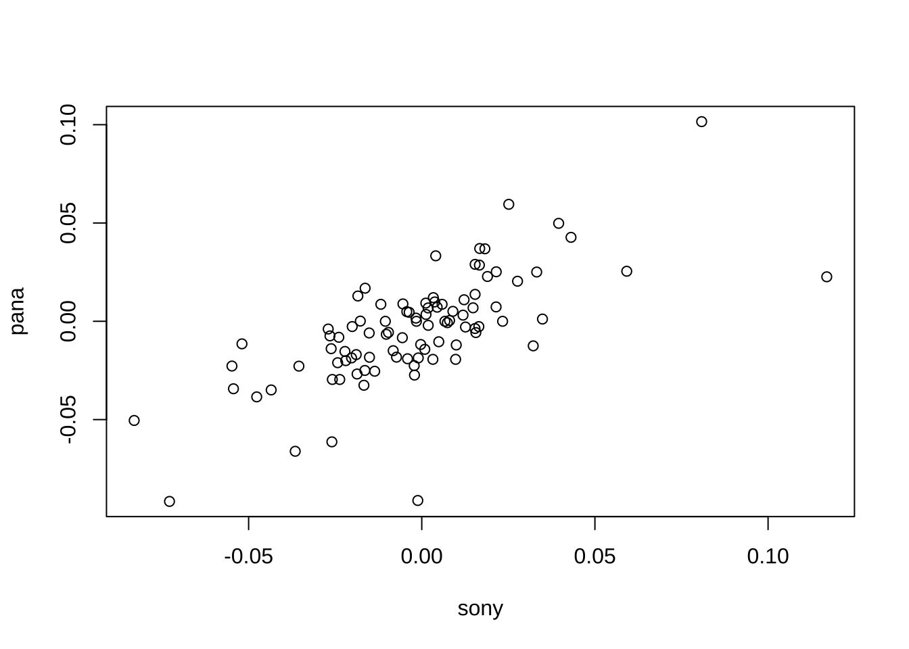

```r
cov(ret_df)
#>              sony         pana
#> sony 0.0008134375 0.0005522023
#> pana 0.0005522023 0.0007710553
```

互いに相関のある2つ株価変動を1つの合成変量に集約するため,
PCAを実行する.


データ行列`ret_df`に対して, ここでは,
`princomp()`を適用する. `princomp()`は, デフォルトでは
分散共分散行列に対するPCAを実行する.


```r
# PCA (分散共分散行列に対して)
ret_pca <- princomp(ret_df)  # PCA on covariance matrix
summary(ret_pca)
#> Importance of components:
#>                            Comp.1     Comp.2
#> Standard deviation     0.03647457 0.01539678
#> Proportion of Variance 0.84876066 0.15123934
#> Cumulative Proportion  0.84876066 1.00000000
```

`princomp()`の実行結果に対して関数`summary()`を適用し,
PCAの全体パフォーマンス (寄与率) を確認する.
今回のデータセットについては, 主成分1本で
データ全体の変動を約85%説明できることが分かる.

- 各PCの寄与プロット (scree plot)

主成分 (PC) を寄与の大きさで降順にプロットしたグラフで, 採用する主成分の本数を決定するのに使うことができる.
(今回のデータセットはそもそも2変数なのであまり参考にはならない.)


```r
plot(ret_pca)
```


- データの中心 (各変数の平均値), 主成分の標準偏差

```r
ret_pca$center
ret_pca$sd
#>         sony         pana 
#> -0.001931057 -0.004103680 
#>     Comp.1     Comp.2 
#> 0.03647457 0.01539678
```


- PC負荷量

```r
# PC負荷量（固有ベクトル）
ret_pca$loadings
#> 
#> Loadings:
#>      Comp.1 Comp.2
#> sony  0.721  0.693
#> pana  0.693 -0.721
#> 
#>                Comp.1 Comp.2
#> SS loadings       1.0    1.0
#> Proportion Var    0.5    0.5
#> Cumulative Var    0.5    1.0
# barplot(ret_pca$loadings) plot(ret_pca$loadings)
```

PC負荷量 (各係数) の値を見ると,
第1主成分はソニー, パナソニック両者が同様な大きさ
(0.7前後) で同方向 (ともに正) に貢献していることが分かる.
他方, 第2主成分は, 同様な大きさだが逆方向になっている.

すなわち, 第1主成分が2銘柄の (同一方向の) 同時変動を表す合成変数である. この1変数を使えば
上述のように元のデータの約85%の変動を説明できる.

なお, PCAでは符号に関しては一意に定まらないため,
PC負荷量の符号を同時に反転させても良い.

- PC得点

```r
# PC得点（符号反転前)
head(ret_pca$scores)
#>               Comp.1       Comp.2
#> 10/02/15 0.018766080  0.029702336
#> 10/05/15 0.024824650 -0.000809378
#> 10/06/15 0.012415077 -0.003704272
#> 10/07/15 0.035422744 -0.011804820
#> 10/08/15 0.004122787 -0.025089215
#> 10/09/15 0.042936376 -0.015543559
plot(ret_pca$scores)
```

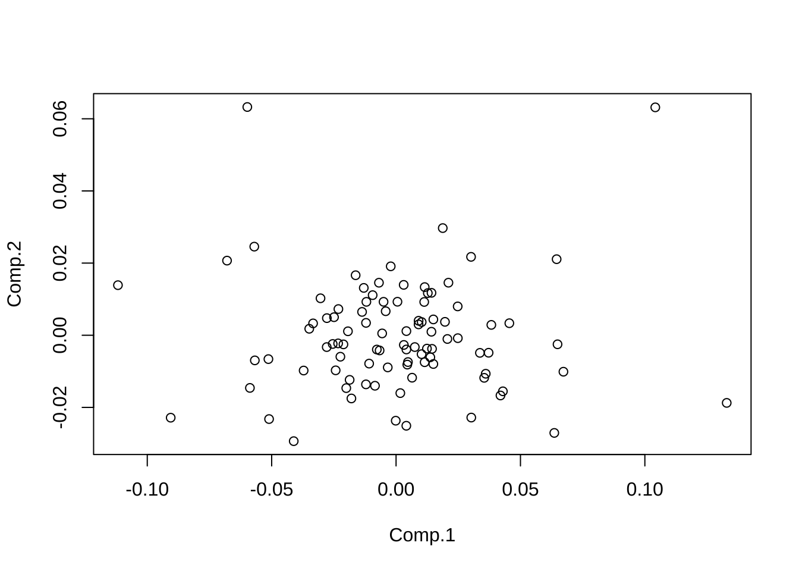


- biplot

biplotは, PC得点とPC負荷量の同時プロットである.
これにより, データの構造と変数の寄与を視覚的に確認できる.

```
biplotとは
  - PC得点: 
    - データのPC得点を (選択した2本のPCを軸に持つ) 2次元空間に散布図としてプロット. 各データ点が, 各PCについてどのように分布しているかを示す.
  - PC負荷量
    - 元の変数が主成分にどの程度寄与しているかを矢印としてプロット. 矢印の方向と長さが変数の主成分への寄与の方向と大きさを示す.
```

<!--
PC得点: データ点の新しい座標. 元の変数空間から主成分の作る空間 (PC空間) に射影された位置を示す
-->


```r
biplot(ret_pca)
```

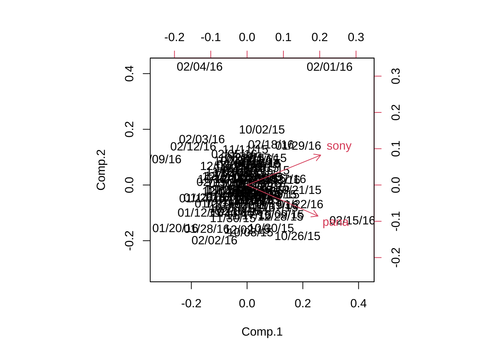


比較のため, 次に相関行列に対するPCAも実行してみる.
`princomp()`では, 引数`cor=TRUE`を与えれば良い.


```r
# PCA (相関行列に対して)
ret_pca <- princomp(ret_df, cor = T)  # PCA on correlation matrix
summary(ret_pca)
#> Importance of components:
#>                           Comp.1    Comp.2
#> Standard deviation     1.3027885 0.5502202
#> Proportion of Variance 0.8486289 0.1513711
#> Cumulative Proportion  0.8486289 1.0000000
```

分散共分散行列をしたPCAにおける, 変数のスケーリングの影響を確認するため,
元データを人為的にゆがめてから, 
`princomp()`を実行してみる.

```r
# 変数のスケーリング影響確認
ret_df2 <- data.frame(sony = sony_ret * 10, pana = pana_ret, row.names = rownames(price_dat[-1,
  ]))

# PCA (分散共分散行列に対して)
ret_pca2 <- princomp(ret_df2)  # PCA on covariance matrix
summary(ret_pca2)
ret_pca2$loadings
#> Importance of components:
#>                           Comp.1      Comp.2
#> Standard deviation     0.2843268 0.019751604
#> Proportion of Variance 0.9951974 0.004802622
#> Cumulative Proportion  0.9951974 1.000000000
#> 
#> Loadings:
#>      Comp.1 Comp.2
#> sony  0.998       
#> pana        -0.998
#> 
#>                Comp.1 Comp.2
#> SS loadings       1.0    1.0
#> Proportion Var    0.5    0.5
#> Cumulative Var    0.5    1.0
```

一番目の変数であるソニーの日次リターンを10倍にすると,
PCAの結果が大きく変わってしまったことが確認される.


```r
# PCA (相関行列に対して)
ret_pca3 <- princomp(ret_df2, cor = T)  # PCA on correlation matrix
summary(ret_pca3)
#> Importance of components:
#>                           Comp.1    Comp.2
#> Standard deviation     1.3027885 0.5502202
#> Proportion of Variance 0.8486289 0.1513711
#> Cumulative Proportion  0.8486289 1.0000000
ret_pca3$loadings
#> 
#> Loadings:
#>      Comp.1 Comp.2
#> sony  0.707  0.707
#> pana  0.707 -0.707
#> 
#>                Comp.1 Comp.2
#> SS loadings       1.0    1.0
#> Proportion Var    0.5    0.5
#> Cumulative Var    0.5    1.0
```

予想通り, 相関行列におけるPCAは
影響を受けていないことが確認される.

```
テクニカルな補足: princomp() vs prcomp() 
- 主成分の計算方法
  - princomp(): 固有値分解
  - prcomp(): 特異値分解
- 分散共分散行列の計算方法
  - princomp(): $1/n$ ($n$はサンプルサイズ) を使用
  - prcomp(): $1/(n-1)$ を使用
```


### データセット2: 従業員スキル評価データ(仮想) {-}
文字化けする場合には, 英語版"testdat_eng.csv"を使用しても良い.

```
"testdat_30_jap.csv" (日本語版/英語版)
  - 氏名/Name
  - 専門性/Expertise (0-100)
  - 分析力/Analytics (同)
  - リーダーシップ/Leadership (同)
  - プレゼン力/Presentation (同)
  - コミュ力/Communication (同)
- n = 9, p = 5
```


```r
tokuten <- read.csv("testdat_jap.csv", header = T, row.names = 1, skip = 1)
# colnames(tokuten) <- c('name', 'E', 'A', 'L', 'P', 'C')
tokuten

# 散布図
pairs(tokuten)
```

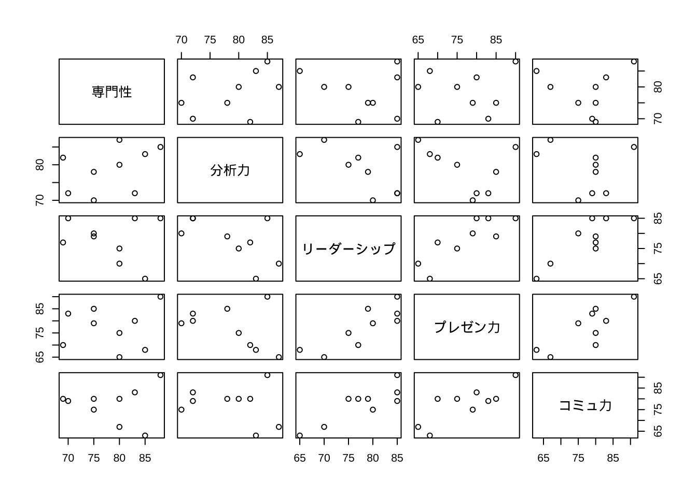

```
#>      専門性 分析力 リーダーシップ プレゼン力 コミュ力
#> 山田     80     87             70         65       67
#> 鈴木     85     83             65         68       63
#> 田中     75     70             80         79       75
#> 中村     70     72             85         83       79
#> 大野     88     85             85         90       91
#> 松井     75     78             79         85       80
#> 高木     80     80             75         75       80
#> 三浦     83     72             85         80       83
#> 佐藤     69     82             77         70       80
```

分散共分散行列に対するPCAを実行する.

```r
# 分散共分散行列に対するPCA（デフォルト)
tokuten_pc <- princomp(tokuten)
summary(tokuten_pc)
#> Importance of components:
#>                            Comp.1    Comp.2     Comp.3    Comp.4     Comp.5
#> Standard deviation     12.4807420 7.1424787 4.73037885 2.9724343 1.57269337
#> Proportion of Variance  0.6477709 0.2121478 0.09305346 0.0367422 0.01028558
#> Cumulative Proportion   0.6477709 0.8599188 0.95297222 0.9897144 1.00000000
```

- Scree plot

```r
plot(tokuten_pc)  # Scree plot = barplot of PC variances (eigenvalues)
screeplot(tokuten_pc)  # same as above
```

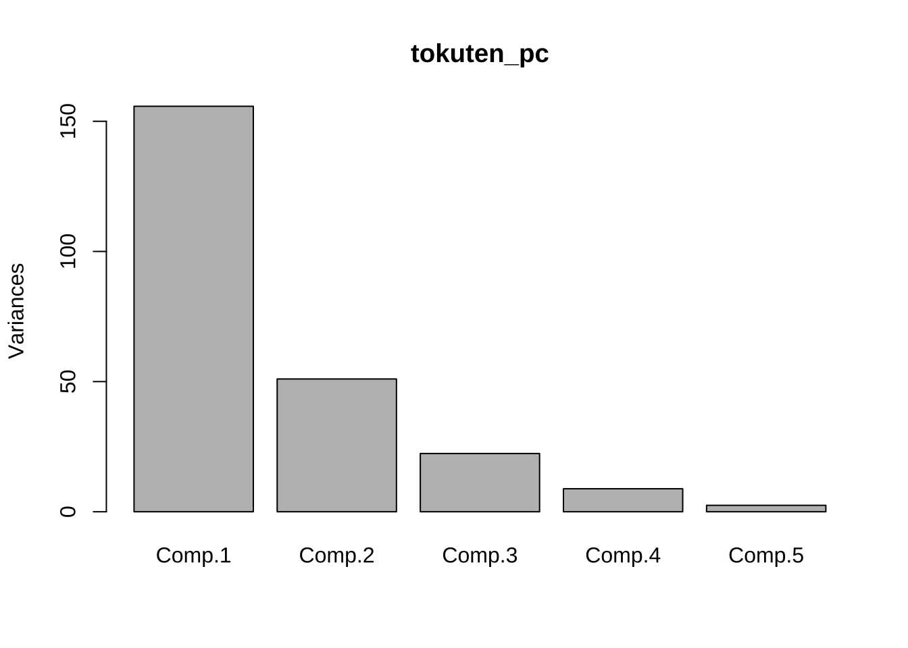

- PC負荷量

```r
# 主成分負荷量(係数)
tokuten_pc$loadings
# 可視化 (第1, 第2主成分)
barplot(tokuten_pc$loadings[, 1])
```

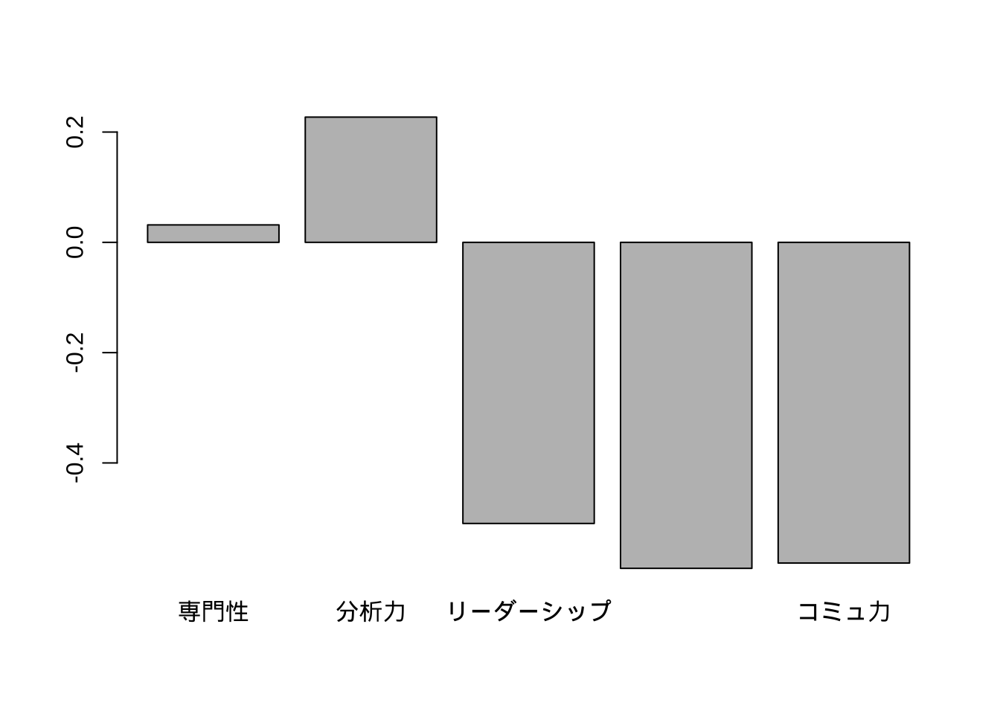

```r
barplot(tokuten_pc$loadings[, 2])
```

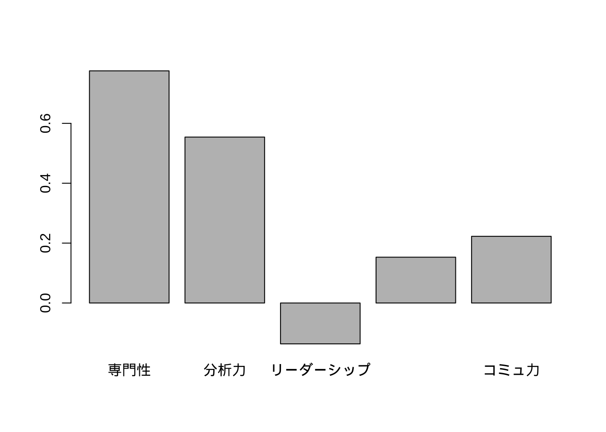

```r
# 注) prcomp()の実行結果と, 符号が逆転

# t(tokuten_pc$loadings) %*% tokuten_pc$loadings\t\t# 直交性の確認

# scatter plot for 1st & 2nd PC plot(tokuten_pc$loadings[, 1:2], type = 'n',
# main = 'PC loadings: PC1 vs PC2')\t# plot only axis text(tokuten_pc$loadings,
# colnames(tokuten))
#> 
#> Loadings:
#>                Comp.1 Comp.2 Comp.3 Comp.4 Comp.5
#> 専門性                 0.775  0.536  0.332       
#> 分析力          0.227  0.554 -0.634 -0.325  0.366
#> リーダーシップ -0.510 -0.137         0.323  0.786
#> プレゼン力     -0.591  0.153  0.275 -0.741       
#> コミュ力       -0.582  0.223 -0.486  0.362 -0.496
#> 
#>                Comp.1 Comp.2 Comp.3 Comp.4 Comp.5
#> SS loadings       1.0    1.0    1.0    1.0    1.0
#> Proportion Var    0.2    0.2    0.2    0.2    0.2
#> Cumulative Var    0.2    0.4    0.6    0.8    1.0
```

- PC得点


```r
# 主成分得点(データ毎)
tokuten_pc$scores
# plot(tokuten_pc$scores[, 1], tokuten_pc$scores[, 2], type = 'n', main = 'PC
# scores: PC1 vs PC2') text(tokuten_pc$scores[, 1], tokuten_pc$scores[, 2],
# rownames(tokuten), family = 'HiraKakuProN-W3') # 日本語文字化け対応の例 (mac)
#>          Comp.1     Comp.2      Comp.3     Comp.4     Comp.5
#> 山田  19.304343  2.7048291  -2.4411238  0.5754498  2.6750248
#> 鈴木  21.655520  4.6155395   5.6073003 -1.7490457 -0.7368287
#> 田中  -2.739766 -8.0346039   5.4765050  0.1887216 -0.4687677
#> 中村  -9.682974 -9.9826824   0.6190434 -2.0247358  1.8769769
#> 大野 -17.277425 14.9224986  -1.8787424 -1.1322419  0.8666327
#> 松井  -6.867523 -1.4328205  -0.3577567 -5.3750278 -1.0885751
#> 高木   1.694979  2.5684468  -1.6399325  1.7537323 -2.8802837
#> 三浦  -9.824535  0.5291295   4.8161616  5.9565572  0.4056066
#> 佐藤   3.737381 -5.8903368 -10.2014547  1.8065903 -0.6497859
```

- biplot

デフォルトでは, 第1,2主成分が自動選択される.

```r
# バイプロット
biplot(tokuten_pc, family = "HiraKakuProN-W3")  # 日本語文字化け対応 (mac)
```

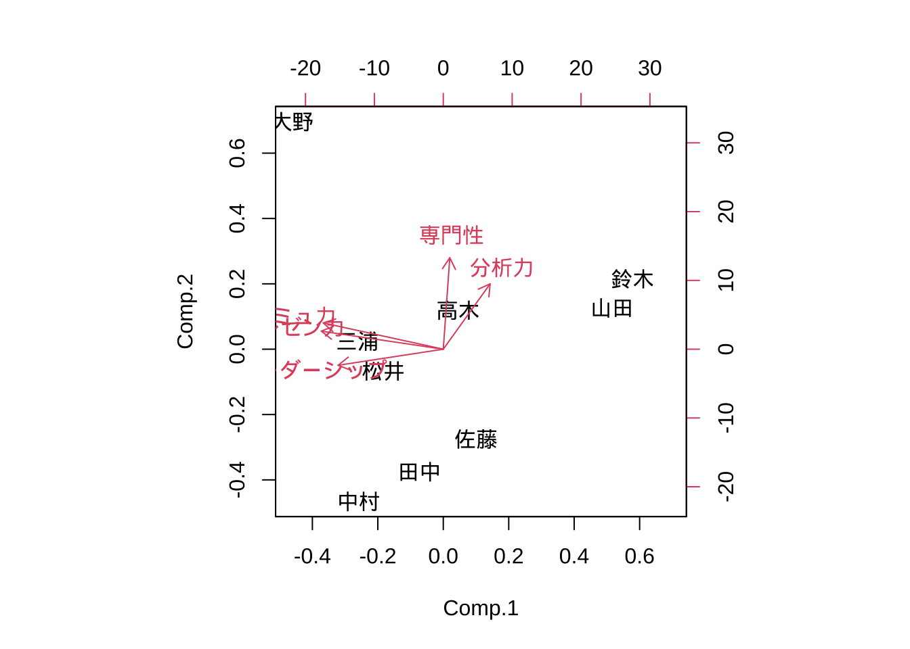

```r
# biplot(tokuten_pc)\t\t# plot PC & PC scores ===> display first 2 PCs only...
```
※ データセットに含まれる日本語が文字化けすることがある.
上のコードは macにおける対応の例であり, 各自の使用pcの環境に応じた対応が必要となる可能性がある.


```r
# 計算結果確認
(yama <- tokuten["山田", ] - apply(tokuten, 2, mean))  # demeaned score
#>        専門性   分析力 リーダーシップ プレゼン力  コミュ力
#> 山田 1.666667 8.222222      -7.888889  -12.22222 -10.55556
sum(tokuten_pc$loadings[, "Comp.1"] * yama)  # Yamada's PC1 score
#> [1] 19.30434
sum(tokuten_pc$loadings[, "Comp.2"] * yama)  # Yamada's PC2 score
#> [1] 2.704829
# compare this with tokuten_pc$scores['Yamada', ]
```

- PC得点, PC負荷量

```r
# 第1, 2主成分
tokuten_pc$scores[, 1:2]
tokuten_pc$loadings[, 1:2]
#>          Comp.1     Comp.2
#> 山田  19.304343  2.7048291
#> 鈴木  21.655520  4.6155395
#> 田中  -2.739766 -8.0346039
#> 中村  -9.682974 -9.9826824
#> 大野 -17.277425 14.9224986
#> 松井  -6.867523 -1.4328205
#> 高木   1.694979  2.5684468
#> 三浦  -9.824535  0.5291295
#> 佐藤   3.737381 -5.8903368
#>                     Comp.1     Comp.2
#> 専門性          0.03162775  0.7753770
#> 分析力          0.22710092  0.5541994
#> リーダーシップ -0.50974398 -0.1365068
#> プレゼン力     -0.59111858  0.1530044
#> コミュ力       -0.58151936  0.2227311
```


`princomp()`に代わり, `prcomp()`を使った例を示す.

```r
# 代替的関数 prcomp()\t# 不偏分散共分散行列の使用 (÷(n-1))
tokuten_prcomp <- prcomp(tokuten)
# tokuten_prcomp <- prcomp(tokuten, scale = T)
summary(tokuten_prcomp)
#> Importance of components:
#>                            PC1    PC2     PC3     PC4     PC5
#> Standard deviation     13.2378 7.5757 5.01732 3.15274 1.66809
#> Proportion of Variance  0.6478 0.2122 0.09305 0.03674 0.01029
#> Cumulative Proportion   0.6478 0.8599 0.95297 0.98971 1.00000
tokuten_prcomp$rotation  # PC負荷量
#>                        PC1        PC2         PC3        PC4         PC5
#> 専門性         -0.03162775  0.7753770  0.53571555  0.3316583 -0.02831625
#> 分析力         -0.22710092  0.5541994 -0.63357070 -0.3251925 -0.36623249
#> リーダーシップ  0.50974398 -0.1365068 -0.01367592  0.3227645 -0.78559724
#> プレゼン力      0.59111858  0.1530044  0.27483158 -0.7411911  0.04766342
#> コミュ力        0.58151936  0.2227311 -0.48567230  0.3615403  0.49561793
tokuten_prcomp$x  # PC得点
#>             PC1        PC2         PC3        PC4        PC5
#> 山田 -19.304343  2.7048291  -2.4411238  0.5754498 -2.6750248
#> 鈴木 -21.655520  4.6155395   5.6073003 -1.7490457  0.7368287
#> 田中   2.739766 -8.0346039   5.4765050  0.1887216  0.4687677
#> 中村   9.682974 -9.9826824   0.6190434 -2.0247358 -1.8769769
#> 大野  17.277425 14.9224986  -1.8787424 -1.1322419 -0.8666327
#> 松井   6.867523 -1.4328205  -0.3577567 -5.3750278  1.0885751
#> 高木  -1.694979  2.5684468  -1.6399325  1.7537323  2.8802837
#> 三浦   9.824535  0.5291295   4.8161616  5.9565572 -0.4056066
#> 佐藤  -3.737381 -5.8903368 -10.2014547  1.8065903  0.6497859
# biplot(tokuten_prcomp)
biplot(tokuten_prcomp, family = "HiraKakuProN-W3")
```

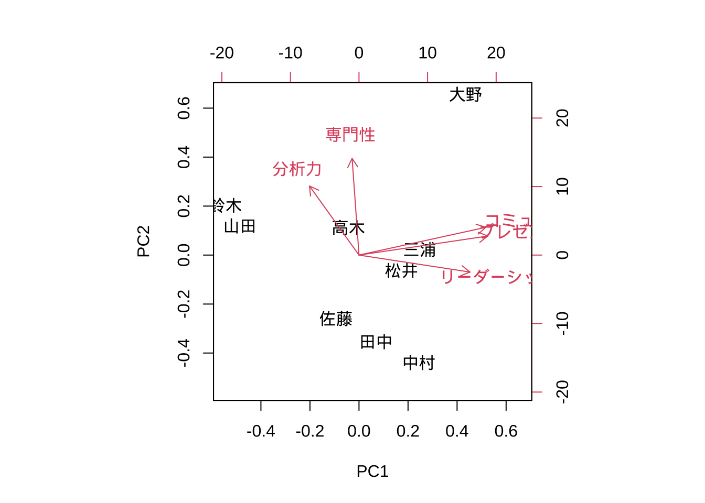

## 分散共分散行列 vs 相関行列
### データセット3: USArrests data {-}
```
USArrests
- 全米50州, 1973念
- 人口10万人当たりの凶悪犯罪(Assault, Murder, Rape)件数,  及び都市部の人口割合(UrbanPop, %)
- n = 50, p = 4
```


```r
USArrests
#>                Murder Assault UrbanPop Rape
#> Alabama          13.2     236       58 21.2
#> Alaska           10.0     263       48 44.5
#> Arizona           8.1     294       80 31.0
#> Arkansas          8.8     190       50 19.5
#> California        9.0     276       91 40.6
#> Colorado          7.9     204       78 38.7
#> Connecticut       3.3     110       77 11.1
#> Delaware          5.9     238       72 15.8
#> Florida          15.4     335       80 31.9
#> Georgia          17.4     211       60 25.8
#> Hawaii            5.3      46       83 20.2
#> Idaho             2.6     120       54 14.2
#> Illinois         10.4     249       83 24.0
#> Indiana           7.2     113       65 21.0
#> Iowa              2.2      56       57 11.3
#> Kansas            6.0     115       66 18.0
#> Kentucky          9.7     109       52 16.3
#> Louisiana        15.4     249       66 22.2
#> Maine             2.1      83       51  7.8
#> Maryland         11.3     300       67 27.8
#> Massachusetts     4.4     149       85 16.3
#> Michigan         12.1     255       74 35.1
#> Minnesota         2.7      72       66 14.9
#> Mississippi      16.1     259       44 17.1
#> Missouri          9.0     178       70 28.2
#> Montana           6.0     109       53 16.4
#> Nebraska          4.3     102       62 16.5
#> Nevada           12.2     252       81 46.0
#> New Hampshire     2.1      57       56  9.5
#> New Jersey        7.4     159       89 18.8
#> New Mexico       11.4     285       70 32.1
#> New York         11.1     254       86 26.1
#> North Carolina   13.0     337       45 16.1
#> North Dakota      0.8      45       44  7.3
#> Ohio              7.3     120       75 21.4
#> Oklahoma          6.6     151       68 20.0
#> Oregon            4.9     159       67 29.3
#> Pennsylvania      6.3     106       72 14.9
#> Rhode Island      3.4     174       87  8.3
#> South Carolina   14.4     279       48 22.5
#> South Dakota      3.8      86       45 12.8
#> Tennessee        13.2     188       59 26.9
#> Texas            12.7     201       80 25.5
#> Utah              3.2     120       80 22.9
#> Vermont           2.2      48       32 11.2
#> Virginia          8.5     156       63 20.7
#> Washington        4.0     145       73 26.2
#> West Virginia     5.7      81       39  9.3
#> Wisconsin         2.6      53       66 10.8
#> Wyoming           6.8     161       60 15.6
```


```r
summary(USArrests)
pairs(USArrests)
```

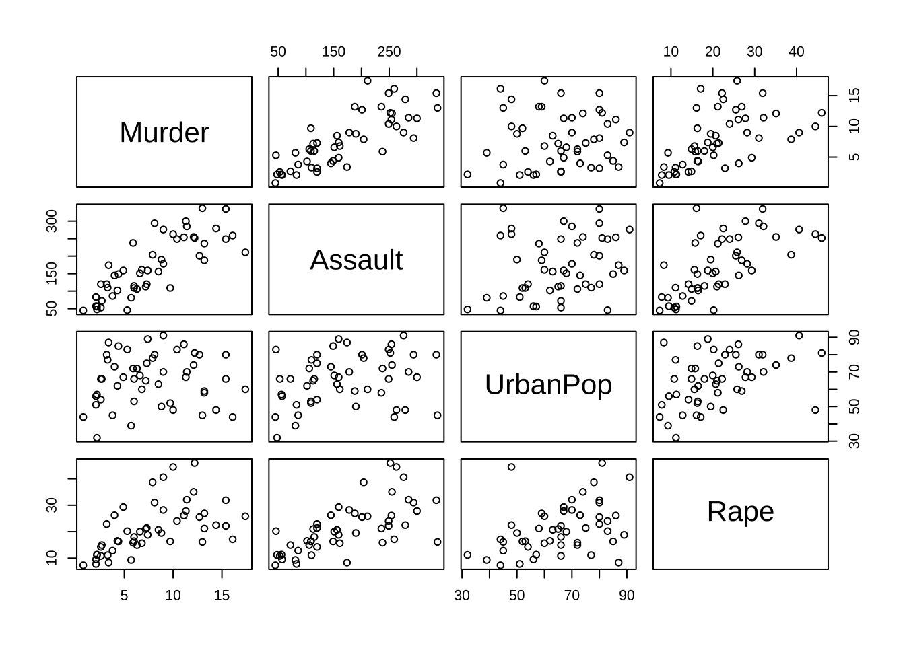

```
#>      Murder          Assault         UrbanPop          Rape      
#>  Min.   : 0.800   Min.   : 45.0   Min.   :32.00   Min.   : 7.30  
#>  1st Qu.: 4.075   1st Qu.:109.0   1st Qu.:54.50   1st Qu.:15.07  
#>  Median : 7.250   Median :159.0   Median :66.00   Median :20.10  
#>  Mean   : 7.788   Mean   :170.8   Mean   :65.54   Mean   :21.23  
#>  3rd Qu.:11.250   3rd Qu.:249.0   3rd Qu.:77.75   3rd Qu.:26.18  
#>  Max.   :17.400   Max.   :337.0   Max.   :91.00   Max.   :46.00
```

2種類のPCAを実行する.

```r
# どちらが良いか?  (pc_cr1 <- princomp(USArrests)) (pc_cr2 <-
# princomp(USArrests, cor = TRUE))
(pc_cr3 <- prcomp(USArrests))
#> Standard deviations (1, .., p=4):
#> [1] 83.732400 14.212402  6.489426  2.482790
#> 
#> Rotation (n x k) = (4 x 4):
#>                 PC1         PC2         PC3         PC4
#> Murder   0.04170432 -0.04482166  0.07989066 -0.99492173
#> Assault  0.99522128 -0.05876003 -0.06756974  0.03893830
#> UrbanPop 0.04633575  0.97685748 -0.20054629 -0.05816914
#> Rape     0.07515550  0.20071807  0.97408059  0.07232502
(pc_cr4 <- prcomp(USArrests, scale = TRUE))
#> Standard deviations (1, .., p=4):
#> [1] 1.5748783 0.9948694 0.5971291 0.4164494
#> 
#> Rotation (n x k) = (4 x 4):
#>                 PC1        PC2        PC3         PC4
#> Murder   -0.5358995  0.4181809 -0.3412327  0.64922780
#> Assault  -0.5831836  0.1879856 -0.2681484 -0.74340748
#> UrbanPop -0.2781909 -0.8728062 -0.3780158  0.13387773
#> Rape     -0.5434321 -0.1673186  0.8177779  0.08902432
```

どちらのPCAが良いか? その理由は何か?

```r
plot(pc_cr3)
```

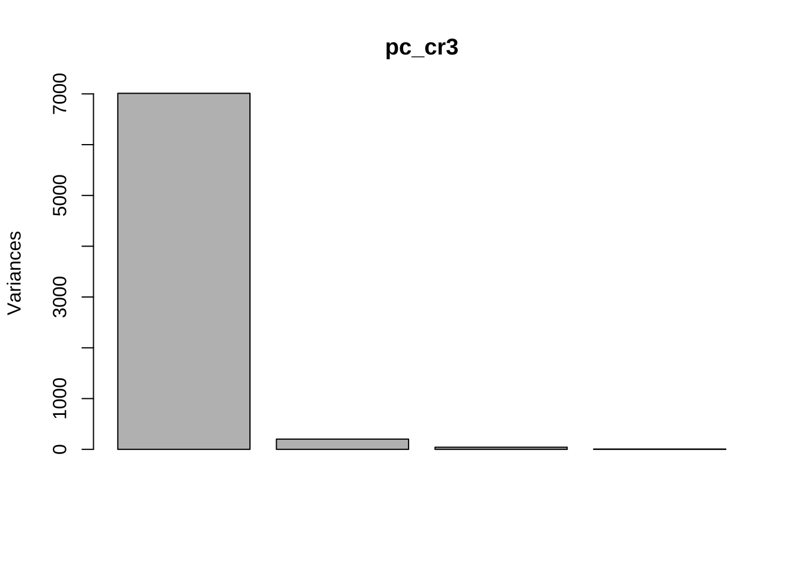

```r
summary(pc_cr3)
#> Importance of components:
#>                            PC1      PC2    PC3     PC4
#> Standard deviation     83.7324 14.21240 6.4894 2.48279
#> Proportion of Variance  0.9655  0.02782 0.0058 0.00085
#> Cumulative Proportion   0.9655  0.99335 0.9991 1.00000
plot(pc_cr4)
```

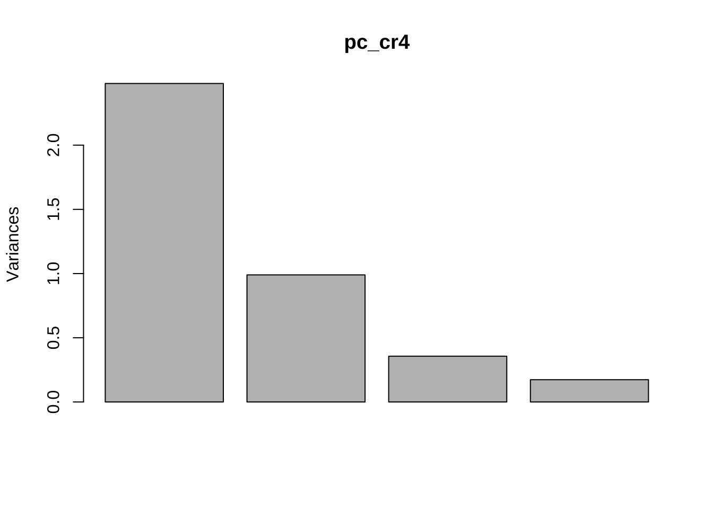

```r
summary(pc_cr4)
#> Importance of components:
#>                           PC1    PC2     PC3     PC4
#> Standard deviation     1.5749 0.9949 0.59713 0.41645
#> Proportion of Variance 0.6201 0.2474 0.08914 0.04336
#> Cumulative Proportion  0.6201 0.8675 0.95664 1.00000
```

**PCAを適用する変数を絞り込む方法**

`prcomp()`では, 式で指定できる. データセット`USArrests`のうち,
人口割合を除く3変数に対してPCAを実行する.

```r
# PCAにかける変数の絞り込み
prcomp(~Murder + Assault + Rape, data = USArrests, scale = TRUE)
#> Standard deviations (1, .., p=3):
#> [1] 1.5357670 0.6767949 0.4282154
#> 
#> Rotation (n x k) = (3 x 3):
#>                PC1        PC2        PC3
#> Murder  -0.5826006  0.5339532 -0.6127565
#> Assault -0.6079818  0.2140236  0.7645600
#> Rape    -0.5393836 -0.8179779 -0.1999436
```
