# クラスター分析


## 基本操作
ここでは, クラスター分析の基本を理解するため, 小規模でクラスタリングの
有用性を示す例としては適切と言えないが,
主成分分析の章でも使用した
従業員スキル評価データ $(n=9,p=5)$ を使用する.


```r
tokuten <- read.csv("testdat_eng.csv", skip = 1, header = T, row.names = 1)
# tokuten <- read.csv('testdat_jap.csv', skip = 1, header = T, row.names = 1)
# tokuten <- read.csv('testdat_30_eng.csv', skip = 1, header = T, row.names =
# 1) tokuten <- read.csv('testdat_30_jap.csv', skip = 1, header = T, row.names
# = 1)
```

### 階層型クラスタリング {-}
階層型クラスタリングは, Rの標準パッケージの一つ**stats**に含まれる
関数`hclust()`を用いて実行することができる.

`hclust()`への入力として, クラスタリング対象間の距離行列を与える必要がある.
もし入力データセット (`tokuten`) の個体間 (行) のクラスタリングを行うのであれば
そのまま関数`dist()`を適用すれば良い. 一方, 変数間 (列) のクラスタリングであれば,
一旦データセットを転置 (行と列の入れ替え) する必要がある.


```r
tokuten_dist <- dist(tokuten)
# method = 'binary', 'canberra', 'maximum', 'manhattan'

# 距離行列
round(tokuten_dist, 2)
#>          yamada suzuki tanaka nakamura  ohno Matsui takagi miura
#> suzuki     9.54                                                 
#> tanaka    25.96  27.55                                          
#> nakamura  31.91  35.03   9.27                                   
#> ohno      38.65  41.00  28.21    26.19                          
#> Matsui    27.50  29.98  11.22    10.10 20.00                    
#> takagi    18.52  21.73  13.82    18.14 23.13  12.04             
#> miura     30.66  32.70  12.57    13.93 18.92  13.04  14.39      
#> sato      19.72  26.34  17.18    18.30 30.90  16.76  12.41 21.66

# 距離の近い人を集めて、クラスターを形成 1:C1 = {tanaka, nakamura} 2:C2 =
# {yamada, suzuki}, or C2 = {C1, matsui} or else??  --> どちらが優先される?
```

`hclust()`のデフォルト設定では, 距離尺度はユークリッド距離,
クラスター結合方法は最遠隣法/完全連結法となっている.

```r
# 最遠隣法/完全連結法
(tokuten_hc_1 <- hclust(tokuten_dist))  # method = 'complete'
#> 
#> Call:
#> hclust(d = tokuten_dist)
#> 
#> Cluster method   : complete 
#> Distance         : euclidean 
#> Number of objects: 9
# summary(tokuten_hc_1)
```

出力オブジェクトの要素`$merge`にクラスター形成過程が格納されている.

```r
# クラスター形成履歴 マイナス付き => 個体番号. マイナス無し => クラスター番号
tokuten_hc_1$merge
#>      [,1] [,2]
#> [1,]   -3   -4
#> [2,]   -1   -2
#> [3,]   -6    1
#> [4,]   -7   -9
#> [5,]   -8    3
#> [6,]    4    5
#> [7,]   -5    6
#> [8,]    2    7
```

また, 出力オブジェクトの要素`$height`には, クラスター間の結合が行われる際の距離が格納されている.

```r
# デンドログラム (樹形図) の枝の高さ
tokuten_hc_1$height
#> [1]  9.273618  9.539392 11.224972 12.409674 13.928388 21.656408 30.903074
#> [8] 41.000000
```

このクラスター形成過程と結合距離を使うことでデンドログラムが作成される.
デンドログラムは階層的クラスタリングの結果 (クラスターの形成過程) を視覚化するための有効なツールである.


```r
# デンドログラム
par(mfrow = c(1, 2))
plot(tokuten_hc_1)
plot(tokuten_hc_1, hang = -1)  # 葉の位置(高さ)を揃える
```

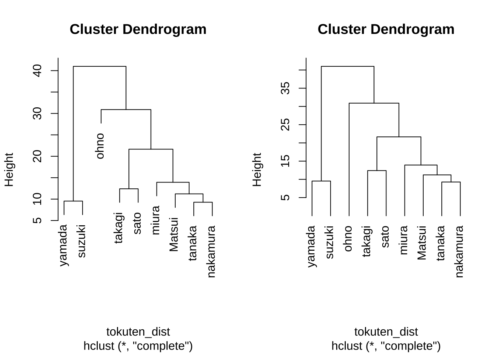

階層クラスタリングを実施しデンドログラムを作成したあと,
`cutree`にクラスター数を指定することで,
木を剪定し (細かい枝を切り落とし) て望ましい数のクラスターに絞り込んで,
個体がそれぞれ所属するクラスターに分類することができる.

```r
# 各個体の属するクラスター番号
(tokuten_cls2 <- cutree(tokuten_hc_1, k = 2))  # k: クラスター数
#>   yamada   suzuki   tanaka nakamura     ohno   Matsui   takagi    miura 
#>        1        1        2        2        2        2        2        2 
#>     sato 
#>        2
```

正解のないクラスター分析においては, 分析の目的に照らして,
(暫定的に) 得られたクラスタリングの妥当性を判断しなければならない.
そこで, 形成された各クラスターの特徴の理解を助けるために,
クラスター毎に各変数に対する要約統計量が計算されることも多い.
ここでは, $k=2$とおいた場合に, 5つの変数 (評価スコア) に関して,
各クラスターに属する個体 (従業員) の平均点を計算してみる.

```r
# 全体平均
apply(tokuten, 2, mean)
#>     Expertise     Analytics    Leadership  Presentation Communication 
#>      78.33333      78.77778      77.88889      77.22222      77.55556
# 各クラスターの特徴 (各変数の平均値) → 変数 (テスト)
# 毎に各クラスターに属する個体 (従業員) の平均を計算
by(tokuten, factor(tokuten_cls2), apply, 2, mean)
#> factor(tokuten_cls2): 1
#>     Expertise     Analytics    Leadership  Presentation Communication 
#>          82.5          85.0          67.5          66.5          65.0 
#> ------------------------------------------------------------ 
#> factor(tokuten_cls2): 2
#>     Expertise     Analytics    Leadership  Presentation Communication 
#>      77.14286      77.00000      80.85714      80.28571      81.14286
```

これより, 第1クラスターは, 専門性・分析スキル (expertise, analytics) は全体平均よりもかなり高いが,
ヒューマンスキル (leadership, presentation, communication) は逆にかなり低いグループ, 他方,
第2クラスターは全般に全体平均に近いが, 専門性・分析スキルが
相対的にやや高く, ヒューマンスキルがやや低いグループであることが分かる.


つぎに, クラスター分析におけるクラスター結合方法の影響を理解するために,
クラスター結合方法の相違によるデンドログラムの形状の違いをみてみよう.

```r
# 代替的手法
(tokuten_hc_2 <- hclust(tokuten_dist, method = "single"))  # 最近隣法
#> 
#> Call:
#> hclust(d = tokuten_dist, method = "single")
#> 
#> Cluster method   : single 
#> Distance         : euclidean 
#> Number of objects: 9
(tokuten_hc_3 <- hclust(tokuten_dist, method = "ward.D2"))  # ウォード法
#> 
#> Call:
#> hclust(d = tokuten_dist, method = "ward.D2")
#> 
#> Cluster method   : ward.D2 
#> Distance         : euclidean 
#> Number of objects: 9
(tokuten_hc_4 <- hclust(tokuten_dist, method = "average"))  # 群平均法
#> 
#> Call:
#> hclust(d = tokuten_dist, method = "average")
#> 
#> Cluster method   : average 
#> Distance         : euclidean 
#> Number of objects: 9
(tokuten_hc_5 <- hclust(tokuten_dist, method = "centroid"))  # 中心点法/重心法
#> 
#> Call:
#> hclust(d = tokuten_dist, method = "centroid")
#> 
#> Cluster method   : centroid 
#> Distance         : euclidean 
#> Number of objects: 9
(tokuten_hc_6 <- hclust(tokuten_dist, method = "median"))  # メジアン法
#> 
#> Call:
#> hclust(d = tokuten_dist, method = "median")
#> 
#> Cluster method   : median 
#> Distance         : euclidean 
#> Number of objects: 9
```


```r
par(mfrow = c(2, 2))
plot(tokuten_hc_1)
plot(tokuten_hc_2)
plot(tokuten_hc_3)
plot(tokuten_hc_4)
```

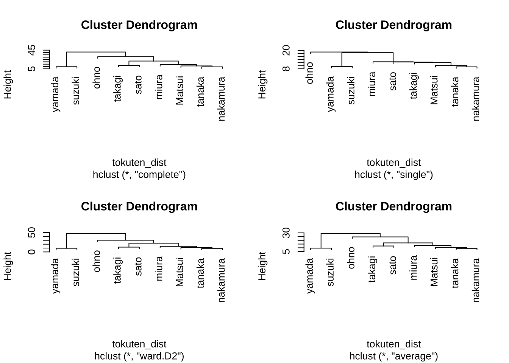

```r

par(mfrow = c(1, 2))
plot(tokuten_hc_5)
plot(tokuten_hc_6)
```

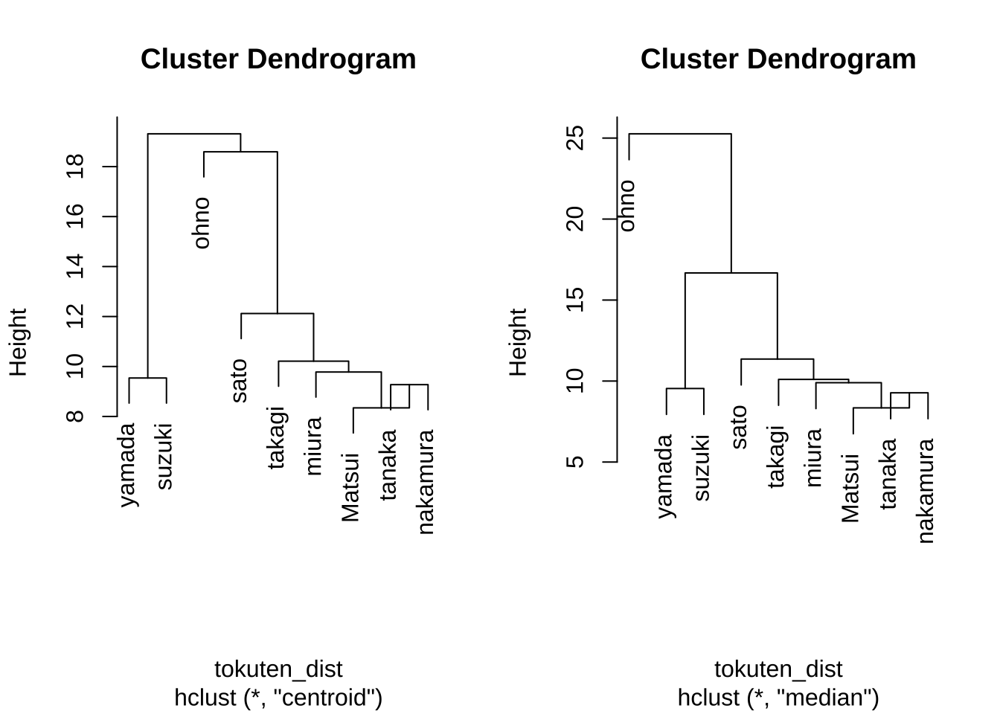

距離尺度として中心点法 (重心法) やメジアン法を選択した場合には,
「inversion (逆転) 現象」 の発生が確認される.
「inversion現象」とは、階層的クラスタリングのプロセスにおいて, 本来ならばステップが進むにつれてより"遠く"にあるクラスターと結合していくべきところ, 実際にはより"近く"のクラスターが後に統合されるという状況を指す. すなわち, 結合の順序が距離に関する単調性を失い, 距離の近い順に結合するという直感的な (本来あるべき) 順序に反する状態であり, クラスタリングがうまくいっていないことを示す.

この現象が生じた場合には, 異なる距離尺度や統合方法を検討する必要がある.

### k-means法 {-}
非階層型クラスタリングの主要な方法であるk-means法は, 
Rの標準パッケージの一つ**stats**に含まれる
関数`kmeans()`を用いて実行することができる.


```r
# k-means法
set.seed(1)
(tokuten_hc_k <- kmeans(tokuten, 3))
#> K-means clustering with 3 clusters of sizes 2, 6, 1
#> 
#> Cluster means:
#>   Expertise Analytics Leadership Presentation Communication
#> 1  82.50000  85.00000   67.50000     66.50000          65.0
#> 2  75.33333  75.66667   80.16667     78.66667          79.5
#> 3  88.00000  85.00000   85.00000     90.00000          91.0
#> 
#> Clustering vector:
#>   yamada   suzuki   tanaka nakamura     ohno   Matsui   takagi    miura 
#>        1        1        2        2        3        2        2        2 
#>     sato 
#>        2 
#> 
#> Within cluster sum of squares by cluster:
#> [1]  45.5000 540.3333   0.0000
#>  (between_SS / total_SS =  72.9 %)
#> 
#> Available components:
#> 
#> [1] "cluster"      "centers"      "totss"        "withinss"     "tot.withinss"
#> [6] "betweenss"    "size"         "iter"         "ifault"
tokuten_hc_k$cluster
#>   yamada   suzuki   tanaka nakamura     ohno   Matsui   takagi    miura 
#>        1        1        2        2        3        2        2        2 
#>     sato 
#>        2

(tokuten_hc_k <- kmeans(tokuten, 2))
#> K-means clustering with 2 clusters of sizes 7, 2
#> 
#> Cluster means:
#>   Expertise Analytics Leadership Presentation Communication
#> 1  77.14286        77   80.85714     80.28571      81.14286
#> 2  82.50000        85   67.50000     66.50000      65.00000
#> 
#> Clustering vector:
#>   yamada   suzuki   tanaka nakamura     ohno   Matsui   takagi    miura 
#>        2        2        1        1        1        1        1        1 
#>     sato 
#>        1 
#> 
#> Within cluster sum of squares by cluster:
#> [1] 996.0  45.5
#>  (between_SS / total_SS =  51.9 %)
#> 
#> Available components:
#> 
#> [1] "cluster"      "centers"      "totss"        "withinss"     "tot.withinss"
#> [6] "betweenss"    "size"         "iter"         "ifault"
tokuten_hc_k$cluster
#>   yamada   suzuki   tanaka nakamura     ohno   Matsui   takagi    miura 
#>        2        2        1        1        1        1        1        1 
#>     sato 
#>        1
```


### 変数に対するクラスタリング {-}
次に, レコード (従業員) の数値 (得点) の現れ方が類似した変数 (評価スコア) をグループにまとめるクラスタリングを行ってみよう.

```r
tokuten_dist3 <- dist(t(tokuten))
tokuten_hc3 <- hclust(tokuten_dist3, method = "ward.D2")
tokuten_hc3$merge  # クラスター形成履歴
#>      [,1] [,2]
#> [1,]   -3   -5
#> [2,]   -4    1
#> [3,]   -1   -2
#> [4,]    2    3
tokuten_hc3$height  # デンドログラム(樹形図)の枝の高さ
#> [1] 12.20656 14.61734 19.74842 44.74967
par(mfrow = c(1, 2))
plot(tokuten_hc3)
plot(tokuten_hc3, hang = -1)  # デンドログラム
```

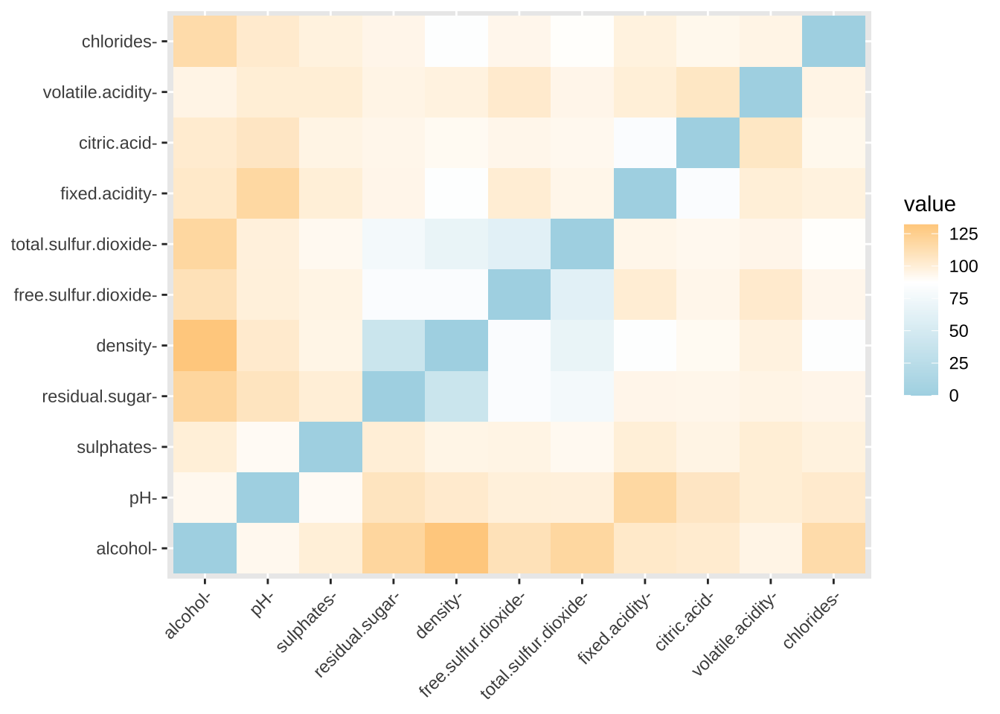


```r
(ttokuten_cls2 <- cutree(tokuten_hc3, k = 2))  # 各個体の属するクラスター番号 (k: クラスター数)
#>     Expertise     Analytics    Leadership  Presentation Communication 
#>             1             1             2             2             2
par(mfrow = c(1, 1))
```

上で行ったのと同様, 形成された各クラスターの特徴を掴むために,
$k=2$とおいた場合に, 9件のレコード (従業員) に関して,
各クラスターに属する5つの変数 (評価スコア) の平均点を計算してみる.

```r
# 全体平均
apply(t(tokuten), 2, mean)
#>   yamada   suzuki   tanaka nakamura     ohno   Matsui   takagi    miura 
#>     73.8     72.8     75.8     77.8     87.8     79.4     78.0     80.6 
#>     sato 
#>     75.6
# 各クラスターの特徴 (各個体の平均値)
by(t(tokuten), factor(ttokuten_cls2), apply, 2, mean)
#> INDICES: 1
#>   yamada   suzuki   tanaka nakamura     ohno   Matsui   takagi    miura 
#>     83.5     84.0     72.5     71.0     86.5     76.5     80.0     77.5 
#>     sato 
#>     75.5 
#> ------------------------------------------------------------ 
#> INDICES: 2
#>   yamada   suzuki   tanaka nakamura     ohno   Matsui   takagi    miura 
#> 67.33333 65.33333 78.00000 82.33333 88.66667 81.33333 76.66667 82.66667 
#>     sato 
#> 75.66667
# → 個体 (従業員) 毎に各クラスターに属する変数のクラスター平均を計算
```

第1クラスターは, 山田, 鈴木, 大野, 高木の「専門性・分析スキル」 平均点が80点を超え,
第2クラスターは中村, 大野, 松井, 三浦の「ヒューマンスキル」平均点が
80点を超える一方, 山田, 鈴木の平均点は60点台となっている.

なお, それぞれの特徴を理解している5つの変数をクラスタリングした時点で,
各クラスターの特徴は理解出来ることから, それに加えて,
(ランダムな) 評価対象者の観測値の平均を使って
各々の特徴を記述する作業は, さらに理解が深まるとは言えない. 先の従業員に対するクラスタリングの場合とは異なり,
特別の意図や目的がない限り要約統計量の計算は不必要であろう.

<!---
なお, このデータセット例のように,
従業員の能力評価のために設計され収集された
5つの変数が作るクラスターの特徴について, 
(ランダムな) 評価対象者の観測値の平均を使って記述することは,
上の従業員に対するクラスタリングの場合とは異なり,
解釈性や説得性に欠ける. 


恐らくは, 評価対象者に関する
前提知識, 共通理解がない限りは不必要な作業と言えるだろう.
-->

## データ分析例
### データセット (1): ワイン品質データ (再掲) {-}

回帰木で使用したワイン品質データを使用する.
ここでは, 回帰問題において目的変数であったワイン品質`quality`
は除き, ワインの化学的特性を表す11の変数のみを用いて,
白ワインのデータセットをクラスター分類することを試みる.

```
- winequality-white.csv
   - fixed acidity: 酢酸濃度
   - volitle acidity: 揮発酸濃度
   - citric acidity: クエン酸濃度
   - chlorides: 塩化物
   - sulfur dioxide: 二酸化硫黄
   - sulphate: 硫酸塩
   - fixed acidity: 酒石酸含有量（g/dm3)
   - volatile acidity: 酢酸含有量（g/dm3)
   - citric acid: クエン酸含有量（g/dm3)
   - residual sugar: 残留糖分含有量（g/dm3）
   - chlorides: 塩化ナトリウム含有量（g/dm3)
   - free sulfur dioxide: 遊離亜硫酸含有量（mg/dm3）
   - total sulfur dioxide: 総亜硫酸含有量（mg/dm3）
   - density: 密度（g/dm3)
   - pH:	pH
   - sulphates: 硫酸カリウム含有量（g/dm3）
   - alcohol: アルコール度数（% vol.）
   - quality: ワインの品質 (0 (very bad) -- 10 (excellent))
```


```r
winedat <- read.csv("winequality-white.csv", sep = ";", skip = 1, header = T)
wine <- winedat[, -12]  # qualityを除く
wine_s <- scale(wine)  # 標準化
```

#### レコードのクラスタリング {-}
個別のワイン (行) を, 11個の化学的特性 (列) に関する類似性によりクラスタリングする.


```r
# wine_dist <- dist(wine)
wine_dist <- dist(wine_s)

# method = 'binary', 'canberra', 'maximum', 'manhattan'
(wine_hc <- hclust(wine_dist, method = "ward.D2"))  # ウォード法
#> 
#> Call:
#> hclust(d = wine_dist, method = "ward.D2")
#> 
#> Cluster method   : ward.D2 
#> Distance         : euclidean 
#> Number of objects: 4898
plot(wine_hc, labels = F, main = "wineデータ (標準化後): レコードのクラスタリング\nEuclidean + Ward",
  family = "HiraKakuProN-W3")
# plot(wine_hc, labels=F, main='wineデータ (標準化前):
# レコードのクラスタリング\nEuclidean + Ward')

# 指定したクラスター数kで, デンドログラムを切断
rect.hclust(wine_hc, k = 5, border = "red")
rect.hclust(wine_hc, k = 9, border = "blue")
```

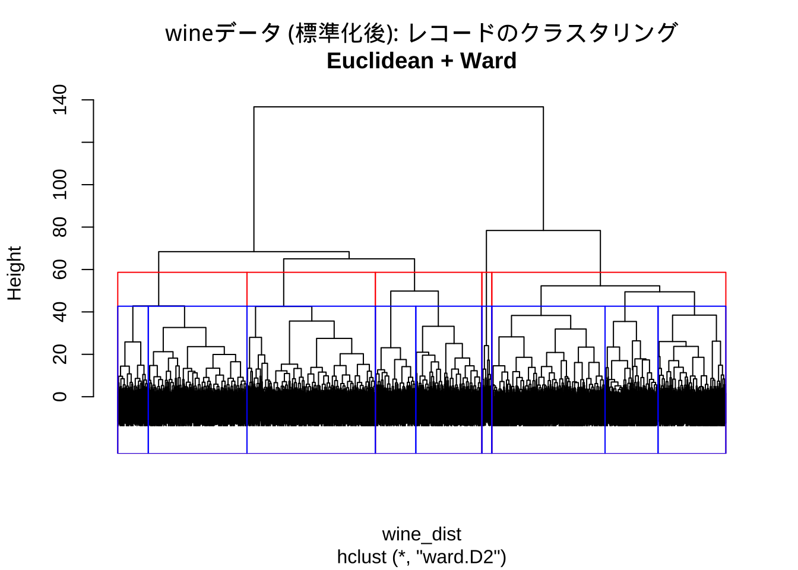

レコード (ワイン) をその化学的特性によってグルーピングしたいという目的はともかく,
レコードの件数の多い場合には, デンドログラムの描画は有益とは言えない.

#### 変数のクラスタリング {-}
次に, クラスタリングの対象を行から列に変えて実行してみる.
具体的には, 11個の化学的特性 (列) を, 個別ワインでの現れ方・含有量の大きさの類似性によりクラスタリングする.


```r
# wine_dist <- dist(t(wine))
wine_dist <- dist(t(wine_s))
(wine_hc <- hclust(wine_dist, method = "ward.D2"))  # ウォード法
#> 
#> Call:
#> hclust(d = wine_dist, method = "ward.D2")
#> 
#> Cluster method   : ward.D2 
#> Distance         : euclidean 
#> Number of objects: 11
plot(wine_hc, main = "wineデータ (標準化後): 変数のクラスタリング\nEuclidean + Ward",
  family = "HiraKakuProN-W3")
```

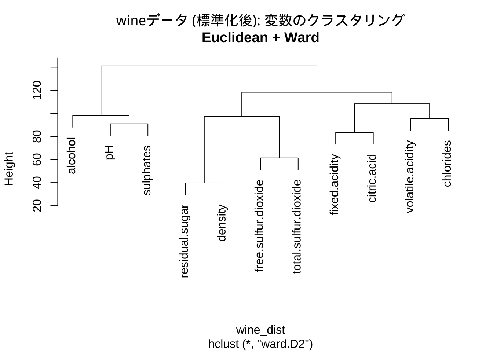

```r
# plot(wine_hc, main='wineデータ (標準化前): 変数のクラスタリング\nEuclidean +
# Ward')
```

- クラスター間距離による結果の相違

```r
(wine_hc <- hclust(wine_dist, method = "complete"))
#> 
#> Call:
#> hclust(d = wine_dist, method = "complete")
#> 
#> Cluster method   : complete 
#> Distance         : euclidean 
#> Number of objects: 11
plot(wine_hc, main = "wineデータ (標準化後): レコードのクラスタリング\nEuclidean + complete",
  family = "HiraKakuProN-W3")
```

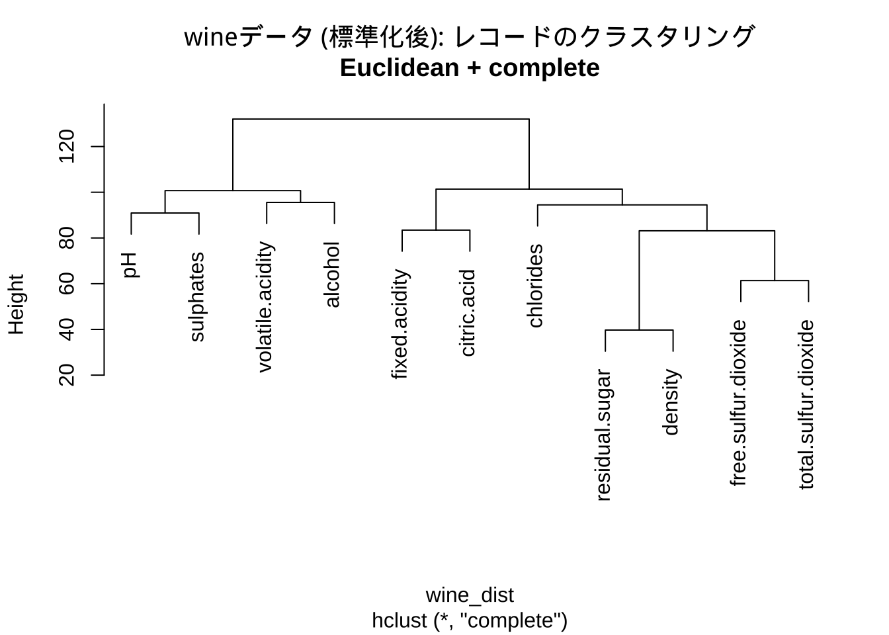

```r
(wine_hc <- hclust(wine_dist, method = "single"))
#> 
#> Call:
#> hclust(d = wine_dist, method = "single")
#> 
#> Cluster method   : single 
#> Distance         : euclidean 
#> Number of objects: 11
plot(wine_hc, main = "wineデータ (標準化後): レコードのクラスタリング\nEuclidean + single",
  family = "HiraKakuProN-W3")
```

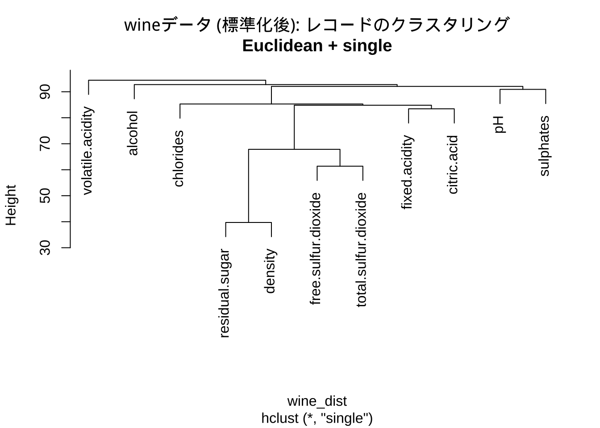

```r
(wine_hc <- hclust(wine_dist, method = "average"))
#> 
#> Call:
#> hclust(d = wine_dist, method = "average")
#> 
#> Cluster method   : average 
#> Distance         : euclidean 
#> Number of objects: 11
plot(wine_hc, main = "wineデータ (標準化後): レコードのクラスタリング\nEuclidean + average",
  family = "HiraKakuProN-W3")
```

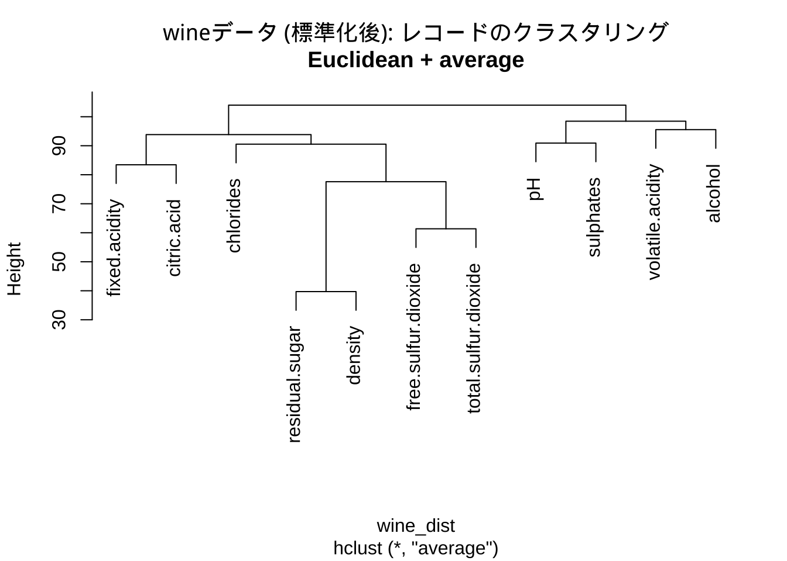

```r
(wine_hc <- hclust(wine_dist, method = "centroid"))
#> 
#> Call:
#> hclust(d = wine_dist, method = "centroid")
#> 
#> Cluster method   : centroid 
#> Distance         : euclidean 
#> Number of objects: 11
plot(wine_hc, main = "wineデータ (標準化後): レコードのクラスタリング\nEuclidean + centroid",
  family = "HiraKakuProN-W3")
```

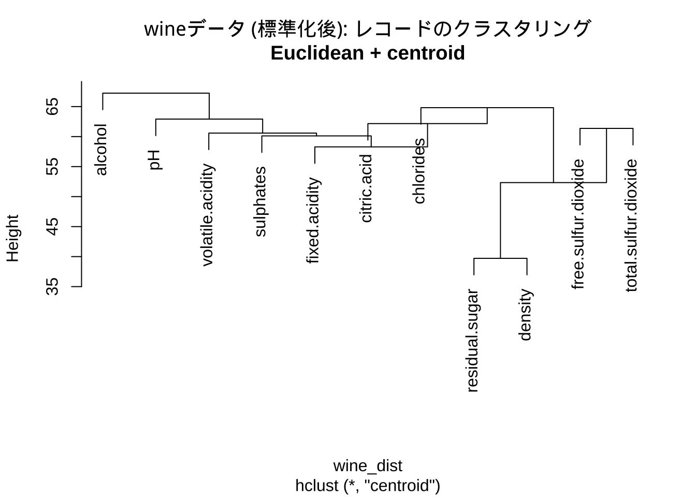

重心法 (中心点法)において,
inversion現象の発生が確認される.


#### クラスタリング結果の可視化の工夫 {-}
パッケージ**factoextra**は, 様々ななクラスタリングのアルゴリズムの他,
可視化のツールも提供する. 例えば, `fvizz_dist()`は, 距離行列を可視化する関数である.

```r
library(factoextra)  # clustering algorithms & visualization
fviz_dist(dist(t(wine_s)), gradient = list(low = "lightblue", mid = "white", high = "orange"))
```


また, 関数`fviz_cluster()`はクラスター分析の結果を可視化する関数である. 2次元を超える変数がある場合には, PCAを実行し第2主成分までを使ってプロットを行う.
なお, この関数は`kmeans()`の結果には対応するが, `hclust()`には直接対応していないため,
階層型クラスタリングの結果を可視化したい場合には, パッケージ**factoextra**に含まれる
`eclust()`を実行する必要がある (同関数はwrapper関数で, 内部で`hclust()`を呼び出す).

```r
wine_kmeans2 <- kmeans(t(wine_s), 2)  # 変数 (科学的特性) のクラスタリング
wine_eclust <- eclust(t(wine_s), FUNcluster = "hclust", k = 3)
# pos_eclust <- eclust(t(wine_s), FUNcluster = 'hclust', nboot = 2) #
# デフォルトではgap統計量を使って最適なkを決定
# (bootstrapをgap統計量の計算に使用)
fviz_cluster(wine_eclust)
```

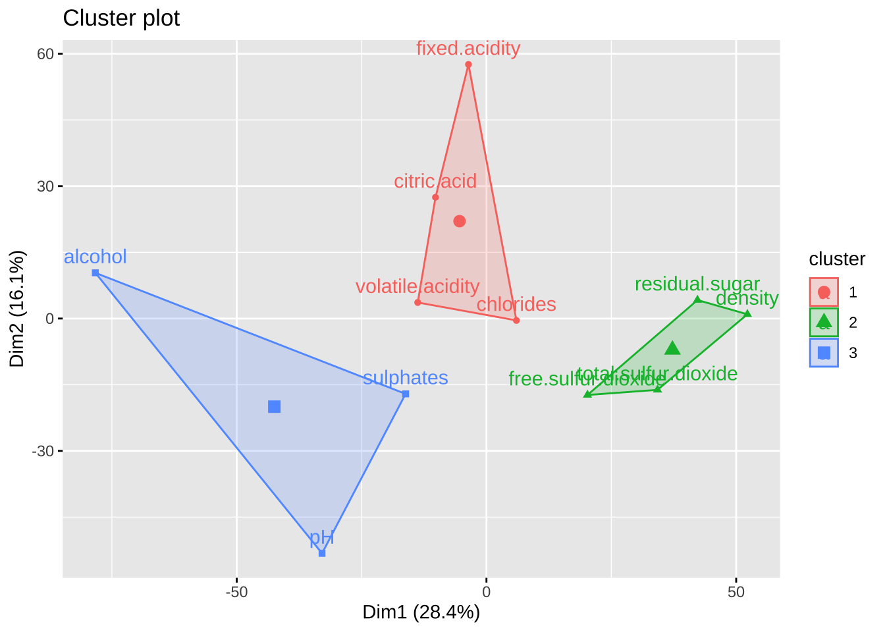


### データセット (2): (ID無し) POSデータ {-}

地方のサービスエリアの売店のレシートデータ500件 (実際のデータに加工を加えた上でランダムにサブセット化. オリジナルの地域・店舗が特定されないように工夫).

```
"pos_sample500_dist.csv"
- n = 500, p = 16
- 行: レシート (顧客の一回当り購入バスケット)
- 列: "洋菓子土産"〜"デザート類"までの16分類の商品群
- 値: 対応するレシートに含まれる対応する商品の売上個数 (0,1,2,...)
```

#### データ読み込み & 距離行列の計算 {-}

```r
# posデータの読み込み
posdat <- read.csv(file("pos_sample500_dist.csv", encoding = "Shift_JIS"))  # 500件
```

#### 階層クラスタリング {-}
16個の商品分類 (列) を, それらの買われ方 (レシートへの反映のされ方) の類似性によって, クラスタリングする.

```r
# 商品分類間の距離行列
pos_dist <- dist(t(posdat))  # カテゴリー間の距離
# pos_dist <- dist(posdat)\t\t\t# 顧客間の距離
```


```r
pos_hc <- hclust(pos_dist, method = "ward.D2")
pos_hc$merge  # クラスター形成履歴
#>       [,1] [,2]
#>  [1,]   -9  -10
#>  [2,]   -6  -13
#>  [3,]   -7    1
#>  [4,]    2    3
#>  [5,]   -8    4
#>  [6,]   -3    5
#>  [7,]  -16    6
#>  [8,]  -11    7
#>  [9,]   -5    8
#> [10,]  -12    9
#> [11,]  -14   10
#> [12,]   -4   11
#> [13,]  -15   12
#> [14,]   -1   13
#> [15,]   -2   14
pos_hc$height  # デンドログラム(樹形図)の高さ
#>  [1]  7.280110  8.062258  8.103497  8.644844  9.014803  9.549370  9.702724
#>  [8] 10.785793 12.548572 13.754999 15.099669 18.753461 30.374223 41.487118
#> [15] 65.724108
plot(pos_hc, hang = -1, family = "HiraKakuProN-W3")
```

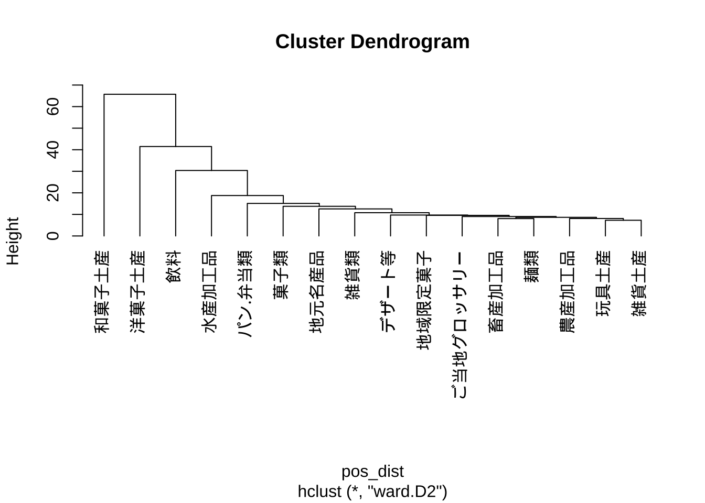

```r
# 問題点?
```

デンドログラム内に「chaining現象」が発生していることが分かる.

「chaining現象」は, クラスターが連鎖的に長く伸びる形で形成される現象を指す.
この現象は, 階層クラスタリングの過程で, 一つのクラスターが次々に近くのデータ点を吸収して成長していくことで生する.

chaining現象は, 特に, 単連結法で生じやすいと考えられる. 本来異なるクラスターに属すべきデータポイントが, 同一のクラスターに統合されてしまうことで, データの真の構造を見落としてしまう可能性がある.
対処法として, クラスター間の結合方法を変える (単連結法から他の方法) ことでchaining現象の影響を軽減できる場合がある. また, 距離尺度を変更することで軽減できる場合がある.

このposデータの取る値は, 各レシートごとの商品群の購買個数を表している.
同時購買されやすい・されにくいが商品群間の距離に反映されてしまっている. 
ここでは, データに加工を施し, 値が購買個数 (頻度) → 購買有無 (0/1) に変換してみる.

```r
posdat2 <- posdat
posdat2[posdat2 >= 2] <- 1
pos_dist2 <- dist(t(posdat2))
#
pos_hc2 <- hclust(pos_dist2, method = "ward.D2")
pos_hc2$merge  # クラスター形成履歴
#>       [,1] [,2]
#>  [1,]   -7   -9
#>  [2,]  -10    1
#>  [3,]  -16    2
#>  [4,]   -3  -13
#>  [5,]    3    4
#>  [6,]   -6    5
#>  [7,]   -5    6
#>  [8,]  -11  -14
#>  [9,]   -8    7
#> [10,]    8    9
#> [11,]  -12   10
#> [12,]   -4   11
#> [13,]   -1   -2
#> [14,]  -15   12
#> [15,]   13   14
pos_hc2$height  # デンドログラム(樹形図)の高さ
#>  [1]  4.472136  4.760952  4.983305  5.099020  5.369668  5.550633  6.989788
#>  [8]  7.348469  7.348469  8.011356  9.468448  9.536032 15.874508 16.016132
#> [15] 20.502178
plot(pos_hc2, hang = -1, family = "HiraKakuProN-W3")
```

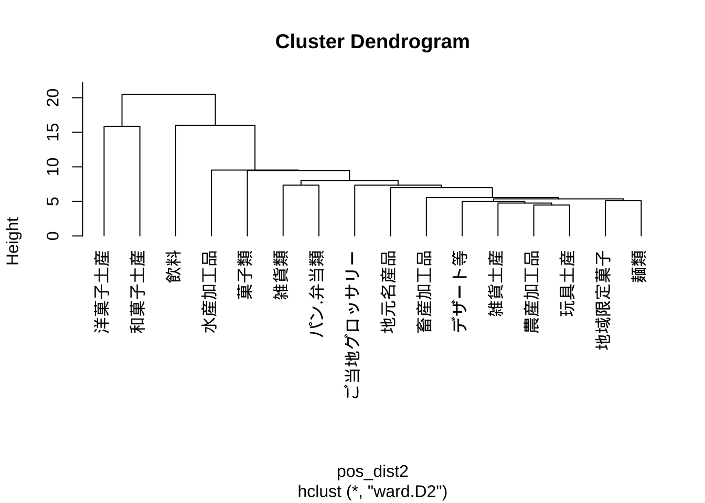

更新されたデンドログラムより, chainingが緩和されたのが確認される.

次に, 距離尺度およびクラスター結合方法の変更を試みる. ここでは, 距離尺度としてコサイン距離を,
クラスター結合方法としてウォード法を採用する.

```r
# マンハッタン距離 pos_dist <- dist(t(posdat), method = 'manhattan')\t\t

# cosine距離の使用
library(proxy)
# 購買個数
pos_dist <- proxy::dist(t(posdat), method = "cosine")  # cosine距離
pos_hc <- hclust(pos_dist, method = "ward.D2")
plot(pos_hc, hang = -1, family = "HiraKakuProN-W3")
```

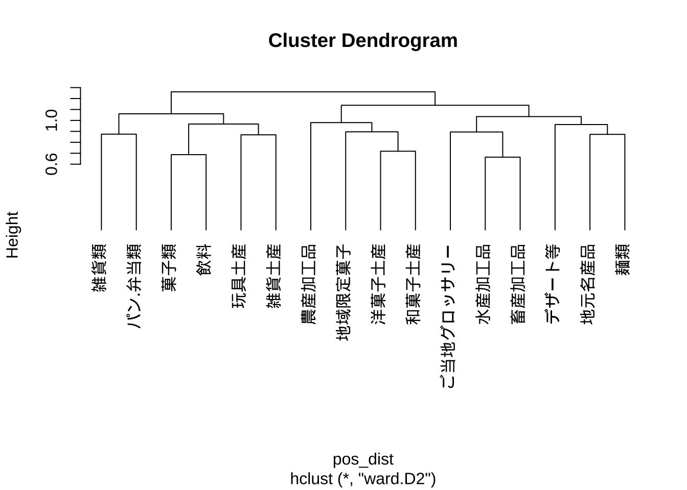

```r
# 購買有無
pos_dist2 <- proxy::dist(t(posdat2), method = "cosine")  # cosine距離
pos_hc2 <- hclust(pos_dist2, method = "ward.D2")
plot(pos_hc2, hang = -1, family = "HiraKakuProN-W3")
```

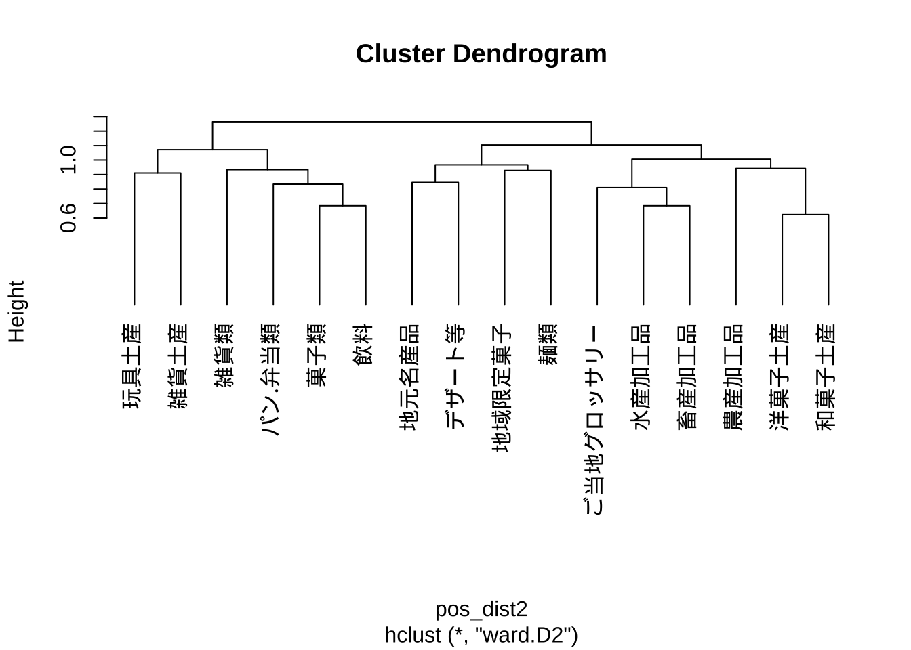

以上, データ間の距離やクラスター結合方法の選択が結果に大きく影響することが確認される.

#### 次元縮約 → 顧客 (レシート) のクラスタリング {-}
つぎに, 顧客 (レシート) のクラスタリングを行う.
変数の次元が大きい場合には, クラスタリングの実行に先立って,
類似性を測る変数の次元を落とすのが効果的なことが多い.
本データセットの商品分類数 (16) は大きいとは言えないが,
手順例を紹介する. ここでは, PCAによる次元縮約によって
事前に5つに絞り込んでおく.
(なお, "超高次元"の場合には, 通常のPCAはうまく機能しないことが
理論的に示されているため, 別途対応が必要となる.)


```r
# 変数(商品)に関して次元縮約pca実行 posdat_pc <- prcomp(posdat)
posdat_pc <- prcomp(posdat, scale. = T)  # 標準化
summary(posdat_pc)
#> Importance of components:
#>                            PC1     PC2     PC3     PC4     PC5    PC6     PC7
#> Standard deviation     1.26384 1.22037 1.10340 1.07873 1.03901 1.0245 0.99523
#> Proportion of Variance 0.09983 0.09308 0.07609 0.07273 0.06747 0.0656 0.06191
#> Cumulative Proportion  0.09983 0.19291 0.26901 0.34174 0.40921 0.4748 0.53672
#>                           PC8    PC9    PC10    PC11    PC12    PC13   PC14
#> Standard deviation     0.9911 0.9847 0.96511 0.93339 0.91726 0.89735 0.8772
#> Proportion of Variance 0.0614 0.0606 0.05821 0.05445 0.05259 0.05033 0.0481
#> Cumulative Proportion  0.5981 0.6587 0.71693 0.77138 0.82397 0.87430 0.9224
#>                          PC15    PC16
#> Standard deviation     0.8070 0.76844
#> Proportion of Variance 0.0407 0.03691
#> Cumulative Proportion  0.9631 1.00000
plot(posdat_pc, family = "HiraKakuProN-W3")
```

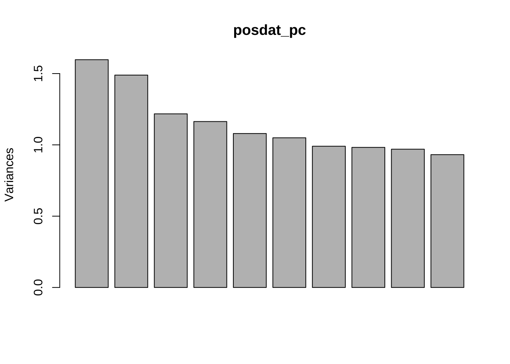

```r

# 主成分得点 (第5主成分まで選択)
posdat_score5 <- posdat_pc$x[, 1:5]
# → クラスタリングに使用
```


```r
# 主成分負荷量
posdat_pc$rotation[, 1:5]
#>                            PC1         PC2         PC3          PC4         PC5
#> 洋菓子土産          0.19801045 -0.41680964  0.07830286 -0.204893941  0.15189427
#> 和菓子土産          0.31926545 -0.17429488  0.29451622 -0.024368667 -0.06823826
#> 地域限定菓子        0.11093983 -0.21464500  0.08853735 -0.122379290  0.51464240
#> 水産加工品          0.38402139  0.47345139  0.12406842  0.018704524 -0.05301032
#> 地元名産品          0.28312609  0.25920695  0.07566671  0.432182990  0.21885500
#> 畜産加工品          0.31510689  0.36152933  0.04970947 -0.404289871  0.10659114
#> 農産加工品          0.14914158 -0.03604771  0.16126513  0.142280575 -0.30221851
#> ご当地グロッサリー  0.20348286  0.20049364  0.03892426 -0.150258935 -0.38320847
#> 玩具土産           -0.18783969  0.06869904  0.48245433 -0.205983425  0.07184299
#> 雑貨土産           -0.08771897  0.09893981  0.46577309 -0.185847154 -0.18455564
#> 雑貨類             -0.13980819  0.13804035 -0.38617293 -0.166604346 -0.17361526
#> 菓子類             -0.33688987  0.10484451  0.32900498 -0.001601135  0.21715666
#> 麺類                0.21239584  0.14992291 -0.10107137 -0.106430151  0.49276377
#> パン.弁当類        -0.14576690  0.29113765 -0.32482427 -0.311169546  0.14077896
#> 飲料               -0.46157964  0.32927414  0.15896997  0.041046373  0.11399644
#> デザート等         -0.02334359  0.16142448  0.01003826  0.578340358  0.12251255
# 可視化
library(tidyverse)
posdat_longer <- posdat_pc$rotation[, 1:5] %>%
  as.data.frame() %>%
  rownames_to_column(var = "item") %>%
  pivot_longer(cols = 2:6, names_to = "pc", values_to = "value")
ggplot(posdat_longer, aes(x = item, y = value)) + geom_col() + facet_grid(pc ~ .)
```

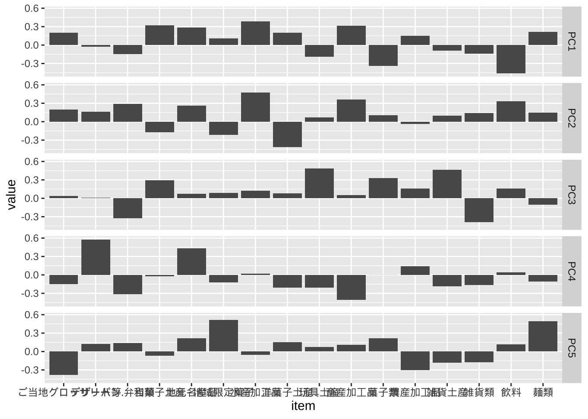

主成分得点 (5変数) に集約後のレコード間の距離行列を計算し,
これを使ってウォード法により階層型クラスタリングを行う.

```r
# 主成分得点 (5変数) に集約後のレコード間の距離
posdat_dist5 <- dist(posdat_score5)  # レコード間
# posdat_dist5 <- dist(t(posdat_score5)) # 合成変数間 階層型クラスタリング
posdat_hc5 <- hclust(posdat_dist5, method = "ward.D2")
plot(posdat_hc5, family = "HiraKakuProN-W3")
# デンドログラムの切断
rect.hclust(posdat_hc5, k = 8, border = "blue")
```

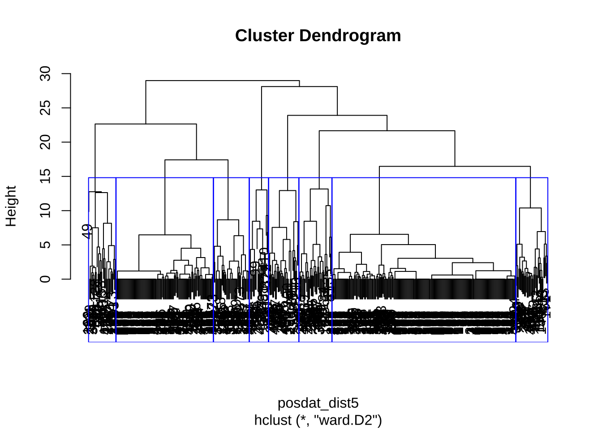

```r

# pos_km5 <- FitKMeans(posdat_score5, max.cluster = 20, seed = 1)
# PlotHartigan(pos_km5)
```

上では, 顧客 (レシート) に対して階層クラスタリングを実施したが,
件数の多い場合には, 注意が必要である.
主な問題点は計算コストと可視化の困難さである. 階層的クラスタリングにおいて, データ点の数が非常に多い場合, 計算時間やメモリ消費が膨大になる可能性がある (全てのデータ点間で距離を計算し, これらの距離に基づいて段階的にクラスターを形成する必要性) .
また, データポイントの数が多い場合、デンドログラムは非常に密集してしまい、個々のクラスターやクラスタリングの構造を解釈することが困難で, 有益な情報を得られにくくなる.


## クラスター数$k$の決定
クラスター数$k$の大きさは分析者が決める必要がある.
階層型クラスタリングにおいては, 事前に$k$を定めずに,
得られたデンドログラムを見てから決定することもできる.
一方, K-means法においてはそもそも$k$を与えないとクラスタリングが行われない.

クラスター分析の目的に応じて, 専門知識や経験に基づいた
決定が最優先されるべきであるが,
最適な大きさを決定するの補助的な役割を果たすものとして,
データから計算される定量的な方法を参考にするのも良い.

### エルボー法 {-}
代表的な手法として, エルボー法は, クラスター数 vs クラスター内誤差
(SSE) をプロットし, クラスター数を増やしても誤差の減少が小さくなるポイント ("エルボー") を見つけ, その点を最適なクラスター数$K$として選択する方法である.

<!-- コード出所: https://uc-r.github.io/kmeans_clustering#silo -->

```r
library(purrr)
# クラスター数kに対して, クラスター内平方和を計算する関数
withinSS <- function(k, df) {
  kmeans(df, k, nstart = 10)$tot.withinss
}

# クラスター内平方和の計算: k=1,...,15 パッケージpurrrの関数map_dbl()を使って,
# forループを使わずに一気に計算する
set.seed(1)
k_values <- 1:15
withinSS_values <- map_dbl(k_values, withinSS, df = t(posdat2))

plot(k_values, withinSS_values, type = "b", pch = 20, frame = FALSE, xlab = "クラスター数 k",
  ylab = "クラスター内平方和")
```

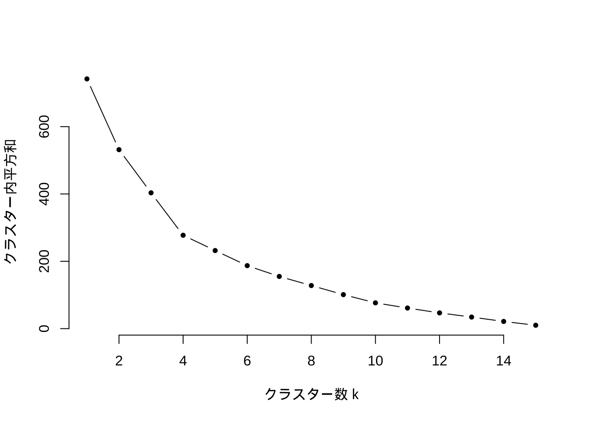

今回のposデータセットの商品群については, 明確な"エルボー"が見られない.


### Hartiganルール {-}
Hartiganルールでは, $k$から $(k+1)$個目のクラスターを加えるか否かの判定を逐次行い,
最適なクラスター数$K$を決定する.

```r
library(useful)
seed_val <- 1
# FitKMeans(): K-means法を順次実行し, Hartigan数を計算 pos_km <-
# FitKMeans(posdat2, max.cluster = 20, seed = seed_val)\t# 客
pos_km_item <- FitKMeans(t(posdat2), seed = seed_val)  # 商品
pos_km_item
#>    Clusters Hartigan AddCluster
#> 1         2 5.534495      FALSE
#> 2         3 4.038035      FALSE
#> 3         4 5.548609      FALSE
#> 4         5 2.156583      FALSE
#> 5         6 2.395935      FALSE
#> 6         7 1.863343      FALSE
#> 7         8 1.687500      FALSE
#> 8         9 1.688485      FALSE
#> 9        10 2.080690      FALSE
#> 10       11 1.259245      FALSE
#> 11       12 1.233512      FALSE
# (クラスター数, Hartigan数, クラスターを追加するべきか否か)
PlotHartigan(pos_km_item)  # 閾値=10(デフォルト)
```

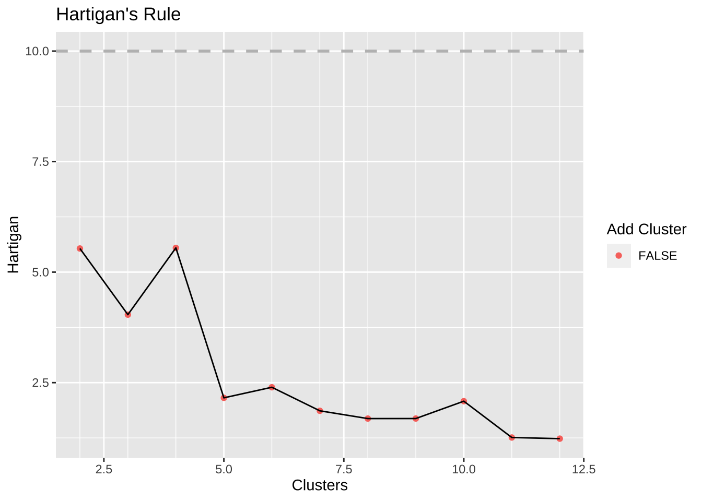

上記出力によれば, いずれの$k$においても閾値 (10) を上回ることはなく,
スタートの大きさ (1) からクラスター数を増やすことは勧められない.

<!--
FitKMeans()
A data.frame consisting of columns, for the number of clusters, the Hartigan Number and whether that cluster should be added, based on Hartigan's Number.
-->


### 平均シルエット法 {-}
シルエット値は, 各データ点がどの程度, 所属するクラスターに適しているかを評価する指標であり,
そのデータ点を含むクラスター内の平均距離と, そのデータ点と最も近い別のクラスターの平均距離の差として計算される. その差が大きいほど, そのデータ点は所属するクラスターに適していると判断される.
さらに, データ点全体を使って, シルエット値の平均を計算し, それが最大になるクラスター数を選択する.


```r
library(cluster)
# クラスター数kに対して, 平均シルエット値を計算する関数
avg_slh <- function(k, df) {
  km.res <- kmeans(df, centers = k, nstart = 25)
  ss <- silhouette(km.res$cluster, dist(df))
  mean(ss[, 3])
}

# 平均シルエット値の計算: k=2,...,15
set.seed(1)
k_values <- 2:15
avg_slh_values <- map_dbl(k_values, avg_slh, t(posdat2))

plot(k_values, avg_slh_values, type = "b", pch = 20, frame = FALSE, xlab = "クラスター数 k",
  ylab = "平均シルエット値")
```

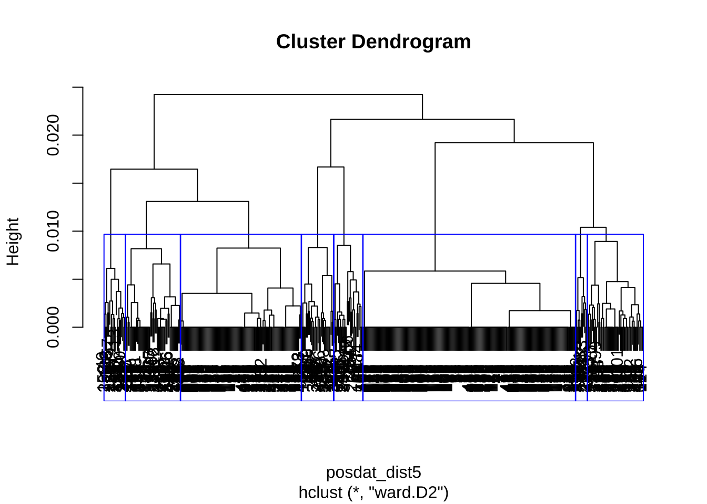

プロットでは$k=2$の時が最大, 次に$k=4$が2番目に大きな値となっている.


## 発展的なクラスター分析


先に使用した従業員評価データ (拡張版) をここでも使用する.
距離としては, 相関係数 (類似度) をベースにしたcosine距離 (=1-相関係数) を使用する.

```r
tokuten <- read.csv("testdat_30_jap.csv", skip = 1, header = T, row.names = 1)
```
### 関数`agnes` {-}
パッケージ**cluster**内にある関数`agnes` (AGglomerative NESting) を使うことで, 階層型クラスタリングをより高度に制御しながら実行することが可能.

```r
library(cluster)
dist_matrix <- as.dist(1 - cor(tokuten))
res_agnes <- agnes(dist_matrix, method = "average")
plot(res_agnes)
```

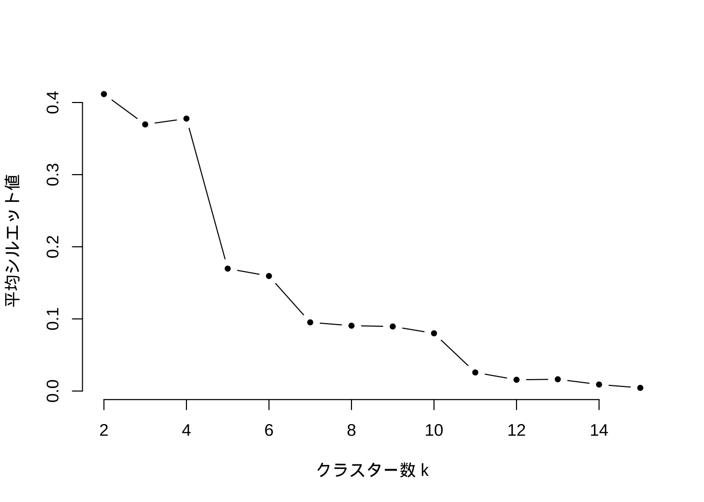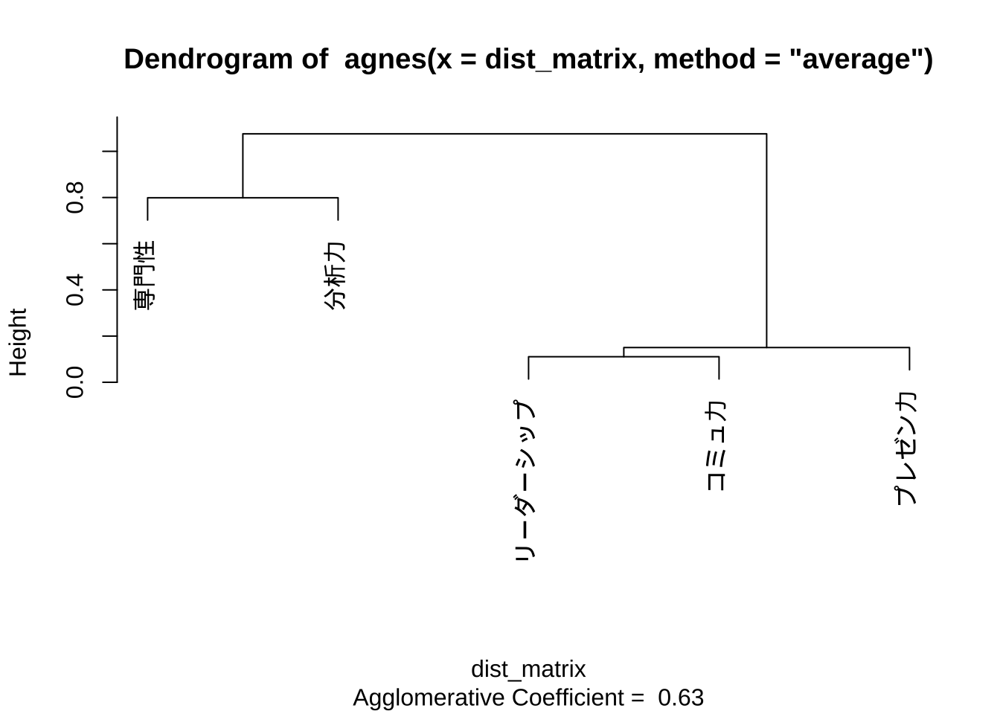


```r
dist_matrix <- as.dist(1 - cor(t(tokuten)))
res_agnes <- agnes(dist_matrix, method = "average")
plot(res_agnes)
```

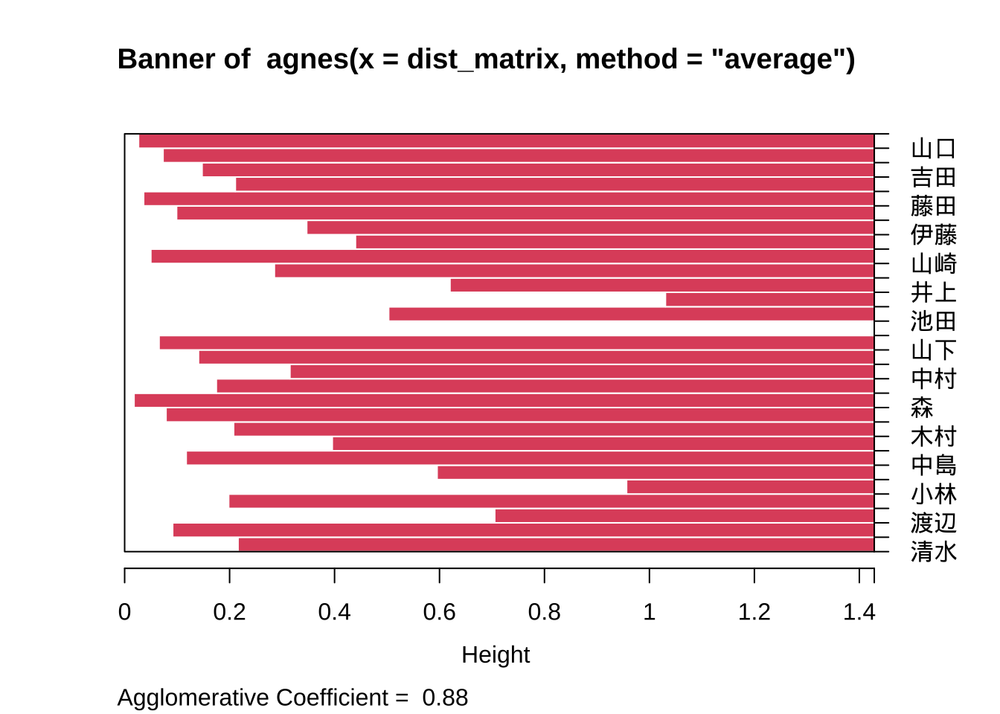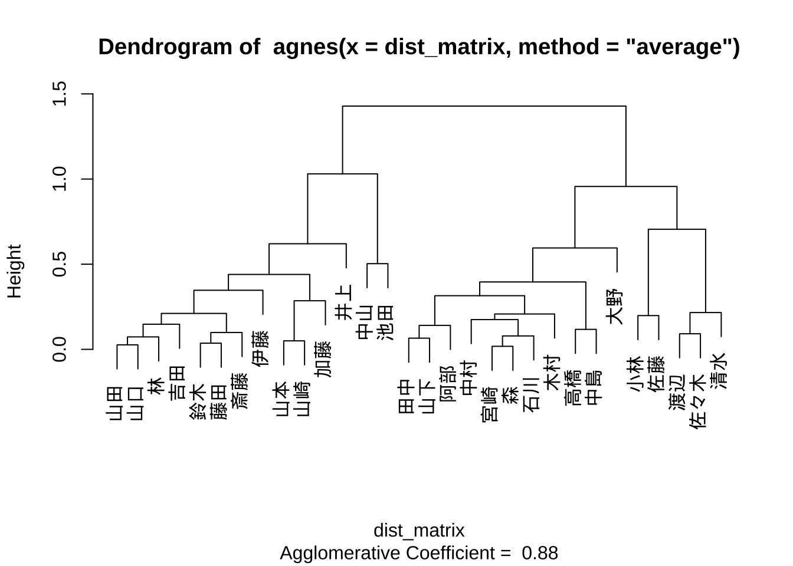

### 関数`pheatmap` {-}
パッケージ**pheatmap**は, 主にヒートマップの作成に使用されるが, 相関に基づく階層型クラスタリングを行い, ヒートマップとして可視化する機能もあり. 
遺伝子発現データなどのbioinformatics分野で活用.

```r
library(pheatmap)
pheatmap(tokuten, clustering_distance_rows = as.dist(1 - cor(t(tokuten))), clustering_distance_cols = as.dist(1 -
  cor(tokuten)))
```

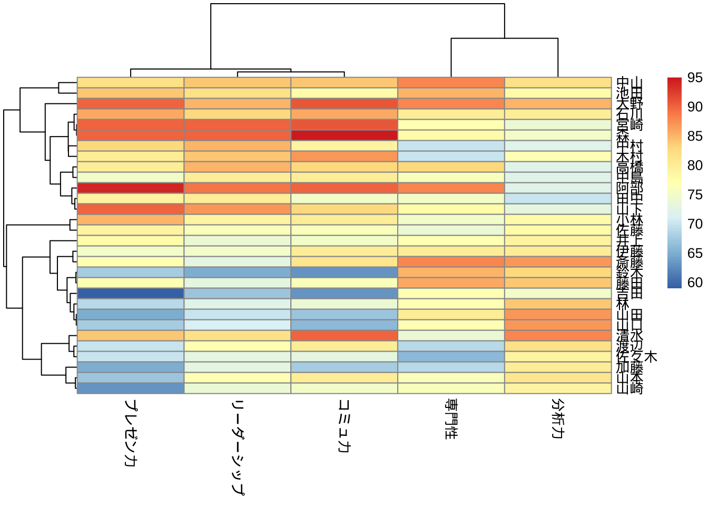

### 関数`pam` {-}
メドイド (medoid) は,  クラスタ内の全ての点に対する距離の合計が最小となるような, クラスタ内に存在するデータ点であり, K-medoids法は, メドイドを中心としてクラスタリングを行う手法である. PAM (Partitioning Around Medoids) は, K-medoids法の考え方を実装した具体的アルゴリズムの一種である.
Rでは, パッケージ**cluster**内の関数`pam`を使用することができる.

一方, K-medoids法に類似したクラスタリング手法として,
K-median法がある. K-median法は,  各クラスタ内のデータポイントの中央値に基づいて「中央点」決定し, クラスタ内の全データポイントと「中央点」との距離の合計を最小化するようにクラスタリングを行う.

これらの手法を使うことで, 外れ値に強い, ロバストなクラスタリング結果が得られる.


```r
# pam関数によるK-medoids法の実行
k <- 3  # クラスタの数
res_pam <- pam(tokuten, k)
print(res_pam)
#> Medoids:
#>      ID 専門性 分析力 リーダーシップ プレゼン力 コミュ力
#> 山口 15     77     87             71         68       66
#> 伊藤  7     80     80             75         75       80
#> 石川 20     80     80             83         86       86
#> Clustering vector:
#>   山田   鈴木   田中   中村   大野   小林   伊藤   高橋   渡辺   佐藤   山下 
#>      1      1      2      3      3      3      2      3      2      2      3 
#>   木村   山本   宮崎   山口   阿部   斎藤   吉田 佐々木   石川   山崎   中山 
#>      3      2      3      1      3      2      1      1      3      1      3 
#>   藤田   加藤   清水   池田   井上     林   中島     森 
#>      2      1      3      3      2      1      2      3 
#> Objective function:
#>    build     swap 
#> 10.01806 10.01806 
#> 
#> Available components:
#>  [1] "medoids"    "id.med"     "clustering" "objective"  "isolation" 
#>  [6] "clusinfo"   "silinfo"    "diss"       "call"       "data"
plot(res_pam)
```

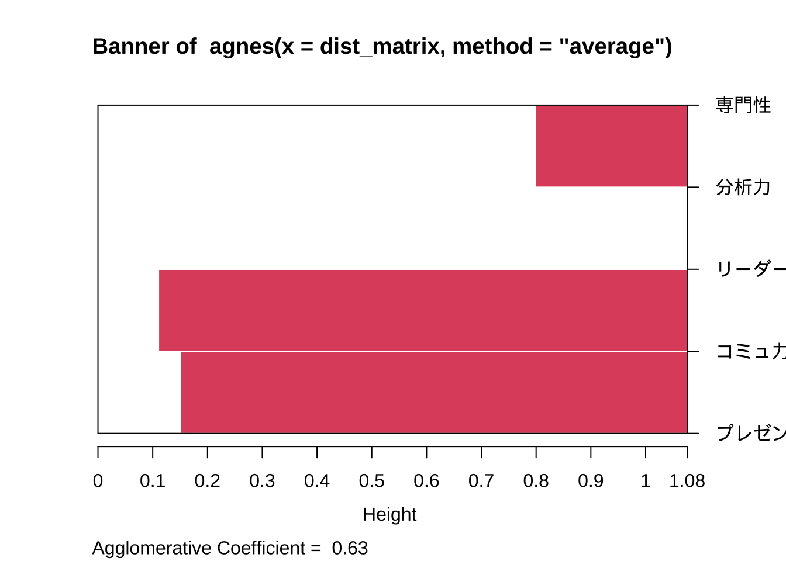
